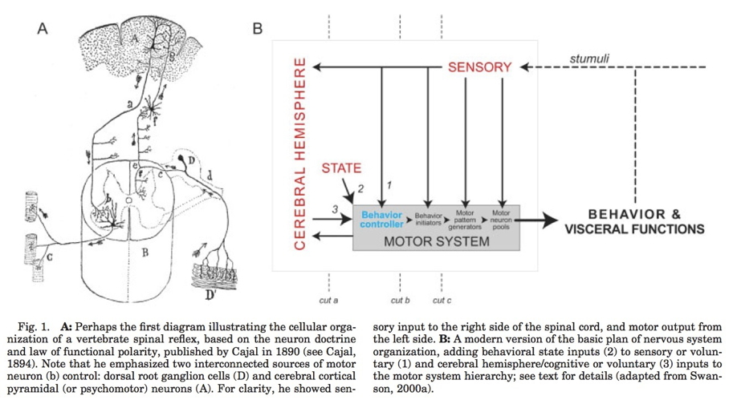
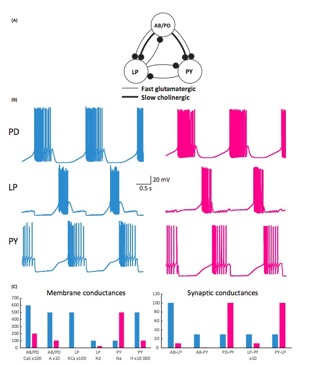
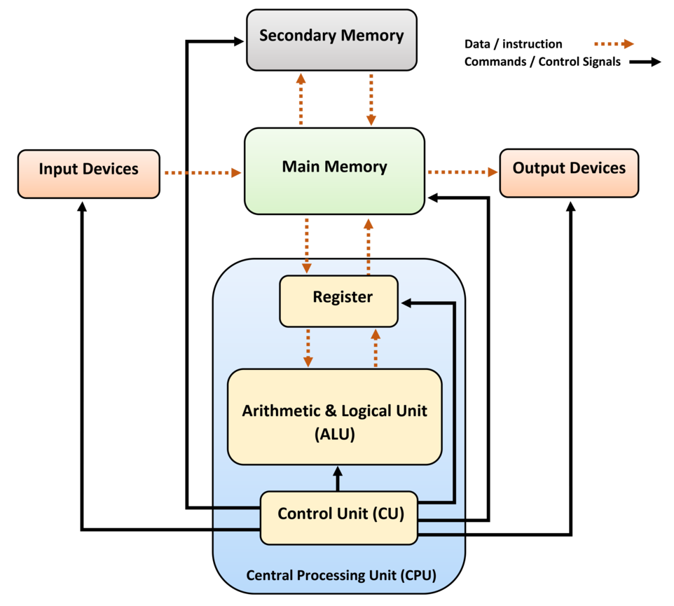
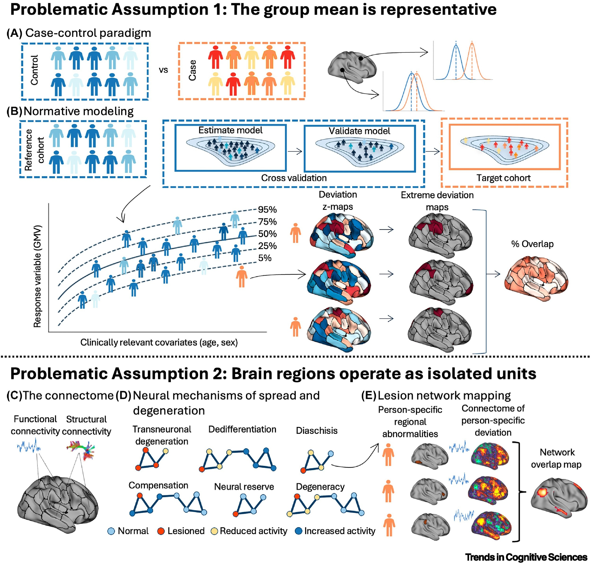
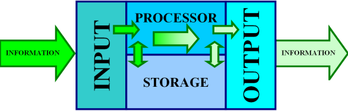
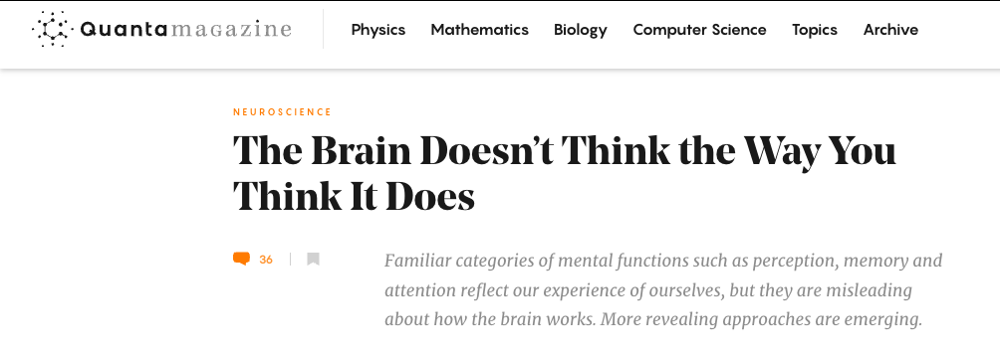
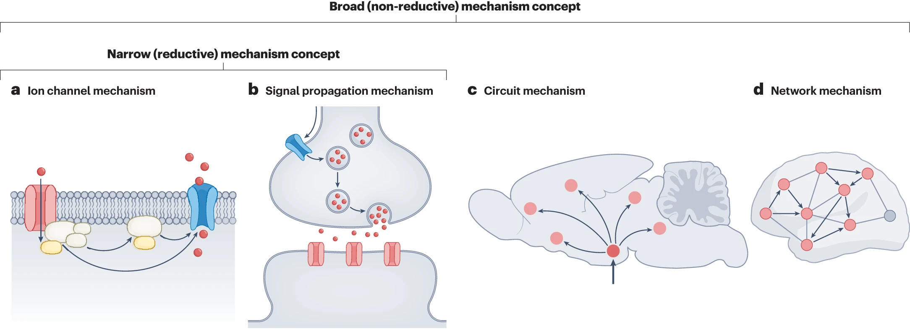
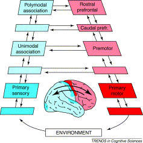

# Overview

## Prelude



-- @Melodysheep2011-wg

---

>If understanding everything we need to know about the brain is a mile, how far have we walked?

-- @National_Geographic2014-gv

## Today's topics

- Why ~~neuroscience~~ psychology is harder than physics
- Course overview
- Does neuroscience need behavior? Does behavioral science need the brain?

# Why psychology is harder than physics

---

{width=80% fig-align="center"}


---

{width=80% fig-align="center"}

## Physics perspective

- Simplifying assumptions
- Universal laws
- Macro phenomena
- Low dimensional state space

## On state spaces...

:::: {.columns}
::: {.column width=80%}
>State space is the set of all possible states of a dynamical system; each state of the system corresponds to a unique point in the state space. For example, the state of an idealized pendulum is uniquely defined by its angle and angular velocity...

-- @Terman2008-nc
:::
::: {.column width=20%}
{fig-align="right"}
:::
::::

## Psychological perspective

:::: {.columns}
::: {.column width=50%}
::: {.incremental}
- What is the state...
    - Of the world ($W$)?
    - Of the organism?
        - Body ($B$)
        - Nervous system ($N$)
        - Mind ($M$)
- How do these states change over time?
- What causes the changes?

:::
:::
::: {.column width=50%}
```{mermaid}
flowchart TD
  N[**N**ervous System] --> B[**B**ody]
  B --> W[**W**orld]
  W --> B
  B --> N
  M["**M**ind"] -.- N
```
:::
::::

---



## States high dimensional

- ~86 billion neurons
- ~100 trillion - 1 quadrillion synapses
- ?? # of motor units
- 600+ skeletal muscles; 300+ joints

---


## Direct vs. indirect measurement

- $W$, $B$, $N$ (more or less) **directly**
- vs. $M$, measured **indirectly**
  - Via $N$, $B$, $W$

::: {.fragment}
::: {.callout-warning}
## Your turn
- Do you agree or disagree?
- Does it matter?
:::
:::

##  Hard to simplify

:::: {.columns}
::: {.column width=60%}
- [Consider a spherical cow](https://en.wikipedia.org/wiki/Spherical_cow)
- Computation (and memory) often distributed
- Single functions -> multiple parts
:::
::: {.column width=40%}
<p><a href="https://commons.wikimedia.org/wiki/File:Spot_the_cow.gif#/media/File:Spot_the_cow.gif"></a><br>By Keenan Crane; (The source material is licensed under CC0), <a href="https://creativecommons.org/licenses/by-sa/4.0" title="Creative Commons Attribution-Share Alike 4.0">CC BY-SA 4.0</a></p>
:::
::::

## Single parts -> multiple functions

:::: {.columns}
::: {.column width=60%}
{.lightbox width=60%}
:::
::: {.column width=40%}
- Many circuit wiring patterns yield similar dynamics
- Wiring diagram (i.e., connectome) important, but not definitive
:::
::::

## Biological systems not "designed"

:::: {.columns}
::: {.column width=40%}
- ...like human-engineered ones
:::
::: {.column width=60%}
{width=60%}
:::
::::

## Studying such systems is hard because...

- Change structure/function over time
- Hard to measure what is being exchanged, what is being *controlled*

---

![[@Cisek2019-vq Figure 3]. Schematic behavioral control systems. (A) When the current nutrient state deviates from a desired state, locomotion is initiated, ultimately bringing the animal to a more desirable state. (B) Elaboration of nutrient state control into a high-level controller (ANS) and a lower-level controller (BNS) capable of two modes of locomotion, local exploitation, and long-range exploration. 5HT, serotonin; ANS/BNS, apical/blastoporal nervous system; DA, dopamine; NPY, neuropeptide Y](https://media.springernature.com/full/springer-static/image/art%3A10.3758%2Fs13414-019-01760-1/MediaObjects/13414_2019_1760_Fig3_HTML.png)

<!-- ## Assumptions are problematic -->

<!--  -->

# Course overview

## Goals

- Master fundamentals of neuroscientific concepts and facts
- Prepare to read primary source literature in social, behavioral, cognitive, affective, and clinical neuroscience

## Structure

<https://psu-psychology.github.io/psy-511-scan-fdns-2026-spring/>

## Questions

- What is the basic organizational plan of the nervous system?
- How does the nervous system undergird...
  - action
  - perception
  - emotion
  - learning & memory
  
## Questions

- What happens to the brain during sleep?
- How does the nervous system develop? How has it evolved?
- How do neurons work? How do they communicate?
- How do disorders of the mind reveal themselves in the nervous system?

## Approach

- Biologically essential behaviors
- Brain architecture (neuroanatomy)
- Brain function (neurophysiology)
- Brain communication (neurochemistry)
- Changes over evolutionary and developmental time

## Approach

- The nervous system as a mechanism
- Specifically, an information processing system



## Mindful of limitations in brain/computer metaphors


## Inputs

- From environment, body, brain

## Processing

- Current inputs + brain state + body state + possible future states...
- Stored information
- Physiological & behavioral goals

---


---

## Outputs

- To brain, body, environment

## Mapping structures to functions...

{width=45%}

## And *vice versa*?



---

>The brainwide representation of behavioral variables suggests that information encoded nearly anywhere in the forebrain is combined with behavioral state variables into a mixed representation...Our data indicate that it happens as early as primary sensory cortex.

-- @Stringer2019-vf

## Do we have the right "psychological" structures?

>Psychological sciences have identified a wealth of cognitive processes and behavioral phenomena, yet struggle to produce cumulative knowledge...

-- @Eisenberg2019-iy

---

>Progress is hamstrung by siloed scientific traditions and a focus on explanation over prediction...two issues that are particularly damaging for the study of **multifaceted constructs like self-regulation**...We conclude that **self-regulation lacks coherence as a construct**...

-- @Eisenberg2019-iy

## How should behavior be defined?

## How is behaviour defined?

>Behavioural biology is a major discipline within biology, centred on the key concept of ‘behaviour’. But how is ‘behaviour’ defined, and how should it be defined? ... 

-- @Levitis2009-br

---

>We outline what characteristics we believe a scientific definition should have, and why we think it is important that a definition have these traits. We then examine the range of available published definitions for behaviour. 

-- @Levitis2009-br


---

>Finding no consensus, we present survey responses from 174 members of three behaviour-focused scientific societies as to their understanding of the term. Here again, **we find surprisingly widespread disagreement as to what qualifies as behaviour**...

-- @Levitis2009-br

---

>Respondents contradict themselves, each other, and published definitions, indicating that they are using individually variable intuitive, rather than codified, meanings of `behaviour.'

-- @Levitis2009-br

---

>We offer a new definition, based largely on survey responses: "Behaviour is the internally coordinated responses (actions or inactions) of whole living organisms (individuals or groups) to internal and/or external stimuli, excluding responses more easily understood as developmental changes."

-- @Levitis2009-br

## Levels of analysis


## David Marr (1945-1980)

:::: {.columns}
::: {.column width="50%"}
{width="50%"}
:::
::: {.column width="50%"}

:::
::::

## Marr's Three Levels

{width=35%}

---

- What must be computed to carry out task X?
- What algorithm is used to carry out the computation?
- What hardware implements the algorithm?

## Computational level

- What has to be computed?
  - What is the shape/form of that unknown object?
  - What did that person just say?
  - Is that unknown object a threat to me?
  
## Algorithmic level

- What's the 'recipe' or sequence of operations for...
  - computing shape
  - perceiving speech
  - recognizing threats

## Implementation level

- How do...
  - neurons
  - areas
  - networks
- implement the recipe?

## Causality in neuroscience

- @Siddiqi2022-wl
- Stimulation & lesion studies needed for inferring *causation*.
- Bradford-Hill criteria [@Hill2015-jb]

## Varied notions of mechanism



## Toward reverse neuroethology

{width="55%"}

---

>...when faced with a difficult question, we often answer an easier one instead, usually without noticing
the substitution.

-- @Kahneman2013-zi, p. 12 quoted in @Krakauer2017-xl

## There and back again

:::: {.columns}
::: {.column width=50%}
- The perception action-cycle
:::
::: {.column width=50%}

:::
::::

## Another example...

```{mermaid}
%%| label: fig-screen-to-cortex
%%| fig-cap: "From computer screen to cortex."
flowchart LR
  A["Screen"] --> B(("Retina"))
  B --> C["Thalamus"]
  C --> D["Primary visual cortex"]
  D --> E["?"]
```

::: {.fragment}
```{mermaid}
%%| label: fig-from-cortex-to-finger
%%| fig-cap: "Pathways to move the finger."
flowchart LR
  E["?"] --> F["Primary motor cortex"]
  F --> G("Motor neuron")
  G -->|"Alpha motor fiber"|H(["Extrafusal muscle fiber"])
  G --> I("Spinal interneuron")
  I -->|"Gamma motor fiber"|J(["Intrafusal fiber"])
  H & J --> K(["Finger muscle"])
```
:::

::: {.fragment}
```{mermaid}
%%| label: fig-feedback-from-muscle
%%| fig-cap: "Feedback from finger muscle."
flowchart LR
  A(["Finger muscle"]) --> C(["Intrafusal muscle fiber"])
  C --> D["Stretch receptor"]
  D -->|"Ia afferent"| E("Spinal cord interneuron")
  E --> F["Somatosensory cortex"]
```
:::

---

```{mermaid}
%%| label: fig-other-sensory-input-from-finger
%%| fig-cap: "Other sources of sensory information from the finger."
flowchart LR
  A["Finger skin"] --> B("Spinal cord neuron")
  B --> C["Somatosensory cortex"]
  D["Finger joints"] --> B
```

---

```{mermaid}
%%| label: fig-s1-inputs
%%| fig-cap: "Inputs to primary somatosensory cortex."
flowchart LR
  A["Finger skin"] --> B["Somatosensory cortex"]
  C["Finger joints"] --> B
  D["Stretch receptor"] --> B
  E["Motor cortex"] --> B
  F["?"] --> B
```

# Break

# Your turn

## Does neuroscience need behavior? 

Krakauer, J. W., Ghazanfar, A. A., Gomez-Marin, A., MacIver, M. A., & Poeppel, D. (2017). Neuroscience needs behavior: Correcting a reductionist bias. *Neuron*, *93*(3), 480–490. <https://dx.doi.org/10.1016/j.neuron.2016.12.041>.

Parada, F. J. & Rossi, A. (2018). If neuroscience needs behavior, what does psychology need? *Frontiers in Psychology*, *9*, 433. <https://doi.org/10.3389/fpsyg.2018.00433>.

---

Newcombe, N. (2017). If neuroscience needs behavior, what does behavioral science need? APS Observer, 31(1). <https://www.psychologicalscience.org/observer/if-neuroscience-needs-behavior-what-does-behavioral-science-need>

## Key points

- Questions 'often tacit...belief in the reductionist program for understanding the link between brain and behavior'
- Behavior -> understanding; neural interventions -> causality
- Marr's 3 levels (computation; algorithm; implementation)

## But what is behavior?

## "Behavioural biologists don't agree on what constitutes behaviour"

>Behaviour is the internally coordinated responses (actions or inactions) of whole living organisms (individuals or groups) to internal and/or external stimuli, excluding responses more easily understood as developmental changes.

-- @Levitis2009-br

---


---


---


---


---


## Exercise LVL

- [[Due next Thursday](../exercises/ex-LVL.qmd)]{.orange_due}

## Main points

- Psychology is harder than physics
- Neuroscience needs behavior
- Psychology needs behavior + mental states + measures of environment

## Next time...

- Neuroanatomy lab
  - Read/study
    - Neuroanatomy [notes](../resources/anatomy.qmd)
    - Bring to class a copy of [Exercise ANAT](../exercises/ex-ANAT.qmd) | [docx](../exercises/ex-ANAT.docx) | [pdf](../exercises/ex-ANAT.pdf) |

# Resources

## References
