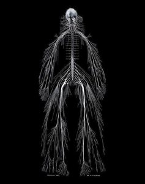
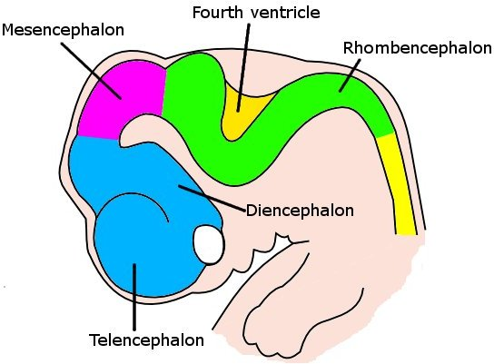
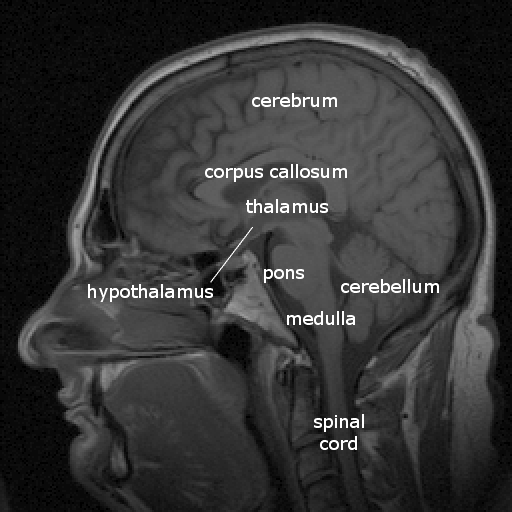
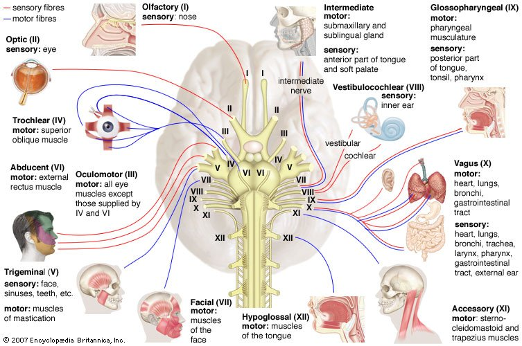
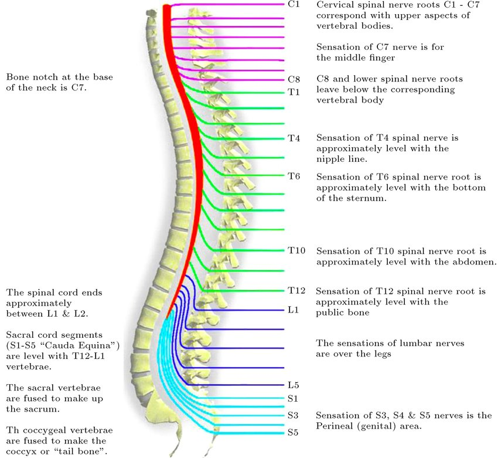
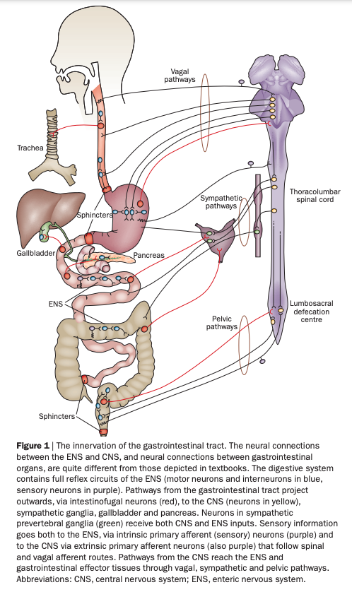

# Prelude

---

::: {#fig-pinky-and-the-brain}


@Ctdalilah2006-co
:::

::: {#fig-im-your-brain-song}


@Kids_Learning_Tube2015-pb <!-- Kids brain song -->
:::

## Announcements

- Exercise LVL due **today**.
  - [Canvas dropbox](https://psu.instructure.com/courses/2441266/assignments/17981371)
- Exercise ANAT due **next Thursday, January 29, 2026**.
  - [Canvas dropbox](https://psu.instructure.com/courses/2441266/assignments/17981392)

## Today's topics

- Neuroanatomy
- In-class lab
  - [Exercise ANAT](../exercises/ex-ANAT.qmd)

# Neuroanatomy

## Why study?

- Master basic vocabulary for reading literature

## Computational perspective

:::: {.columns}
::: {.column width=33%}
::: {.fragment}
- Inputs from
  - World
  - Body
  - Nervous system

:::
:::

::: {.column width=33%}
```{mermaid}
flowchart TD
  N[Nervous System] --> B[Body]
  B --> W[World]
  W --> B
  B --> N
```
:::

::: {.column width=33%}
::: {.fragment}
- Outputs to
  - World
  - Body
  - Nervous system

:::
:::
::::

::: {.fragment}
- What computations occur where?
:::

## Functional anatomy perspective

- Located where
- Connected to
- Involved in

## Brain anatomy through dance



## {.scrollable}

:::: {.columns}
::: {.column width=50%}
- Anterior/Posterior
- Medial/Lateral
- Superior/Inferior
- Dorsal/Ventral
- Rostral/Caudal
:::
::: {.column width=50%}
![Wikipedia^["By Original: OpenStax Vector: Pixelsquid🎱 - Own work based on: Human Neuroaxis-en.jpg:, CC BY 4.0, https://commons.wikimedia.org/w/index.php?curid=97420092"]](https://upload.wikimedia.org/wikipedia/commons/thumb/6/6f/Human_Neuroaxis-en.svg/2560px-Human_Neuroaxis-en.svg.png)
:::
::::

## {.scrollable}


## {.scrollable}


## Nervous system

- Central Nervous System (CNS)
  - Encased in bone
  - Brain
  - Spinal cord
- Peripheral Nervous System (PNS)

---

:::: {.columns}
::: {.column width=50%}
{width=70%}
:::
::: {.column width=50%}
![Wikipedia^[By Own work, CC BY 3.0, <https://commons.wikimedia.org/w/index.php?curid=10187018>]](https://upload.wikimedia.org/wikipedia/commons/thumb/b/b2/TE-Nervous_system_diagram.svg/1280px-TE-Nervous_system_diagram.svg.png){width=70%}
:::
::::

## CNS Organization

| Major division | Ventricular Landmark | Embryonic Division | Structure |
|------------------|-------------------|------------------|------------------|
| Forebrain | Lateral | Telencephalon | Cerebral cortex |
|  |  |  | Basal ganglia |
|  |  |  | Hippocampus, amygdala |

------------------------------------------------------------------------

| Major division | Ventricular Landmark | Embryonic Division | Structure    |
|----------------|----------------------|--------------------|--------------|
|                | Third                | Diencephalon       | Thalamus     |
|                |                      |                    | Hypothalamus |

------------------------------------------------------------------------

| Major division | Ventricular Landmark | Embryonic Division | Structure         |
|------------------|-------------------|------------------|------------------|
| Midbrain       | Cerebral Aqueduct    | Mesencephalon      | Tectum, tegmentum |

------------------------------------------------------------------------

| Major division | Ventricular Landmark | Embryonic Division | Structure         |
|------------------|-------------------|------------------|------------------|
| Hindbrain      | 4th                  | Metencephalon      | Cerebellum, pons  |
|                | --                   | Mylencephalon      | Medulla oblongata |

------------------------------------------------------------------------

:::: {.columns}
::: {.column width=50%}

:::
::: {.column width=50%}

:::
::::

- Forebrain, midbrain, hindbrain terminology derives from embryonic stages in CNS development.

## Cerebrum

:::: {.columns}
::: {.column width=50%}
- (Cerebral) cortex
- Subcortical (below the cortex) structures
:::
::: {.column width=50%}

:::
::::

## Cerebral Cortex: Landmarks

:::: {.columns}
::: {.column width=50%}
::: {.incremental}
- Cerebral hemispheres
- Bumps
  - Gyrus or gyri
- Grooves
  - Sulcus or sulci: shallow
  - Fissure: deep
- Medial longitudinal fissure
- Corpus callosum
:::
:::
::: {.column width=50%}

:::
::::

## Cerebral cortex: Lobes

:::: {.columns}
::: {.column width=50%}
- Lateral (sagittal) view
- Lobes
  - Frontal
  - Temporal
  - Parietal
  - Occipital
:::
::: {.column width=50%}
![Wikipedia^[By Sebastian023, CC BY-SA 3.0, https://commons.wikimedia.org/w/index.php?curid=21020857]](https://upload.wikimedia.org/wikipedia/commons/4/46/LobesCaptsLateral.png)
:::
::::

## Cerebral cortex: Lobes

:::: {.columns}
::: {.column width=50%}

:::
::: {.column width=50%}
{width=70% fig-align="right"}
:::
::::

## Cerebral cortex: Lobes

:::: {.columns}
::: {.column width=50%}
- Frontal: Motor cortex (M1)
- Temporal: Auditory cortex (A1)
- Parietal: Somatosensory cortex (S1)
- Occipital: Visual cortex (V1)
- Insula: Gustatory
:::
::: {.column width=50%}
![Wikipedia^[By Sebastian023, CC BY-SA 3.0, https://commons.wikimedia.org/w/index.php?curid=21020857]](https://upload.wikimedia.org/wikipedia/commons/4/46/LobesCaptsLateral.png)
:::
::::

## Cerebral cortex: M1

![Wikipedia^[By Cortex sensorimoteur1.jpg: Pancratderivative work: Iamozy - Own work, This file was derived from: Cortex sensorimoteur1.jpg:, CC BY-SA 3.0, https://commons.wikimedia.org/w/index.php?curid=33981076]](https://upload.wikimedia.org/wikipedia/commons/3/33/Human_motor_cortex.jpg){width=45%}

## Cerebral cortex: A1

![Wikipedia^[By Chittka L, Brockmann - Perception Space—The Final Frontier, A PLoS Biology Vol. 3, No. 4, e137 doi:10.1371/journal.pbio.0030137 ([1]/[2]), vectorised by Inductiveload, CC BY-SA 2.5, https://commons.wikimedia.org/w/index.php?curid=5958918]](https://upload.wikimedia.org/wikipedia/commons/thumb/e/ec/Auditory_Cortex_Frequency_Mapping.svg/2560px-Auditory_Cortex_Frequency_Mapping.svg.png){width=60%}

## Cerebral cortex: S1

![Wikipedia^[By Jimhutchins (talk) - The original image was uploaded on en.wikipedia as en:Image:Postcentral_gyrus.png, CC BY-SA 3.0, https://commons.wikimedia.org/w/index.php?curid=4481990]](https://upload.wikimedia.org/wikipedia/commons/6/66/Postcentral_gyrus.png){width=60%}

## Cerebral cortex: V1

![Wikipedia^[By Brodmann - File:Brodmann_Cytoarchitectonics.PNG, Public Domain, https://commons.wikimedia.org/w/index.php?curid=8221432]](https://upload.wikimedia.org/wikipedia/commons/3/33/Brodmann_Cytoarchitectonics_17.png){width=30%}

## Cerebral cortex: Insula {.scrollable}

:::: {.columns}
::: {.column width=50%}
- Primary gustatory cortex
- Self-awareness, interpersonal experiences, motor control, interoception
:::
::: {.column width=50%}
![@Namkung2017-gc Figure 1^[Figure 1. Anatomy of the Human Insula. The human insular cortex is bilaterally located deep within the lateral sulcus separating the temporal lobe from the parietal and frontal lobes. The insula is covered with folds of the adjacent frontal, parietal, and temporal opercula. The circumference of the insula is outlined by the circular sulcus, and the deep central sulcus of the insula separates the anterior and posterior parts. Three short insular gyri are found in the anterior insula (AI), whereas two long insular gyri lie in the posterior insula (PI). Cytoarchitecturally, the insula is roughly divided into anterior agranular and posterior granular sections with a transitional dysgranular mid-section.]](https://ars.els-cdn.com/content/image/1-s2.0-S0166223617300176-gr1.jpg)
:::
::::

## Cerebral cortex: Brodmann areas

:::: {.columns}
::: {.column width=50%}
- [Korbinian Brodmann](https://en.wikipedia.org/wiki/Korbinian_Brodmann)
- Cytoarchitecture
- Examples
  - BA 41 & 42: audition; BA 44 & 45: Broca's area
  - BA 17, 18: vision
:::
::: {.column width=50%}
{fig-align="right"}
:::
::::

## Cerebrum: Subcortical

- Basal ganglia
- Hippocampus
- Amygdala

## Basal ganglia

:::: {.columns}
::: {.column width=50%}
- Striatum
	- Caudate nucleus
	- Putamen
- Globus pallidus
- Subthalamic nucleus
- Substantia nigra (tegmentum)
:::
::: {.column width=50%}

:::
::::

## Basal ganglia

{width=80%}

## Hippocampus

:::: {.columns}
::: {.column width=50%}
- Hippocampus means "sea horse"
- Fornix (axon fiber bundle) projects to (mammillary bodies of) hypothalamus

:::
::: {.column width=50%}

:::
::::

## Hippocampus

:::: {.columns}
::: {.column width=50%}
- Initial storage of memories for specific facts (semantic memory) or events (episodic memory)
- Place memory in non-human animals (& humans?)
:::
::: {.column width=50%}

:::
::::

## Amygdala

:::: {.columns}
::: {.column width=50%}
- Physiological state, behavioral readiness, affect
- NOT the fear center! [@ledoux_amygdala_2015].
- Projection to hypothalamus
:::
::: {.column width=50%}

:::
::::

---

| Major division | Ventricular Landmark | Embryonic Division | Structure    |
|----------------|----------------------|--------------------|--------------|
|                | Third                | Diencephalon       | Thalamus     |
|                |                      |                    | Hypothalamus |

## Diencephalon

:::: {.columns}
::: {.column width=50%}
- Thalamus
- Hypothalamus
:::
::: {.column width=50%}

:::
::::

## Thalamus

:::: {.columns}
::: {.column width=50%}
- Input to cortex
- Functionally distinct *nuclei*
    - Lateral geniculate nucleus (LGN), vision
    - Medial geniculate nucleus (MGN), audition
    - Pulvinar, attention?
:::
::: {.column width=50%}

:::
::::

## Hypothalamus


## Hypothalamus

- Five Fs:
  - Fighting/fleeing/freezing
  - Feeding
  - Reproduction

## Hypothalamus

- Controls pituitary gland (“master” gland)
    + Anterior pituitary (indirect release of hormones)
        * e.g., Corticotropin Releasing Hormone (CRH) -> release of cortisol from Adrenal Cortex (adjacent to kidney)
    + Posterior pituitary (direct release of hormones)
        - Oxytocin
        - Vasopressin (aka, Arginine Vasopressin -- AVP; Anti-diuretic Hormone -- ADH)

---

| Major division | Ventricular Landmark | Embryonic Division | Structure         |
|------------------|-------------------|------------------|------------------|
| Midbrain       | Cerebral Aqueduct    | Mesencephalon      | Tectum, tegmentum |
| Hindbrain      | 4th                  | Metencephalon      | Cerebellum, pons  |
|                | --                   | Mylencephalon      | Medulla oblongata |

## Midbrain

- Tectum (roof), dorsal
- Tegmentum (floor), ventral

## Tectum

:::: {.columns}
::: {.column width=50%}
- "Roof" of the midbrain
- Superior and inferior colliculus (colliculi is plural for 'little hill')
:::
::: {.column width=50%}

:::
::::

## Tectum: Components

:::: {.columns}
::: {.column width=50%}
- Superior colliculus (colliculi)
  - Reflexive orienting of eyes, head, ears (superior colliculi)
- Inferior colliculus
  - Auditory processing (from brainstem to auditory thalamus)
:::
::: {.column width=50%}

:::
::::

## Tegmentum

:::: {.columns}
::: {.column width=50%}
- "Floor" of the midbrain
- Species-typical movement sequences
- Neuromodulatory nuclei release NTs
    + Norepinephrine (NE)
    + Serotonin (5-HT)
    + Dopamine (DA) -- from *ventral tegmental area (VTA)*
:::
::: {.column width=50%}
{width=70%}
:::
::::

## Hindbrain

:::: {.columns}
::: {.column width=50%}
- Structures adjacent (or caudal to) 4th ventricle
- Components
    - Pons
    - Cerebellum
    - Medulla oblongata
:::
::: {.column width=50%}

:::
::::

## Pons

:::: {.columns}
::: {.column width=50%}
- Bulge on ventral brain stem
- Relay to cerebellum
:::
::: {.column width=50%}

:::
::::

## Cerebellum

:::: {.columns}
::: {.column width=50%}
- “Little brain”, but most neurons in CNS
- Dorsal to pons
- Movement coordination, simple learning (classical conditioning)
:::
::: {.column width=50%}

:::
::::

## Medulla oblongata

:::: {.columns}
::: {.column width=50%}
- Cardiovascular regulation
- Muscle tone
- Fibers of passage
    - **A**scending fibers (from body), a.k.a. **a**fferents
    - Descending fibers (**e**xiting brain), a.k.a., **e**fferents
:::
::: {.column width=50%}

:::
::::

## Input/output

:::: {.columns}
::: {.column width=50%}
- Via cranial nerves (in CNS)
- Via spinal nerves (in PNS)
- Hierarchical organization
  - Substantial interconnection
:::
::: {.column width=50%}

:::
::::

## Cranial nerves

{width="70%"}

## Spinal nerves

{width="50%"}

## Spinal cord

:::: {.columns}
::: {.column width=50%}
- Spinal column w/ vertebrae
- Segments
  - Cervical (8), thoracic (12), lumbar (5), sacral (5), coccygeal (1)
- 31 (anterior & posterior) nerve pairs
- Cauda equina
:::
::: {.column width=50%}

:::
::::

## Spinal cord: Axial

:::: {.columns}
::: {.column width=50%}

:::
::: {.column width=50%}

:::
::::

## PNS Organization

:::: {.columns}
::: {.column width=50%}
::: {.incremental}
- Somatic nervous system
- Autonomic nervous system (ANS)
  - Sympathetic
  - Parasympathetic
  - Enteric (gut, intestinal tract)
:::
:::
::: {.column width=50%}
![Wikipedia^[By Own work, CC BY 3.0, <https://commons.wikimedia.org/w/index.php?curid=10187018>]](https://upload.wikimedia.org/wikipedia/commons/thumb/b/b2/TE-Nervous_system_diagram.svg/1280px-TE-Nervous_system_diagram.svg.png){width=70% fig-align="right"}
:::
::::

## Somatic nervous system

{width=35%}

## Autonomic nervous system

- Controls “vegetative functions”
  + Limited voluntary control

::: {.incremental}
- *Sympathetic*
  - Prepares body for action
  - "Fight, flee, or fight"
- *Parasympathetic* (around the sympathetic)
  - Restorative function
  - "Rest & digest"

:::

## Autonomic nervous system

:::: {.columns}
::: {.column width=50%}
![Wikipedia^[By OpenStax College - Anatomy & Physiology, Connexions Web site. http://cnx.org/content/col11496/1.6/, Jun 19, 2013., CC BY 3.0, https://commons.wikimedia.org/w/index.php?curid=30148020]](https://upload.wikimedia.org/wikipedia/commons/thumb/f/f3/1503_Connections_of_the_Parasympathetic_Nervous_System.jpg/1280px-1503_Connections_of_the_Parasympathetic_Nervous_System.jpg){width=45% fig-align="center"}
:::
::: {.column width=50%}
![Wikipedia^[By Henry Vandyke Carter - Henry Gray (1918) Anatomy of the Human Body (See "Book" section below)Bartleby.com: Gray's Anatomy, Plate 839, Public Domain, https://commons.wikimedia.org/w/index.php?curid=792179]](https://upload.wikimedia.org/wikipedia/commons/f/f7/Gray839.png){width=45% fig-align="center"}
:::
::::

## Autonomic nervous system: Enteric

{width=25%}

# Neuroanatomy lab

## Overview

- 3 groups
- Rotate among stations every \~25 min
- Identify as many structures as possible

# Wrap-up

## Main points

- Directional terms
- What is it
- Where is it
  - Relative to other things
  - CNS/PNS
  - Forebrain/midbrain/hindbrain

------------------------------------------------------------------------

-   Cerebral cortex and its subparts
-   Grey matter vs. white matter

## Next time...

- [Action](wk-03-2026-01-29-action.qmd)
- *Due*: [Exercise ANAT • Neuroanatomy](../exercises/ex-ANAT.qmd)
  - [Canvas dropbox](https://psu.instructure.com/courses/2441266/assignments/17981392)

# Resources

## References
