# Overview

## Prelude



-- @MoveIt2012-fg

## Announcements

- Exercise ANAT due **today**.
  - [Canvas dropbox](https://psu.instructure.com/courses/2441266/assignments/17981392)

## Today's topics

- On action
- How muscles work
- Controlling muscles
- Illustrative motor systems

## Warm-up

---

### The amygadala is found deep within which lobe of the cerebral cortex?

- A. The occipital lobe
- B. The frontal lobe
- C. The insula
- D. The temporal lobe

---

### The amygadala is found deep within which lobe of the cerebral cortex?

- ~~A. The occipital lobe~~
- ~~B. The frontal lobe~~
- ~~C. The insula~~
- **D. The temporal lobe**

## {.scrollable}


---

:::: {.columns}
::: {.column width=50%}
### The middle image in A in the figure at right depicts what plane of section?
- A. Sagittal
- B. Dorsal
- C. Coronal
- D. Horizontal
:::
::: {.column width=50%}

:::
::::

---

:::: {.columns}
::: {.column width=50%}
### The middle image in A in the figure at right depicts what plane of section?
- ~~A. Sagittal~~
- ~~B. Dorsal~~
- C. Coronal
- ~~D. Horizontal~~
:::
::: {.column width=50%}

:::
::::

---


---

### Which division of the peripheral nervous system (PNS) ennervates the gastrointestinal tract?

- A. Enteric
- B. Cerebellum
- C. Sympathetic
- D. Parasympathetic

---

### Which division of the peripheral nervous system (PNS) ennervates the gastrointestinal tract?

- **A. Enteric**
- ~~B. Cerebellum~~
- ~~C. Sympathetic~~
- ~~D. Parasympathetic~~

# On action

## Why action?

:::: {.columns}
::: {.column width=80%}
>The way to do is to be.

-- Laozi (老子), Chinese philosopher
:::
::: {.column width=20%}
{width=200px}
:::
::::

::: {.fragment}
:::: {.columns}
::: {.column width=80%}
>The way to be is to do.

-- Dale Carnegie
:::
::: {.column width=20%}
{width=200px}
:::
::::

@QuoteInvestigator-cl
:::

---

:::: {.columns}
::: {.column width=80%}
>Do be, do be, do.

-- Frank Sinatra
:::
::: {.column width=20%}
{width=200px}

:::
::::

@QuoteInvestigator-cl

## Animals are *animate*

:::: {.columns}
::: {.column width=50%}
- Actions influence 
  - Their own bodies, $B$
    - The external world, $W$
- The nervous system controls the body and its effects on the world
:::
::: {.column width=50%}
```{mermaid}
flowchart TD
  N[Nervous System] --> B[Body]
  B --> W[World]
```
:::
::::

## Animal movement lawful

- Physics
- Biology
- Psychology

::: {.fragment}
::: {.callout-important}
## Your turn
Can you name a physical law that applies to movement? A biological law? A psychological law?
:::
:::

## Movement one class of nervous system output

::: {.fragment}

:::: {.columns}
::: {.column width=50%}
- Nervous system *outputs*
  - Autonomic
  - Endocrine
  - Somatic
:::
::: {.column width=50%}

```{mermaid}
%%| label: fig-ns-outputs
%%| fig-cap: "Three classes of outputs from the nervous system."
flowchart TD
  N[Nervous System] -- autonomic --> B[Body];
  N -- somatic --> B;
  N -- endocrine --> B;
```

:::
::::

:::

---

:::: {.columns}
::: {.column width=50%}
- Nervous system *inputs* fall into two broad classes
  - Exteroceptive (outside the body)
  - Interoceptive

:::
::: {.column width=50%}
```{mermaid}
%%| label: fig-ns-inputs
%%| fig-cap: "Two broad classes of inputs from the body (interoception) and the world (exteroception) to the nervous system."
flowchart TD
  B[Body] -->|interoception| N[Nervous System] 
  B -->|exteroception| N
```
:::
::::

---

### Schematic of input and output flows

```{mermaid}
%%| label: fig-input-output-flows
%%| fig-cap: "Schematic of information flows into and out of the nervous system. Note: This figure ignores flows specifically related to metabolism."
flowchart TD
  N[Nervous System] -- autonomic --> B[Body]
  N -- somatic --> B
  N ---|endocrine| B
  B --->|interoception| N
  B --->|action| W[World]
  W --->|perception| B
  B --->|exteroception| N
```

## Computational perspective

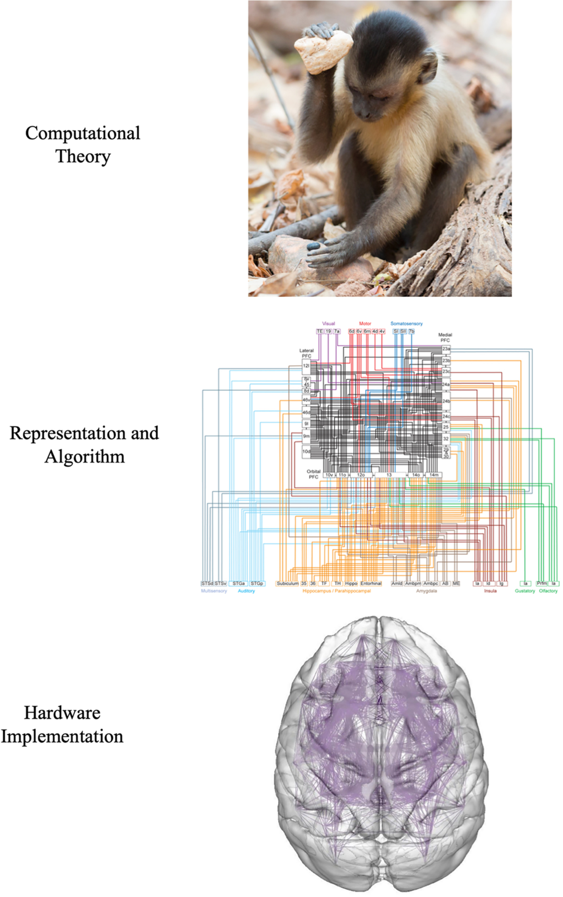{width=35%}

## Evolutionary perspective

- What actions must animals perform?
  - Live long enough to reproduce

---

::: {.incremental}
- Live long enough...
  - Avoid injury & predation
  - Secure sustenance
  - Maintain health
- Reproduce...
  - Find a mate
  - Mate
  - Ensure the well-being of offspring
- In other words...*behave*
:::

## Movement is the *real* reason for brains



-- @TED2011-oz

## Classes of behavior

:::: {.columns}
::: {.column width=50%}
::: {.incremental}
- Orienting, info gathering
- Maintaining balance
- Reaching, grasping, & manipulation
- Locomotion
:::
:::
::: {.column width=50%}
::: {.incremental}
- Communication
- Mating & caregiving
- Ingestion & elimination
:::
:::
::::

::: {.fragment}
::: {.callout-caution}
## Your turn
Does this miss any major classes of behavior?
:::
:::

<!-- ## Orienting, info gathering

- Eye movements
- Head movements
- Active listening
- Active touch
- Sniffing & tasting -->

<!-- ## Balance

- @Cullen2022-ao; 

## Reaching & grasping

- @Kim2021-ph; @Di-Caro2025-tl

## Locomotion

- @Purves2001-ht; @UnknownUnknown-gb; @Xing2022-om

## Communication

- Speech
  - @Khanna2024-fe; @Griffin2024-zo
  - @Zada2025-jl
- Facial expression
  - @Bress2024-og
- Gesture -->

## Muscles: Engines of animal motion {.scrollable}

:::: {.columns}
::: {.column width=45%}
{width=80% fig-align="left"}
:::
::: {.column width=10%}
:::
::: {.column width=45%}
{width=80% fig-align="right"}
:::
::::

# How muscles work

## Muscles are machines that

:::: {.columns}
::: {.column width=50%}
- Generate force...in one direction

::: {.fragment}
- Involuntary
  - Cardiac & smooth
- Voluntary
  - Striated
  - Skeletal
:::
:::
::: {.column width=50%}
{fig-align="center"}
:::
::::

## Functional classes

- Axial
    + Trunk, neck, hips
- Proximal
    + Shoulder/elbow, pelvis/knee
- Distal
    + Hands/fingers, feet/toes
    
## {.scrollable}

![[@Cantu2019-sz]](https://www.frontiersin.org/files/Articles/476718/fneur-10-00951-HTML/image_m/fneur-10-00951-g001.jpg)

## Agonist/antagonist pairs {.scrollable}

{fig-align="center"}

## How skeletal muscles contract

::: {.incremental}
- Motor neurons (cell bodies located in ventral horn of spinal cord)
- Project to muscle fiber(s)
  - *Motor unit* == Motor neuron + muscle fibers
- Form *neuromuscular junction*
    + Synapse between motor neuron and muscle fiber
    + Release acetylcholine (ACh)
:::

## {.scrollable}

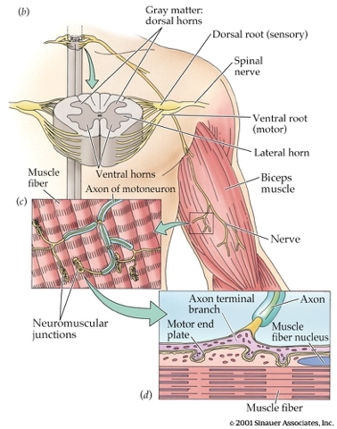{fig-align="center"}

<!-- --- -->

<!-- - Motor endplate -->
<!--     + Contains nicotinic ACh receptors -->
<!-- - Activation produces excitatory endplate potential -->
<!--     + Muscle fibers depolarize -->
<!--     + Depolarization spreads along fibers like an action potential -->
<!--     + Ca++ released from intramuscular stores -->

<!-- ## {.scrollable} -->

<!--  -->

<!-- --- -->

<!-- - Myofibrils -->
<!--     + Contain actin & mysosin proteins -->
<!--     + “Molecular gears” -->
<!-- - Muscle fibers contain bundles of myofibrils called sarcomeres -->
<!--   - Bind, move, unbind in presence of Ca++, adenosine triphosphate (ATP) -->

<!-- --- -->

<!-- 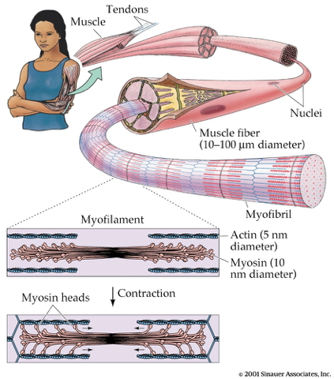{fig-align="center"} -->

<!-- --- -->

<!-- 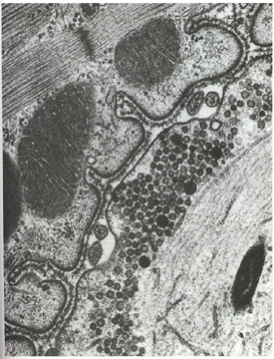{fig-align="center"} -->

## Skeletal muscle fiber types

:::: {.columns}
::: {.column width=50%}
- Fast twitch/fatiguing
    + Type II
    + White meat
- Slow twitch/fatiguing
    + Type I
    + Red meat
:::
::: {.column width=50%}
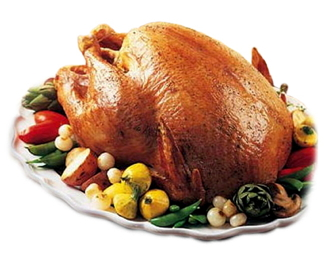{fig-align="center"}
:::
::::

## Marionette analogy

{fig-align="center"}
    
## Muscles are sensory organs, too!

:::: {.columns}
::: {.column width=50%}
- *Extrafusal* fibers
  - Generate force
- *Intrafusal* fibers 
  - Contain stretch receptors
  - Sense muscle length/tension
:::
::: {.column width=50%}
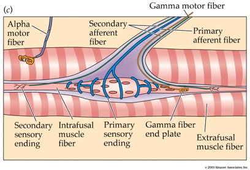{fig-align="center"}
:::
::::

## Intrafusal fibers

+ Sense muscle length and $\Delta l$, e.g. "stretch"
+ Provide muscle *proprioception*
- Proprioception == perception about the self
  - A form of interoception

## Intrafusal fibers

- Stretch receptors (also called muscle spindles)
  - Ennervated by by primary Ia afferents (sensory output from muscle to CNS)
  - Secondary Type II fibers
- Force-producing motor fiber
  + Ennervated by gamma ($\gamma$) motor neurons (motor input)

## Extrafusal fibers

+ Generate force
+ Ennervated by alpha ($\alpha$) motor neurons

## Circuit

```{mermaid}
%%| label: fig-info-flow-skeletal-muscle
%%| fig-cap: "CNS activation of skeletal muscle fibers."
flowchart TD
  N{Nervous System} ==>|Alpha motor neurons|B(Extrafusal muscle fibers)
  N ==>|Gamma motor neurons|C(Intrafusal muscle fibers)
  C ==>|Ia spindle afferents|N
  C ==>|Secondary afferents|N
```

## Monosynaptic stretch (myotatic) reflex

::: {.incremental}
- Muscle stretched (length increases)
- Muscle spindle in intrafusal fiber activates
- Ia afferent $\rightarrow$ spinal cord
    + Activates alpha ($\alpha$) motor neuron
    - 1 synapse $\rightarrow$ monosynaptic
- $\alpha$ motor neuron activates extrafusal fiber
- Muscle contracts, shortens length
:::

## {.scrollable}


- Gamma ($\gamma$) motor neuron fires to take up 'slack' in intrafusal fiber 

## {.scrollable}

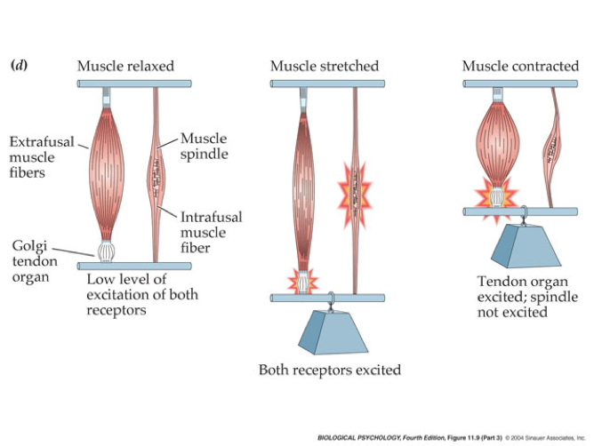{fig-align="center"}

## {.scrollable}

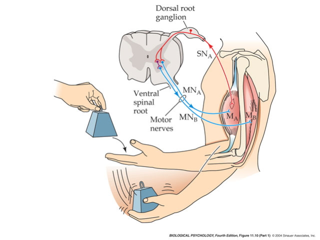{fig-align="center"}

---

::: {.callout-note}
This is a bit like the role of a belayer in rock climbing.

:max_bytes(150000):strip_icc():format(webp)/HowtoBelay_3-571117903df78c3fa293859d.jpg){fig-align="center"}
:::

## Avoiding tremor

:::: {.columns}
::: {.column width=50%}
- Polysynaptic *inhibition* of antagonist muscle
- Prevents/dampens tremor

- Brain gets fast(est) sensory info from spindles
:::
::: {.column width=50%}
{fig-align="right"}
:::
::::

## Why this matters...

{fig-align="center"}

## Also: Patellar reflex



-- @Niu-Jin-Ji-Chu-Sheng-Wu-Xue-2021-mv

## Conduction speed

:::: {.columns}
::: {.column width=50%}
- $\alpha$ motor neuron ~ 50-60 m/s
- Ia afferents ~ 80-120 m/s
- Brain to toe or toe to brain: 15-30 ms
- @Wikipedia-contributors2025-xk
:::
::: {.column width=50%}

:::
::::

## Developmental implications? 

- Does the motor system "learn" the sensory consequences of muscle fiber contraction?
- "Tuning" proprioceptive feedback
- Via random spontaneous "twitches" [@Blumberg2023-ce]?

## How muscles work: Interim summary

::: {.incremental}
- Voluntary movements involve motor units causing contraction of agonist or antagonist pairs of skeletal muscles
- Skeletal muscles have embedded sensors that detect length/tension
- CNS gets rapid feedback about muscle length/tension (proprioception)
- Monosynaptic stretch (myotatic) reflexes maintain position stability
:::

# Controlling muscles

---

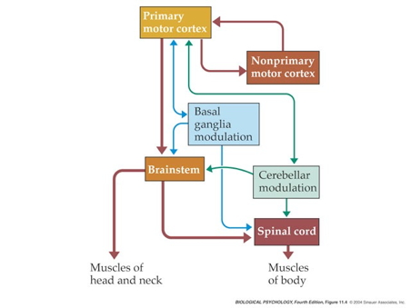

## Key nodes

- Primary motor cortex (M1)
  - Anterior to central sulcus
  - Frontal lobe

## {.scrollable}


## Topgraphic organization {.scrollable}


## Key nodes

- Non-primary motor cortex
  - Supplemental motor area (SMA)
  - Premotor cortex (PMC)
  - Frontal eye fields (FEF)
- Basal ganglia
- Brain stem
- Cerebellum
- Spinal cord

## Projection pathways

- Pyramidal tracts/system
- Extrapyramidal system

## Pyramidal tracts/system {.scrollable}

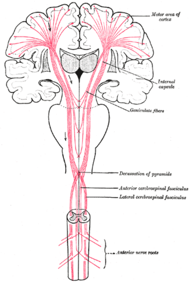

## Pyramidal tracts/system
    
+ Pyramidal cells 
  - Cerebral Cortex Layer 5 in primary motor cortex (M1)
+ Corticobulbar (cortex -> brainstem) tract
+ Corticospinal (cortex -> spinal cord) tract
- Crossover (decussate) in medulla
    + L side of brain ennervates R side of body

---

::: {.callout-note}
- Anatomically separate ascending (afferent) and descending (efferent) pathways in the spinal cord.
- Ascending (generally) more dorsal; descending more ventral.
- White matter on exterior (unlike cerebral cortex).
:::


## Extrapyramidal system

+ [Tectospinal tract](https://en.wikipedia.org/wiki/Tectospinal_tract)
+ [Lateral Vestibulospinal tract](https://en.wikipedia.org/wiki/Lateral_vestibulospinal_tract)
+ [Reticulospinal tract](https://en.wikipedia.org/wiki/Reticular_formation#Descending_reticulospinal_tracts)
- Rubrospinal tract
- [Involuntary movements](https://en.wikipedia.org/wiki/Extrapyramidal_symptoms)
    + Posture, balance, arousal
    
## Direct cortical control

- Over *some* motor neurons
- In humans; prevalence uncertain in other animals
- For individuated ("fractionated") movements of fingers, toes, lips, but other muscles, too.

## {.scrollable}

![@Nielsen2016-hs Figure 1. Evidence of corticomotoneuronal connections in human subjects. Indirect, noninvasive evidence of the existence of monosynaptic connections between corticospinal neurons and spinal motoneurons may be obtained in awake human subjects by transcranial magnetic stimulation (TMS) (b,c) and coherence analysis of either cortical [electroencephalogram (EEG)] and muscular activity [electromyogram (EMG)] (d,e) or two separate recordings of muscular activity (f). (b,c) Corticospinal neurons can be excited by a brief magnetic pulse applied by a magnetic coil placed over the appropriate part of the motor cortex in awake human subjects. If the intensity of the magnetic pulse is adjusted appropriately, the evoked descending volley in the corticospinal tract may elicit a subthreshold excitatory postsynaptic potential (EPSP) in the relevant spinal motoneurons. This EPSP may be demonstrated as a change in the discharge probability of a single motor unit recorded from the muscle (b). In the illustrated example, the subject was asked to voluntarily activate the tibialis anterior (TA) muscle, and the discharges of a single motor unit were recorded by a needle electrode inserted into the muscle. TMS elicited a short-lasting (2-ms) increase of discharge probability at a latency of 45 ms (b). The short duration of this peak is consistent with the short rise time of a monosynaptic EPSP. This interpretation is further supported by the observation that stimulation of Ia afferents with known monosynaptic connections to the motoneurons elicits a peak with a similar short duration (c). Data in panels b and c modified with permission from Nielsen & Petersen (1994). (d,e) EEG recorded from the motor cortex and EMG recorded from a voluntarily activated muscle (TA in the illustrated example) show rhythmic modulation of the recorded activity at a frequency of 15–35 Hz. As shown from a coherence analysis of the two signals in panel d, some of this activity is common for the two sites, suggesting a close link between cortical and muscular activity. Panel e shows the EEG and EMG activities are not always synchronous but may show a time lag, which is in the range expected for a fast-conducting direct pathway to the motoneurons. Data in panels d and e modified with permission from Hansen et al. (2002). (f) A monosynaptic origin of corticomuscular coherence is further supported by the observation of short-term synchrony between the discharges of pairs of TA motor units, which may be related to the coherence in the 15–35-Hz frequency band. The subject was asked to voluntarily activate the TA muscle, and the discharges of two different TA motor units were recorded with needle electrodes. The short duration of the central peak of synchronization suggests that the motor unit activities are modulated by a common (monosynaptic) input from collaterals of last-order neurons, which are in all likelihood identical to corticomotoneuronal cells. The secondary peaks at lags of approximately 50–60 ms on either side of the central peak suggest that this last-order input modulates the discharge of the motor units at a frequency of about 20–30 Hz, i.e., corresponding to the coherence observed in the paired EEG-EMG recordings in panels b and c. Data in panel f modified with permission from Nielsen & Kagamihara (1994).](https://www.annualreviews.org/docserver/fulltext/neuro/39/1/ne390081.f1.gif)

# Illustrative motor systems

## Behavioral repertoires
  
- Looking
- Locomotion
- Reaching & grasping
- Speaking

## Approach

:::: {.columns}
::: {.column width=50%}
- Computation
- Algorithm
- Hardware
- **Physics**
:::
::: {.column width=50%}
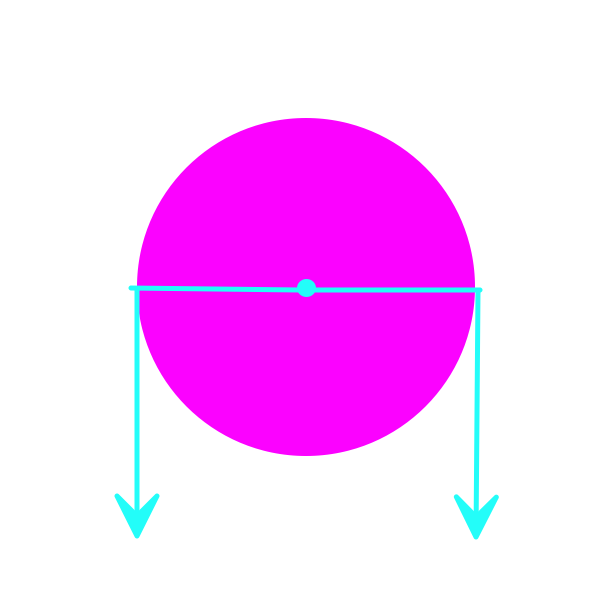
:::
::::

## Looking

- Behavioral goals
  - Direct gaze (eyes + head + body) toward goal-relevant targets
  - Direct gaze toward emergent targets
  - Track/pursue targets across observer/target motion
  - Maximize quality of visual information about targets

---

{width=50%}

---

{width=70%}


## Eye movement types

:::: {.columns}
::: {.column width=50%}
::: {.incremental}
- Voluntary
  - Saccades
  - Smooth pursuit
  - Vergence
  
:::
:::
::: {.column width=50%}
::: {.incremental}
- Involuntary
  - Vestibulo-occular reflex (VOR)
  - Optokinetic nystagmus
  - Accommodation

:::
:::
::::

## Saccades

:::: {.columns}
::: {.column width=40%}
- Rapid, ballistic (no online feedback)
- ~2-3/s
- ~200 ms to initiate
- Amplitudes >20 deg $\rightarrow$ saccade + head movement
:::
::: {.column width=60%}


:::
::::

-- @Wikipedia-contributors2025-mr

## {.scrollable}


## Smooth pursuit


## Vergence

:::: {.columns}
::: {.column width=40%}
- Eyes move disjointly
- Fixate on comparable locations
- Binocular vision $\rightarrow$ 3D depth
:::
::: {.column width=60%}

:::
::::

## Head movements {.scrollable}



-- @AnatomyApp2024-cn

## Vestibulo-occular reflex (VOR)

:::: {.columns}
::: {.column width=40%}
- Steady eyes when head moves
- Fast: response < 10 ms
- Disturbed in vertigo
:::
::: {.column width=60%}
{width=50% fig-align="center"}
:::
::::

## Optokinetic nystagmus (OKN)

- Also called optokinetic response
- Fast tracking of whole field visual motion, then reset 

::: {.fragment}
:::: {.columns}
::: {.column width=50%}


-- @Stanton2015-qh
:::
::: {.column width=50%}


:::
::::
:::

## Pupil constriction/dilation

:::: {.columns}
::: {.column width=50%}
- Bright light $\rightarrow$ constriction
  - Also by parasympathetic activation
- Dim light $\rightarrow$ dilation
  - Also by sympathetic activation
:::
::: {.column width=50%}

:::
::::

## Eye muscles


## Eye muscles

{width=90%}

---

|  Nerve |  Eye Muscle|
|------------|---------------|
|  CN^[Cranial nerve] III Oculomotor | Superior rectus |
|   | Inferior rectus |
|  | Medial rectus |
|  | Inferior oblique |
|  | Iris (pupillary) sphincter |
| CN IV Trochlear | Superior oblique | 
| CN VI Abducens | Lateral rectus | 
| ANS sympathetic | Iris (pupillary) dilator |

## Inputs to CN III

```{mermaid}
%%| label: fig-cn-iii-inputs
%%| fig-cap: "Inputs to CN III."
flowchart TD
  A["Frontal Eye Fields"] -->|"Voluntary saccades"| B(("CN III"))
  C["Superior Colliculus"] -->|"Reflexive saccades"| B
  D["Vestibular (CN VIII) n."] -->|"VOR"|B
  B --> E["Superior rectus"]
  B --> F["Inferior rectus"]
  B --> G["Medial rectus"]
  B --> H["Inferior oblique"]
  I["Parasympathetic NS"] -.-> B
  B -.-> J["Iris (pupillary) sphincter"]
```

## Considerations

::: {.incremental}
- (Multi)sensory feedback
  - Move eyes $\rightarrow$ shift visual field
  - Change vergence or lens thickness $\rightarrow$ change image focus
  - Eye muscles (probably) have proprioceptors analogous to spindles in skeletal muscles

:::

## Considerations

::: {.incremental}
- Relatively simple physics: 
  - Limited influence of gravity, friction
- Small # of muscles $\rightarrow$ "model" motor system?
- **DEMO**: Illustration of "forward"/generative model/[unconscious inference](https://en.wikipedia.org/wiki/Unconscious_inference)?
  - Predicting future/interpreting current sensory states
- Converging inputs: voluntary and involuntary control

:::

## Locomotion: Goals

:::: {.columns}
::: {.column width=50%}
- Keep balance
- Control speed
- Steer
  - Toward
  - Away

:::
::: {.column width=50%}

:::
::::

## Physics of balance

:::: {.columns}
::: {.column width=40%}
- Body ~ inverted pendulum
  - Inherently unstable
  - Requires *control*

:::

::: {.column width=60%}


-- @Lab2022-ea

:::
::::

---

- Keep Center of Mass (COM) within base of support



-- @Motion2024-rf

## Locomotion: Physics

:::: {.columns}
::: {.column width=50%}
- Rhythmic/periodic movement of limbs
  - Sequence of left/right leg flexions/extensions
  - + arm swing
  - + hips/trunk/neck movements
:::
::: {.column width=50%}

:::
::::


## Locomotion: Physics

:::: {.columns}
::: {.column width=50%}
- Legs, hips can be modeled as generalized spring-loaded inverted pendulum (G-SLIP)
:::
::: {.column width=50%}

:::
::::

## Locomotion: Neural signalling

- Animals with brain input to the spinal cord can locomote on a treadmill
- *Central pattern generators (CPG)* in spinal cord?



## Or "rotational" patterns...{.scrollable}

{width=70%}

## Reaching: Goals

:::: {.columns}
::: {.column width=50%}
- Move hand (foot/mouth) to contact target
- Avoid obstacles

:::
::: {.column width=50%}
Content
:::
::::

## Speech: Goals

- Involuntary vs. voluntary
- Vocalizations types
  - Linguistic 
  - Paralinguistic
    - Pitch, tone, rhythm, tempo, etc.
  - Non-linguistic
  
## Components

- Lips, tongue, mouth
- Pharynx
- Larynx
- Lungs

## {.scrollable}


---

<https://en.wikipedia.org/wiki/File:Real-time_MRI_-_Speaking_(English).ogv>

-- @Wikipedia-contributors2026-xx

## Consonants

- Place and manner of articulation
- Voicing
  - "B" vs. "P"
  - "D" vs. "T"
  - "G" vs. "K"
  - "Z" vs. "S"
  
## {.scrollable}
  


## {.scrollable}

{width=75%}

## {.scrollable}

```{mermaid}
%%| label: fig-speech-inputs
%%| fig-cap: "Inputs to cranial nerve nuclei involved in speech from cortex and midbrain."
flowchart TD
  Z["Motor cortex"] & Y["Periaqueductal gray"] --> A & C & E & G
  A["CN XII Hypoglossal"] --> B["Tongue"]
  C["CN X Vagus"] --> D["Larynx"]
  E["CN VII Facial"] --> F["Lips & face"]
  G["CN IX Glossopharygeal"] --> H["Pharynx"]
```

## Example



-- @VideoCollectables2014-bw

## Considerations

- Hierarchical, parallel control
- Sensory feedback
  - Vocal muscle stretch receptors
  - Auditory
- Vocal muscles like fingers
  - Large area of M1
  - Individuated control over
  
## {.scrollable}


## Illustrative motor systems: Interim summary

- Many (most?) behaviors involve sequences of
  - looking/orienting + locomotion + reaching/manipulation + vocalization
- Parallel, coordinated, sequential outputs to multiple motor systems

## Illustrative motor systems: Interim summary

- Direct (cerebral) cortical control over muscles of eyes, fingers, vocal apparatus
- Feedback critical, often multisensory
- Exploiting physics of body

## The cerebral symphony


# Wrap-up

## Main points

- 

## Next time

- Perception

# Resources

## About

This talk was produced using [Quarto](https://quarto.org), using the [RStudio](https://posit.co/products/open-source/rstudio/)
Integrated Development Environment (IDE), version 2026.1.0.392.

The source files are in R and R Markdown, then rendered to HTML using the
[revealJS](https://revealjs.com) framework.
The HTML slides are hosted in a [GitHub repo](https://github.com/psu-psychology/psy-511-scan-fdns-2026-spring) and served by GitHub pages:
<https://psu-psychology.github.io/psy-511-scan-fdns-2026-spring/>

## References
