# Prelude

---



-- @TheWhoVEVO2016-wl

## Announcements

- [Final Project proposal](../exercises/final-project.qmd) assigned.
- [Ex-PA • Perception & Action](../exercises/ex-PA.qmd) assigned.

## Today's topics

- The big picture
- Sensory processing
- Deep dive: Vision

## Warm-up

---

### Why is the myotatic stretch reflex important?

- A. It helps maintain body stability against external perturbation.
- B. It is the most famous complete and monosynaptic perception/action circuit we know of.
- C. It illustrates feedback control.
- D. All of the above

---

### Why is the myotatic stretch reflex important?

- A. It helps maintain body stability against external perturbation.
- B. It is the most famous complete and monosynaptic perception/action circuit we know of.
- C. It illustrates feedback control.
- **D. All of the above**

---

### Motor neuron axons emerge from this part of the spinal cord.

- A. Dorsal root
- B. Ventral root
- C. Cerebellum
- D. Motor cortex (M1)

---

### Motor neuron axons emerge from this part of the spinal cord.

- ~~A. Dorsal root~~
- **B. Ventral root**
- ~~C. Cerebellum~~
- ~~D. Motor cortex (M1)~~

---

![Wikipedia^[By Mysid (original by Tristanb) - Vectorized in CorelDraw by Mysid on an existing image at en-wiki by Tristanb., CC BY-SA 3.0, https://commons.wikimedia.org/w/index.php?curid=1420508]](https://upload.wikimedia.org/wikipedia/commons/d/d2/Spinal_nerve.svg)

---

### This is a a critical neural substrate for individuated movement of the fingers and vocal apparatus in humans.

- A. Feedback from the cerebellum.
- B. Feedforward information from the basal ganglia.
- C. Large motor neurons in Layer 5 of M1.
- D. Direct connections between M1 and motor neurons.

---

### This is a a critical neural substrate for individuated movement of the fingers and vocal apparatus in humans.

- ~~A. Feedback from the cerebellum.~~
- ~~B. Feedforward information from the basal ganglia.~~
- ~~C. Large motor neurons in Layer 5 of M1.~~
- **D. Direct connections between M1 and motor neurons.**

# The big picture

## Perception/action systems

```{r, echo=FALSE, message=FALSE, warning=FALSE}
library(igraph)
el <- rbind(c("World","Sensation"), c("Sensation","Mind"), c("Mind", "Act"), c("Act", "World"))
g <- graph_from_edgelist(el)
g$layout <- layout_in_circle
plot(g, vertex.size=50, vertex.color="gray")
```

---


## {.scrollable}

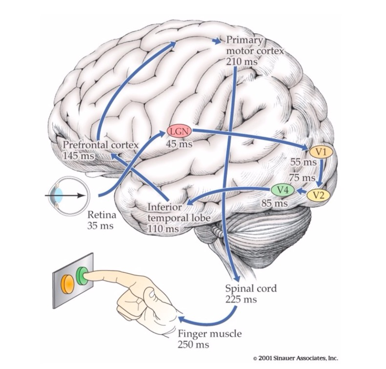{fig-align="center"}

---

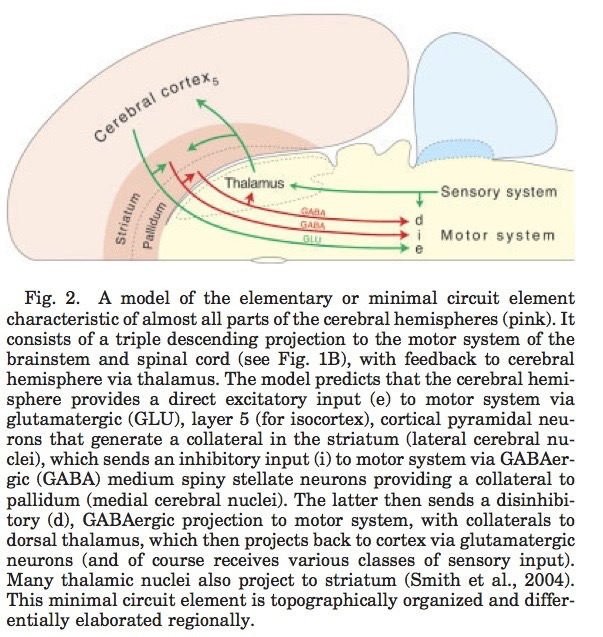

---


## Multisensory smartphones

:::: {.columns}
::: {.column width=33%}
- Accelerometer
- Gyroscope
- Magnetometer
- Proximity sensor
- Ambient light sensor

:::
::: {.column width=33%}

:::
::: {.column width=33%}
- Barometer
- Thermometer
- Mic
- Camera
- Radios (Bluetooth, wifi, cellular, GPS)
:::
::::

## Dimensions

:::: {.columns}
::: {.column width=50%}
- Interoceptive
  - Body position, movement, posture
  - Internal status
- Exteroceptive
  - Layout of environment, contents
:::
::: {.column width=50%}
```{mermaid}
%%| label: fig-input-output-flows
%%| fig-cap: "Schematic of information flows into and out of the nervous system."
flowchart TD
  N[Nervous System] -- autonomic --> B[Body]
  N -- somatic --> B
  N -- endocrine --> B
  B --->|interoception| N
  B --->|action| W[World]
  W --->|perception| B
  B --->|exteroception| N
```
:::
::::

## Questions for interoception

:::: {.columns}
::: {.column width=50%}
- Tired or rested?
- Well or ill?
- Hungry or thirsty or sated?
- Stressed vs. coping?
- Emotional state?
- Position of body
:::
::: {.column width=50%}

:::
::::

---


## Questions for exteroception

- Who/What is out there?
- Animate/inanimate?
    - Conspecific (same species)/non?
    - Threat/non?
    - Familiar/un?
    - Mate/non? or Friend/not?
    - Food source/non
    
## Questions for exteroception

:::: {.columns}
::: {.column width=50%}
- Where is it?
  - Distance
    - Proximal
    - Distal
  - Elevation, azimuth
:::
::: {.column width=50%}
- Coordinate frames
  + Self/ego (left of me)
  + Object (top of object)
  + Allo/world (North of College)
- Where moving?
:::
::::

## Causal chains

::: {.incremental}
- Behaviorally relevant conditions, events, and entities...
- Generate...
    - Chemical signals
    - Photic/electromagnetic patterns
    - Mechanical/acoustic patterns
:::
    
---

- That specialized sensors detect, and

::: {.incremental}
- Neural circuitry responds to
- That yield internal states (short- and long-term)
- That cause actions
- That cause perceptions...
:::

# Sensory Processing

## Physics of sensation

| Informal name | Source                            |
|---------------|-----------------------------------|
| Vision        | Electromagnetic radiation               |
| Audition      | Mechanical vibration in air/water       |
| Touch         | Mechanical vibration of skin on surface |
| Vestibular    | Rotation & linear acceleration of head  |
| Olfaction     | Chemical patterns in air/water          |

## Physics of sensation

| Informal name | Source                            |
|---------------|-----------------------------------|
| Gustation     | Chemical patterns in mouth              |
| Electroception | Electromagnetic radiation              |
| Magnetoreception | Electromagnetic radiation patterns   |
| Kinesthesia      | Position, velocity, acceleration of limbs, body |

## From $\Phi$ to $\Psi$

- What is the energy/chemical channel?
- Channels carry different types of information about
    + *What* is out there?
    + *Where* is it located or moving?
- Convey information at different rates, with varied precision
- Information often signaled by multiple sources

## Example: Vision

- Source: Electromagnetic radiation
    - Reflected from surfaces
- What is it?
    - Shape, size, surface properties (color, texture, reflectance, etc.)
    - Wavelength/frequency, intensity
    
## {.scrollable}


    
## Example: Vision

- Where is it?
    - Position: Left/right; up/down on retina
    - Near/far: retinal disparity, interposition, height above horizon...
    - Orientation, motion

## Example: Audition

- Source: Mechanical vibrations in air or water
- What is it?
    - Pattern of frequencies, amplitudes, durations
- Where is it?
    - Left/right or up/down: Interaural time/phase, intensity differences, pinnae filtering
    - Motion: Frequency shifts via Doppler effect
    
## {.scrollable}


    
## Example: Chemosensation

- Source: Chemicals in mouth, nasal cavity 
- What is it?
    - Mixtures of chemicals
- Where is it?
    - Left/right; up/down; near/far via intensity gradients
    
## {.scrollable}

![@Bargmann2006-gr Figure 2^[The locations of the main olfactory tissues in the mouse (a), Drosophila (b) and C. elegans (c) are shown. The odorant detection machinery is localized to the olfactory cilia, which are specializations of the olfactory neurons that come into direct contact with the environment (centre). The cilia of three representative olfactory neurons in each species are illustrated in the right-hand panel. Colours denote different odorant receptor proteins in the cilia. a, In mammals, olfactory neurons reside in the nasal epithelium. Each olfactory neuron expresses one type of odorant receptor, a GPCR. b, In Drosophila, olfactory neurons are localized to antennae and maxillary palps. Most olfactory neurons express one specific olfactory receptor and one ubiquitous one, Or83b (dark blue). Occasionally, neurons express two specific olfactory receptors in addition to Or83b (far right). The orientation of fly olfactory receptors is inverted with respect to classical GPCRs (Fig. 1a). (Fly head image modified, with permission, from Kyotofly Kit, Kyoto Institute of Technology, Japan.) c, In C. elegans, each olfactory neuron expresses several different GPCRs. The cell body is in the head and the cilia are at the tip of the nose. (Image courtesy of Jason Kennerdell, Rockefeller University, New York, USA.)]](https://media.springernature.com/full/springer-static/image/art%3A10.1038%2Fnature05402/MediaObjects/41586_2006_Article_BFnature05402_Fig2_HTML.jpg?as=webp)
    
## Somatosensation

- Source: Thermal or mechanical stimulation (vibration/pressure) of skin
- What is it?
    - Shape, size, smoothness, mass, temperature, deformability: Pattern of stimulation
- Where it it?
    - Pattern of cutaneous receptors on skin
    
## Interoception

:::: {.columns}
::: {.column width=60%}
- Hunger/thirst
    - Receptors for nutrient, fluid levels
- Energy levels
    - Receptors for hormones, NTs 
    - ANS responses
- Temperature
    - Receptors in skin, viscera
:::
::: {.column width=40%}
![@Namkung2017-gc Figure 2^[Figure 2. Interoceptive Information and Its Integration with Emotional, Cognitive, and Motivational Signals from an Array of Cortical and Subcortical Regions. Interoceptive information of constantly changing body states arrives in the posterior insula by ascending sensory inputs from dedicated spinal and brainstem pathways via specific thalamic relays. This information is projected rostrally onto the anterior insula, where it is integrated with emotional, cognitive, and motivational signals from an array of cortical and subcortical regions. As a result, the anterior insula supports unique subjective feeling states. The anterior insula regulates the introduction of subjective feelings into cognitive and motivational processes by virtue of its cortical location at the cross-roads of numerous pathways involved in higher cognition and motivation. Abbreviations: AI, anterior insula; AMG, amygdala; dACC, dorsal anterior cingulate cortex; DLPFC, dorsolateral prefrontal cortex; PI, posterior insula; THAL, thalamus; VMPFC, ventromedial prefrontal cortex; VS, ventral striatum.]](https://ars.els-cdn.com/content/image/1-s2.0-S0166223617300176-gr2.jpg)
:::
::::
    
## Interoception

:::: {.columns}
::: {.column width=50%}
- Mating interest
    - Receptors for hormones, NTs 
    - ANS responses
- Body position & movement (proprioception)
    - Receptors in muscles, joints, skin
:::
::: {.column width=50%}

:::
::::

## {.scrollable}


## Features of sensory signals

## Change across time

:::: {.columns}
::: {.column width=40%}
- *Tonic* (sustained) 
- vs. *phasic* (transient) responses
:::
::: {.column width=60%}
![@Dozmorov2011-ii Figure 1^[Two types of receptions differing by the rate of adaptation to the dynamical stimulus. A, Sensory system have two types of receptors differing by the rate of adaptation (9): tonic receptors that adapt slowly to a stimulus and continues to produce action potentials over the duration of the stimulus (left), and phasic receptors that adapt rapidly to a stimulus (right) and react to both the emergence of the signal (on- reaction) and to it cessation (off-reaction). The response diminishes quickly ant then stops. B, Immune system has different types of cells resembling in their reactions of tonic and phasic receptors of sensory systems. Some lymphocytes react preferably to the presence of foreign antigen (CD5- B lymphocytes, small resting T lymphocytes), whereas the others react to the change of antigenic contest in time (CD5+ B lymphocytes, naturally activated T-blast forms) or to the appearance of heterogeneity in presumingly homogenous tissue (NK killing of syngeneic targets in nonsyngeneic for targets environment (64, 65)).]](../include/img/dozmorov-2011-fig-01.jpeg)
:::
::::

## Change across time

:::: {.columns}
::: {.column width=50%}
- Adaptation/habituation
- Sensitization
- Most sensory systems attuned to change
:::
::: {.column width=50%}
![@Herman2013-uf Figure 3^[Figure 3. Stress habituation and facilitation. Repeated exposure to the same stressor results in progressive diminution of response magnitude, thought to be mediated by structures such as the prefrontal cortex (PFC) and paraventricular thalamus (PVT). Exposure to a new stressor after either homotypic or hetertypic stressors causes a larger than normal (“sensitized' or “facilitated' response), which may be mediated by enhanced drive from the basolateral amygdala (BLA), PVT or locus coeruleus (LC).]](https://images-provider.frontiersin.org/api/ipx/w=290&f=webp/https://www.frontiersin.org/files/Articles/48488/fnbeh-07-00061-HTML/image_m/fnbeh-07-00061-g003.jpg)
:::
::::

## Scientific psychology began with perception

:::: {.columns}
::: {.column width=50%}
- Psychophysics has origins in mid-1800s
- How precisely do human observers detect physical properties?
- Emphasisis on quantitative relationships, precise measurement
- More: @Wikipedia-contributors2025-gx
:::
::: {.column width=50%}

:::
::::

## Perception not linear

:::: {.columns}
::: {.column width=50%}
- Just noticeable difference (JND)
  - How much of a change is noticeable?
  - Slope of psychophysical function
  - JND usually a nonlinear function of absolute intensity ($S=k\ln{I}$)
- Steven's power law ($\psi{I}=kI^\alpha$) [@Wikipedia-contributors2025-bb]
:::
::: {.column width=50%}

:::
::::

## Perception not linear

:::: {.columns}
::: {.column width=50%}
- Steven's power law ($\psi{I}=kI^\alpha$) [@Wikipedia-contributors2025-bb]
- *Group*, average functions 
- Ignores
  - Individual differences
  - Contextual factors, c.f. [signal detection theory](https://en.wikipedia.org/wiki/Detection_theory)
:::
::: {.column width=50%}

:::
::::

---

::: {.callout-important}
### Beyond JNDs
Are other types of self-reported intensity or magnitude non-linear?

::: {.fragment}
For example, "How happy are you on a scale from 1 to 5?"

If so, what are the implications?
:::

:::

## Project to CNS at different speeds

- Bigger diameter axon fiber: Faster
- Thicker myelin sheath around axon: Faster

## Repeating signals (e.g. patterns)
  
+ In space (textures)
+ In time
    
## Vision


## Audition

{width=80%}

<!-- --- -->

<!-- :::: {.columns} -->
<!-- ::: {.column width=50%} -->
<!-- ```{r} -->
<!-- #| label: fig-lower-freq -->
<!-- #| fig-cap: "Lower frequency (20 Hz)" -->
<!-- library(ggplot2) -->
<!-- t = seq(from = 0, to = 1, by = .001) -->
<!-- a1 = 1 -->
<!-- a2 = 1.5 -->
<!-- f1 = 20 -->
<!-- f2 = 45 -->
<!-- p1 = 0 -->
<!-- p2 = pi/4 -->
<!-- s1 = a1*sin(2*pi*f1*t+p1) -->
<!-- s2 = a2*sin(2*pi*f2*t+p2) -->
<!-- df <- data.frame(t = t, s1 = s1, s2 = s2, s12 = s1 + s2) -->
<!-- df |> -->
<!--   ggplot() + -->
<!--   geom_line(aes(t, s1)) + -->
<!--   ylim(-2, 2) -->
<!-- ``` -->
<!-- ::: -->
<!-- ::: {.column width=50%} -->
<!-- ```{r} -->
<!-- #| label: fig-higher-freq -->
<!-- #| fig-cap: "Higher frequency (45 Hz) with phase shift and 1.5x amplitude." -->
<!-- df |> -->
<!--   ggplot() + -->
<!--   geom_line(aes(t, s2)) + -->
<!--   ylim(-2, 2) -->
<!-- ``` -->
<!-- ::: -->
<!-- :::: -->

<!-- --- -->

<!-- ```{r} -->
<!-- #| label: fig-sum-lower-higher-freq -->
<!-- #| fig-cap: "Sum of lower and higher frequencies." -->
<!-- df |> -->
<!--   ggplot() + -->
<!--   geom_line(aes(t, s12)) -->
<!-- ``` -->

---

{width=90%}

## Somatosensation

![@Deflorio2022-yh Figure 1^[Figure 1. Schematic view of exploratory movements. Surface texture (e.g., periodicity of a spatial grating, or roughness of sandpaper) may be felt by static pressing or sliding contact of the index finger with the normal and tangential force components as shown. Sliding is critical in discriminating very fine texture as it generate skin vibrations which reflect the sensed surface.]](https://www.frontiersin.org/files/Articles/862344/fnhum-16-862344-HTML/image_m/fnhum-16-862344-g001.jpg){width=70%}

## Methdological aside

:::: {.columns}
::: {.column width=30%}
- Fourier analysis (& synthesis), [@Wikipedia-contributors2025-mu]
- Powerful mathematical toolkit for understanding
  - vision, audition, somatosensation
  - EEG, MRI analysis
  - Music
:::
::: {.column width=70%}
![Wikipedia^[By Lorepenoten - Own work, CC0, https://commons.wikimedia.org/w/index.php?curid=176110382]](https://upload.wikimedia.org/wikipedia/commons/4/40/Fourier_analysis.png)
:::
::::

## Compare (>1) sensors located in different parts of the body
    
+ Eyes
+ Ears
+ Skin surface
+ Nostrils
- Tongue

---


## Specialized neurons: Vision

:::: {.columns}
::: {.column width=50%}
- Photoreceptors
:::
::: {.column width=50%}

:::
::::

## Specialized neurons: Audition

:::: {.columns}
::: {.column width=50%}
- Cochlear hair cells
:::
::: {.column width=50%}

:::
::::

## Specialized neurons: Gustation (taste)

:::: {.columns}
::: {.column width=50%}
- taste receptor cells
:::
::: {.column width=50%}

:::
::::

## ["Receptive fields"](https://en.wikipedia.org/wiki/Receptive_field)

>The receptive field is a portion of sensory space that can elicit neuronal responses when stimulated. The sensory space can be defined in a single dimension (e.g. carbon chain length of an odorant), two dimensions (e.g. skin surface) or multiple dimensions (e.g. space, time and tuning properties of a visual receptive field).

-- @Alonso2009-og
    
## Tactile receptive fields


## Receptive fields: Visual

:::: {.columns}
::: {.column width=50%}

:::
::: {.column width=50%}


:::
::::

## Topographic maps

## Auditory: Tonotopic maps {.scrollable}


## Visual: Retinotopic maps

:::: {.columns}
::: {.column width=50%}

:::
::: {.column width=50%}

:::
::::

## Visual: Retinotopic maps


## Somatosensory: Somatotopic maps in S1 & M1


## Non-uniform sensitivity

## Two-point touch thresholds

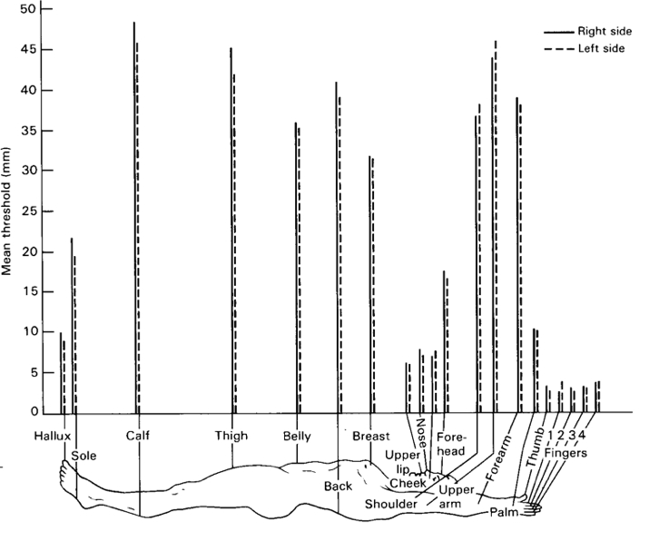

<iframe width="560" height="315" src="https://www.youtube.com/embed/t97QiEiKjD8" title="YouTube video player" frameborder="0" allow="accelerometer; autoplay; clipboard-write; encrypted-media; gyroscope; picture-in-picture" allowfullscreen></iframe>

## Somatosensory homunculus


## Visual acuity non-uniform


## Hearing thresholds non-uniform


## Hierarchical/sequential AND parallel

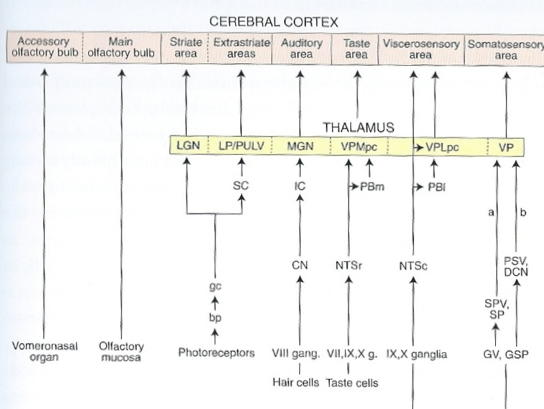

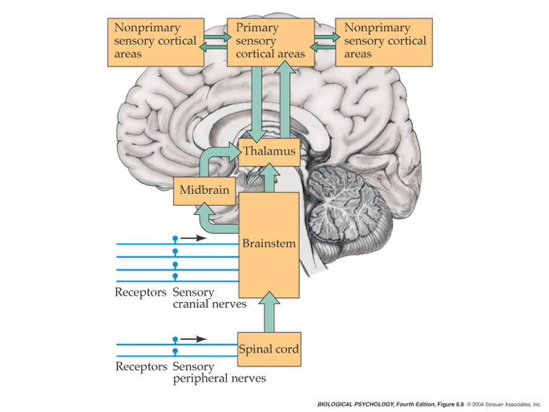

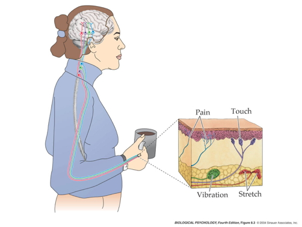

## Feedforward and feedback

```{r, echo=FALSE, message=FALSE, warning=FALSE}
el <- rbind(c("Wrld","Sens"), c("Sens","Mind"), c("Mind", "Act"), c("Mind","Sens"), c("Act", "Mind"), c("Act", "Wrld"))
g <- graph_from_edgelist(el)
g$layout <- layout_in_circle
plot(g, vertex.size=50, vertex.color="gray")
```

# Break

# Deep dive: Vision

## Animals respond to visual illusions, too


## A cat responds...

<https://www.reddit.com/r/youseeingthisshit/comments/p9y7v1/the_reaction_of_the_cat_on_the_optical_illusion/?ref=share&ref_source=embed&utm_content=title&utm_medium=post_embed&utm_name=85f1a01593f447e092c5b300e5561d6e&utm_source=embedly&utm_term=p9y7v1>

## Application in VR



-- @ewakili2021-vh

---


---


## Properties of Electromagnetic (EM) radiation

:::: {.columns}
::: {.column width=50%}
- Wavelength/frequency
- Intensity
- Location/position of source
- Reflects off some materials
- Refracted (bent) moving through other materials
- Information across space (and time)
:::
::: {.column width=50%}
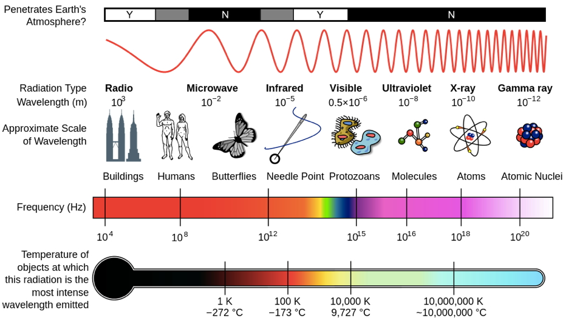

:::
::::

---

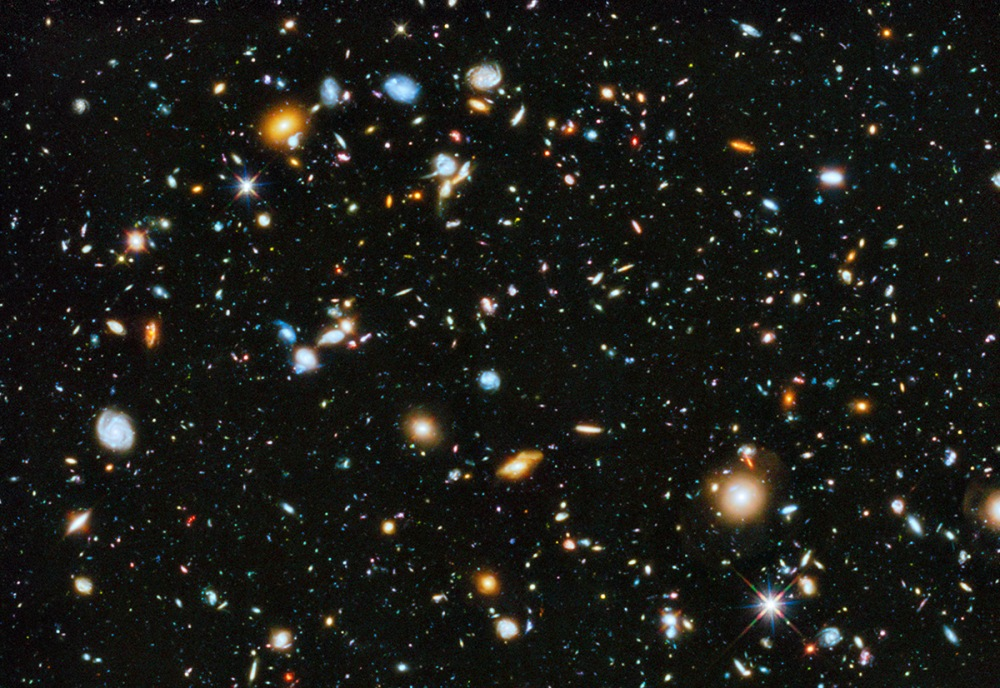

## Light

- Provides fast (2.99 million m/s; 186 million mi/hr) information about surfaces at a distance
- vs. sound (340 m/s; 767 mi/hr)
- vs. chemical signals (min/mi)

## Not instantaneous by cosmic scales


## Reflectance spectra differ by surface


---

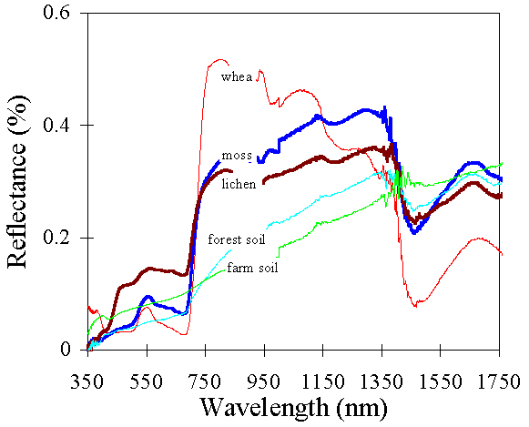

## [Optic array](https://en.wikipedia.org/wiki/Ambient_optic_array) specifies geometry of environment

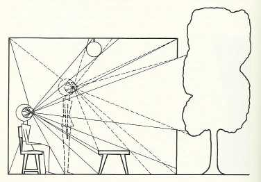

## Categories of wavelength specify perception of color

- Eyes categorize wavelength into relative intensities within wavelength bands
- RGB ~ <span class="red">**R**ed</span>, <span class="green">**G**reen</span>, <span class="blue">**B**lue</span>
    + Long, medium, short wavelengths
- *Color is a neural/psychological construct*


## The biological camera

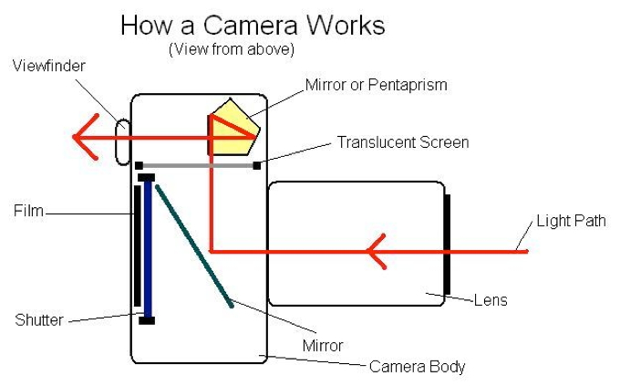
## {.scrollable}

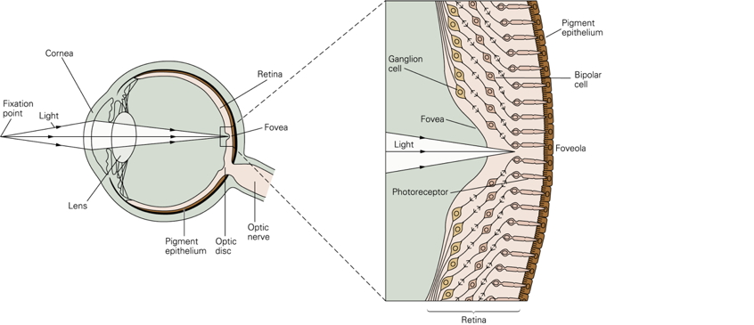

## {.scrollable}

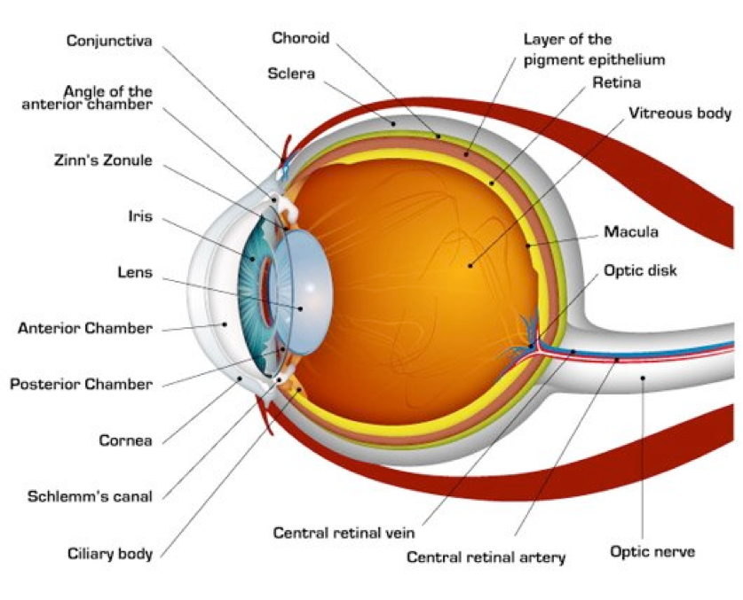

## Part of a self-stabilizing motor system...

<!-- <!-- Kestrel showing image stabilization --> -->
<!-- <iframe width="560" height="315" src="https://www.youtube.com/embed/JGArTWOJtXs?start=7" title="YouTube video player" frameborder="0" allow="accelerometer; autoplay; clipboard-write; encrypted-media; gyroscope; picture-in-picture" allowfullscreen></iframe> -->

<!-- <https://www.youtube.com/embed/JGArTWOJtXs> -->



-- @Bucalo2015-qm

## {.scrollable}

::: {.callout-important}
## The eye/head/body system

- Eye + head + body movements *align and point* the eyes
- Eye + head + body movements *stabilize* the eyes
  - When the observer moves
  - When objects move

:::

## Parts of the eye

- *Cornea* - refraction (2/3 of total)
- *Pupil* - light intensity; diameter regulated by Iris.
- *Lens* - refraction (remaining 1/3; focus)
- *Retina* - light detection
    + ~ skin or organ of Corti in inner ear
- *Pigment epithelium* - regenerate photopigment
- *Muscles* - move eye, reshape lens, change pupil diameter

## Geometry of retinal image

- Image inverted (up/down)
- Image reversed (left/right)
- Point-to-point map (*retinotopic*)
- Binocular and monocular zones

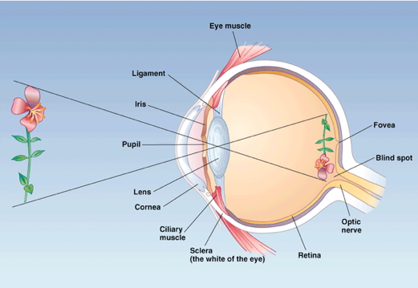

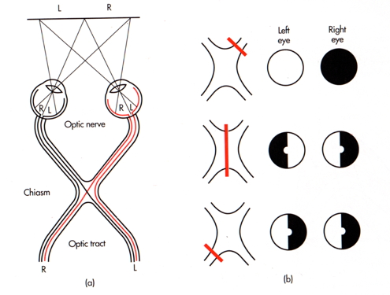

## The *fovea*

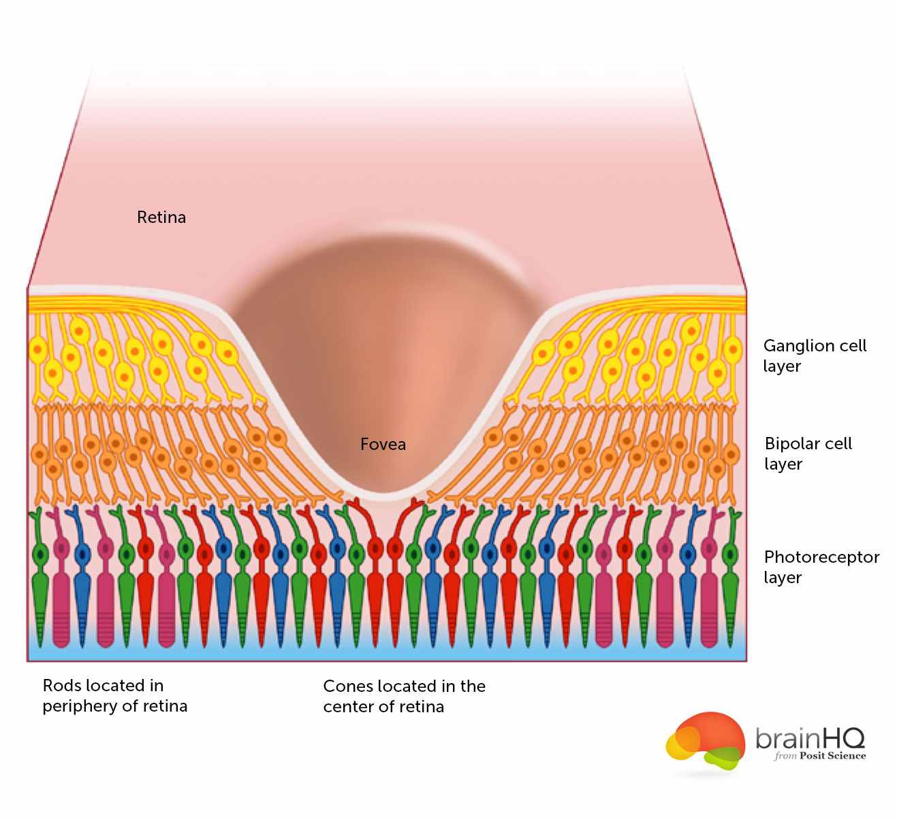

- Central 1-2 deg of visual field
- Aligned with visual axis
- *Retinal ganglion cells* pushed aside
- Highest *acuity* vision == best for details
- Acuity varies from center to periphery

---

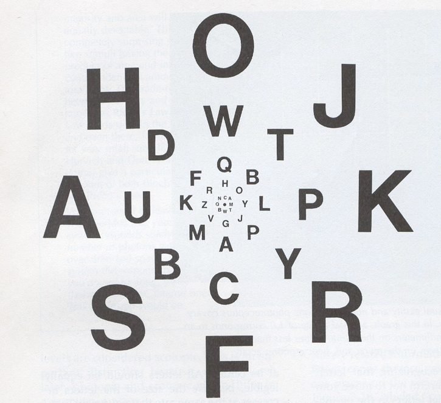

---

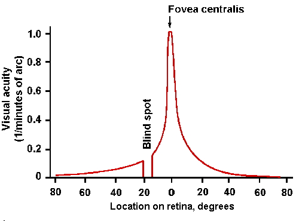

## What part of the skin is like the fovea?


## *Photoreceptors* in retina detect light

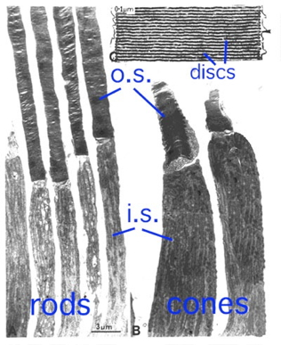

---

- *Rods*
    + ~120 M/eye
    + Mostly in periphery
    + Active in low light conditions
    + One wavelength range
- *Cones*
    + ~5 M/eye
    + Mostly in center
    + 3 wavelength ranges

---


---


## Photoreceptor physiology

- Outer segment
    + Membrane disks
    + *Photopigments*
        - Sense light, trigger chemical cascade
- Inner segment
    + Synaptic terminal
- Light *hyperpolarizes* photoreceptor!
    + The *dark current*
  
## Retina

- Physiologically *backwards*
    + <span class="red">Dark current</span>
- Anatomically *inside-out*
    + <span class="red">Photoreceptors at back of eye</span>

---

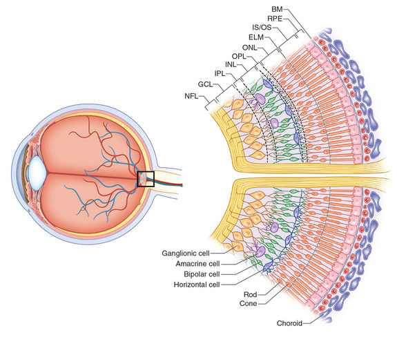

## Retina

- Information flows...
  - From photoreceptors...
  - To *Bipolar cells*
    + <-> and *Horizontal cells*
  - To *Retinal ganglion cells*
    + <-> and *Amacrine cells*
  - To cerebral cortex

## Center-surround receptive fields

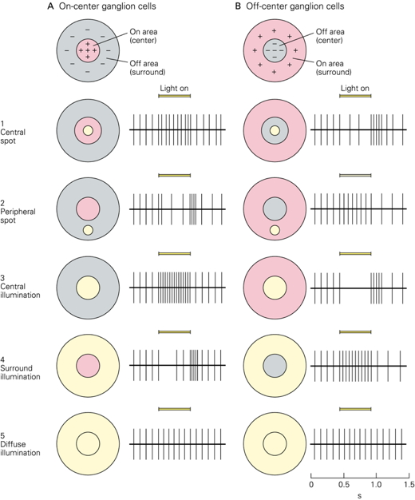

- Center region
    + Excites (or inhibits)
- Surround region
    + Does the opposite
- Bipolar cells & Retinal Ganglion cells ->
- Most activated by "donuts" of light/dark
    + Local contrast (light/dark differences)

## Opponent processing

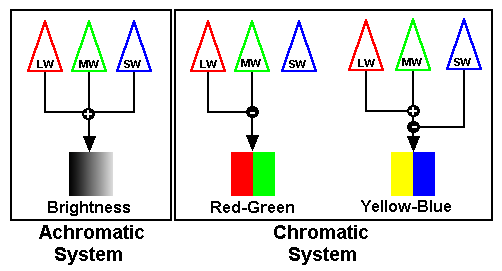

- Black (darker) vs. white (lighter) (achromatic)
- Long (red) vs. Medium (green) wavelength cones
- (Long + Medium) vs. Short cones
- Can't really see reddish-green or bluish-yellow
    - "Oppose" one another at cellular/circuit level
    - [DEMO](reddish-green.html)

## From eye to brain

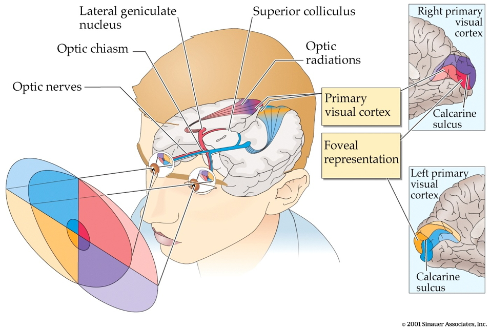

- Retinal ganglion cells
- 2nd/II cranial (optic) nerve
    + Optic chiasm ($\chi$ - asm): Partial crossing of fibers
    + Nasal hemiretina (lateral/peripheral visual field) cross
    + Left visual field (from L & R retinae) -> right hemisphere & vice versa
- *Lateral Geniculate Nucleus (LGN)* of thalamus (receives 90% of retinal projections)
- Hypothalamus
    + *Suprachiasmatic nucleus* (superior to the optic chiasm): Synchronizes day/night cycle with circadian rhythms
- Superior colliculus & brainstem

## LGN

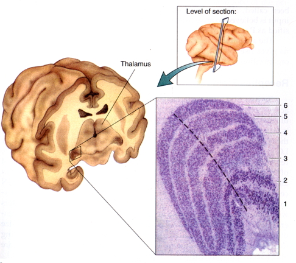

- 6 layers + intralaminar zone
    + Parvocellular (small cells): chromatic
    + Magnocellular (big cells): achromatic
    + Koniocellular (chromatic - <span color="blue">short</span> wavelength?)
- Retinotopic map of opposite visual field

#### From LGN to V1


- Via *optic radiations*
- *[Primary visual cortex (V1)](http://www.scholarpedia.org/article/Area_V1)* in occipital lobe
- Create "stria of Gennari" (visible stripe in layer 4)
- Calcarine fissure (medial occiptal lobe) divides lower/upper visual field

## Human V1


![[@dougherty_visual_2003]](../include/img/mri-v1-retinotopy.jpg)

- Fovea overrepresented
    + Analogous to somatosensation
    + High acuity in fovea vs. lower outside it
- Upper visual field/lower (ventral) V1 and *vice versa*

## Laminar, columnar organization

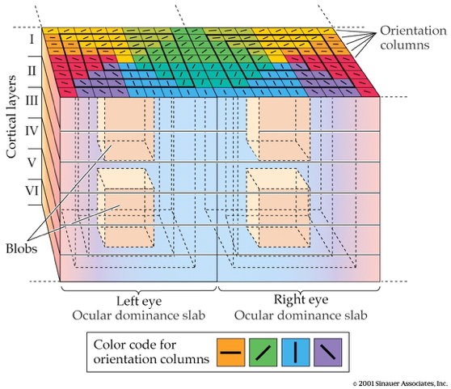

- 6 laminae (layers)
    + Input: Layer 4 (remember stria of Gennari?)
    + Output: Layers 2-3 (to cortex), 5 (to brainstem), 6 (to LGN)
- Columns
    + Orientation/angle
    + Spatial frequency
    + Color/wavelength
    + Eye of origin, *ocular dominance*

---

<iframe width="560" height="315" src="https://www.youtube.com/embed/IOHayh06LJ4" frameborder="0" allowfullscreen></iframe>

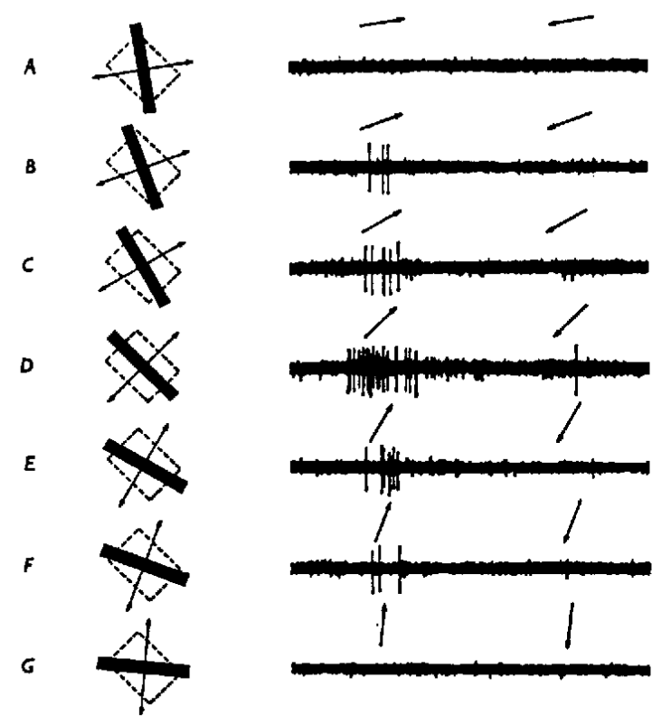

## From center-surround receptive fields to line detection


![[@panichello_predictive_2013]](../include/img/spatial-freq-fpsyg-03-00620-g003.jpg)

##  Ocular dominance columns


<iframe width="560" height="315" src="https://www.youtube.com/embed/KjAQdc29vF8" frameborder="0" allowfullscreen></iframe>

## Beyond V1

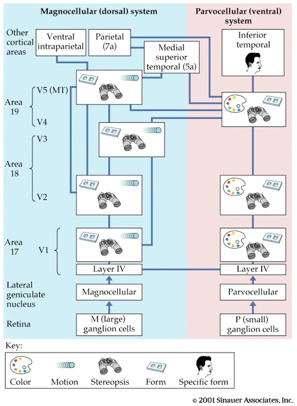

- Larger, more complex receptive fields
- *Dorsal stream* (where/how)
    + Toward parietal lobe
- *Ventral stream* (what)

## What is vision for?

- What is it? (form perception)
- Where is it? (space perception)
- How do I get from here to there (action control)
- What time (or time of year) is it?

# Senses (re)considered

---


## Act to perceive; perceive to act

:::: {.columns}
::: {.column width=50%}
- Orienting, info gathering
- Maintaining balance
- Reaching, grasping, & manipulation
- Locomotion
:::
::: {.column width=50%}
- Communication
- Mating & caregiving
- Ingestion & elimination
- Defense
- Sleep
:::
::::

## {.scrollable}

```{mermaid}
%%| fig-cap: "Schematic of information flows into and out of the nervous system. *Note*: This figure ignores flows specifically related to metabolism, like changes in blood oxygen."
flowchart TD
  N[Nervous System] -- autonomic --> B[Body]
  N -- somatic --> B
  N --->|endocrine| B
  B --->|endocrine| N
  B --->|action| W[World]
  W --->|perception| B
  B --->|somatic| N
  B --->|autonomic| N
```

# Wrap-up

## Main points

- Information about psychologically relevant properties of the world is carried via multiple physical and chemical channels.
- Perceptual systems are specialized for detecting meaningful patterns in these channels.
- Perceptual systems send information to the CNS via parallel pathways.
- Perceptual systems have commonalities in terms of computational principles & algorithms.

---

- Vision dominates human perception.
- Visual processing is both hierarchical (serial) and parallel.
- Sensory and motor processing should be considered as integrated systems.

## Next time

- Learning & memory

# Resources

## About

This talk was produced using [Quarto](https://quarto.org), using the [RStudio](https://posit.co/products/open-source/rstudio/)
Integrated Development Environment (IDE), version 2026.1.0.392.

The source files are in R and R Markdown, then rendered to HTML using the
[revealJS](https://revealjs.com) framework.
The HTML slides are hosted in a [GitHub repo](https://github.com/psu-psychology/psy-511-scan-fdns-2026-spring) and served by GitHub pages:
<https://psu-psychology.github.io/psy-511-scan-fdns-2026-spring/>

## References