# Overview

## Prelude



-- @Timvitkuske2014-wy

## Announcements

- *Due*: [Exercise PA • Perception & Action](../exercises/ex-PA.qmd)
  - [Canvas dropbox](https://psu.instructure.com/courses/2441266/assignments/18005038)
- *Updated*: [Final Project proposal](../exercises/final-project.qmd#project-proposal)
  - [Fun with AI](../exercises/final-project.qmd#a-critical-dialogue-with-ai)

## Today's topics

- Big picture questions
- Biological bases of
- Disorders of memory
- Working memory

## Warm-up

---

### Which of the following sensory systems have clear topographic maps in the cerebral cortex?

- A. Vision
- B. Audition
- C. Somatosensation
- D. Olfaction
- E. A, B, & C.

---

### Which of the following sensory systems have clear topographic maps in the cerebral cortex?

- A. Vision
- B. Audition
- C. Somatosensation
- ~~D. Olfaction~~
- **E. A, B, & C.**

## {.scrollable}

:::: {.columns}
::: {.column width=33%}
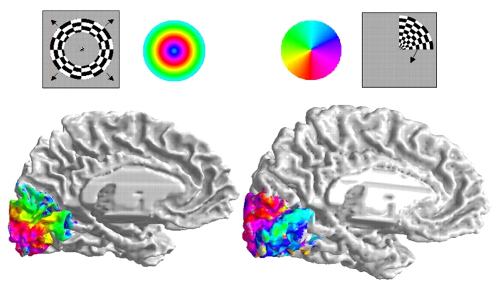
:::
::: {.column width=33%}

:::
::: {.column width=33%}
![@Humphries2010-hi Figure 3^[Fig. 3. Flattened surface representation. (A) Derivation of a flattened patch for a single subject, showing the corresponding area on the original surface. On the patch, gyri are represented with lighter shading and sulci with darker shading. (B) Hand drawn boundaries used for group alignment. (C) Left hemisphere tonotopy map for a single subject projected on a flattened surface and in volumetric space.]](https://cdn.ncbi.nlm.nih.gov/pmc/blobs/77e5/2830355/d2c2a836b94d/nihms172043f3.jpg)
:::
::::

---

### True or false: There is little evidence that psychological judgements of stimulus magnitude are linear.

- A. True
- B. False

---

### True or false: There is little evidence that psychological judgements of stimulus magnitude are linear.

:::: {.columns}
::: {.column width=50%}
- **A. True**
- ~~B. False~~
:::
::: {.column width=50%}
::: {.fragment}
{width=75% fig-align="right"}
:::
:::
::::

---

### Humans can't see or even imagine reddish-green because

- A. Long (reddish) wavelength cones and medium (greenish) wavelength cones connect to downstream cells with opposing effects.
- B. Rod photoreceptors are monochromatic.
- C. Lights with both long and medium wavelengths appear yellow.
- D. Color is a psychological categorization of continuous wavelength spectra.

---

### Humans can't see or even imagine reddish-green because

- **A. Long (reddish) wavelength cones and medium (greenish) wavelength cones connect to downstream cells with opposing effects.**
- ~~B. Rod photoreceptors are monochromatic.~~
- C. Lights with both long and medium wavelengths appear yellow.
- D. Color is a psychological categorization of continuous wavelength spectra.

## {.scrollable}

:::: {.columns}
::: {.column width=50%}
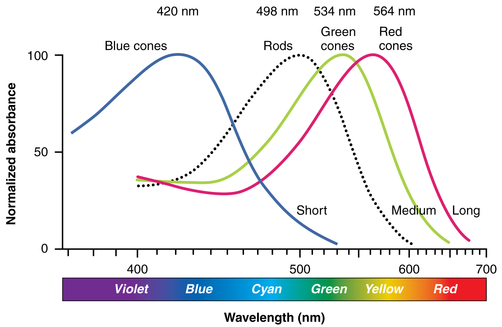
:::
::: {.column width=50%}

:::
::::

# Big picture questions

## Memory capacity of the human brain?

- 1e12 neurons
- 1e3 synapses/neuron
- 1e15 synapses or 1.25e14 bytes
- 1e9 gigabyte, 1e12 terabyte, 1e15 petabyte
- So 125 TB?

-- @Reber2010-bu

## What is learning?

> Learning is the process of acquiring new understanding, knowledge, behaviors, skills, values, attitudes, and preferences. 

-- <https://en.wikipedia.org/wiki/Learning>

## Types of learning?

:::: {.columns}
::: {.column width=50%}
- **Non-associative**
    - Change in response to repeated encounters with same stimulus/event
    - Habituation -> weaker response
    - Sensitization -> stronger response
:::
::: {.column width=50%}
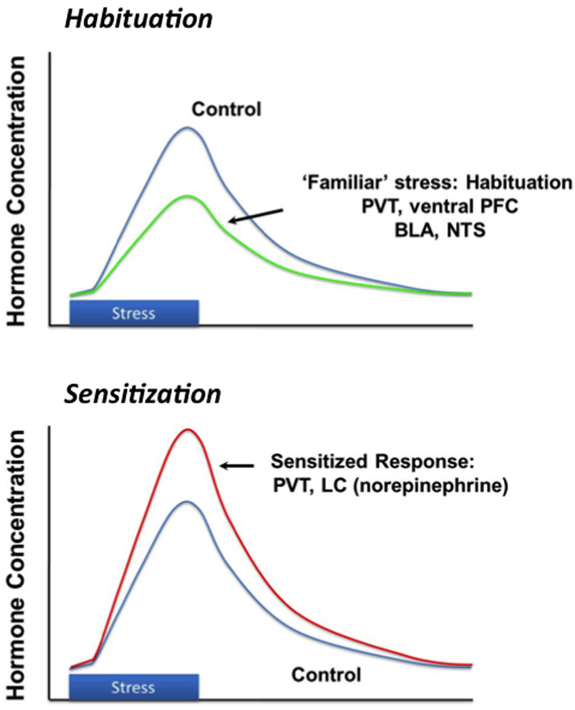{fig-align="right" width="75%"}
:::
::::

## Types of learning

:::: {.columns}
::: {.column width=60%}
- **Associative**
  - "Associates" or links two events/items with one another
:::
::: {.column width=40%}
:max_bytes(150000):strip_icc():format(webp)/2794861-classical-vs-operant-conditioning-5afc42a343a10300370da76f.png){fig-align="right"}
:::
::::

## Types of learning

:::: {.columns}
::: {.column width=60%}
- Classical conditioning
  - Link event with physiological response
- Operant/instrumental conditioning
  - Link behaviors with external events (rewards/punishments) 
:::
::: {.column width=40%}
:max_bytes(150000):strip_icc():format(webp)/2794861-classical-vs-operant-conditioning-5afc42a343a10300370da76f.png){fig-align="right"}
:::
::::

## Associative learning

:::: {.columns}
::: {.column width=60%}
- Types
  - Observational/imitative
:::
::: {.column width=40%}
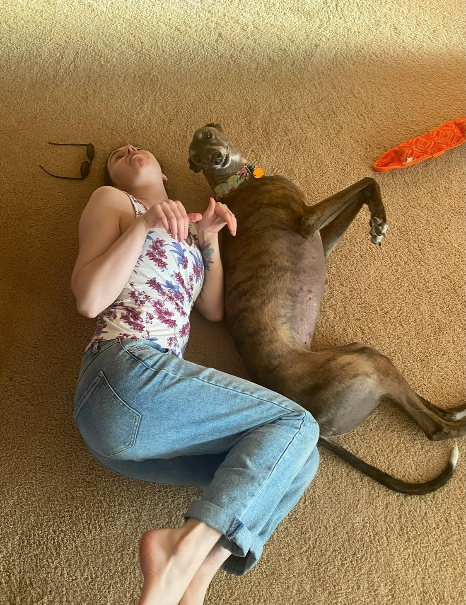{fig-align="right" width="70%"}
:::
::::

## Associative learning

:::: {.columns}
::: {.column width=50%}
- Types
  - Sequence
    - A, B, C, D, ...
  - Episodic
    - Mom's 85th
  - Semantic
    - Thanksgiving is a holiday celebrated in Canada and the U.S...
  
:::
::: {.column width=50%}
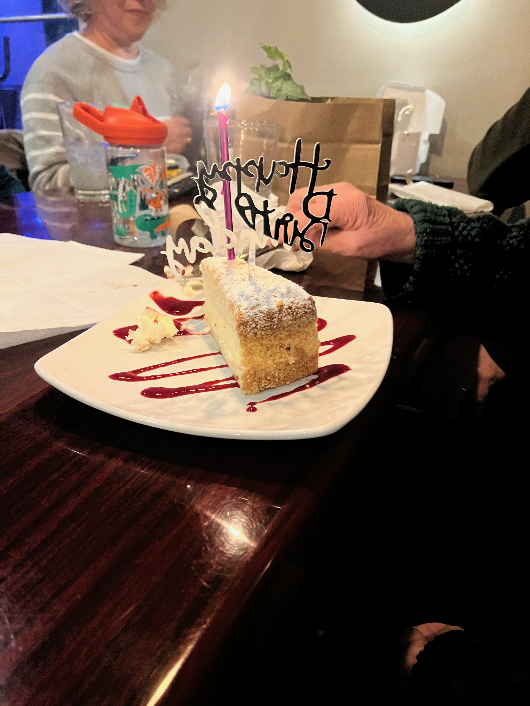{fig-align="right" width="70%"}
:::
::::

## Learning styles?

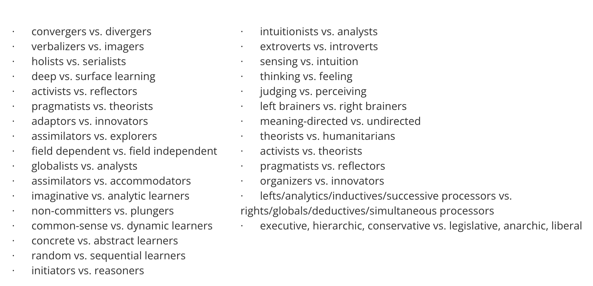

## Are myths [@Pashler2008-zi]

>Although the literature on learning styles is enormous, very few studies have even used an experimental methodology capable of testing the validity of learning styles applied to education. Moreover, of those that did use an appropriate method, several found results that flatly contradict the popular meshing hypothesis...

---

>We conclude therefore, that at present, there is no adequate evidence base to justify incorporating learning-styles assessments into general educational practice.

-- @Pashler2008-zi

## How do machines "learn"?

::: {.fragment}
- Often, but not always, by imitating brains.
:::

## {.scrollable}


## Neural networks {.scrollable}


## Network [learning rules](https://en.wikipedia.org/wiki/Learning_rule)

- How/when to change connections between network nodes
- Types
  - Unsupervised (i.e., covariance/correlation)
  - Supervised (change based on 'error', external 'supervision')
  - Reinforcement (learn *now*)
    
## What is memory?

::: {.fragment}
- A: Information encoding, storage, retrieval
:::

## Types?

- Facts/events/places/feelings vs. skills
- Short vs. long-term
    - Working memory ~ short-term maintenance for guiding action
- *Explicit* (declarative: *semantic* vs. *episodic*) vs. *implicit* (procedural)
- *Retrospective* (from the past) vs. *prospective* (to be remembered)
- *Recognition* (judgment of familiarity or novelty) vs. *recall*

## {.scrollable}

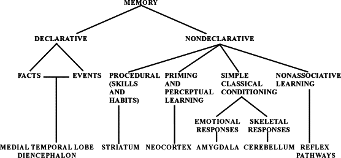

## Computer memory vs. brains

| Computers | Brains |
|-----------|--------|
| Separate memory and processing stores | Processing & memory not separate; specialized regions |
| Specific addresses | Distributed networks (no addresses?) |
| (Usually) non-volatile | Volatile |
| All types--images, sounds, text, data--stored as binary sequences, e.g., `01101110` | Stored patterns of synaptic connections and ??? |

## Computer memory vs. brains

| Computers | Brains |
|-----------|--------|
| Render binary sequences differently based on information about the *type* of data stored | Retrieve different types based on ??? |
| Inspired by mathematical models of neurons | Can be simulated by mathematical models implemented in computers |

## Artificial neurons

- Mathematical/computational models of neurons & networks has 70 year+ history [@McCulloch1943-ud]

](https://upload.wikimedia.org/wikipedia/commons/b/b0/Artificial_neuron.png)

# Biological bases of...

## Does learning require a network?

- Learning in single cells controversial [@Gershman2021-zf]
- Beatrice Gelber

## {.scrollable}

![@Gershman2021-zf Figure 1^[News story about Beatrice Gelber from the Tucson Daily Citizen October 19, 1960. © 1960, USA TODAY NETWORK. This image is not covered by the CC-BY 4.0 licence and may not be separated from the article.]](https://iiif.elifesciences.org/lax/61907%2Felife-61907-fig1-v1.tif/full/1500,/0/default.jpg)

## {.scrollable}

![@Gershman2021-zf^[In Experiment 1 (top), one group of Paramecia was exposed to intermittent training trials in which a wire was coated with bacteria (every 3rd trial during the training phase). This group acquired a conditioned response to the clean wire, as measured by adherence to the wire in final test trials. In contrast, an untrained group did not show a conditioned response. Experiment 2 (bottom) demonstrated that the wire by itself did not drive conditioned responding.] from @Gelber1952-bb](https://iiif.elifesciences.org/lax/61907%2Felife-61907-fig2-v1.tif/full/1500,/0/default.jpg)

---

>This paper presents a new approach to behavioral problems which might be called molecular biopsychology… Simply stated, it is hypothesized that the memory engram must be coded in macromolecule...As the geneticist studies the inherited characteristics of an organism the psychologist studies the modification of this inherited matrix by interaction with the environment.  

-- @Gelber1962-ey

---

>Possibly the biochemical and cellular physiological processes which encode new responses are continuous throughout the phyla (as genetic codes are) and therefore would be reasonably similar for a protozoan and a mammal.

-- @Gelber1962-ey

---

>Taking stock, we believe that Gelber’s experiments, though not without their limitations, convincingly demonstrated Pavlovian conditioning in Paramecia. Sadly, her critics seem to have won in the long term. Most reviews of the literature, if they mention Gelber’s work at all, quickly dismiss it...

-- @Gershman2021-zf

---

>If single cells can learn then they must be using a non-synaptic form of memory storage. The idea that intracellular molecules store memories has a long history, mainly in the study of multicellular organisms. 

-- @Gershman2021-zf

## Learning in nervous systems

::: {.fragment}

>The idea that memory is stored as enduring changes in the brain dates back at least to the time of Plato and Aristotle (circa 350 BCE), but its scientific articulation emerged in the 20th century when Richard Semon introduced the term **“engram” to describe the neural substrate for storing and recalling memories**. 

-- @Josselyn2020-xr

:::

## Mechanism(s)

>Essentially, Semon proposed that **an experience activates a population of neurons that undergo persistent chemical and/or physical changes to become an engram**. Subsequent reactivation of the engram by cues available at the time of the experience induces memory retrieval. 

-- @Josselyn2020-xr

## Neural substrates (engrams) consist of

- Changes in *patterns of neural activity*
- Changes in *connectivity*
    + New synapses
    + Altered synapses (strengthened or weakened)
    
## Donald Hebb

:::: {.columns}
::: {.column width=50%}
- Canadian clinical neuropsychologist
- Author of *The Organization of Behavior* [-@Hebb1949-se]
:::
::: {.column width=50%}
{width="60%" fig-align="right"}
:::
::::

## Hebbian learning

>"*When an axon of cell A is near enough to excite cell B and repeatedly or persistently takes part in firing it, some growth process or metabolic change takes place in one or both cells such that A’s efficacy, as on of the cells firing B, is increased.*" 

-- @Hebb1949-se

## Hebbian learning

>"*Neurons that fire together wire together.*"

-- @Lowel1992-lk

## Hebbian learning is *associative*

- Neuron A active & 
- Neuron B active $\rightarrow$ 

```{mermaid}
flowchart LR
  A --> B
```

::: {.fragment}

- Strengthen link (synapse) between them

```{mermaid}
flowchart LR
  A ==> B
```

:::

## How synapses strengthen

:::: {.columns}
::: {.column width=50%}
- [Long-term potentiation (LTP)](https://en.wikipedia.org/wiki/Long-term_potentiation)
- Make more potent (stengthen) synapse based on recent co-activity
- Change at synapse == physical basis of one type of Hebbian learning
:::
::: {.column width=50%}
{fig-align="right"}
:::
::::
  
## LTP discovery 

:::: {.columns}
::: {.column width=50%}
- @Bliss1973-xx
- Granule cell neurons in hippocampus dentate gyrus (DG)
- $\theta$ band (10–20 Hz) stim for 10–15 sec, or 100 Hz stim for 3–4 sec
:::
::: {.column width=50%}
{fig-align="right"}
:::
::::

## LTP discovery

:::: {.columns}
::: {.column width=50%}
- shortened response latency, increased EPSP, increased population response over minutes or hours
:::
::: {.column width=50%}
{fig-align="right"}
:::
::::

## Mechanism(s) of LTP

- effectiveness of postsynaptic response
  - post-synaptic, early LTP
- number of synaptic receptors
  - post-synaptic, late LTP
- quantity of NT released
  - pre-synaptic, late LTP
  
## Mechanism

:::: {.columns}
::: {.column width=50%}

:::
::: {.column width=50%}
- *N-methyl-D-aspartate* receptor (NMDA-R)
  - Name derived from agonist molecule that selectively binds to the receptor
- 'Coincidence' detector
    + Sending cell has released NT
    + Receiving cell is/has been recently active
:::
::::

## Pathways to plasticity

- Glutamate release activates
    - ionotropic AMPA Glu receptors
    - metabotropic Glu receptors
    - N-methyl-D-aspartate (NMDA) Glu receptors (NMDA-R)

## NMDA-R

:::: {.columns}
::: {.column width=50%}

:::
::: {.column width=50%}
- *Chemically*-gated
    - Binds glutamate
      - When nearby neuron releases
    - Binds glycine (co-factor/co-agonist)
    - So, *ligand-gated*
:::
::::

## NMDA-R

:::: {.columns}
::: {.column width=50%}

:::
::: {.column width=50%}
- *Voltage*-gated
    + Receiving cell depolarizes (generates excitatory post-synaptic potential or EPSP)
    + $Zn^{++}$ or $Mg^{++}$ ion 'plug' repelled under depolarization
    + $Na^+$ & $Ca^{++}$ influx; $K^+$ outflux
:::
::::

## {.scrollable}

```{r, out.width="75%", fig.cap='https://i2.wp.com/www.gatewaypsychiatric.com/wp-content/uploads/2015/02/NMDA-Receptor-and-Depression.jpg?ssl=1'}
knitr::include_graphics("https://i2.wp.com/www.gatewaypsychiatric.com/wp-content/uploads/2015/02/NMDA-Receptor-and-Depression.jpg?ssl=1")
```

## Pathways to plasticity

- $Ca^{++}$ entry via NMDA receptor activates protein kinases (CaMKII and PKAII)
- *Early LTP* (up to few hours)
    - protein kinases *phosphorylate* (add $P$ group to) postsynaptic AMPA receptors
    - Increase current flow through AMPA (Glu) receptors
    
## Pathways to plasticity

- *Late LTP*
    - depends on protein synthesis to generate new AMPA receptor
    - insertion of new AMPA receptors into postsynaptic membrane
- Retrograde signal generator influences presynaptic response

## Schematic

```{mermaid}
flowchart LR
  A -->|Glu| B
```

```{mermaid}
flowchart LR
  A -->|Glu| C[AMPA-R]
  A -->|Glu| B[NMDA-R]
  C --> |generates EPSP| B
  B --> |Ca++ enters| D:::hidden
  
  %% Clickable links
  click C "https://en.wikipedia.org/wiki/AMPA_receptor"
  click B "https://en.wikipedia.org/wiki/NMDA_receptor"
```

::: {.incremental}
- Ca++ entry strengthens synapse
- Modulate existing AMPA-R; synthesize new AMPA-R 
:::

## NMDA-Rs & associative learning

::: {.incremental}
- Receptors associate (link)
    + Concept A -> Concept B
    + Neuron A -> Neuron B
- I say Donald...you say...

:::

---

:::: {.columns}
::: {.column width=33%}

:::
::: {.column width=33%}

:::
::: {.column width=33%}

:::
::::

## {.scrollable}

:::: {.columns}
::: {.column width=30%}

:::
::: {.column width=3%}
:::
::: {.column width=30%}

:::
::: {.column width=3%}
:::
::: {.column width=30%}

:::
::::

## NMDA-R clinical significance

- [*Memantine*](https://medlineplus.gov/druginfo/meds/a604006.html) (Alzheimer's Disease treatment)
    - NMDA-R antagonist
    - Controls over-activation and $Ca^{++}$ excitotoxicity?
- Implicated in effects of *phencylidine* (PCP)
    - Link to Glutamate hypothesis of schizophrenia?
    
## NMDA-R clinical significance

- *Ketamine* is NMDA-R antagonist^[Blocks ion pore. See <https://en.wikipedia.org/wiki/Ketamine>]
    - anesthesia, sedation pain relief
    - possible short-term relief for depression
- Linked to analgesic effects of nitrous oxide (laughing gas; $NO$)
- Alcohol (ethanol) inhibits [@Ron2011-dh]

## Spike-timing-dependent plasticity

- How to learn/remember "causal chains"?
  - e.g., lightning THEN thunder
  - unusual food THEN indigestion, e.g. [Garcia effect](https://en.wikipedia.org/wiki/John_Garcia_(psychologist)) or [conditioned taste aversion](https://en.wikipedia.org/wiki/Conditioned_taste_aversion)

## {.scrollable}

![@caporale2008spike Figure 1^[Recent studies have further characterized the mechanism and function of STDP in both in vitro and in vivo preparations, addressing the following questions: Which cellular mechanisms determine the STDP window, and how similar are they to the mechanisms underlying LTP and LTD induced by HFS and LFS, respectively? Does the window depend on the dendritic location of the input, and can it be regulated by neuromodulatory inputs? Does a similar learning rule apply to the inhibitory circuits? Can we observe the consequences of the asymmetric window in vivo, and can it account for the synaptic modifications induced by complex, naturalistic spike trains? In this review we summarize recent progress in these areas.]](../include/img/caporale-2008-fig-1.jpg)

## {.scrollable}

![@caporale2008spike Figure 2^[Balanced excitation and inhibition are crucial for normal brain functions (Shu et al. 2003) and for regulating experience-dependent developmental plasticity (Hensch 2005). Although the strength of excitatory synapses can be modified through STDP, an important question is whether and how correlated pre- and postsynaptic activity affects inhibitory circuits. Inhibition in a network depends on both the excitatory synapses onto inhibitory neurons and the inhibitory synapses themselves. Spike timing–dependent plasticity has been studied at both of these synapses.]](../include/img/caporale-2008-fig-2.jpg)

---

- A before B: strengthen $A \rightarrow B$
- A after B: weaken $A \rightarrow B$
  - Long-term Depression or LTD
- [*Neural Plasticity*](https://en.wikipedia.org/wiki/Neuroplasticity)
    + Lasting changes in neural firing, connectivity
- NMDA-R a molecular mechanism for implementing LTP and spike-timing-dependent plasticity

## Summary

- Learning and memory involve changes in neural firing, circuitry
    - And probably molecular changes inside neurons
- Hebbian learning a type of associative learning
- NMDA receptors implement coincidence detectors that undergird associative learning at the synapse

# Memory systems

## Lashley's search for the ['engram'](https://en.wikipedia.org/wiki/Engram_(neuropsychology))

:::: {.columns}
::: {.column width=50%}
- Is memory 'localized' like sensory and motor functions? [@Lashley1944-fg]
:::
::: {.column width=50%}
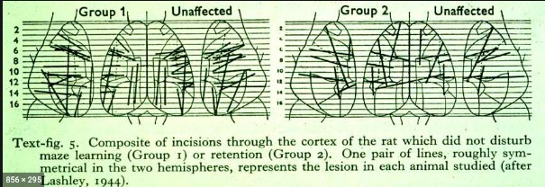
:::
::::

## {.scrollable}

>"*the area subdivisions are in large part anatomically meaningless and misleading as to the presumptive functional divisions of the cortex*"

-- @Lashley1946-pa

- Memory not localized in the rat cerebral cortex!

## Modern views

:::: {.columns}
::: {.column width=50%}
- Cerebral cortex less central to "engram-like" memory than other areas
:::
::: {.column width=50%}


:::
::::

## Hippocampus

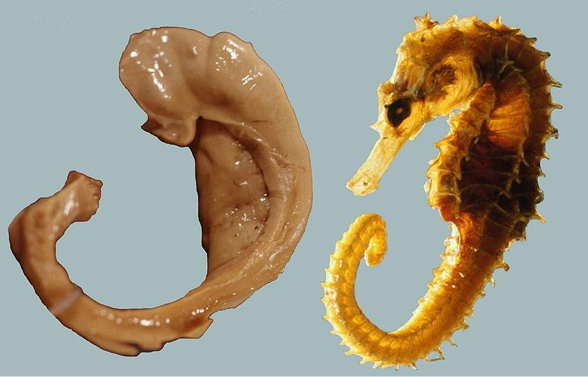

## {.scrollable}


## Hippocampus

- Dense in NMDA receptors
- Central "hub" in network?
    - No, based on anatomical or functional connectivity
    - But yes, when modeling "information flow", [@Misic2014-eq]
- Formation, storage, consolidation of long-term episodic or declarative memories

## Hippocampus

- Stores info for later transfer to cortex
    - "Engrams" form in hippocampus & prefrontal cortex (PFC) simultaneously
    - Fade in PFC over time [@Kitamura2017-es]
- Spatial navigation
    + [Place cells](https://en.wikipedia.org/wiki/Place_cell)
    + [Grid cells](http://www.scholarpedia.org/article/Grid_cells)
    + [Head-direction cells](http://www.scholarpedia.org/article/Head_direction_cells)
    
## {.scrollable}

![@kjelstrup_finite_2008 Figure 1^[Fig. 1. Place fields of eight pyramidal cells recorded at different longitudinal levels of CA3 during animals' running on a linear 18-m track. (A) Nissl-stained sections showing recording locations in four animals. Individual rat numbers are indicated. (B) Place fields on the 18-m track. Each panel shows one cell. Rat numbers refer to (A). Percentages indicate location along the dorsoventral axis. For rat 11285, only the 87% location is shown in (A). (Top of each panel) Smoothed spike density function indicates firing rate as a function of position. Horizontal bar indicates estimated place field. Left runs, red; right runs, green. (Bottom of each panel) Raster plot showing density of spikes on individual laps. Each vertical tic indicates one spike and each horizontal line shows one lap (right side, blue-green; left, red). See fig. S5 for complete cell samples. Note 5- to 10-m-long place fields in ventral CA3 (colored horizontal bars; left runs, red; right runs, green).]](../include/img/finite-scale-spatial-rep-F1.large.jpg)

## Memory-taxing behaviors alter hippocampus

:::: {.columns}
::: {.column width=50%}
- London taxi drivers (a high memory demand profession) have specialized hippocampi [@maguire2000navigation]
- Not due to self-motion, driving experience, or stress *per se*
:::
::: {.column width=50%}

:::
::::

---

>Gray matter volume differences in the hippocampus relative to controls have been reported to accompany this expertise. While these gray matter differences could result from using and updating spatial representations, they might instead be influenced by factors such as self-motion, driving experience, and stress. We examined the contribution of these factors by comparing London taxi drivers with London bus drivers, who were matched for driving experience and levels of stress, but differed in that they follow a constrained set of routes.

-- @Maguire2006-sc

---

>We found that compared with bus drivers, taxi drivers had greater gray matter volume in mid-posterior hippocampi and less volume in anterior hippocampi. Furthermore, years of navigation experience correlated with hippocampal gray matter volume only in taxi drivers, with right posterior gray matter volume increasing and anterior volume decreasing with more navigation experience. This suggests that spatial knowledge, and not stress, driving, or self-motion, is associated with the pattern of hippocampal gray matter volume in taxi drivers.

-- @Maguire2006-sc

---

::: {#fig-woollett-2011 layout-ncol=2}


  
:::

## Evidence from other species

- Birds whose ethologies have high memory demands have larger hippocampi.

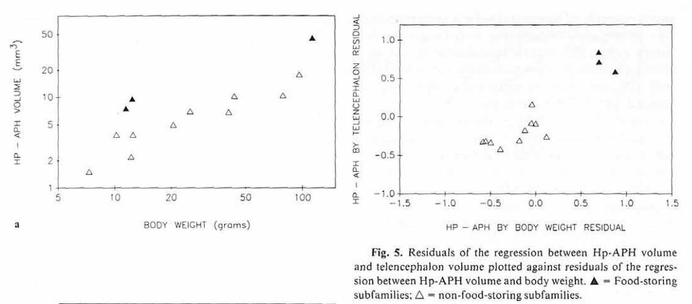{fig-width=40%}

## {.scrollable}

:::: {.columns}
::: {.column width=50%}
- Birds with high memory caching demands use sparse ("bar-code"-like ) representations in hippocampus
:::
::: {.column width=50%}
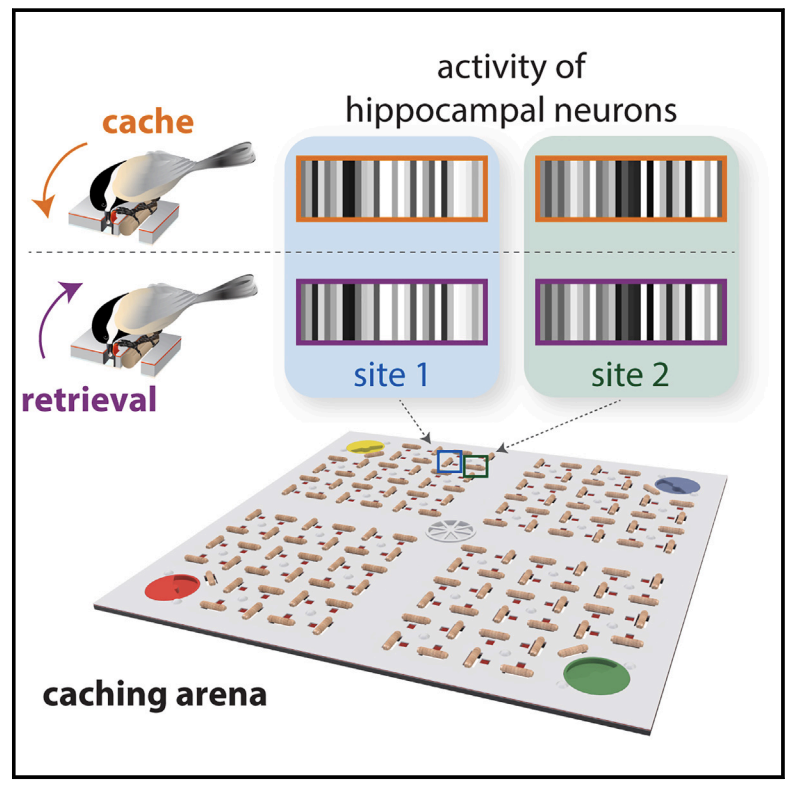
:::
::::

## Cerebral cortex

- Contains retinotopic maps (beyond V1) that are memory-related [@Steel2024-bv]

![@Steel2024-bv Figure 1^[a, PRF paradigm and modeling. In Exp. 1, participants underwent pRF mapping. Participants viewed visual scenes through a bar aperture that gradually traversed the visual field. Each visual-field traversal lasted 36 s (18 × 2 s positions), and the bar made eight traversals per run. The direction of motion varied between traversals. To estimate the pRF for each voxel, a synthetic time series is generated for 400 visual-field locations (200 x and y positions) and 100 sizes (sigma). This results in four million possible time series that are fit to each voxel’s activity. The fit results in four parameters describing each receptive field: x, y, sigma and amplitude. b, Negative-amplitude pRFs fall anterior to the cortex typically considered visual (beyond known retinotopic maps). Group average (n = 17) pRF amplitude map (threshold at explained variance R-squared (R2) > 0.08) is shown on partially inflated representations of the left hemisphere, alongside ROIs: SPAs (OPA, PPA), PMAs (LPMA, VPMA) (localized in an independent group of participants24) and the DMN22. The known retinotopic maps in the posterior cortex (black dotted outlines21) contain exclusively positive-amplitude pRFs (hot colors), as visual stimulation evokes positive retinotopically specific BOLD responses. Negative-amplitude pRFs (cool colors), where visual stimulation evokes a negative spatially specific BOLD response, arise anterior to these retinotopic maps in the PMAs and DMN (see Fig. 2a for example time series from a representative subject).]](https://media.springernature.com/full/springer-static/image/art%3A10.1038%2Fs41593-023-01512-3/MediaObjects/41593_2023_1512_Fig1_HTML.png?as=webp){width=70%}

---

![@Steel2024-bv Figure 2^[a, PRF modeling reveals posterior–anterior inversion of pRF amplitude in individual participants. Left, PRF amplitude for a representative participant overlaid onto a lateral view of the left hemisphere (threshold at R2 > 0.15; see Extended Data Fig. 1 for example ventral and lateral surface pRF amplitude maps from all participants and Extended Data Fig. 3 for amplitude maps with default mode parcellation overlaid). Posterior visual cortex is dominated by positive-amplitude pRFs (hot colors), while cortex anterior to regions classically considered visual exhibits a high concentration of negative-amplitude pRFs (cold colors). This individual’s OPA and LPMA are shown in white. Both the SPAs and PMAs contain pRFs (Extended Data Fig. 2). Right, time-series, model fits and reconstructed pRFs for two surface vertices in this subject. Top, example prototypical positive-amplitude pRF from the lateral SPA (OPA) in the left and right hemispheres (LH, RH). Bottom, example negative-amplitude population receptive field from the LPMA. b, Memory areas (PMAs) contain a larger percentage of negative pRFs compared to perceptual areas (SPAs) (repeated measures ANOVA, Bonferroni-corrected t-tests). Blue bars depict percentage of negative pRFs from individually localized SPAs and PMAs compared to total pRFs in the area (dotted outline). On the ventral and lateral surfaces, SPAs are dominated by positive pRFs, whereas a transition from positive to negative pRFs is evident within PMAs. Individual participant data points overlaid and connected in gray. *P two-tailed < 0.05, ***P two-tailed < 0.001. NS, not significant.]](https://media.springernature.com/full/springer-static/image/art%3A10.1038%2Fs41593-023-01512-3/MediaObjects/41593_2023_1512_Fig2_HTML.png?as=webp){width=70%}

---

>Together with recent reports showing retinotopic coding persisting as far as the ‘cortical apex’ [15,16,31], including the DMN [15,16], and the hippocampus [31,32], our findings challenge conventional views of brain organization, which generally assume that retinotopic coding is replaced by abstract amodal coding as information propagates through the visual hierarchy [7,8,9,10] toward memory structures [11,12,13,14]

-- @Steel2024-bv

## Cerebellum

- response timing, sequences, especially in classical conditioning paradigms [@Jirenhed2017-fl]

# Disorders of memory

## Amnesia

- Acquired loss of memory
- ≠ normal forgetting
- Retrograde ('backwards' in time)
    + Damage to information acquired pre-injury
    + Temporally graded
- Anterograde ('forward' in time) 
    + Damage to information acquired/experienced post-injury

## Patient HM^[Henry G. Molaison was identified with his permission after his death in 2008.]

:::: {.columns}
::: {.column width=50%}
- Intractable/untreatable epilepsy
- Bilateral resection of medial temporal lobe (1953)
- Epilepsy now treatable
- But, memory impaired
:::
::: {.column width=50%}

:::
::::

---



-- @Grafe2019-mk

## HM's amnesia

- Retrograde amnesia
    + Can’t remember 10 yrs before operation
    + Distant past better than more recent
- Severe, global anterograde amnesia
    + Impaired learning of new facts, events, people
- But, skills (mirror learning) intact
    
---

>"*Every day is alone in itself, whatever enjoyment I’ve had, and whatever sorrow I’ve had…Right now, I’m wondering, have I done or said anything amiss?  You see at this moment, everything looks clear to me, but what happened just before?  That’s what worries me.  It’s like waking from a dream.  I just don’t remember.*"

---

<iframe width="560" height="315" src="https://www.youtube.com/embed/Rq9eM4ZXRgs" frameborder="0" allowfullscreen></iframe>
    
## Other causes of amnesia

- Disease 
    + Alzheimer’s, herpes virus
- [Korsakoff’s syndrome](https://en.wikipedia.org/wiki/Korsakoff%27s_syndrome)
    + Result of severe alcoholism
    + Impairs medial thalamus & mammillary bodies

## Patient NA

- Fencing accident
- Damage to medial thalamus
- Anterograde + graded retrograde amnesia
- Are thalamus & medial temporal region connected?

---



-- @Anagnostaras2014-nr

## Spared skills in amnesia

- Skill-learning
- Mirror-reading, writing
- Short-term memory
- “Cognitive” skills
- Priming

## Learning from amnesia

:::: {.columns}
::: {.column width=50%}
- Long-term memory for facts, events, people 
- ≠ Short-term memory
- ≠ Long-term memory for “skills”
- Separate memory systems in the brain?
:::
::: {.column width=50%}

:::
::::

## Alzheimer's Disease (AD)

- Chronic, neurodegenerative disease affecting ~6.7 M Americans
- Cognitive dysfunction (memory loss, language difficulties, planning, coordination)
- Psychiatric symptoms and behavioral disturbances
- Difficulties with daily living
- @burns_alzheimers_2009

---

- Build up of amyloid $\beta$ protein plaques in brain tissue
- APOE e4 gene variant [increases risk 2-12x](https://www.mayoclinic.org/diseases-conditions/alzheimers-disease/in-depth/alzheimers-genes/art-20046552)

## Progression

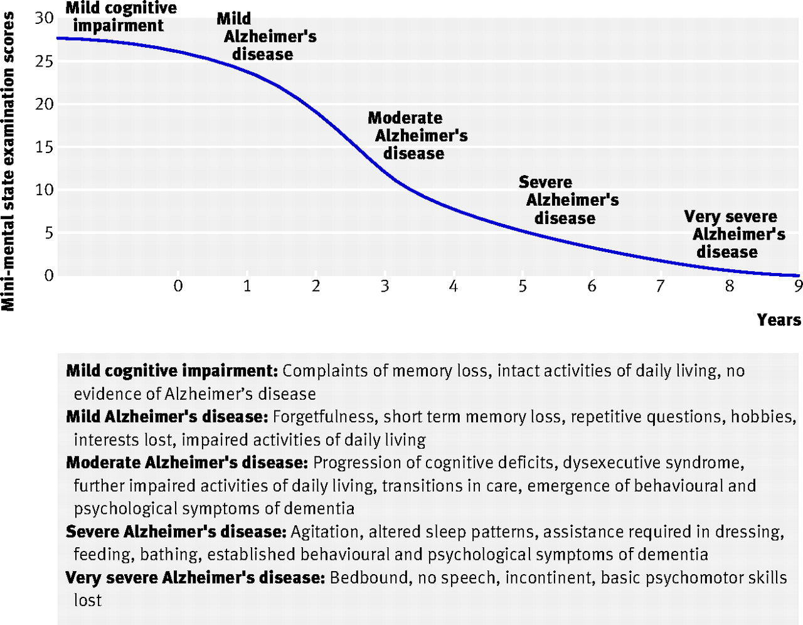{width=50%}

## In the brain

:::: {.columns}
::: {.column width=50%}
- Post-mortem exams show $\beta$ amyloid plaques and neurofibrillary tangles in hippocampus + other brain areas
:::
::: {.column width=50%}
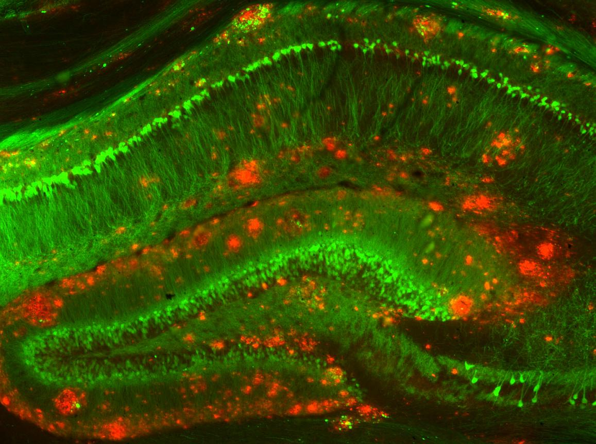
:::
::::

## AD Treatments
    
- Drugs that address amyloid $\beta$ don't work especially well
- Acetylcholinesterase (AChE) *inhibitors* (e.g. Aricept)
    - ACh a neuromodulator in the brain
    - AChE inhibitors boost/prolong ACh levels

## AD Treatments

- AD the result of disordered immune response [@Jevtic2017-jt]?
  - Promising prospective therapy using microglia to remove amyloid $\beta$ [@Hou2024-wx]
  - Link between genetic factor (APOE4/4 gene) and fatty build-up in microglia [@Haney2024-wb]
- NMDA-R partial antagonists (e.g., Memantine)
    - Slow/impede formation of disordered new memories to keep established ones intact?

## Alzheimer's Disease (AD)

:::: {.columns}
::: {.column width=40%}
- AD numbers expected to increase everywhere over next 25+ years [@GBD-2019-Dementia-Forecasting-Collaborators2022-gp]
- 80-100% in U.S.
:::
::: {.column width=60%}

:::
::::

## The other end of the spectrum...



-- @60-Minutes-Australia2018-rm

# Working memory

## @DEsposito2015-zm

- LTM representations of target items + attention -> elevated activation
    - Semantic items
    - Sensorimotor items
- Capacity for attended items (in Focus of Attention or FoA) limited ~ 4

## {.scrollable}

:::: {.columns}
::: {.column width=50%}
- Neural basis 
    - sustained activation in PFC
    - subthreshold activation in areas where items are stored
- Individual differences in visual WM
:::
::: {.column width=50%}

:::
::::
  
# Wrap-up

## Main points

- Multiple types of learning & memory
- Learning & memory distributed across the brain
  - Specializations relate to location in the network? (input/output/in-between)
- Hippocampus + PFC critical areas binding together sensory/semantic info stored elsewhere
- Changes in synaptic #, strength, connectivity provide cellular basis

## Main points

- Many questions remain
  - How does reinforcement learning work? Where does the "learn-now" signal come from?
    - Reward Prediction Errors (RPE) and dopamine signalling?
  - What about supervised (error-correction) learning?
- What does [Gemini](https://gemini.google.com/share/6fd649fec02a) have to say?

## Next time

- Language

# Resources

## About

This talk was produced using [Quarto](https://quarto.org), using the [RStudio](https://posit.co/products/open-source/rstudio/)
Integrated Development Environment (IDE), version 2026.1.0.392.

The source files are in R and R Markdown, then rendered to HTML using the
[revealJS](https://revealjs.com) framework.
The HTML slides are hosted in a [GitHub repo](https://github.com/psu-psychology/psy-511-scan-fdns-2026-spring) and served by GitHub pages:
<https://psu-psychology.github.io/psy-511-scan-fdns-2026-spring/>

## References