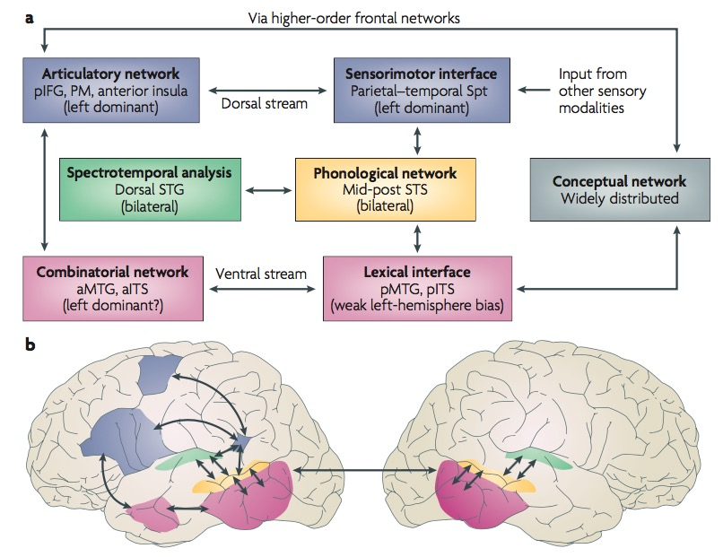
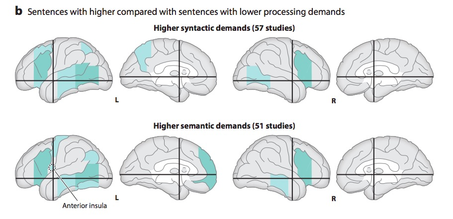
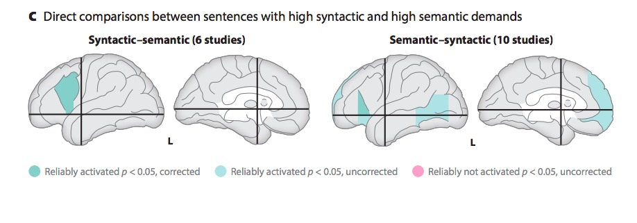
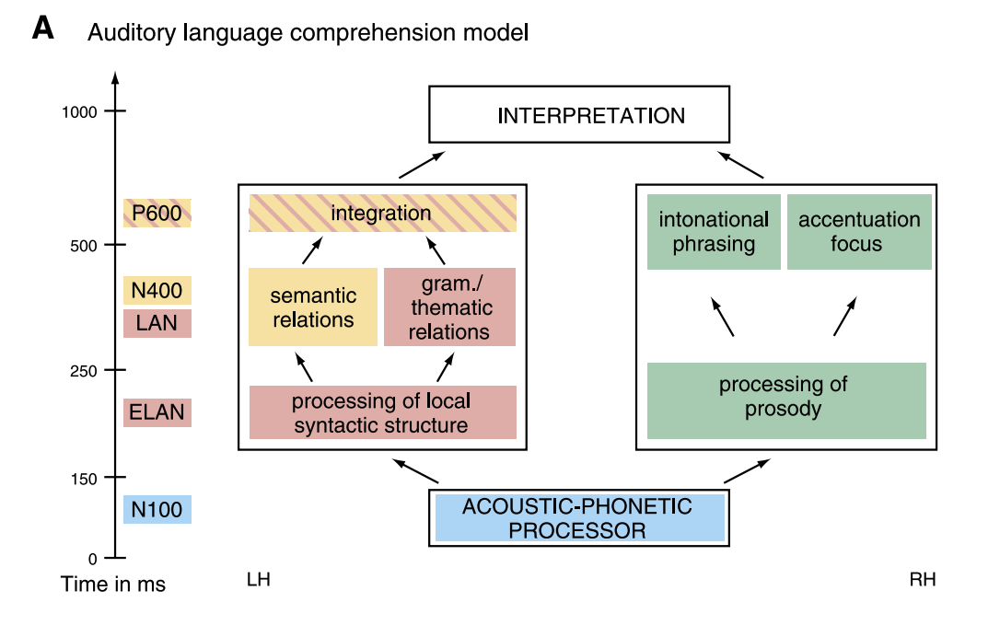
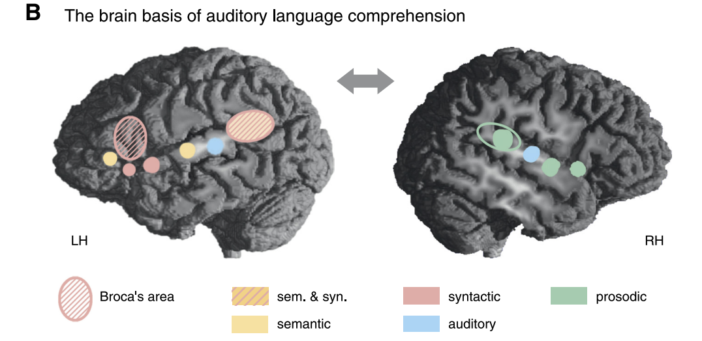

# Overview

## Prelude



-- @Bow2022-cy^[https://en.wikipedia.org/wiki/Prisencolinensinainciusol]

## Announcements

- Final Project proposal due March 5, 2026.

## Today's topics

- Language and the brain
- Read & discuss
  - @Bourguignon2025-sy or
  - @Zada2025-jl or
  - ideas suggested in @Google2026-ds

## Warm-up

# Language and the brain

## Language behavior

<iframe width="800" height="450" src="https://www.youtube.com/embed/4X4Fy8YqysY?rel=0&amp;start=160" frameborder="0" allowfullscreen></iframe>

## Components

- Productive
  - Speaking (2-5 words/s), modulate prosody (intonation)
    - Often combined with gesture, facial expression, para- and non-linguistic sounds
  - Writing, typing (.5-3+ words/s), [200 wpm!](https://youtube.com/shorts/SwH4er-YcyI?si=8rS_T2ycqVBjlES1)
  - [Morse code](https://youtube.com/shorts/OY-JPqojuH0?si=T_ceCBxOF39pNJIF) (25-50 wpm) 

## Components

- Receptive
    - Listening 
    - Responding (facial expressions, gestures, laughter, etc.)
    - Reading (3-5 words/s)
    - Morse code (30-50 wpm or 0.8+ word/s), [@Zoglmann2025-mf]
- How so fast? Time for feedback?

## Speech input/output

:::: {.columns}
::: {.column width=50%}
{width=90%}
:::
::: {.column width=50%}
[MRI of speech "Welcome to the science gallery of the Max Planck society":  @Wikipedia-contributors2026-xx](https://en.wikipedia.org/wiki/File:Real-time_MRI_-_Speaking_(English).ogv)
:::
::::

## Cognitive components

- Speech sounds $\rightarrow$ words
  - ifyoudidnotknowtheenglishlanguagethiswouldbeanincomprehensiblestreamoflettersorsounds
- Words $\rightarrow$ semantics/meaning(s)
- Sequences of words $\rightarrow$ semantics/meaning(s)
- Para and non-linguistic sounds + context $\rightarrow$ semantics/meaning(s)

## Hierarchical structure

![@Wikipedia-contributors2025-kd^[By Traced by Stannered - Own work based on: ParseTree.jpg, Public Domain, https://commons.wikimedia.org/w/index.php?curid=1925920]](https://upload.wikimedia.org/wikipedia/commons/thumb/6/6e/ParseTree.svg/1920px-ParseTree.svg.png){width=50%}

## Hierarchical structure

:::: {.columns}
::: {.column width=40%}
- Phonetic
  - |Ber| |wiTH| |mē|
- Syntactic
  - Subject | Verb | Object
- Semantic
- Pragmatic
:::
::: {.column width=60%}
{width=65% fig-align="right"}

::: {.fragment}
{width=65% fig-align="right"}
:::
:::
::::

## Network components {.scrollable}

![@Friederici2011-ye Figure 1^[FIGURE 1. Anatomical and cytoarchitectonic details of the left hemisphere. The different lobes (frontal, temporal, parietal, occipital) are marked by colored borders. Major language relevant gyri (IFG, STG, MTG) are color coded. Numbers indicate language-relevant Brodmann Areas (BA) which Brodmann (1909) defined on the basis of cytoarchitectonic characteristics. The coordinate labels superior/inferior indicate the position of the gyrus within a lobe (e.g., superior temporal gyrus) or within a BA (e.g., superior BA 44; the superior/inferior dimension is also labeled dorsal/ventral). The coordinate labels anterior/posterior indicate the position within a gyrus (e.g., anterior superior temporal gyrus; the anterior/posterior dimension is also labeled rostral/caudal). Broca's area consists of the pars opercularis (BA 44) and the pars triangularis (BA 45). Located anterior to Broca's area is the pars orbitalis (BA 47). The frontal operculum (FOP) is located ventrally and more medially to BA 44, BA 45. The premotor cortex is located in BA 6. Wernicke's area is defined as BA 42 and BA 22. The primary auditory cortex (PAC) and Heschl's gyrus (HG) are located in a lateral to medial orientation.]](../include/img/friederici-2011-fig-01.jpeg)

## Wernicke-Geschwind (WG) model

:::: {.columns}
::: {.column width=50%}
- [Carl Wernicke](https://en.wikipedia.org/wiki/Carl_Wernicke)
- [Norman Geschwind](https://en.wikipedia.org/wiki/Norman_Geschwind)
- Speaking ≠ Writing/typing
- Perception ≠ production
:::
::: {.column width=50%}

:::
::::

## Input/output flow

```{mermaid}
%%| label: fig-language-input-outpu
%%| fig-cap: "Minimal circuit diagram for verbal & visual language."
flowchart LR
  A[speech input] --> B["Auditory Cortex (A1)"]
  H[text input] -->|eye movements| C["Visual Cortex (V1)"]
  B --> I["???"]
  C --> I
  I --> D[speech output]
  I --> F["typing/writing"]
  D --> M["Primary motor cortex (M1)"]
  F --> M
  M --> E["Vocal apparatus"]
  M --> G["Finger, wrist muscles"]
```

## Wernicke's area (Brodmann Area or BA 42)

:::: {.columns}
::: {.column width=50%}
- Adjacent to primary auditory cortex (A1; Heschl's gyrus; BA 41)
- Perception
- Receptive or 'fluent' aphasia
:::
::: {.column width=50%}

:::
::::

---

## {.scrollable}

:::: {.columns}
::: {.column width=50%}
![Wikipedia^[Talbot K, Louneva N, Cohen JW, Kazi H, Blake DJ, et al. (2011) Synaptic Dysbindin-1 Reductions in Schizophrenia Occur in an Isoform-Specific Manner Indicating Their Subsynaptic Location. PLoS ONE 6(3): e16886. doi:10.1371/journal.pone.0016886]](https://upload.wikimedia.org/wikipedia/commons/thumb/c/c0/Human_temporal_lobe_areas.png/960px-Human_temporal_lobe_areas.png)
:::
::: {.column width=50%}
![Wikipedia^[By Brodamnn - Brodmann (1909) File:Brodmann areas inside of lateral sulcus close up.png, Public Domain, https://commons.wikimedia.org/w/index.php?curid=20696476]](https://upload.wikimedia.org/wikipedia/commons/b/bf/Brodmann_area_41_inside_lateral_sulcus.png)
:::
::::
    
## {.scrollable}



-- @cogmonaut2010-hc

## Broca's area

- Inferior frontal gyrus, pars opercularis (BA 44) & pars angularis (BA 45)     
- Production
- Syntactic comprehension
- Expressive aphasia

## {.scrollable}

:::: {.columns}
::: {.column width=50%}
![@Wikipedia-contributors2026-kf ^[By Fatemeh Geranmayeh, Sonia L. E. Brownsett, Richard J. S. Wise - "Task-induced brain activity in aphasic stroke patients: what is driving recovery?" Fatemeh Geranmayeh, Sonia L. E. Brownsett, Richard J. S. Wise. Brain 2014 Oct 28;137(Pt 10):2632-48. Epub 2014 Jun 28. DOI: https://dx.doi.org/10.1093/brain/awu163, CC BY 3.0, https://commons.wikimedia.org/w/index.php?curid=38174526]](https://upload.wikimedia.org/wikipedia/commons/c/ca/Broca’s_area_-_BA44_and_BA45.png)
:::
::: {.column width=50%}
![@Wikipedia-contributors2026-kf^[By Polygon data were generated by Database Center for Life Science(DBCLS)[2]. - Polygon data are from BodyParts3D[1], CC BY-SA 2.1 jp, https://commons.wikimedia.org/w/index.php?curid=32508617]](https://upload.wikimedia.org/wikipedia/commons/b/b4/Broca%27s_area_-_lateral_view.png)
:::
::::


## {.scrollable}



-- @purepedantry2007-td

## Dual streams [@Hickok2007-rc]?

:::: {.columns}
::: {.column width=50%}
- Ventral (speech signals -> semantics)
- Dorsal (speech signal acoustics -> articulatory networks in frontal lobe)
:::
::: {.column width=50%}

:::
::::

## {.scrollable}

![Wikipedia^[By Leathalperisthecoolest123321 - Own work, CC BY-SA 4.0, https://commons.wikimedia.org/w/index.php?curid=45449677]](https://upload.wikimedia.org/wikipedia/commons/8/8d/T16-DorsalRepetition.png)

## {.scrollable}

![@Friederici2011-ye Figure 3^[FIGURE 3. Structural connectivities between the language cortices. Schematic view of two dorsal pathways and two ventral pathways. Dorsal pathway I connects the superior temporal gyrus (STG) to the premotor cortex via the arcuate fascile (AF) and the superior longitudinal fascicle (SLF). Dorsal pathway II connects the STG to BA 44 via the AF/SLF. Ventral pathway I connects BA 45 and the temporal cortex via the extreme fiber capsule system (EFCS). Ventral pathway II connects the frontal operculum (FOP) and the anterior temporal STG/STS via the uncinate fascile (UF).]](../include/img/friederici-2011-fig-03.jpeg)


## {.scrollable}

:::: {.columns}
::: {.column width=50%}
![Uncinate Fasciculus: Wikipedia^[By Tractography data: Yeh, F. C., Panesar, S., Fernandes, D., Meola, A., Yoshino, M., Fernandez-Miranda, J. C., ... & Verstynen, T. (2018). Population-averaged atlas of the macroscale human structural connectome and its network topology. NeuroImage, 178, 57-68. PubMed: https://www.ncbi.nlm.nih.gov/pmc/articles/PMC6921501/Skull and brain data: Nobutaka Mitsuhashi, Kaori Fujieda, Takuro Tamura, Shoko Kawamoto, Toshihisa Takagi, and Kousaku Okubo. (2009) BodyParts3D: 3D structure database for anatomical concepts. Nucleic Acids Research, Vol. 37, Database issue D782-D785, https://doi.org/10.1093/nar/gkn613 - Tractography data: http://brain.labsolver.org/diffusion-mri-templates/tractographySkull and brain data: http://lifesciencedb.jp/bp3d/, CC BY-SA 4.0, https://commons.wikimedia.org/w/index.php?curid=105038802]](https://upload.wikimedia.org/wikipedia/commons/1/14/Tractography_-_Uncinate_fasciculus_-_animation_1.gif)
:::
::: {.column width=50%}
![Extreme (Fiber) Capsule System: Wikipedia^[By Yeh, F. C., Panesar, S., Fernandes, D., Meola, A., Yoshino, M., Fernandez-Miranda, J. C., ... & Verstynen, T. (2018). Population-averaged atlas of the macroscale human structural connectome and its network topology. NeuroImage, 178, 57-68. - http://brain.labsolver.org/, CC BY-SA 4.0, https://commons.wikimedia.org/w/index.php?curid=78298710]](https://upload.wikimedia.org/wikipedia/commons/1/12/Extreme_Capsule.jpg)
:::
::::

## {.scrollable}

:::: {.columns}
::: {.column width=50%}
![Arcuate Fasciculus: Wikipedia^[By Yeh, F. C., Panesar, S., Fernandes, D., Meola, A., Yoshino, M., Fernandez-Miranda, J. C., ... & Verstynen, T. (2018). Population-averaged atlas of the macroscale human structural connectome and its network topology. NeuroImage, 178, 57-68. - http://brain.labsolver.org, CC BY-SA 4.0, https://commons.wikimedia.org/w/index.php?curid=78299333]](https://upload.wikimedia.org/wikipedia/commons/2/2a/Arcuate_Fasciculus.jpg)
:::
::: {.column width=50%}
![@Jang2013-fb Figure 1^[The diffusion tensor tractographies of neural tracts for language: the arcuate fasciculus (AF), the superior longitudinal fasciculus (SLF), the inferior longitudinal fasciculus (ILF), the uncinate fasciculus (UF), and inferior fronto-occipital fasciculus (IFOF).]](https://images-provider.frontiersin.org/api/ipx/w=631&f=webp/https://www.frontiersin.org/files/Articles/67643/xml-images/fnhum-07-00749-g001.webp)
:::
::::

## Dual streams hypothesis

:::: {.columns}
::: {.column width=50%}
- @Wikipedia-contributors2026-to
- @Goodale1992-xd; @Mishkin1983-px
:::
::: {.column width=50%}
![Wikipedia^[By Selket - I (Selket) made this from File:Gray728.svg, CC BY-SA 3.0, https://commons.wikimedia.org/w/index.php?curid=1679336]](https://upload.wikimedia.org/wikipedia/commons/thumb/f/fb/Ventral-dorsal_streams.svg/3840px-Ventral-dorsal_streams.svg.png)
:::
::::

## Metaanalytic evidence

![@Hagoort2014-au Figure 1a^[Figure 1. Schematic representation of the brain showing regions with reliably reported activations for sentences compared with nonsentential stimuli (a) and sentences with high syntactic or semantic processing demands compared with simpler sentences (b,c). The left posterior inferior frontal gyrus is further subdivided into Brodmann areas (BA) 44 (above black line), BA 45 (below black line, above AC–PC line) and BA 47 (below AC–PC line). Green regions indicate a reliable number of reports. Pink regions indicate no reports in 53 studies. For details, see Supplemental Tables 2, 3, and 4. Abbreviations: AC, anterior commissure; PC, posterior commissure).]](../include/img/hagoort-indefrey-fig1a.jpg)

## {.scrollable}



## {.scrollable}



## {.scrollable}

![@Hagoort2014-au Figure 2^[(a) Summary of activation patterns for sentences with high syntactic or semantic processing demands compared with simpler sentences. (b) Syntactic/semantic gradients in left inferior frontal and posterior temporal cortex based on 28 studies reporting posterior temporal cortex activation for syntactically demanding or semantically demanding sentences compared with less demanding sentences (see Supplemental Figure 13 for details). The centers represent the mean coordinates of the local maxima, and the radii represent the standard deviations of the distance between the local maxima and their means. Abbreviations: GFm, GFi, middle and inferior frontal gyri; BA, Brodmann area; GTs, GTm, GTi, superior, middle, and inferior temporal gyri; STS, ITS, superior and inferior temporal sulci; Gsm, supramarginal gyrus.]](../include/img/hagoort-indefrey-fig2a.jpg)

## {.scrollable}

>"*A meta-analysis of numerous neuroimaging studies reveals a clear dorsal/ventral gradient in both left inferior frontal cortex and left posterior temporal cortex, with dorsal foci for syntactic processing and ventral foci for semantic processing. In addition...further networks need to be recruited to realize language-driven communication to its full extent.*"

-- @Hagoort2014-au

## {.scrollable}

:::: {.columns}
::: {.column width=50%}

:::
::: {.column width=50%}

:::
::::

## On system architectures

```{mermaid}
%%| label: fig-serial
%%| fig-cap: "A simplistic feedforward psychological architecture."
flowchart LR
  A[Perception] --> B[Cognition/Emotion]
  B --> C[Action]
```

::: {.fragment}

```{mermaid}
%%| label: fig-parallel
%%| fig-cap: "A barely more complicated feedforward & parallel psychological architecture."

flowchart LR
  A[Perception] --> B[Cognition]
  A --> C[Emotion]
  B --> D[Action]
  C --> D
```

:::

## On system architectures

```{mermaid}
%%| label: fig-parallel-feedback
%%| fig-cap: "A more realistic feedforward/feedback parallel architecture."

flowchart LR
  E[ ]:::empty
  W[ ]:::empty
  E --> A
  A[Perception] <--> B[Cognition]
  A <--> C[Emotion]
  B & C <--> D[Action]
  D --> W
  
  %% Define the style for the empty node
  classDef empty height:0,width:0,margin:0;
```

::: {.fragment}
```{mermaid}
%%| label: fig-parallel-feedback
%%| fig-cap: "An even more realistic feedforward/feedback parallel architecture."

flowchart LR
  E[ ]:::empty
  W[ ]:::empty
  E --> A
  A[Perception] <--> B[Cognition]
  A <--> C[Emotion]
  B <--> C
  B & C <--> D[Action]
  D --> W
  
  %% Define the style for the empty node
  classDef empty height:0,width:0,margin:0;
```
:::

## On large language models (LLMs)

- @Wikipedia-contributors2026-wf
- AI systems trained to predict the next word or set of words (tokens)
- Use deep (multi, e.g., 100+ layer) neural network architecture
- Gemini AI may have 1e12+ (trillions) of parameters
- Each word in an LLM represented by a vector (often 2^12 or 4,096) of numbers (feature values) [@Heaven2026-pz]

# Read & discuss

## Options

- @Bourguignon2025-sy or
- @Zada2025-jl or
- ideas suggested in @Google2026-ds

# Wrap-up

## Main points

- Language behavior engages multiple sensory and motor systems working in parallel.
- Earlier and simpler input/output models have yielded to more complex parallel and interactive network models.
- Comprehending and producing language engages multiple regions of the brain.
- Some functions are lateralized, especially in the left hemisphere.

## Next time

- Emotion

# Resources

## About

This talk was produced using [Quarto](https://quarto.org), using the [RStudio](https://posit.co/products/open-source/rstudio/)
Integrated Development Environment (IDE), version 2026.1.0.392.

The source files are in R and R Markdown, then rendered to HTML using the
[revealJS](https://revealjs.com) framework.
The HTML slides are hosted in a [GitHub repo](https://github.com/psu-psychology/psy-511-scan-fdns-2026-spring) and served by GitHub pages:
<https://psu-psychology.github.io/psy-511-scan-fdns-2026-spring/>

## References