```{r}
#| include: false
```

# Prelude

## {.scrollable}

::: {#fig-smokey-robinson-second-that-emotion}
<iframe width="1200" height="450" src="https://www.youtube.com/embed/2ia6zQLOPfU?si=R8IzwfGu-qophcX9" title="YouTube video player" frameborder="0" allow="accelerometer; autoplay; clipboard-write; encrypted-media; gyroscope; picture-in-picture; web-share" referrerpolicy="strict-origin-when-cross-origin" allowfullscreen></iframe>
@The-Ed-Sullivan-Show2020-td
:::

## {.scrollable}

::: {#fig-inside-out-video}
<iframe width="1200" height="450" src="https://www.youtube.com/embed/yRUAzGQ3nSY?si=4Q95bT2qM6M-fwtc" title="YouTube video player" frameborder="0" allow="accelerometer; autoplay; clipboard-write; encrypted-media; gyroscope; picture-in-picture; web-share" referrerpolicy="strict-origin-when-cross-origin" allowfullscreen></iframe>
@Pixar2014-md
:::

## Announcements

- Final Project proposal due March 5, 2026.

## Today's topics

- Biology of emotion
- Fear & anxiety
- Stress
- Pleasure & reward

## Warm-up

---

### A person has difficulty producing fluent speech, but their comprehension appears largely intact. Where might this person have had a stroke?

- A. Inferior frontal gyrus
- B. Superior temporal gyrus
- C. Superior frontal gyrus
- D. Medial temporal lobe

---

### A person has difficulty producing fluent speech, but their comprehension appears largely intact. Where might this person have had a stroke?

- **A. Inferior frontal gyrus**
- ~~B. Superior temporal gyrus~~
- ~~C. Superior frontal gyrus~~
- ~~D. Medial temporal lobe~~

---


---

### Why do @Tremblay2016-gm want to move past the classic model of language neurobiology?

- A. There is no consistent definition of Broca’s and Wernicke’s areas.
- B. Language areas are connected by pathways beyond the arcuate fasciculus.
- C. Broca's and Wernicke's aphasias have more similarities than differences.
- D. A and B.

---

### Why do @Tremblay2016-gm want to move past the classic model of language neurobiology?

- A. There is no consistent definition of Broca’s and Wernicke’s areas.
- B. Language areas are connected by pathways beyond the arcuate fasciculus.
- ~~C. Broca's and Wernicke's aphasias have more similarities than differences.~~
- **D. A and B.**

---

### How are LLMs like human language perception/production systems?

- A. They are instantiated in neural networks with dozens of layers
- B. They have large numbers (trillions) of parameters
- C. They predict words or sequences of words that follow some input
- D. A, B, & C
- E. They use minimal energy

---

### How are LLMs like human language perception/production systems?

- A. They are instantiated in neural networks with dozens of layers
- B. They have large numbers (trillions) of parameters
- C. They predict words or sequences of words that follow some input
- **D. All of the above**
- ~~E. They use minimal energy~~

---

- See @O-Donnell2025-tm; @Shubhamku2025-wn; @Caravaca2025-gj
- Queries: 6,706 J/query = 1.86 Wh/query. Brain uses ~20 W, so...
  - 100 x 1.86/20= `{r} 100*1.86/20` % of a typical human brain's energy budget
- Training: ~1,000 MWh or 1e6/20 = `{r} 1000000/20` human brain budgets

# Biology of emotion

## Evolutionary perspective

:::: {.columns}
::: {.column width=50%}
- Emotion (can be) adaptive
- Emotion may serve similar biological purposes in different species
:::
::: {.column width=50%}

:::
::::

## Dimensions

:::: {.columns}
::: {.column width=50%}
- Behaviors
- Internal states
  - Autonomic
  - Endocrine
  - Immune
  - Brain regions or networks
- Feelings
:::
::: {.column width=50%}
::: {.fragment}

:::
:::
::::

## {.scrollable}

![@Malezieux2023-as Figure 1^["Experimentally inferring emotion states across species. Evolutionary conserved functional emotion states (black box) are hidden internal states that can be inferred from knowledge about their causes (input or trigger, left) and consequences (emotion expression, right). Diverse triggers and contexts can cause similar emotion states (fan in), which can elicit a multitude of organismal changes (fan out). This arrangement allows the researcher to experimentally control and manipulate diverse features and contexts of ethological emotion triggers, quantify the resulting expression of the emotion state, and test whether the expressions adhere to emotion-characteristic features. The relationship between changes in stimulus input and the response of the organism can help to infer the presence of an emotion state."]](https://www.annualreviews.org/docserver/fulltext/neuro/46/1/ne460211.f1.gif)

## {.scrollable}

![@Barrett2017-hq Figure 1^["Fig. 1.The classical view of emotion. The classical view of emotion includes basic emotion theories (e.g. for a review, see Tracy and Randles, 2011), causal appraisal theories (e.g. Scherer, 2009; Roseman, 2011), and theories of emotion that rely on black-box functionalism (Davis, 1992; Anderson and Adolphs, 2014). Each emotion faculty is assumed to have its own innate ‘essence’ that distinguishes it from all other emotions. This might be a Lockean essence (an underlying causal mechanism that all instances of an emotion category share, making them that kind of emotion and not some other kind of emotion, depicted by the circles in the figure). Lockean essences might be a biological, such as a set of dedicated neurons, or psychological, such as a set of evaluative mechanisms called ‘appraisals’. An emotion category is usually assumed to have a Platonic essence [a physical fingerprint that instances of that emotion share, but that other emotions do not, such a set of facial movements (an ‘expression’), a pattern of autonomic nervous system activity, and/or a pattern of appraisals]. Of course, no one is expecting complete invariance, but it is assumed that instances of a category are similar enough to be easily diagnosed as the same emotion using objective (perceiver-independent) measures alone. (A) is adapted from Davis (1992). (B) is adapted Anderson and Adolphs (2014). (C) is adapted from Barrett (2006a), which reviews the growing evidence that contracts the classical view of emotion."]](https://oup.silverchair-cdn.com/oup/backfile/Content_public/Journal/scan/12/1/10.1093_scan_nsw154/3/m_nsw154f1.jpeg?Expires=1774193013&Signature=N2uof9AEeJpJjIwHV9~owilPje3xCxFnlO1W0UFwkAOCbRpDKoZFTtATv1eFB27As7ylLdmT~4Gs6GFXDbi0HKkKeVlJdUz1Zsu9xxHT9vpHGdHclgd6GyvRj7zHBQrN-jKxELwH7~Uo4xIjOGG26g2sq3uB54nKi3G5IkeYylDwL4ZUdO-0FyOlQzO5dYiKMeWiLG2j-Ok6IAi~v6Bd~7DC~B-~7HJozgCS4It9Evp6mmzaSjlI3x3rvpzOBKb1x6G1yF~L29HhkFH6lantn3jK5ua5LDdXD0kvdGP1PiPQHNpsUOZbJgttFOVMHOveqrzWFRpnQBcrNVores9qnQ__&Key-Pair-Id=APKAIE5G5CRDK6RD3PGA)

## Models

:::: {.columns}
::: {.column width=50%}
- Basic $\leftrightarrow$ Complex
- Dimensions
  - Valence (+/-)
  - Arousal (high/low)
- Action tendencies: Approach $\leftrightarrow$ Withdraw
:::
::: {.column width=50%}
![@Robert-Plutchik-2004-hj^[By Machine Elf 1735 - Own work, Public Domain, https://commons.wikimedia.org/w/index.php?curid=13285286]](https://upload.wikimedia.org/wikipedia/commons/thumb/c/ce/Plutchik-wheel.svg/1920px-Plutchik-wheel.svg.png)
:::
::::

## Questions

- Are emotions universal (among humans)?

---

>Both cross-cultural differences and similarities were identified in each phase of the emotion process; similarities in one phase do not necessarily imply similarities in other phases. **Whether cross-cultural differences or similarities are found depends to an important degree on the level of description of the emotional phenomena**.

-- @Mesquita1992-vt

## Questions

- Do emotions have distinct *physiological* signatures?

---

>Do we run from a bear because we are afraid or are we afraid because we run? William James posed this question more than a century ago, yet the notion that afferent visceral signals are essential for the unique experiences of distinct emotions remains a key unresolved question at the heart of emotional neuroscience.

-- @Harrison2010-nx

---

```{mermaid}
flowchart LR
  B[Bear] ---> M[Me]
  M ---> F[Fear]
  F ---> P[Physio]
  F ---> R[Run]
```

## Competing views on causes

- James-Lange theory [@Wikipedia-contributors2025-xn]
- Cannon-Bard theory [@Wikipedia-contributors2025-wp]
- Two factor (Singer/Schacter) theory [@Wikipedia-contributors2025-er]

## [James-Lange](https://en.wikipedia.org/wiki/James%E2%80%93Lange_theory) theory

- Physiological response -> subjective feelings
    
```{mermaid}
flowchart LR
  B[Bear] ---> M[Me]
  M ---> P[Physio]
  P ---> F[Fear]
  M ---> R[Run]
```

## [Cannon-Bard](https://en.wikipedia.org/wiki/Cannon%E2%80%93Bard_theory)

:::: {.columns}
::: {.column width=50%}
- Severing CNS (spinal cord & vagus, Xth CN) from rest of body leaves some types of emotional expression unchanged
- Physiological states slow, don't differentiate among emotions
:::
::: {.column width=50%}
```{mermaid}
flowchart LR
  B[Bear] ---> M[Me]
  M ---> P[Physio]
  M ---> F[Fear]
  M ---> R[Run]
```
:::
::::

## [Cannon-Bard](https://en.wikipedia.org/wiki/Cannon%E2%80%93Bard_theory) theory

:::: {.columns}
::: {.column width=50%}
- Physiology and feelings distinct
- Hypothalamus (physiological response); dorsal thalamus (feelings)
:::
::: {.column width=50%}
```{mermaid}
flowchart LR
  B[Bear] ---> M[Me]
  M ---> P[Physio]
  M ---> F[Fear]
  M ---> R[Run]
```
:::
::::

## [Two factor](https://en.wikipedia.org/wiki/Two-factor_theory_of_emotion) theory

:::: {.columns}
::: {.column width=50%}
- Also known as Singer-Schacter theory
- Physiological arousal + cognitive appraisal -> Emotion states
:::
::: {.column width=50%}
```{mermaid}
flowchart LR
  B[Bear] ---> M[Me]
  M ---> P[Physio]
  M ---> A[Appraisal]
  A ---> F[Fear]
  P ---> F
  P ---> A
  M ---> R[Run]
```
:::
::::

## Physiological states

:::: {.columns}
::: {.column width=50%}
>The classical view of emotion hypothesizes that certain emotion categories have a specific autonomic nervous system (ANS) “fingerprint” that is distinct from other categories... 

-- @Siegel2018-ab
:::
::: {.column width=50%}
::: {.fragment}
```{mermaid}
flowchart LR
  F[fear] ---> H(heart rate)
  F ---> B(blood pressure)
  P[happiness] ---> H
  P ---> B
  A[anger] ---> H
  A ---> B
```
:::
::: 
::::

## Physiological states

:::: {.columns}
::: {.column width=50%}
- What ANS measures are part of this "fingerprint?"
- Do they distinguish among emotion categories?
:::
::: {.column width=50%}
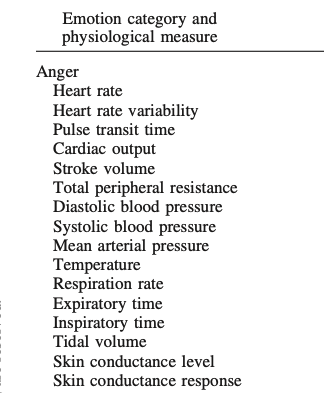{fig-align="right" width="75%"}
:::
::::

## Physiological states

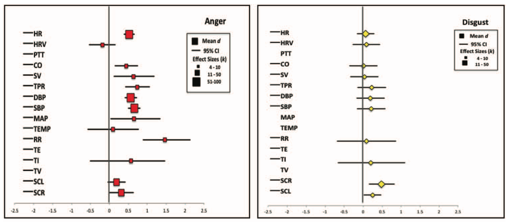

---

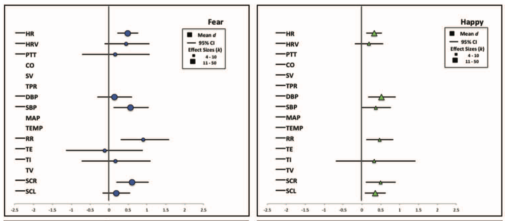

---

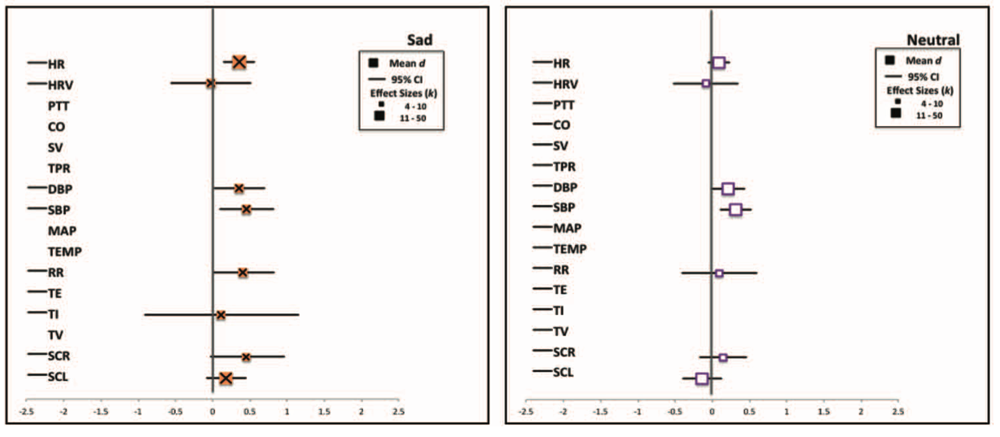

---

>...**there is no 1-to-1 mapping between an emotion category and a specific autonomic nervous system response pattern**. In addition, we observed substantial variability in autonomic nervous system changes during instances of the same emotion category that was not accounted for by experimental moderators (such as the way the emotion was induced). 

-- @Siegel2018-ab

---

>These findings suggest that **autonomic nervous system changes during emotion are less like a bodily fingerprint and more like a population of variable, context sensitive instances**. 

-- @Siegel2018-ab

## Self-reported experiences {.scrollable}

![@Nummenmaa2014-ub Figure 1^["The emBODY tool. Participants colored the initially blank body regions (A) whose activity they felt increasing (left body) and decreasing (right body) during emotions. Subjectwise activation–deactivation data (B) were stored as integers, with the whole body being represented by 50,364 data points. Activation and deactivation maps were subsequently combined (C) for statistical analysis".]](https://www.pnas.org/cms/10.1073/pnas.1321664111/asset/dcc3da97-2288-4f1c-a175-cad39b111aab/assets/graphic/pnas.1321664111fig01.jpeg){width="75%"}

---

![@Nummenmaa2014-ub Figure 2^["Bodily topography of basic (Upper) and nonbasic (Lower) emotions associated with words. The body maps show regions whose activation increased (warm colors) or decreased (cool colors) when feeling each emotion. (P < 0.05 FDR corrected; t > 1.94). The colorbar indicates the t-statistic range."]](https://www.pnas.org/cms/10.1073/pnas.1321664111/asset/3263030e-acb8-4654-9064-b18db4a3a146/assets/graphic/pnas.1321664111fig02.jpeg){width="75%"}

---

![@Nummenmaa2014-ub Figure 4^["Hierarchical structure of the similarity between bodily topographies associated with emotion words in experiment 1 (Upper) and basic emotions across experiments with word (W), story (S), movie (M), and Face (F) stimuli (Lower)."]](https://www.pnas.org/cms/10.1073/pnas.1321664111/asset/68554fff-57c8-4818-8178-dc8bdd7a6db4/assets/graphic/pnas.1321664111fig04.jpeg){width="55%"}

- See also EMbody Tool Matlab code [@GlereanUnknown-ek]

## *Where* in the brain is emotion processed?

:::: {.columns}
::: {.column width=50%}
- Locationist account
  - Fear: amygdala (yellow)
  - Disgust: insula (green)
  - Anger: OFC (rust)
  - Sadness: ACC (blue). 
:::
::: {.column width=50%}
![@Lindquist2012-jr Figure 1^["Locationist Hypotheses of Brain–Emotion Correspondence. A: Lateral view. B: Sagital view at the midline. C: Ventral view. D: Coronal view. Brain regions hypothesized to be associated with emotion categories are depicted. Here we depict the most popular locationist hypotheses, although other locationist hypotheses of brain–emotion correspondence exist (e.g., Panksepp, Reference Panksepp1998). Fear: amygdala (yellow); Disgust: insula (green); Anger: OFC (rust); Sadness: ACC (blue). A color version of this image can be viewed in the online version of this target article at http://www.journals.cambridge.org/bbs."]](https://static.cambridge.org/binary/version/id/urn:cambridge.org:id:binary:20170929031912583-0602:S0140525X11000446:S0140525X11000446_fig1g.jpeg)
:::
::::

---

![@Lindquist2012-jr Figure 1^["Locationist Hypotheses of Brain–Emotion Correspondence. A: Lateral view. B: Sagital view at the midline. C: Ventral view. D: Coronal view. Brain regions hypothesized to be associated with emotion categories are depicted. Here we depict the most popular locationist hypotheses, although other locationist hypotheses of brain–emotion correspondence exist (e.g., Panksepp, Reference Panksepp1998). Fear: amygdala (yellow); Disgust: insula (green); Anger: OFC (rust); Sadness: ACC (blue). A color version of this image can be viewed in the online version of this target article at http://www.journals.cambridge.org/bbs."]](https://static.cambridge.org/binary/version/id/urn:cambridge.org:id:binary:20170929031912583-0602:S0140525X11000446:S0140525X11000446_fig1g.jpeg){width="75%"}

---

![@Lindquist2012-jr Figure 4^["Figure 4. The Neural Reference Space for Discrete Emotion. The neural reference space (phrase coined by Edelman [1989]) is the set of brain regions consistently activated across all studies assessing the experience or perception of anger, disgust, fear, happiness and sadness (i.e. the superordinate category emotion). Brain regions in yellow exceeded the height threshold (p<05) and regions in orange exceeded the most stringent extent-based threshold (p<001). Regions in pink and magenta correspond to lesser extent-based thresholds and are not discussed in this article. Cortex is grey, the brainstem and nucleus accumbens are green, the amygdala is blue and the cerebellum is purple. A color version of this image can be viewed in the online version of this target article at http://www.journals.cambridge.org/bbs."]](https://static.cambridge.org/binary/version/id/urn:cambridge.org:id:binary:20170929031912583-0602:S0140525X11000446:S0140525X11000446_fig4g.jpeg){width="75%"}

---

![@Lindquist2012-jr Figure 5^["Logistic Regression Findings. Selected results from the logistic regressions are presented (for additional findings, see Table S6 in supplementary materials). Circles with positive values represent a 100% increase in the odds that a variable predicted an increase in activity in that brain area. Circles with negative values represent a 100% increase in the odds that a variable predicted there would not be an increase in activity in that brain area. Legend: Blue lines: left hemisphere; Green lines: right hemisphere. Arrowheads: % change in odds is greater than values represented in this figure. Abbreviations: OFC: orbitofrontal cortex; DLPFC: dorsolateral prefrontal cortex; ATL: anterior temporal lobe; VLPFC: ventrolateral prefrontal cortex; DMPFC: dorsomedial prefrontal cortex; aMCC: anterior mid-cingulate cortex; sAAC: subgenual ACC. A color version of this image can be viewed in the online version of this target article at http://www.journals.cambridge.org/bbs."]](https://static.cambridge.org/binary/version/id/urn:cambridge.org:id:binary:20170929031912583-0602:S0140525X11000446:S0140525X11000446_fig5g.jpeg){width="75%"}

---

![@Lindquist2012-jr Figure 6^["Proportion of Study Contrasts with Increased Activation in Four Key Brain Areas. The y-axes plot the proportion of study contrasts in our database that had increased activation within 10mm of that brain area. The x-axes denote the contrast type separated by experience (exp) and perception (per). All brain regions depicted are in the right hemisphere. See Figures S2 and S3 in supplementary materials, available at http://www.journals.cambridge.org/bbs2012008, for additional regions. A color version of this image can be viewed in the online version of this target article at http://www.journals.cambridge.org/bbs"]](https://static.cambridge.org/binary/version/id/urn:cambridge.org:id:binary:20170929031912583-0602:S0140525X11000446:S0140525X11000446_fig6g.jpeg){width="75%"}

---

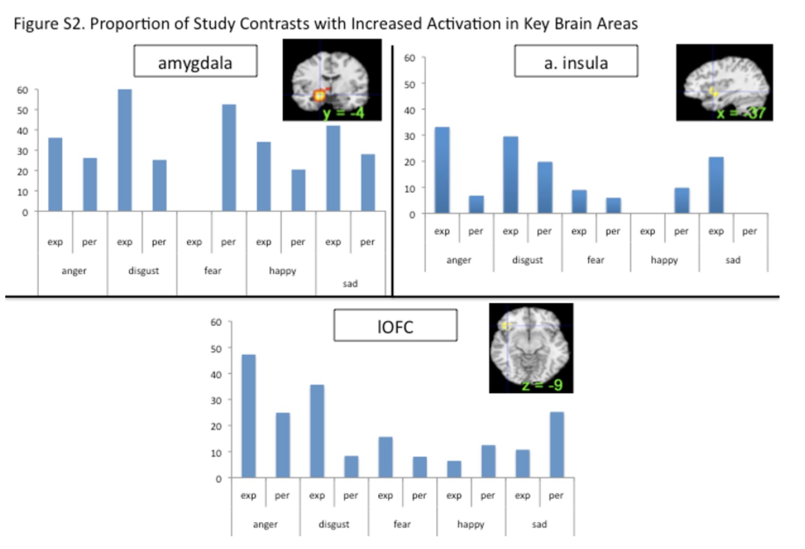{width="75%"}

---

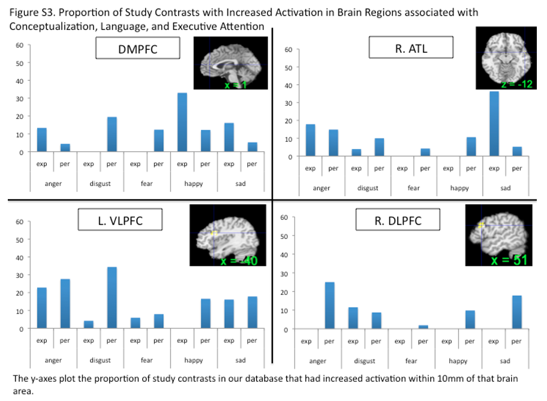{width="75%"}

## Are discrete emotions *localized* in the brain?


---

![@Malezieux2023-as Figure 2 ^["Figure 2. Largely overlapping and conserved brain regions involved in emotions. Recent work in rodents and humans has begun to highlight several conserved brain regions that are implicated in emotion processing across species. Interestingly, many of these regions are implicated in several emotion states of different valences. (a) Sagittal view of the rodent brain highlighting regions implicated in emotions. (b) Sagittal view of the human brain highlighting regions implicated in emotions. Note the conservation of many of these regions between rodents and humans. For clarity, we chose not to display the anatomical and functional connections between these regions. However, it should be noted that most of these regions are heavily interconnected and form functional networks that are crucial for the emergence and control of emotions. Abbreviations: ACC, anterior cingulate cortex; BLA, basolateral amygdala; BNST, bed nucleus of the stria terminalis; CeA, central amygdala; HPC, hippocampus; HPT, hypothalamus; LS, lateral septum; MeA, medial amygdala; mPFC, medial prefrontal cortex; NAc, nucleus accumbens; OFC, orbitofrontal cortex; PAG, periaqueductal gray; vHPC, ventral hippocampus; VP, ventral pallidum; VTA, ventral tegmental area."]](https://www.annualreviews.org/docserver/fulltext/neuro/46/1/ne460211.f2.gif){width="50%"}

---

![@Berridge2019-th Figure 1 ^["a | An affective modules hypothesis posits that a given neuron, neural system, projection or subregion reliably mediates only a single affective function. In the example shown here, which is based on some of the findings described in this article, a hypothesis of affective modules suggests that there are at least four affective modules within the nucleus accumbens shell. Each module is dedicated to mediating just one of four affective functions (the positive-valenced ‘liking’ and ‘wanting’ reactions and the negative-valenced ‘fear’ and ‘disgust’ reactions2,61,62,70) and is activated by particular manipulations of the nucleus accumbens (for example, ‘liking’ enhancement is triggered by opioid stimulation in the rostrodorsal quadrant of the medial shell62). b | An affective modes hypothesis that accounts for the same data would allow a given affective module (a given neuron, projection, neural system or subregion) to have more than one mode. For example, in the schematic example, module 1 (corresponding to a rostrodorsal site in the nucleus accumbens shell) can generate either pure ‘wanting’ (after dopamine receptor stimulation or AMPA receptor (AMPAR) blockade)45,47,70 or ‘liking’ plus ‘wanting’ (in response to opioid receptor stimulation47,62). Module 4 (corresponding to the caudal shell) can generate ‘wanting’ alone (after dopamine receptor or µ-opioid receptor stimulation)50,62, ‘fear’ alone (after AMPA receptor blockade)41,70 or ‘disgust’ plus ‘fear’ (after GABA agonist microinjection)61,70. However, a particular module may still have unique features that distinguish it from other modules (for example, only one of the modules illustrated has the capacity to enhance ‘liking’47,62 and only one has the capacity to generate ‘disgust’61,70). A particular module also may retain a valence bias across modes (for example, module 1 has strong positive-valenced bias41,62,70, whereas module 4 has a negative-valenced bias41,70) but still be capable of generating affective reactions of the opposite valence in particular modes (such as the switching between generation of ‘wanting’ and ‘fear’ by intermediate modules23,41, or the ‘wanting’ enhancement obtained from negatively biased module 4 in the dopamine receptor or µ-opioid receptor stimulation modes45,50,62). GABAR, GABA receptor."]](https://media.springernature.com/lw685/springer-static/image/art%3A10.1038%2Fs41583-019-0122-8/MediaObjects/41583_2019_122_Fig1_HTML.png?as=webp){width="40%"}

---

![@Wager2015-fh Figure 1^["Fig 1. Classification of emotion category using the Bayesian Spatial Point Process model. A) A schematic of the method, which models the population density of activation across the brain with a sparse set of multivariate Gaussian distributions at two levels (study center and population center). The intensity function map summarizes the expected frequency of activation conditional on an emotion category. The model also represents the joint activation across multiple brain regions, which is not captured in the intensity map. The model can also be used for classification by calculating the conditional likelihood of each emotion category given a set of foci using Bayes’ rule. B) Confusion matrix for the 5-way classification of emotion category based on the model. Diagonal entries reflect classification accuracy. C) The intensity maps for each of the 5 emotion categories. Intensity maps are continuous over space, and their integral over any portion of the brain reflects the expected number of activation centers in that area for all studies with a particular emotion. The maps are thresholded for display at a voxel-wise intensity of 0.001 or above. "]](https://journals.plos.org/ploscompbiol/article/figure/image?size=large&id=10.1371/journal.pcbi.1004066.g001)

## {.scrollable}

![@Wager2015-fh Figure 2^["Fig 2. Emotion-predictive patterns of activity across cortical networks and subcortical regions. A) Left: Seven resting-state connectivity networks from the Buckner Lab with cortical, basal ganglia, and cerebellar components. Colors reflect the network membership. Right: Published anatomical parcellations were used to supplement the resting-state networks to identify sub-regions in amygdala (131), hippocampus (131, 132), and thalamus (133). dAN: dorsal attention network; Def: default mode network; FPN: fronto-parietal network; Limbic: limbic network; SMN: somatomotor network; vAN: ventral attention network; Vis: visual network. B) The profile of activation intensity across the 7 cortical and basal ganglia resting-state networks, and anatomical amygdalar and thalamic regions. Colors indicate different emotion categories, as in Fig. 1. Red: anger; green: disgust; purple: fear; yellow: happiness; blue: sadness. Values farther toward the solid circle indicate greater average intensity in the network (i.e., more expected study centers). C) Two canonical patterns estimated using non-negative matrix factorization, and the distribution of intensity values for each emotion across the two canonical patterns. The colored area shows the 95% joint confidence interval (confidence ellipsoids) derived from the 10,000 Markov chain Monte Carlo samples in the Bayesian model. Non-overlapping confidence ellipsoids indicate significant differences across categories in the expression of each profile."]](https://journals.plos.org/ploscompbiol/article/figure/image?size=large&id=10.1371/journal.pcbi.1004066.g002){width="75%"}

## {.scrollable}

![@Wager2015-fh Figure 3 ^["Fig 3. Co-activation graphs for each emotion category.
A) Force-directed graphs for each emotion category, based on the Fruchterman-Reingold spring algorithm (134). The nodes (circles) are regions or networks, color-coded by anatomical system. The edges (lines) reflect co-activation between pairs of regions or networks, assessed based on the joint distribution of activation intensity in the Bayesian model (Pearson’s r across all MCMC iterations) and thresholded at P <. 05 corrected based on a permutation test. The size of each circle reflects its betweenness-centrality (48, 49), a measure of how strongly it connects disparate networks. (B) The same connections in the anatomical space of the brain. One location is depicted for each cortical network for visualization purposes, though the networks were distributed across regions (see Fig 3A). C) Global network efficiency (see refs. (135, 136)) within (diagonal elements) and between (off-diagonals) brain systems. Global efficiency (135, 136) is defined as the inverse of the average minimum path length between all members of each group of regions/nodes. Minimum path length is the minimum number of intervening nodes that must be traversed to reach one node from another, counting only paths with statistically significant associations and with distance values proportional to (2—Pearson’s r), rather than binary values, to better reflect the actual co-activation values. Higher efficiency reflects more direct relationships among the systems. Values of 0 indicates disjoint systems, with no significant co-activation paths connecting any pair of regions/networks, and values of 1 indicate the upper bound of efficiency, with a perfect association between each pair of regions. Co-activation is related to connectivity and network integration, though all fMRI-based connectivity measures only indirectly reflect actual neural connections. Efficiency is related to the average correlation among regions (r = 0.76) but not the average intensity (r = 0.02; see S5 Fig). "]](https://journals.plos.org/ploscompbiol/article/figure/image?size=large&id=10.1371/journal.pcbi.1004066.g003){width="75%"}

## @Wager2015-fh

>Analyses of the activity patterns encoded in the model revealed that **each emotion category is associated with unique, prototypical patterns of activity across multiple brain systems** including the cortex, thalamus, amygdala, and other structures. The results indicate that emotion categories are not contained within any one region or system, but are represented as configurations across multiple brain networks.

## @Wager2015-fh

>Analyses of the activity patterns encoded in the model revealed that each emotion category is associated with unique, prototypical patterns of activity across multiple brain systems including the cortex, thalamus, amygdala, and other structures. The results indicate that **emotion categories are not contained within any one region or system, but are represented as configurations across multiple brain networks**.

---

>...**these findings are incompatible with several contemporary theories of emotion, including those that emphasize emotion-dedicated brain systems** and those that propose emotion is localized primarily in subcortical activity.

-- @Wager2015-fh

# Constructing emotion

## Constructionist account

>A psychological constructionist account of emotion assumes that **emotions are psychological events that emerge out of more basic psychological operations that are not specific to emotion**. In this view, mental categories such as anger, sadness, fear, et cetera, are not respected by the brain (nor are emotion, perception, or cognition, for that matter.

-- @Lindquist2012-jr

## {.scrollable}

>...**emotions emerge when people make meaning out of sensory input from the body and from the world using knowledge of prior experiences**. Emotions are “situated conceptualizations” (cf. Barsalou 2003) because the emerging meaning is tailored to the immediate environment and prepares the person to respond to sensory input in a way that is tailored to the situation.

-- @Lindquist2012-jr

## {.scrollable}

![@Barrett2017-hq Figure 2^["Hubs in the human brain. (A) Hubs of the rich club, adapted from van den Heuvel and Sporns (2013). These regions are strongly interconnected with one another and it is proposed that they integrate information across the brain to create large-scale patterns of information flow (i.e. synchronized activity; van den Heuvel and Sporns, 2013). They are sometimes referred to as convergence or confluence zones (e.g. Damasio, 1989; Meyer and Damasio, 2009). (B) Results of a forward inference analysis, revealing ‘hot spots’ in the brain that show a better than chance increase in BOLD signal across 5633 studies from the Neurosynth database. Activations are thresholded at FWE P < 0.05. Limbic regions (i.e. agranular/dysgranular with descending projections to visceromotor control nuclei) include the cingulate cortex [midcingulate cortex (MCC), pregenual anterior cingulate cortex (pgACC)], ventromedial prefrontal cortex (vmPFC), supplementary motor and premotor areas (SMA and PMC), medial temporal lobe, the anterior insula (aINS) and ventrolateral prefrontal cortex (vlPFC) (e.g. Carrive and Morgan, 2012; Bar et al., 2016); for a discussion and additional references, see (Kleckner et al., in press). AG, angular gyrus; MC, motor cortex."]](https://oup.silverchair-cdn.com/oup/backfile/Content_public/Journal/scan/12/1/10.1093_scan_nsw154/3/m_nsw154f2.jpeg?Expires=1774193013&Signature=keXiE-~IyvX0fss39lOeVk6cuS8E0uq-mkYFG6YG-iYYUYMEyUbYDf4SAq1VpaAw7~S9XiXLt8y-U7Y7lJY56rh0VCq9pOBrN0dIPG~ighk~xY7balb-btOCvKdcUaJ43KCJVxDEg4~8iZhrs-7dWWjeakxTW5O7JYM1toIGFNnePI-Hn0fIh33TC-BFe6Fp5R97y1HxcIP6FJcHtS6U~EuK~C75cVKTwcSpycEvUS47K3St1d~th8DwfACJkYglJ9xO5~8XunZTuXaVCQKCkF9~LC0qJWave6bcvYHqiRxi0OkpKlq0qPkcVQvH9W-UkyI67dVlpiy0BCMlFkOfVA__&Key-Pair-Id=APKAIE5G5CRDK6RD3PGA)

## Brains regulate bodies in the world

![@Barrett2017-hq^["Fig. 3.Neural activity during simulation. N = 16 (data from Wilson-Mendenhall et al., 2013). Participants listened with eyes closed to multimodal descriptions rich in sensory details and imagined each real-world scenario as if it was actually happening to them (i.e. the experiences were high in subjective realism). Contrast presented is scenario immersion > resting baseline; maps are FDR corrected P < 0.05. Left image, x = 1; right image, x = −42. Heightened neural activity in primary visual cortex (not labeled), somatosensory cortex (SSC), and MC during scenario immersion replicated prior simulation research (McNorgan, 2012) and established the validity of the paradigm. Notice that simulation was associated with an increase in BOLD response within primary interoceptive cortex (i.e. the pINS), in the sensory integration network of lateral orbitofrontal cortex (lOFC) (Ongur et al., 2003) and in the thalamus; increased BOLD responses were also seen, as expected, in limbic and paralimbic regions such as the vmPFC, the aINS, the temporal pole (TP), SMA and vlPFC, as well as in the hypothalamus and the subcortical nuclei that control the internal milieu. PAG, periacquiductal gray; PBN, parabrachial nucleus."]](https://oup.silverchair-cdn.com/oup/backfile/Content_public/Journal/scan/12/1/10.1093_scan_nsw154/3/m_nsw154f3.jpeg?Expires=1774193013&Signature=mPx5Xq7b-NyURG8YmSSpfURkSvY2bnYP8eApdSUPPZEQrSN1r893JV0Sm9HiBB5F5QRxQEiO934~BDpHrI88Sg3wakpFa6eMN~Mqp9dg86ToKiZujKzTQLg4FSMX2aEBxKTxwc6OAvOowsF~wsyf~Bd7GVmXjT-3xoS9HgtX-rvYBcNWFVksdbfceeU1ppwZRTLuaMybG8IHtZDM8nusgjfRs92bfE-vRwxc7e1CyzVXnYMmHEhxzLX~llbaEm7gk44A6VPGdvMYs5kA82aX8y--tN3gPhn2fysM5PBh0a64gPTF12a83xzMzdCLQbpaG6OAivh322Koht445M-xwQ__&Key-Pair-Id=APKAIE5G5CRDK6RD3PGA)

## Brain =  {.scrollable}

:::: {.columns}
::: {.column width=50%}
- Conceptual System +
- Pattern Generation
:::
::: {.column width=50%}
![@Barrett2017-hq Figure 4^["Fig. 4.The brain is a concept generator. (A) Brodmann areas are shaded to depict their degree of laminar organization, including the insula (bottom right). The brain’s computational architecture is depicted (adapted from Barbas, 2015), where prediction signals flow from the deep layers of less granular regions (cell bodies depicted with triangles) to the upper layers of more granular regions; this, can also be thought of concept construction [as described in Barrett (2017)]. I hypothesize that agranular (i.e. limbic) cortices generatively combine past experiences to initiate the construction of embodied concepts; multimodal summaries cascade to sensory and motor systems to create the simulations that will become motor plans and perceptions. Prediction error processing, in turn, is akin to concept learning. The upper layers of cortex compress prediction errors and reduce error dimensionality, eventually creating multimodal summaries, by virtue of a cytoarchitectural gradient: prediction error flows from the upper layers of primary sensory and motor regions (highly granular cortex) populated with many small pyramidal cells with few connections towards less granular heteromodal regions (including limbic cortices) with fewer but larger pyramidal cells having many connections (Finlay and Uchiyama, 2015). (B) Evidence of conceptual processing in the default mode network: Multimodal summaries for emotion concepts [adapted from Skerry and Saxe (2015), Figure 1B]; summary representations of sensory-motor properties (color, shape, visual motion, sound and physical manipulation [Fernandino et al. (2016), Figure 5]; and, semantic processing [adapted from Binder and Desai (2011), Figure 2]. (C) Regions that consistently increase activity during emotional experience (green), emotion regulation (blue), and their overlap (red) [as appears in Clark-Polner et al. (2016); adapted from Buhle et al. (2014) and Satpute et al. (2015)]. Overlaps are observed in the aIns, vlPFC, the MCC, SMA and posterior superior temporal sulcus. Studies of emotional experience show consistent increase in activity that is consistent with manipulating predictions (i.e. the default mode and salience networks), whereas reappraisal instructions appear to manipulate the modification of those predictions (i.e. the frontoparietal and salience networks). (D) Intensity maps for five emotion categories examined by Wager et al. (2015). Maps represent the expected activations or population centers, given a specific emotion category. Maps also reflect expected co-activation patterns. Notice that population centers for all emotion categories can be found within the default mode and salience networks. These are probabilistic summaries, not brain states for emotion Adapted from Wager et al. (2015)."]](https://oup.silverchair-cdn.com/oup/backfile/Content_public/Journal/scan/12/1/10.1093_scan_nsw154/3/m_nsw154f4.jpeg?Expires=1774193013&Signature=udGMpdvA3INx5VGBROsZ3V9QzQV-az4wiE2tY~Zpns304Mx1hgZFmIw~zZIzPJAd0xV6xIGoJDHfTvu24B7wfP19GlxocrQYT1cyfbu6u9Nl0nlfGxjkovA1ceAX7SparnZJm6aOttHheSYtxAHf7eOZJIxGYE7pEiG7yqPaO04xpyj-bg7jL7FRv1txVLZ7wCFpprdZG7PPMbOnX3naU~pkhT06-s41~Cd7Q3fQE0JC0--YB~WJTgD7nL-MqTjZSBWUWJHqcLY1Br49y82cK1RzfO6NmVSRsTkyiQOyJIHJxgvW4SiS7HYXotB8cJch6EScVQrEhWGYKp~zFkxiqw__&Key-Pair-Id=APKAIE5G5CRDK6RD3PGA){width="65%" fig-align="right"}
:::
::::

## On semantic networks

![@Wikipedia-contributors2025-nl^[Public Domain, https://commons.wikimedia.org/w/index.php?curid=1353062]](https://upload.wikimedia.org/wikipedia/commons/thumb/6/67/Semantic_Net.svg/3840px-Semantic_Net.svg.png){width="75%"}

# Break

# Fear & anxiety

## Animal models

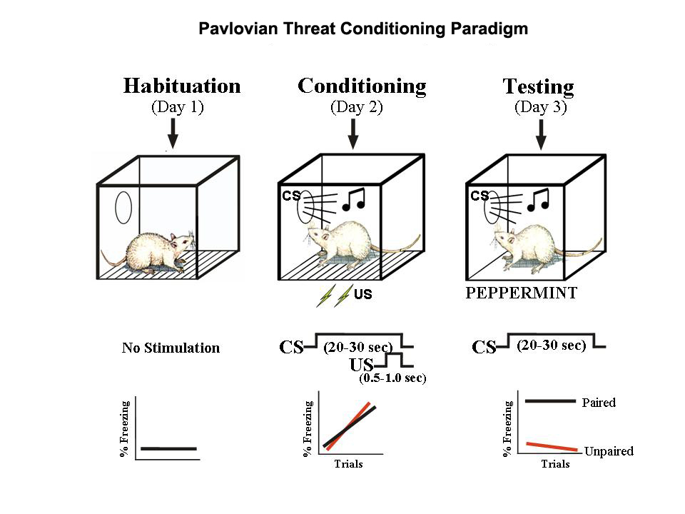{width="50%"}

---

::: {#fig-conditioned-suppression-video}
<iframe width="1200" height="450" src="https://www.youtube.com/embed/ZlZekx1P1g4?si=DdAtoayeBmJNrFuf" title="YouTube video player" frameborder="0" allow="accelerometer; autoplay; clipboard-write; encrypted-media; gyroscope; picture-in-picture; web-share" referrerpolicy="strict-origin-when-cross-origin" allowfullscreen></iframe>

-- @Daleswartzentruber2007-xr
:::

---

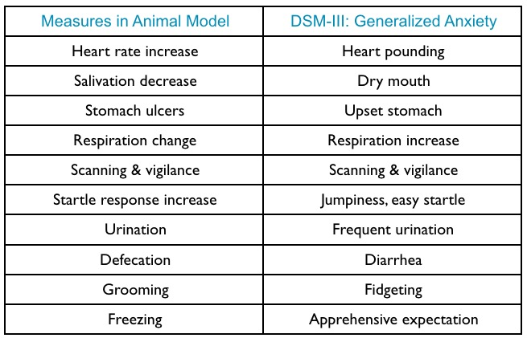

## Amygdala circuits

:::: {.columns}
::: {.column width=50%}
::: {.incremental}
- Direct (fast) pathways via thalamus
- Indirect (slower) pathways via cortex
- Input and output (behavior, physiology) specificity
:::
:::
::: {.column width=50%}
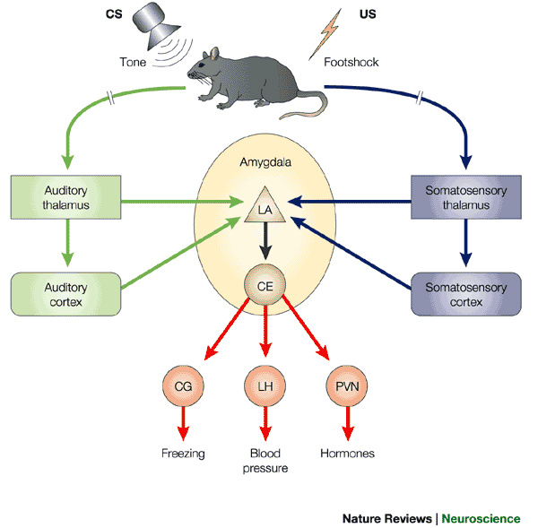
:::
::::

## Specificity of learning

:::: {.columns}
::: {.column width=50%}
- Specific stimulus/response, $S \rightarrow R$, patterns
- Visual OR Auditory $\rightarrow$ pain
- Taste $\rightarrow$ nausea
:::
::: {.column width=50%}
![@Pellman2016-xu Figure 1^["Figure 1. Evolutionary Influences on Innate and Learned Fear. (A) Predatory history shapes prey's innate fear responses as illustrated by Peromyscus maniculatus austerus deer mouse's freezing to weasels and Peromyscus maniculatus gambeli deer mouse's jump (Jan Gillbank, ‘Drawing of a grey mouse’ October 27, 2012 via Wikimedia, Creative Commons Attribution 3.0 License) to gopher snakes [2]. P. m. austerus deer mice live in the coniferous forests of western Washington State and P. m. gambeli deer mice dwell in the arid grassland of eastern Washington State. (B) Ecological history predisposes fear learning. A classic study by John Garcia [3] found that rats easily acquired conditioned fear to bright/noisy conditioned stimulus (CS) paired to footshock unconditioned stimulus (US) and conditioned taste aversion to saccharin taste CS paired to X-rays (or LiCl) US. However, rats showed lack of conditioning to bright/noisy–X-ray (or LiCl) and saccharin–footshock pairings."]](https://ars.els-cdn.com/content/image/1-s2.0-S0166223616300017-gr1.jpg){fig-align="right"}

:::
::::

## Circuitry

![@Brandao2008-hw Figure 1^["Fig. 1. Activation of distinct neural substrates in function of the nature of the threatening stimuli. Conditioned (potential or distal) danger stimuli elicit conditioned freezing through activation of the behavioral inhibition system (septo-hippocampal system) whereas innate danger stimuli (proximal or nociceptive) elicit active forms of defensive behavior through activation of the amygdala–dPAG axis. Activation of the circuit dPAG–amygdala by nociceptive stimuli may also trigger inhibitory mechanisms through amygdala–dPAG projections. This may underlies the so-called fear-induced analgesia or the proposal that anxiety inhibits panic."]](https://ars.els-cdn.com/content/image/1-s2.0-S0166432807005633-gr1.jpg)

---

:::: {.columns}
::: {.column width=50%}
- Amygdala
- Cerebral cortex
- Hippocampus
- Thalamus
- Midbrain Tegmentum
:::
::: {.column width=50%}
![@Pellman2016-xu Figure 2^["Figure 2. A Putative Fear Conditioning Circuit. The auditory CS information reaches the amygdala via the direct thalamic pathway and indirect cortical pathway. The footshock US information is relayed to the amygdala via the ascending pain pathways. The CS–US association formation is thought to occur in specific subnuclei via associative LTP-like mechanism that strengthens the CS–amygdala synapses. Abbreviations: BLA, basolateral complex of the amygdala; CEA, central nucleus of the amygdala; CS, conditioned stimulus; US, unconditioned stimulus; ITC, intercalated cells of the amygdala; PL, prelimbic cortex; IL, infralimbic cortex; HTP, hippocampus; Thal, thalamus; PAG, periaqueductal gray; PBN, parabrachial nucleus; LTP, long-term potentiation. Inhibitory pathways are represented by encircled minus symbols."]](https://ars.els-cdn.com/content/image/1-s2.0-S0166223616300017-gr2.jpg){fig-align="right"}
:::
::::

# Stress

## Types: Acute

:::: {.columns}
::: {.column width=50%}
- Short duration (phasic)
- Brain detects threat
- Mobilizes physiological, behavioral responses
  - Hypothalamic-Pituitary-Adrenal (HPA) axis
  - Sympathetic Adrenal Medullary (SAM) axis
:::
::: {.column width=50%}
{fig-align="right"}
:::
::::

## Types: Chronic

:::: {.columns}
::: {.column width=50%}
- persistent
:::
::: {.column width=50%}

:::
::::

## HPA axis

:::: {.columns}
::: {.column width=50%}
- Hypothalamus controls hormone release
  - Indirectly
  - Directly
- Via pituitary gland
:::
::: {.column width=50%}

:::
::::

## Indirect release

:::: {.columns}
::: {.column width=50%}
- Blood stream ->
- End organs
:::
::: {.column width=50%}

:::
::::


## Responses to threat or challenge

:::: {.columns}
::: {.column width=60%}
- Neural response
  + Sympathetic NS activation of heart, lungs, etc.
  + Sympathetic Adrenal Medullary (SAM) axis (also system or response)
    + Releases norepinephrine/noradrenaline (NE) and epinephrine/adrenaline (Epi) into bloodstream
:::
::: {.column width=40%}
{fig-align="right"}
:::
::::

## Autonomic Nervous System

:::: {.columns}
::: {.column width=50%}
- Sympathetic Branch
  - Spinal cord $\rightarrow$ Vertebral ganglia $\righarrow$ target
- Parasympathetic Branch
  - Vagus (Xth CN) $\righarrow$ multiple targets
  - Spinal cord $\rightarrow$ multiple targets
:::
::: {.column width=50%}
{width="80%" fig-align="right"}
:::
::::

---


## Responses to threat or challenge

:::: {.columns}
::: {.column width=60%}
- Endocrine response
    + *Hypothalamic Pituitary Adrenal (HPA) axis*
- Hypothalamus 
    + Releases *Corticotropin Releasing Hormone (CRH)*
- Anterior pituitary
    + Releases *Adrenocorticotropic hormone (ACTH)* 
:::
::: {.column width=40%}
{fig-align="right"}
:::
::::

## Responses to threat or challenge

:::: {.columns}
::: {.column width=60%}
- Adrenal^[*Ad*jacent to the kidney] cortex
  + Responds to ACTH from anterior pituitary
  + Releases *Glucocorticoids (e.g., cortisol)*
:::
::: {.column width=40%}
{fig-align="right"}
:::
::::

## Responses to threat or challenge

:::: {.columns}
::: {.column width=50%}
- *Glucocorticoids (e.g., cortisol)*
  + increase blood glucose production
  + reduce inflammation
  - suppress immune system 
:::
::: {.column width=50%}

:::
::::
  
## Cortisol's many roles


## Cortisol affects brain, too

:::: {.columns}
::: {.column width=50%}
- Via receptors for CRF, cortisol
:::
::: {.column width=50%}

:::
::::

## Multiple feedback loops {.scrollable}

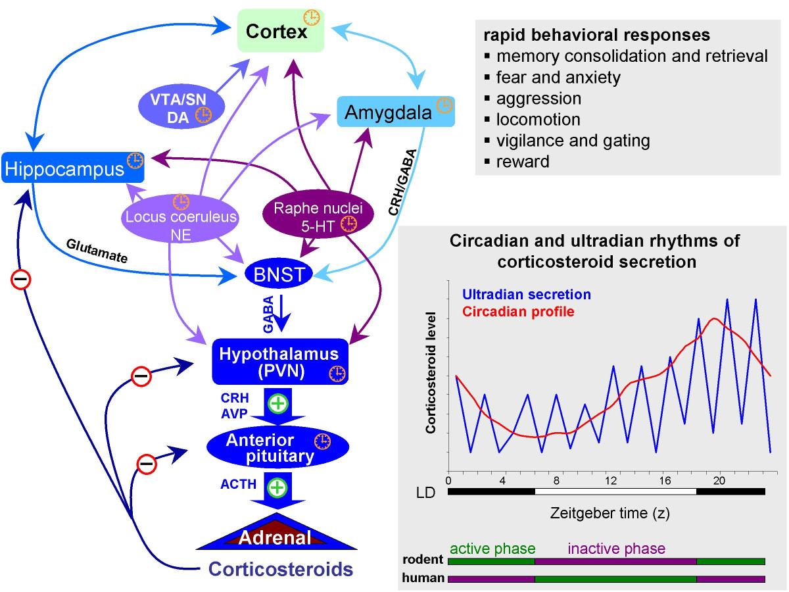

---

## Impacts of stress {.scrollable}

![@Musazzi2017-lr Figure 1^["Figure 1. Neuroarchitectural Changes Induced by Repeated or Acute Stress in Rodents. (A) Repeated restraint stress (7 days) induces a reduction in the number and length of apical dendrites of pyramidal neurons (layer V) in the medial prefrontal cortex (PFC) of rats. (B) Magnified segment of dendrite from the same stressed rats, showing that repeated stress significantly decreases the number of spine synapses in medial PFC. (C) Reconstructions of representative infralimbic pyramidal neurons in mice exposed to zero (0), one (1×), or three (3×) unpredictable sessions of 10 min of forced swim stress. Apical dendritic branch length was significantly reduced after one or three stress episodes relative to controls. Adapted, with permission, from [24] (B) and [23] (C)."]](https://ars.els-cdn.com/content/image/1-s2.0-S0166223617301364-gr1_lrg.jpg){width="65%"}

## Short- and long-term effects {.scrollable}

![@Musazzi2017-lr Figure 3^["Figure 3. Graphic Summary of Short- and Long-Term Functional and Neuroarchitectural Effects in Prefrontal Cortex (PFC) Synapses after Acute Footshock (FS) Stress [44]. The fast and transient increase in corticosterone (CORT) release induced by acute (40 min) FS stress was accompanied by the rapid increase in both depolarization-evoked and hypertonic sucrose-evoked (readily releasable pool) glutamate release in PFC, and the number of small excitatory synapses. The enhancement of glutamate release was sustained for up to 24 h, as well as the increased number of excitatory synapses, which normalized between 24 h and 7 days after FS. Before 24 h had elapsed from the start of FS stress, retraction of apical dendrites began and was sustained for up to 14 days. The timing of actual FS stress (40 min) is indicated by the red marker. Number of excitatory synapses and apical dendrite length are indicative and not in scale with other readouts. CORT and glutamate release data adapted from [44]."]](https://ars.els-cdn.com/content/image/1-s2.0-S0166223617301364-gr3_lrg.jpg){width="65%"}

## Neurochemical factors

- Cortisol enhances glutamate release
- Corticosteroid antagonists block this
- Ketamine (NMDA receptor antagonist) may act via similar mechanisms

## Ethological, psychosocial factors

:::: {.columns}
::: {.column width=50%}

:::
::: {.column width=50%}
![@Danese2017-jc Figure 1^["Potential mechanisms linking childhood trauma and inflammation. Panel (a) portrays potential mechanisms through which exposure to childhood trauma could elicit an acute inflammatory response. On the one hand, exposure to acute psychological stress can elicit an acute inflammatory response by stimulation of the sympathetic nervous system (Bierhaus et al, 2003; Steptoe et al, 2007b). On the other hand, psychological trauma may occur in the context of physical trauma. In this case, physical injury and pathogen infection can induce inflammation by triggering innate immunity (Medzhitov and Janeway, 2000). Short-term activation of the inflammatory response during sensitive periods in early life may affect the brain development and later microglia and neuroendocrine reactivity (Figure 2). Panel (b) portrays potential biological and behavioral mechanisms through which response to childhood trauma could lead to a chronic inflammatory state. First, early-life stress may be indirectly linked to inflammation because of primary neuroendocrine abnormalities in the hypothalamic-pituitary-adrenal (HPA) axis. Childhood trauma is associated with later hyperactive HPA axis functioning (Danese and McEwen, 2012; Gunnar and Quevedo, 2007; Heim and Nemeroff, 2001; Lupien et al, 2009), presumably because of primary abnormalities of the glucocorticoid receptor. Both preclinical and clinical studies have shown that early-life stress is associated with epigenetic changes, leading to insufficient glucocorticoid signaling, namely, impaired functioning of the glucocorticoid-receptor-mediated signaling (Weaver et al, 2004; Klengel et al, 2013). These changes could, in turn, induce resistance to the anti-inflammatory properties of cortisol and, thus, high inflammation levels (Heim et al, 2000; Miller et al, 2002; Raison and Miller, 2003). However, because of the bi-directional association between HPA axis functioning and inflammation, it is also possible that primary inflammatory abnormalities could stimulate HPA axis activity (Besedovsky et al, 1986) and induce glucocorticoid resistance (Barnes and Adcock, 2009). Second, it is possible that early-life stress can influence the composition of the gut microbiota (Bailey and Coe, 1999; O'Mahony et al, 2009). In turn, gut dysbiosis could influence brain function through stimulation of the vagus nerve and other metabolic effects (Cryan and Dinan, 2012). Third, early-life stress is associated with hormonal and brain abnormalities that could contribute to a ‘thrifty’ phenotype characterized by increased energy intake and storage, and/or reduced energy expenditure resulting in obesity (Danese and Tan, 2014; Danese et al, 2014). In turn, obesity is associated with high systemic inflammation through the production of pro-inflammatory cytokines by adipocytes (Gregor and Hotamisligil, 2011). Fourth, early-life stress has been linked to alcohol and substance abuse disorders and smoking (Dube et al, 2003; Anda et al, 1999), which can increase inflammation levels (Crews et al, 2006; Shiels et al, 2014). Fifth, early-life stress has been associated with decreased total sleep and disruption in sleep architecture in rodents (Feng et al, 2007; Mrdalj et al, 2013; Tiba et al, 2004) and humans (Gregory and Sadeh, 2016; Kajeepeta et al, 2015). In turn, clinical experiments have shown that sleep deprivation is associated with an increase in the expression of pro-inflammatory cytokines in humans (Irwin et al, 2006), and epidemiological studies have found that reduced sleep is associated with elevated levels of inflammation biomarkers (Miller et al, 2009). Finally, early-life stress is associated with later abnormalities in brain functioning and behavior (Danese and McCrory, 2015). In particular, persistent or recurrent distress and self-harming behaviors described in individuals with a history of childhood trauma could contribute to maintaining elevated inflammation levels (Cohen et al, 2012; Molina, 2005)."]](https://media.springernature.com/lw685/springer-static/image/art%3A10.1038%2Fnpp.2016.198/MediaObjects/41386_2017_Article_BFnpp2016198_Fig1_HTML.jpg?as=webp){width="50%"}
:::
::::

# Pleasure & reward

## Evolutionary perspective

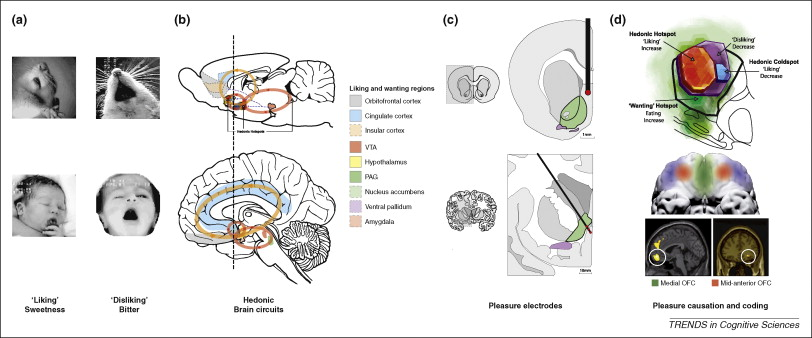

## Reward

- A *reward* reinforces (makes more prevalent/probable) some behavior
- Milner and Olds [-@milner_discovery_1989] discovered 'rewarding' power of electrical self-stimulation
- Heath [-@heath1963electrical] studied effects in human patients

---

::: {#fig-mfb-stimulation-human-video}
<iframe width="1200" height="450" src="https://www.youtube.com/embed/de_b7k9kQp0?si=VEZRlSiB3OrIdp8d" title="YouTube video player" frameborder="0" allow="accelerometer; autoplay; clipboard-write; encrypted-media; gyroscope; picture-in-picture; web-share" referrerpolicy="strict-origin-when-cross-origin" allowfullscreen></iframe>

@Ashikkerib2007-su
:::

## "Reward" circuitry in the brain

:::: {.columns}
::: {.column width=50%}
- Lateral Hypothalamus (Hyp)
- Medial forebrain bundle (MFB)
- Ventral tegmental area (VTA) in midbrain
- Nucleus accumbens (nAcc)
:::
::: {.column width=50%}
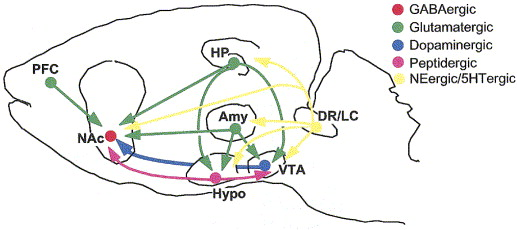

:::
::::

## "Reward" circuitry in the brain

:::: {.columns}
::: {.column width=50%}
- Dorsal Raphe Nucleus/Locus Coeruleus (DR/LC)
- Amygdala (Amy)
- Hippocampus (HP)
- Prefrontal cortex (PFC)
:::
::: {.column width=50%}


:::
::::

---

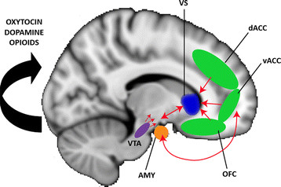

## What does dopamine (DA) signal?

- Hedonia and anhedonia
- Incentive salience
- Reward prediction error (RPE)

---

![@Hu2016-yw Figure 1^["Characteristic response to reward and punishment by different neurons. (a) Ventral tegmental area (VTA) dopamine (DA) neurons encode reward prediction error (RPE) signals, showing excitatory responses only when the reward is not fully predicted (Cohen et al. 2012, Schultz 1998). (b) VTA GABA neurons encode reward expectation, contributing to RPE calculation by serving as a source of subtraction (Eshel et al. 2015). (c) Lateral habenula (LHb) neurons show mirror-inverted phasic responses to DA neurons, potentially providing a source of negative RPE signals (Matsumoto & Hikosaka 2009a). (d,e) Recordings from dorsal raphe nucleus (DRN) serotonergic (5-HT) neurons reveal diverse responses to reward and punishment, with a substantial subset showing excitatory responses to reward even when reward is predicted (Cohen et al. 2015, Li et al. 2016, Liu et al. 2014). (f) DRN GABA neurons are inhibited by reward seeking and activated by aversive stimuli. Green, red, and blue dashed lines indicate the timing of reward cue, reward delivery, and punishment delivery, respectively. Purple dashed lines indicate entry into a reward zone in a sucrose-foraging task. The responses of DRN 5-HT and GABA neurons to unexpected reward and punishment are derived from calcium-imaging fiber photometry experiments. All others are from single-unit electrophysiological recordings."]](https://www.annualreviews.org/docserver/fulltext/neuro/39/1/ne390297.f1.gif)

## DA and GABA signaling

![@Watabe-Uchida2017-gi Figure 1^["Firing patterns of identified dopamine and GABA neurons in VTA. (a) VTA neurons were recorded while mice performed an odor-outcome association task in which different odors predicted different outcomes (see legend on right). Odors were presented for 1 s (gray shading), and outcomes were presented after a 1-s delay. Neuron types were identified based on their optogenetic responses. Dopamine neurons (left) showed phasic excitations to reward-predictive cues and reward. GABA neurons (right) showed sustained activation during the delay. Data from Cohen et al. (2012). (b) Reward expectation modulates dopamine neuron firing. The plot on the left shows when outcome was presented, and the right-hand plot shows when outcome was omitted. Different odors predicted reward with different probabilities. Higher reward probability increased cue responses but suppressed reward responses. Data from Tian & Uchida (2015). Also see Fiorillo et al. (2003) and Matsumoto & Hikosaka (2009a,b). (c) Reward context-dependent modulation of dopamine responses to air puff–predictive cues and air puff. The task conditions during recording differed only in the probability of reward. Dopamine neurons showed both excitation and inhibition in high-reward contexts (left) but only inhibition in low-reward contexts (right). The response in reward trials is not shown. Data from Matsumoto et al. (2016). Abbreviations: CS, conditioned stimulus; VTA, ventral tegmental area."]](https://www.annualreviews.org/docserver/fulltext/neuro/40/1/ne400373.f1.gif){width="65%"}

## Expectation modulates DA signaling

![@Watabe-Uchida2017-gi Figure 2^["Subtractive computation in dopamine neurons. (a) In one task condition (no odor, black), different amounts of reward were presented without any predictive cue. In another condition (odor A, orange), the timing of reward was predicted by an odor. (b) Prediction. Division should change the slope of the curve, whereas subtraction should cause a downward shift. (c) Average response of 40 optogenetically identified dopamine neurons. Prediction caused a subtractive shift. Data from Eshel et al. (2015). (d) Three example neurons. Although individual neurons exhibited diversity with respect to response magnitudes, their response functions were scaled versions of one another. Data from Eshel et al. (2016)."]](https://www.annualreviews.org/docserver/fulltext/neuro/40/1/ne400373.f2.gif){width="65%"}

## DA network

![@Watabe-Uchida2017-gi Figure 4^["Monosynaptic input to dopamine neurons. (a) Monosynaptic inputs to VTA and SNc dopamine neurons (blue and red, respectively). Inputs were labeled through transsynaptic retrograde tracing using rabies virus. Data from Watabe-Uchida et al. (2012). (b) Schematic summary of panel a. The thickness of each line indicates the extent of inputs from each area (percentage of total inputs). (c) Firing patterns of monosynaptic inputs in a classical conditioning paradigm. Monosynaptic inputs to dopamine neurons were labeled by channelrhodopsin-2 using rabies virus. Optogenetics were used to identify these inputs in seven brain areas while mice performed a task. Data from Tian et al. (2016). Abbreviations: Acb, nucleus accumbens; BNST, bed nucleus of stria terminalis; Ce, central amygdala; DA, dopamine; DB, diagonal band of Broca; DR, dorsal raphe; DS, dorsal striatum; EA, extended amygdala; EP, entopeduncular nucleus (internal segment of the globus pallidus); GP, globus pallidus (external segment of the globus pallidus); IPAC, interstitial nucleus of the posterior limb of the anterior commissure; LDTg, laterodorsal tegmental nucleus; LH, lateral hypothalamus; LO, lateral orbitofrontal cortex; LPO, lateral preoptic area; M1, primary motor cortex; M2, secondary motor cortex; MPA, medial preoptic area; mRt, reticular formation; Pa, paraventricular hypothalamic nucleus; PAG, periaqueductal gray; PB, parabrachial nucleus; PPTg, pedunculopontine tegmental nucleus; PSTh, parasubthalamic nucleus; RMTg, rostromedial tegmental nucleus; S1, primary somatosensory cortex; SC, superior colliculus; SNc, substantia nigra pars compacta; STh, subthalamic nucleus; Tu, olfactory tubercle; VP, ventral pallidum; VTA, ventral tegmental area; ZI, zona incerta."]](https://www.annualreviews.org/docserver/ahah/fulltext/neuro/40/1/ne400373.f4_thmb.gif){width="65%"}

## Reward & Aversion Networks

:::: {.columns}
::: {.column width=50%}
- Reward (red)
- Aversion (blue)
:::
::: {.column width=50%}
![@Hu2016-yw Figure 3^["A simplified schematic summarizing the reward-mediating (red) and aversion-mediating (blue) neural pathways that have been verified by recent optogenetics-based behavioral studies. Prominent pathways that are implicated but unverified in reward and aversion are also delineated (gray) (Beier et al. 2015; Britt et al. 2012; Humphries & Prescott 2010; Kirouac et al. 2004; Lammel et al. 2012; Lerner et al. 2015; Liu et al. 2014; Luo et al. 2015; McDevitt et al. 2014; Namburi et al. 2015a,b; Nieh et al. 2015; Qi et al. 2014; Sesack & Grace 2010; Stuber & Wise 2016; Stuber et al. 2011). Abbreviations: BLA, basolateral amygdala; CEA, central amygdala; CPu, caudate putamen; DRN, dorsal raphe nucleus; LDT, laterodorsal tegmental nucleus; LHA, lateral hypothalamus; LHb, lateral habenula; mPFC, medial prefrontal cortex; NAc, nucleus accumbens; OFC, orbitofrontal cortex; RMTg, rostromedial tegmental nucleus; SNc, substantia nigra pars compacta; VTA, ventral tegmental area"]](https://www.annualreviews.org/docserver/ahah/fulltext/neuro/39/1/ne390297.f3_thmb.gif)
:::
::::

## Psychopharmacology

- Dopamine (DA)
- Serotonin (5-HT), Norepinephrine (NE/NA)
- Acetylcholine (ACh)

---

::: {.callout-note}
## Remember

Motor neurons release ACh onto muscle fibers in the PNS.
Here, ACh serves as a neuromodulator.

:::

## Psychopharmacology

:::: {.columns}
::: {.column width=50%}
- Opioids, endogenous morphine-like NTs (endorphins)
:::
::: {.column width=50%}
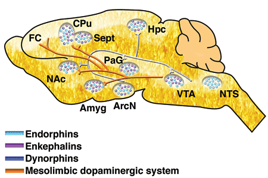
:::
::::

## Psychopharmacology

:::: {.columns}
::: {.column width=50%}
- Cannabinoids = psychoactive compounds found in cannibis
- Endocannabinoids (endogenous cannabinoid system)
    - Cannabinoid CB1 receptors in CNS; CB2 in body, immune system
:::
::: {.column width=50%}
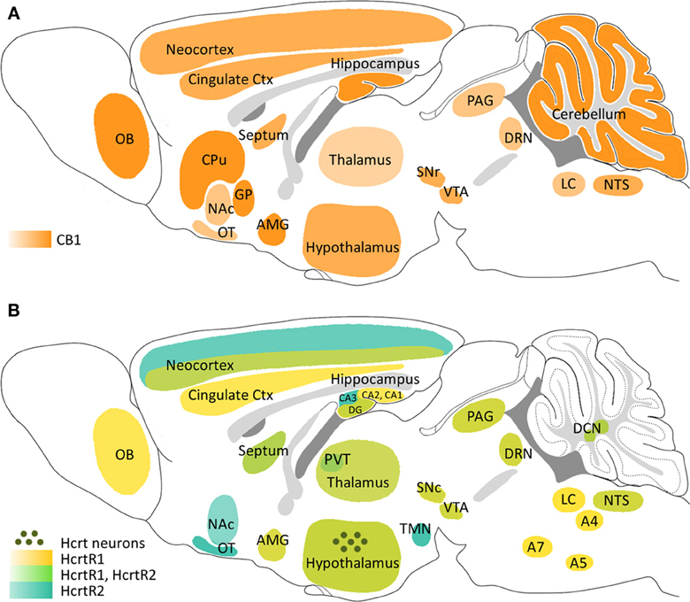{fig-align="right" with="75%"}
:::
::::

## Psychopharmacology

:::: {.columns}
::: {.column width=50%}
- Hypocretin/orexin: wake/sleep, appetite, energy homeostasis
:::
::: {.column width=50%}
{fig-align="right" with="75%"}
:::
::::

# Wrap-up

## Main points

- Emotions are combinations of actions, physiological states, and (for humans at least) feelings
- Distinct emotions aren't localized to specific brain areas or show distinct ANS signatures
- Emotions are distinguishable as activity patterns across multiple, interconnected areas
- *Constructionist* perspective views emotions as "events that emerge out of more basic psychological operations" [@Lindquist2012-jr]

---

>...**emotions emerge when people make meaning out of sensory input from the body and from the world using knowledge of prior experiences**

-- @Barrett2017-hq

## Main points

- Key brain areas/systems implicated in emotion processing:
  - Amygdala
  - Ventral Striatum, Nucleus Accumbens
  - Hippocampus
  - Thalamus
  - Hypothalamus

## Main points

- Key brain areas/systems (continued)
  - Midbrain & brainstem nuclei
    - Ventral Tegmental Area (DA)
    - Periaqueductal Gray
    - Raphe Nucleus (NE), Locus Coeruleus (5-HT)
  - ANS
  
## Main points

:::: {.columns}
::: {.column width=50%}
- Key neurotransmitter pathways
  - Dopamine (DA)
  - Norepinephrine (NE)
  - Serotonin (5-HT)
  - Acetylcholine (ACh)
  - Endorphins & endocannabinoids
:::
::: {.column width=50%}
- Key endocrine pathways
  - HPA (cortisol)
  - SAM (adrenaline, NE)
  - Oxytocin
:::
::::

## Main points

:::: {.columns}
::: {.column width=40%}

:::
::: {.column width=60%}
1. Steering (toward/away)
2. Reinforcement (+/-)
3. Prediction
4. ??
5. ??
:::
::::

## Next time

- Sleep

# Resources

## About

This talk was produced using [Quarto](https://quarto.org), using the [RStudio](https://posit.co/products/open-source/rstudio/)
Integrated Development Environment (IDE), version 2026.1.0.392.

The source files are in R and R Markdown, then rendered to HTML using the
[revealJS](https://revealjs.com) framework.
The HTML slides are hosted in a [GitHub repo](https://github.com/psu-psychology/psy-511-scan-fdns-2026-spring) and served by GitHub pages:
<https://psu-psychology.github.io/psy-511-scan-fdns-2026-spring/>

## References