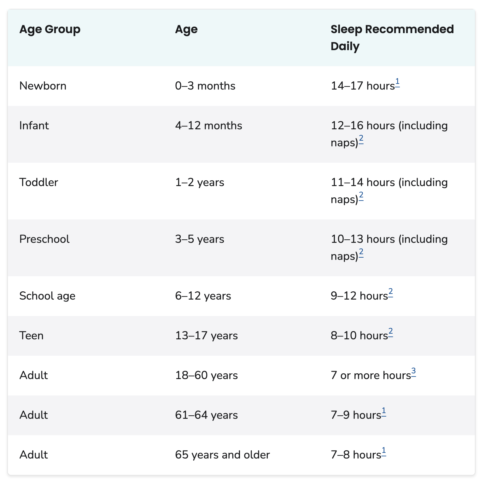
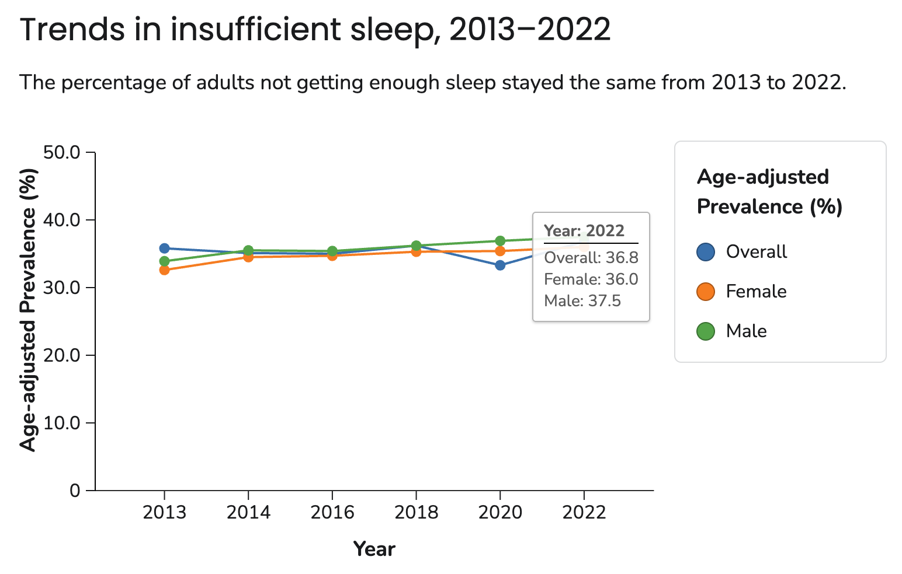
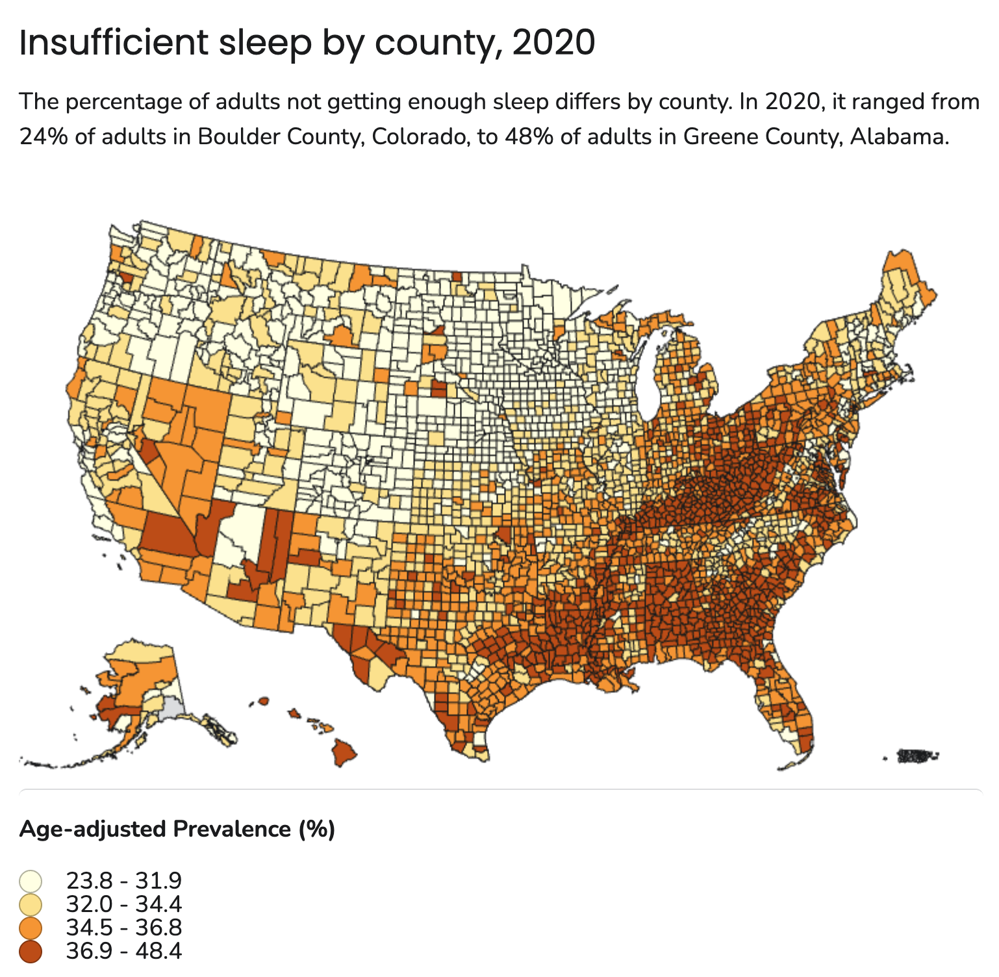

# Overview

## Prelude

::: {#fig-dreamweaver}
<iframe width="1200" height="450" src="https://www.youtube.com/embed/xZKuzwPOefs?si=hNEyFVfwrelgGOJC" title="YouTube video player" frameborder="0" allow="accelerometer; autoplay; clipboard-write; encrypted-media; gyroscope; picture-in-picture; web-share" referrerpolicy="strict-origin-when-cross-origin" allowfullscreen></iframe>

@Films2014-dm
:::

## Announcements

## Today's topics

- Sleep facts
- Brain states during sleep
- Mechanisms of sleep
- Why sleep?

## Warm-up

# Sleep facts

## Recommendations by age

{#fig-cdc-sleep-recs width="50%"}

---

{#fig-cdc-trends width="75%"}

---

{#fig-cdc-sleep-by-county width="50%"}

## Health impacts

![@Shah2025-ol Figure 2^["Figure 2. Potential mechanisms influenced by sleep deprivation (CVD, Cardiovascular Disease; CHD, Coronary Heart Disease; HTH, Hypertension)."]](../include/img/shah-2025-fig-02.jpg)

## Evaluating self-report measures of sleep quality

>...objective measures of sleep quality, such as polysomnography, are not readily available to most clinicians in their daily routine, and are expensive, time-consuming, and impractical for epidemiological and research studies

-- @Fabbri2021-aj

---

>As the most frequently used subjective measurement of sleep quality, the PSQI^[Pittsburgh Sleep Quality Index @Buysse1989-hj] reported good internal reliability and validity; however, different factorial structures were found in a variety of samples, casting doubt on the usefulness of total score in detecting poor and good sleepers.

-- @Fabbri2021-aj

# Brain states during sleep

## Polysomnography

:::: {.columns}
::: {.column width=50%}
- Electroencephalography (EEG)
- Electrocardiography (ECG)
- Electrooculography (EOG)
- Electromyography (EMG)
- Pulse oxymetry & respiratory airflow
:::
::: {.column width=50%}
![@Wikipedia-contributors2025-fi^["By NascarEd - Own work, CC BY-SA 3.0, https://commons.wikimedia.org/w/index.php?curid=24506939"]](https://upload.wikimedia.org/wikipedia/commons/4/4d/Sleep_Stage_REM.png)
:::
::::

## EEG frequency bands

# Mechanisms of sleep

## Two-process models

## Flip-Flop Switch

## Orexin

# Why sleep?

## Glymphatic clearance

## Memory consolidation

## Adaptive inactivity

# Wrap-up

## Main points

## Next time

# Resources

## About

This talk was produced using [Quarto](https://quarto.org), using the [RStudio](https://posit.co/products/open-source/rstudio/)
Integrated Development Environment (IDE), version 2026.1.0.392.

The source files are in R and R Markdown, then rendered to HTML using the
[revealJS](https://revealjs.com) framework.
The HTML slides are hosted in a [GitHub repo](https://github.com/psu-psychology/psy-511-scan-fdns-2026-spring) and served by GitHub pages:
<https://psu-psychology.github.io/psy-511-scan-fdns-2026-spring/>

## References