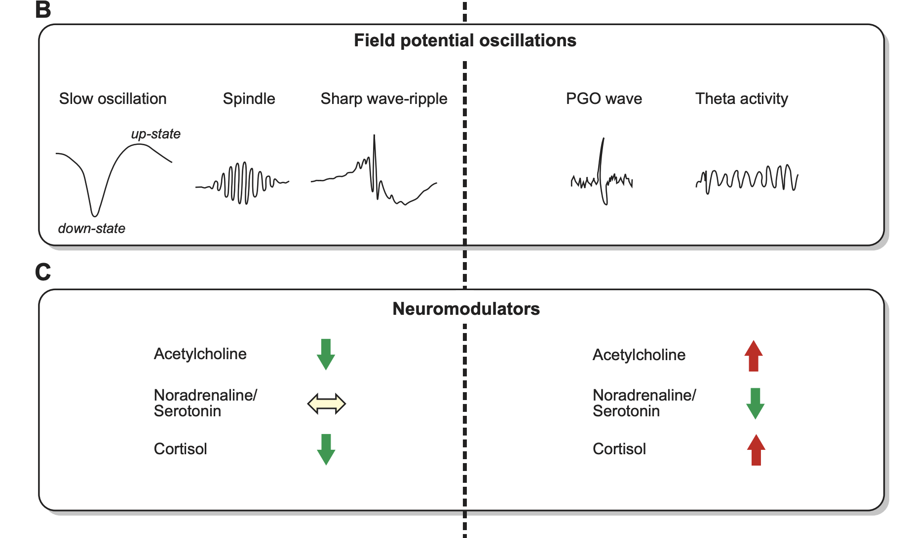
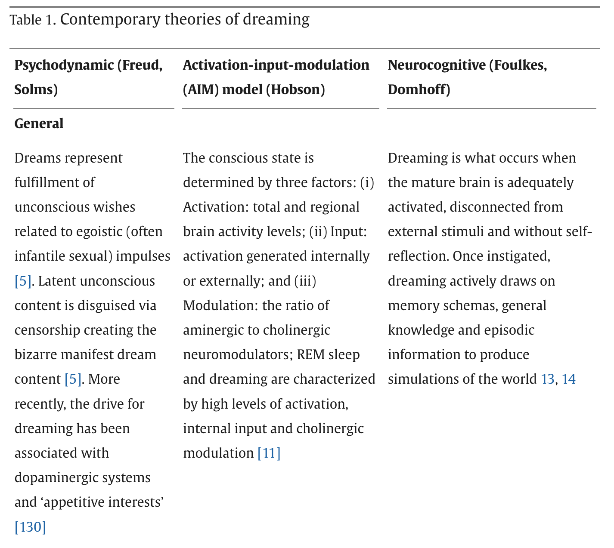
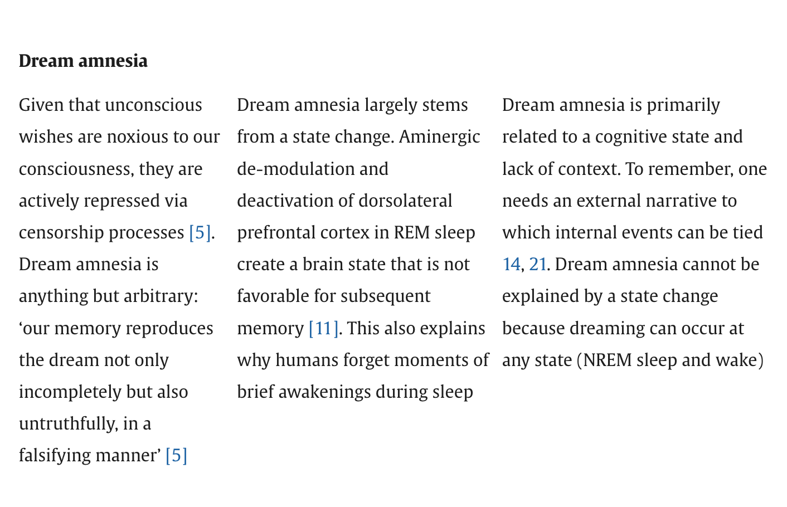
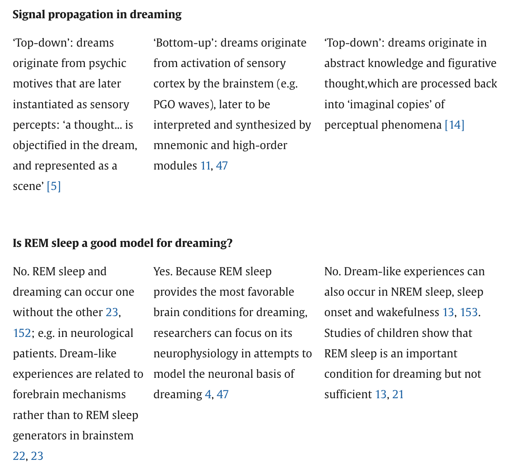
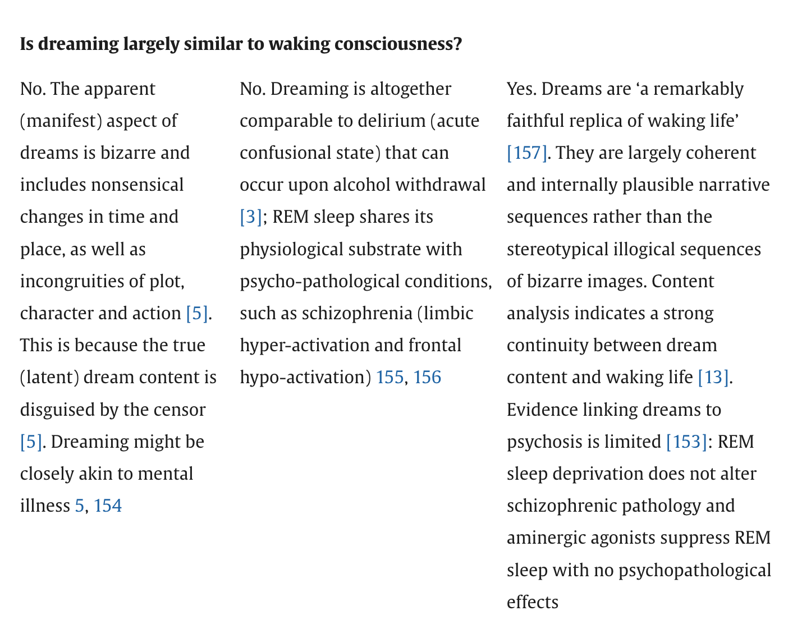
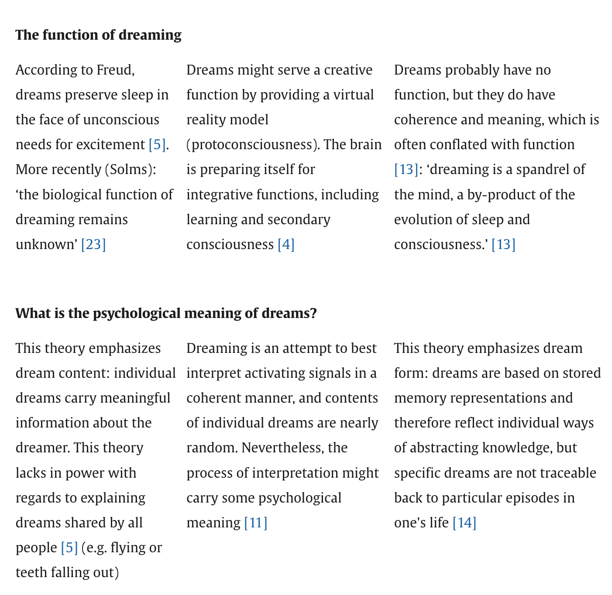
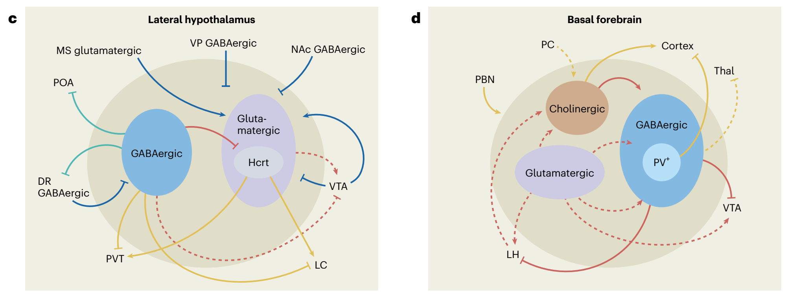
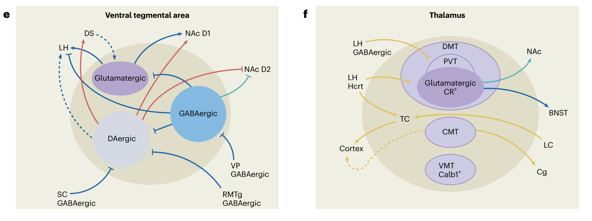
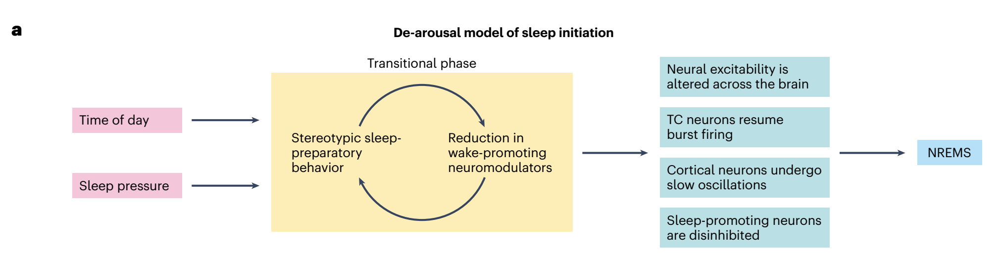
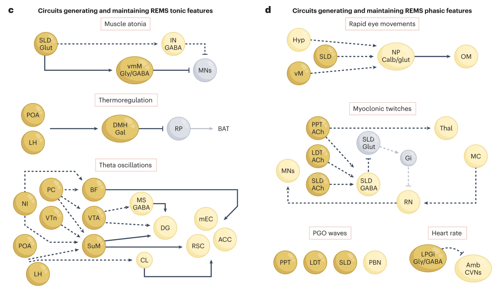

# Overview

## Prelude

::: {#fig-dreamweaver}
<iframe width="1200" height="450" src="https://www.youtube.com/embed/xZKuzwPOefs?si=hNEyFVfwrelgGOJC" title="YouTube video player" frameborder="0" allow="accelerometer; autoplay; clipboard-write; encrypted-media; gyroscope; picture-in-picture; web-share" referrerpolicy="strict-origin-when-cross-origin" allowfullscreen></iframe>

@Films2014-dm
:::

## Announcements

- *Due*: [Exercise EMO • Measuring emotion](../exercises/ex-EMO.qmd)
  - [Canvas dropbox](https://psu.instructure.com/courses/2441266/assignments/18005124)
- *Due*: [Final project proposal](../exercises/final-project.qmd)
  - [Canvas dropbox](https://psu.instructure.com/courses/2441266/assignments/18005251)
- *Assigned*: [Exercise ZZ • Sleep & Circadian Rhythms](../exercises/ex-ZZ.qmd)

## Today's topics

- Sleep facts
- Brain states during sleep
- Mechanisms of sleep
- Why sleep?

## Warm-up

---

### A key output target for signals from the amygdala is

- A. The enteric nervous system
- B. The endocrine system
- C. The hypothalamus
- D. The thalamus

---

### A key output target for signals from the amygdala is

- ~~A. The enteric nervous system~~
- ~~B. The endocrine system~~
- **C. The hypothalamus**
- ~~D. The thalamus~~

---

---

### Which of the following are *not* nodes in the forebrain portion of the emotion network?

- A. Anterior Cingulate Cortex (ACC)
- B. Hippocampus
- C. Periaqueductal Grey
- D. Orbitofrontal cortex

---

### Which of the following are *not* nodes in the forebrain portion of the emotion network?

- ~~A. Anterior Cingulate Cortex (ACC)~~
- ~~B. Hippocampus~~
- **C. Periaqueductal Grey** (PAG)
- ~~D. Orbitofrontal cortex~~ (OFC)

---

{width="60%"}

---

### Neurons in the _____ release _____ when there is a mismatch between predicted and actual reward.

- A. Ventral Tegmental Area (VA); dopamine (DA)
- B. Locus Coeruleus; norepinephrine (NE)
- C. Substantia Nigra (SN); dopamine
- D. Raphe Nuclei; Serotonin (5-HT)

---

### Neurons in the _____ release _____ when there is a mismatch between predicted and actual reward.

- **A. Ventral Tegmental Area (VA); dopamine (DA)**
- B. Locus Coeruleus; norepinephrine (NE)
- C. Substantia Nigra; dopamine
- D. Raphe Nuclei; Serotonin (5-HT)

---

![Allen Brain Institute: @UnknownUnknown-mk^["Neuromodulators (NMs) are neurotransmitters released by a small number of neurons (less than 0.001% of the neurons in our brain) with broad projections to most of the nervous system. They bind primarily to G-protein-coupled receptors on neurons and glia to activate intracellular signaling cascades and modulate the properties of membranes and synapses. The physiological processes triggered by NM release are often slow compared to fast synaptic transmission (hundreds of milliseconds or longer vs. less than ten milliseconds). These cells are largely conserved across vertebrates and have diverse functions in behavior, including modulating sleep-wake cycles, internal homeostasis, learning, arousal, and movement. Early theories that focused on specific behavioral conditions yielded to a more comprehensive view that NMs modulate all behavior, from gastric rhythms in invertebrates to mammalian cognition. We are studying five major NMs: four biogenic amines—norepinephrine (NE), serotonin (5-HT), dopamine (DA), and histamine (HA)—and acetylcholine (ACh). They are primarily released by neurons in the locus coeruleus (NE), raphe nuclei (5-HT), ventral tegmental area and substantia nigra pars compacta (DA), tuberomammillary nucleus (HA), and several cholinergic areas across the brain, including the nucleus basalis (ACh). Many disorders, including depression, schizophrenia, drug addiction, and Parkinson's disease, appear to involve dysfunction of NM signaling."]](https://cdn.prod.website-files.com/691fabdb8ba70248dd5b7fa8/691fabdb8ba70248dd5b8225_66fdeb61ad6f661a7dd7d654_66fc2762eed1ba43e23ab82d_66fc251ce5ca05a46dec6a90_nmCartoon.png)

# Sleep facts

## Recommendations by age

{#fig-cdc-sleep-recs width="50%"}

---

{#fig-cdc-trends width="75%"}

---

{#fig-cdc-sleep-by-county width="50%"}

## Health impacts

![@Shah2025-ol Figure 2^["Figure 2. Potential mechanisms influenced by sleep deprivation (CVD, Cardiovascular Disease; CHD, Coronary Heart Disease; HTH, Hypertension)."]](../include/img/shah-2025-fig-02.jpg)

## Evaluating self-report measures of sleep quality

>...objective measures of sleep quality, such as polysomnography, are not readily available to most clinicians in their daily routine, and are expensive, time-consuming, and impractical for epidemiological and research studies

-- @Fabbri2021-aj

---

>As the most frequently used subjective measurement of sleep quality, the PSQI^[Pittsburgh Sleep Quality Index @Buysse1989-hj] reported good internal reliability and validity; however, different factorial structures were found in a variety of samples, casting doubt on the usefulness of total score in detecting poor and good sleepers.

-- @Fabbri2021-aj

# Brain states during sleep

## Polysomnography

:::: {.columns}
::: {.column width=50%}
- Electroencephalography (EEG)
- Electrocardiography (ECG)
- Electrooculography (EOG)
- Electromyography (EMG)
- Pulse oxymetry & respiratory airflow
:::
::: {.column width=50%}
![@Wikipedia-contributors2025-fi^["By NascarEd - Own work, CC BY-SA 3.0, https://commons.wikimedia.org/w/index.php?curid=24506939"]](https://upload.wikimedia.org/wikipedia/commons/4/4d/Sleep_Stage_REM.png)
:::
::::

## EEG

:::: {.columns}
::: {.column width=50%}
- Post-synaptic electrical activity
- Mostly from cerebral cortex
:::
::: {.column width=50%}
![@Wikipedia-contributors2026-vk^[CC BY-SA 2.0, https://commons.wikimedia.org/w/index.php?curid=845554]](https://upload.wikimedia.org/wikipedia/commons/2/26/Spike-waves.png)
:::
::::

## What does EEG measure?

:::: {.columns}
::: {.column width=50%}
- Voltage *differences* between *source* and *reference* electrode
- Combined activity of huge # of neurons

:::
::: {.column width=50%}

:::
::::

## What does EEG measure?

:::: {.columns}
::: {.column width=50%}
- Current/voltage gradients between *apical* (near surface) dendrites and *basal* (deeper) dendrites and cell body/soma
:::
::: {.column width=50%}

:::
::::

## EEG frequency bands

:::: {.columns}
::: {.column width=50%}
- Fourier Analysis of time-varying EEG yields
- High amplitudes in specific frequency bands
:::
::: {.column width=50%}

:::
::::

## Aside about EEG spectra

:::: {.columns}
::: {.column width=50%}
- EEG contains periodic and aperiodic components [@Donoghue2020-dh]
- Comparisons of relative EEG power across frequency bands should consider aperiodic component
- See [Terms & Concepts](../resources/terms-concepts.qmd)
:::
::: {.column width=50%}
![@Donoghue2020-dh Figure 2^["Overview of band ratio measures and spectral parameters. A, An example power spectrum in which shaded regions reflect the θ band (4–8 Hz) and β band (20–30 Hz), respectively. Band ratio measures, such as the θ/β ratio, are calculated by dividing the average power between these two bands. B, An example of a parameterized power spectrum, in which aperiodic activity is separated from measured periodic components. This is an example spectrum from EEG data, in which peaks in θ, α, and β power are present. C, Examples of simulated power spectra with and without component oscillations of the θ/β ratio. Black lines indicate the simulated data, with red line reflecting the model fit, the dashed blue line indicating the aperiodic component of the model fit, and the green lines indicating the location of canonical θ and β oscillations. Band ratio measures, although intended to measure periodic activity, will reflect power at the predetermined frequencies regardless of whether there is evidence of periodic activity at those frequencies."]](https://www.eneuro.org/content/eneuro/7/6/ENEURO.0192-20.2020/F2.large.jpg?width=800&height=600&carousel=1)
:::
::::

## Sleep cycles

:::: {.columns}
::: {.column width=50%}
- Non-Rapid Eye Movement (NREM)
  - N1 (light sleep)
  - N2
  - N3 (slow-wave, deep sleep)
:::
::: {.column width=50%}
![@Wikipedia-contributors2025-as^["By RazerM at English Wikipedia, CC BY-SA 3.0, https://commons.wikimedia.org/w/index.php?curid=17745252"]](https://upload.wikimedia.org/wikipedia/commons/thumb/3/3e/Sleep_Hypnogram.svg/3840px-Sleep_Hypnogram.svg.png)
:::
::::

## Sleep cycles

:::: {.columns}
::: {.column width=50%}
- Rapid Eye Movements (REM)
  - More vivid dreaming
  - Muscle atonia (REM atonia)
- 4-6 cycles/night
  - Often shorter as night progresses
  - Less NREM, more REM
:::
::: {.column width=50%}
![@Wikipedia-contributors2025-as^["By RazerM at English Wikipedia, CC BY-SA 3.0, https://commons.wikimedia.org/w/index.php?curid=17745252"]](https://upload.wikimedia.org/wikipedia/commons/thumb/3/3e/Sleep_Hypnogram.svg/3840px-Sleep_Hypnogram.svg.png)
:::
::::

## EEG patterns

:::: {.columns}
::: {.column width=50%}
- NREM
  - Lower frequency, higher amplitude
- REM
  - Higher frequency, lower amplitude
  - More awake-like
:::
::: {.column width=50%}
![@Wikipedia-contributors2025-as^["By Andrii Cherninskyi - Own work, CC BY-SA 4.0, https://commons.wikimedia.org/w/index.php?curid=44033654"]](https://upload.wikimedia.org/wikipedia/commons/5/58/Normal_EEG_of_mouse.png)
:::
::::

---

![@Wikipedia-contributors2025-as^["By MrSandman at English Wikipedia - Transferred from en.wikipedia to Commons., Public Domain, https://commons.wikimedia.org/w/index.php?curid=453205"]](https://upload.wikimedia.org/wikipedia/commons/5/5e/Sleep_EEG_REM.png)

---

![@Rasch2013-yn Figure 1^["FIGURE 1. Typical human sleep profile and sleep-related signals. A: sleep is characterized by the cyclic occurrence of rapid-eye-movement (REM) sleep and non-REM sleep. Non-REM sleep includes slow-wave sleep (SWS) corresponding to N3, and lighter sleep stages N1 and N2 (591). According to an earlier classification system by Rechtschaffen and Kales (974), SWS was divided into stage 3 and stage 4 sleep. The first part of the night (early sleep) is dominated by SWS, whereas REM sleep prevails during the second half (late sleep). B: the most prominent electrical field potential oscillations during SWS are the neocortical slow oscillations (0.8 Hz), thalamocortical spindles (waxing and waning activity between 10 –15 Hz), and the hippocampal sharp wave-ripples (SW-R), i.e., fast depolarizing waves that are generated in CA3 and are superimposed by high-frequency (100 –300 Hz) ripple oscillation. REM sleep, in animals, is characterized by ponto-geniculooccipital (PGO) waves, which are associated with intense bursts of synchronized activity propagating from the pontine brain stem mainly to the lateral geniculate nucleus and visual cortex, and by hippocampal theta (4–8 Hz) activity. In humans, PGO and theta activity are less readily identified. C: sleep is accompanied by a dramatic change in activity levels of different neurotransmitters and neuromodulators. Compared with waking, cholinergic activity reaches a minimum during SWS, whereas levels during REM sleep are similar or even higher than those during waking. A similar pattern is observed for the stress hormone cortisol. Aminergic activity is high during waking, intermediate during SWS, and minimal during REM sleep. [Modified from Diekelmann and Born (293).]"]](../include/img/rasch-fig01-a.png)

---

## Mechanisms of REM atonia

:::: {.columns}
::: {.column width=50%}
- Spinal motor neurons hyperpolarize
- But not those controlling eye muscles!
- CN III, IV, VI control eye movements
:::
::: {.column width=50%}
![@Roguski2020-ee Figure 1^["Key brain regions and neurotransmitters involved in regulation and maintenance of the REM sleep stage under healthy normative or pathological RBD conditions. In RBD, dysfunction within the SubC → VMM → Spinal Motor Neuron pathway results in a lack of REM atonia (depicted with dotted line). BF, basal forebrain; LC, locus coeruleus; LDT/PPT, laterodorsal tegmentum/pedunculopontine tegmentum; LH, lateral hypothalamus; Subc/PC, subcoeruleus/pre-locus coeruleus; TMN, tuberomammillary nucleus; vlPAG, ventrolateral periaqueductal gray; VLPO/MnPO, ventrolateral preoptic nucleus/median preoptic nucleus; VMM, ventromedial medulla. Figure created using BioRender.com."]](https://images-provider.frontiersin.org/api/ipx/w=654&f=webp/https://www.frontiersin.org/files/Articles/526705/xml-images/fneur-11-00610-g0001.webp)
:::
::::

---

# Psychological states

## Perchance to dream

- Variations in consciousness during NREM and REM sleep
- Reduced voluntary control, self-awareness
- Enhanced emotionality
- Altered mnemonic processes [@Nir2010-xd]

---

:::: {.columns}
::: {.column width=50%}
![@Freud2001-fe^["Photographic portrait of Sigmund Freud, signed by the sitter ("Prof. Sigmund Freud"). By Max Halberstadt - https://www.christies.com/lotfinder/lot_details.aspx?intObjectID=6116407, Public Domain, https://commons.wikimedia.org/w/index.php?curid=64082854"]](https://upload.wikimedia.org/wikipedia/commons/thumb/3/36/Sigmund_Freud%2C_by_Max_Halberstadt_%28cropped%29.jpg/1280px-Sigmund_Freud%2C_by_Max_Halberstadt_%28cropped%29.jpg){width="60%"}
:::
::: {.column width=50%}
>Deeper research will one day trace the path further and discover an organic
basis for the mental event.

-- @Freud1900-ne
:::
::::

## {.scrollable}

## {.scrollable}

<!-- ## {.scrollable} -->

<!--  -->

## {.scrollable}

## {.scrollable}

# Mechanisms of sleep

## Two-process models

- Wakefulness promoting
- Sleep promoting

## Wakefulness promoting

![@Sulaman2023-jk Figure 1^["Fig. 1 | The orchestration of wakefulness. a, Wakefulness is generated through several concurrent processes. Left, wake systems stimulate cortical and thalamocortical circuits, suppressing low-frequency oscillations (hereafter depicted in yellow). Middle, the release of neuromodulators modulates excitability and information flow in distributed neural networks in support of waking-state processing and behaviors (hereafter depicted in red). Right, wake systems inhibit sleep-promoting neurons (hereafter depicted in green). b, Schematic of wake systems. Neuronal subpopulations distributed throughout the brain generate and maintain wakefulness. Output from the PBN, LC, TMN, LH and BF modulates thalamocortical and cortical circuits and promotes fast cortical oscillations conducive to waking-related processing. Neuromodulatory output from the LC, DR, VTA, PVN, BF, LH and TMN alters the excitability of neural networks spanning from the brainstem to the forebrain. Several wake systems, including those in the SC, LC, TMN, LH and NAc, can inhibit sleeppromoting neurons. Wakefulness may be initiated daily by indirect or direct circadian output from the SCN (purple) onto the PVN, LH, VTA and thalamus.Colors indicate participation in the processes shown in a. c–f, Inputs, outputs and local-network connectivity of four main wake systems. Complex interactions among multiple subpopulations within the LH, BF, VTA and Thal support wakefulness. Within each region, both excitatory and disinhibitory mechanisms fine-tune arousal regulation. c, GABAergic (blue), glutamatergic (purple) and peptidergic subpopulations within the LH generate and maintain wakefulness. Most excitatory and inhibitory inputs into the LH promote wakefulness. d, The BF is critical in opposing the default synchronized cortical state and in producing cortical arousal. Inputs from the PBN and outputs to the cortex are important for this function, whereas outputs to the VTA promote wakefulness. e, Dopaminergic, glutamatergic and GABAergic VTA neurons are involved in regulating wakefulness. Dopaminergic and glutamatergic VTA neurons are necessary for wake maintenance, even in the presence of highly salient stimuli. f, Several midline thalamic subpopulations are both necessary and sufficient for the generation of wakefulness and have been implicated in the initiation of wakefulness. Excitatory input from various wake-promoting neurons depolarizes TC neurons during wakefulness, resulting in the induction of fast cortical oscillations. Solid lines represent pathways whose functions have been experimentally interrogated. Dashed lines represent anatomical innervations that have not been functionally tested in the context of sleep–wake regulation. Blue lines represent inputs to wake systems that do not clearly fall into one of the functions described in a. 5-HT, serotonin; ACh, acetylcholine; BF, basal forebrain; BNST, bed nucleus of the stria terminalis; Calb1+ , calbindin-1-positive neurons; Cg, cingulate cortex; CMT, centromedial thalamus; CR+, calretinin-positive neurons; D1, dopamine type-D1 receptor; D2, dopamine type-D2 receptor; DA, dopamine; DMT, dorsomedial thalamus; DR, dorsal raphe; DS, dorsal striatum; GABA, gamma-aminobutyric acid; HA, histamine; Hcrt, hypocretin; LC, locus coeruleus; LH, lateral hypothalamus; MS, medial septum; NA, noradrenaline; NAc, nucleus accumbens; PBN, parabrachial nucleus; PC, peri-coeruleus; POA, preoptic area; PV+, parvalbumin-expressing neurons; PVN, hypothalamic paraventricular nucleus; PVT, paraventricular nucleus of the thalamus; RMTg, rostromedial tegmental nucleus; SC, superior colliculus; SCN, suprachiasmatic nucleus; TC, thalamocortical neurons; Thal, thalamus; TMN, tuberomammillary nucleus; VMT, ventromedial thalamus; VP, ventral pallidum; VTA, ventral tegmental area."]](../include/img/sulaman-fig01-1.png)

---

---

## Transition to sleep

![@Sulaman2023-jk Figure 2^["a, Proposed ‘de-arousal model of sleep initiation’. The transition from wakefulness to sleep is preceded by a transitional phase during which physiological and behavioral tranquilization enable a brain-wide shift in excitability, functional connectivity and information flow. Left, circadian and homeostatic drives promote a behavioral preparation for sleep. Middle, the manifestation of repetitive, pre-sleep behaviors, such as grooming and nest building, reduces vigilance toward the external environment and decreases the tone of wake-promoting neuromodulators. The decreased wake neuromodulatory tone further promotes the manifestation of pre-sleep behaviors. Right, low neuromodulatory tone also results in the release of TC neurons from their stimulation, the propagation of cortical slow oscillations and the disinhibition of sleep-promoting neurons, imposing sleep upon the organism. b, NREMS regulatory circuitry. POAGABA neurons have a central role in generating and maintaining NREMS. Additional NREMS-promoting populations have been identified in the medulla, midbrain, ZI, amygdala, striatum and cortex. NREMS is maintained by the continuous inhibition of wake systems. Thalamic, cortical and PZGABA neurons are implicated in driving characteristic NREMS oscillations. Blue, NREMS-promoting neurons. Gray, wake systems inhibited by NREMS-promoting neurons. Solid lines represent pathways whose functions have been experimentally interrogated. Dashed lines represent anatomical innervations that have not been functionally tested in the context of sleep–wake regulation. CeA, central nucleus of the amygdala; D2, dopamine type-D2 receptor; DMH, dorsomedial hypothalamus; DS, dorsal striatum; eGP, external globus pallidus; OT, olfactory tubercle; pIII, perioculomotor midbrain; PH, posterior hypothalamus; PZ, parafacial zone; SNr, substantia nigra pars reticulata; vlPAG, ventrolateral periaqueductal gray; vmM, ventromedial medulla; VP, ventral pallidum; ZI, zona incerta."]](../include/img/sulaman-fig02-1.png)

---

## Transition to REM

![@Sulaman2023-jk Figure 3^["a, Gatekeeping neurons in the vlPAG, dorsal DpMe, DR and LC prevent REMS initiation during wakefulness and NREMS by inhibiting REMS-generating populations. REMS is likely initiated by the simultaneous inhibition of gatekeepers and activation of pontine and hypothalamic structures, including the SLD, PPT/LDT, PC and LH. b, The main neuronal populations generating and maintaining REMS are located in the brainstem (pons and medulla), and additional REMS regulatory populations have been identified in the LH, ZI, POA and VTA. c, Tonic features of REMS are generated by different neuronal circuits. Muscle atonia during REMS is attained by SLDglut neuronal input to vmMGly/GABA neurons, which inhibit spinal cord motoneurons. The suspension of thermoregulation may be induced by inhibitory DMHGal projections to the raphe pallidus. Finally, several brain regions have been implicated in the generation of cortical and hippocampal theta oscillations during REMS, including the MS and BF/LPO. The SuM and CL are implicated in the activation of several limbic and cortical regions during REMS. d, Phasic features of REMS are thought to be orchestrated by PPT/LDT neurons through projections to the brainstem, thalamic and forebrain areas, as well as through propagating theta oscillations. Dorsal medulla NPCalb/glut neurons have been implicated in generating REMS rapid eye movements through projections to the oculomotor nucleus. Myoclonic twitching during REMS involves the activation of cholinergic PPT, LDT and SLD neurons, as well as of red nucleus neurons, generating brief episodes of atonia cessation in tandem with glutamate-mediated activation of spinal cord motoneurons. PGO waves are associated with neuronal activation in several neuronal populations in the pons. Phasic increases in heart rate during REMS may be promoted by the phasic inhibition of cardiac vagal neurons in the nucleus ambiguous by REMS-active LPGiGly/GABA neurons. ACC, anterior cingulate cortex; Amb, nucleus ambiguous; Amy, amygdala; BAT, brown adipose tissue; BLA, basolateral amygdala; CL, claustrum; CVNs, cardiac vagal neurons; DG, dentate gyrus; dmM, dorsomedial medulla; DpMe, deep mesencephalic nucleus; Gal, galanin; Gi, gigantocellular nuclei; Glut, glutamate; Gly, glycinergic neurons; Hyp, hypothalamus; IN, spinal cord interneurons; LDT, laterodorsal tegmental nuclei; LPGi, lateral paragigantocellular nuclei; MC, motor cortex; mEC, medial entorhinal cortex; MNs, spinal cord motoneurons; NI, nucleus incertus; NP, nucleus papilio; OM, oculomotor nucleus; PPT, pedunculopontine tegmental nucleus; RN, red nucleus; RSC, retrosplenial cortex; SLD, sublaterodorsal tegmental nucleus; SuM, supramammillary nucleus; vM, ventral medulla; VTn, ventral tegmental nucleus of Gudden."]](../include/img/sulaman-fig03-1.png)

---

## Hypocretins/Orexins

:::: {.columns}
::: {.column width=50%}
- Same substances, discovered independently
- Neuropeptides
- Released by lateral hypothalamus
- Widespread projections
:::
::: {.column width=50%}
![@Sakurai2007-li Figure 1^["This figure summarizes predicted orexinergic projections in the human brain. Please note that distributions of orexin fibres and receptors (OX1R, OX2R) are predicted from the results of studies on rodent brains, as it is on rodents that most histological studies on the orexin system have been carried out. Circles show regions with strong receptor expression and dense orexinergic projections. Orexin neurons originating in the lateral hypothalamic area (LHA) and posterior hypothalamus (PH) regulate sleep and wakefulness and the maintenance of arousal by sending excitatory projections to the entire CNS, excluding the cerebellum, with particularly dense projections to monoaminergic and cholinergic nuclei in the brain stem and hypothalamic regions24,25,26,27,28,29,30,31,32,38, including the locus coeruleus (LC, containing noradrenaline), tuberomammillary nucleus (TMN, containing histamine), raphe nuclei (Raphe, containing serotonin) and laterodorsal/pedunclopontine tegmental nuclei (LDT/PPT), containing acetylcholine). Orexin neurons also have links with the reward system through the ventral tegmental area (VTA, containing dopamine) and with the hypothalamic nuclei that stimulate feeding behaviour. Anatomical image adapted, with permission, from Ref. 108 © (1996) Appleton & Lange."]](https://media.springernature.com/full/springer-static/image/art%3A10.1038%2Fnrn2092/MediaObjects/41583_2007_Article_BFnrn2092_Fig1_HTML.jpg?as=webp)
:::
::::

## Hypocretins/Orexins

:::: {.columns}
::: {.column width=50%}
- Sleep and arousal, link to sleep disorders
- Feeding, water balance, gastrointestinal, & energy; neuroendocrine; cardiovascular, pain modulation [@Ebrahim2002-um]
:::
::: {.column width=50%}

:::
::::

## Hypocretins/Orexins

:::: {.columns}
::: {.column width=50%}
- Target for PTSD treatments? [@Flores2014-oc]
:::
::: {.column width=50%}

:::
::::

## Adenosine [@Wikipedia-contributors2026-ow]

:::: {.columns}
::: {.column width=50%}
- Neuromodulator
- Receptors in cerebral cortex, hippocampus, striatum, & cerebellum
- Modulates DA receptors in striatum
:::
::: {.column width=50%}

:::
::::

## Adenosine

:::: {.columns}
::: {.column width=50%}
- Circadian pattern ($\uparrow$: greater sleepiness) 
- Coffee and caffeine-containing beverages widely consumed
- Caffeine: adenosine antagonist
- See also @Hollingworth1912-vn
:::
::: {.column width=50%}

:::
::::

# Why sleep?

## Adaptive inactivity

:::: {.columns}
::: {.column width=50%}
- Carnivores sleep the most, herbivores the least
- Sleep ~ 1/body mass in *herbivores*
- Smaller animals $\rightarrow$ shorter cycles
:::
::: {.column width=50%}
![@Siegel2005-bf Figure 2^["a, Carnivores are shown in dark red; b, herbivores are in green and c, omnivores in grey. Sleep times in carnivores, omnivores and herbivores differ significantly (P<0.0002, F test, d.f. 2,68), with carnivore sleep amounts significantly greater than those of herbivores (P<0.001, t-test, d.f. 24, 22). Sleep amount is an inverse function of body mass over all terrestrial mammals (black line). This function accounts for approximately 25% of the interspecies variance (d) in reported sleep amounts (regression of log weight against sleep amount, R=−0.5, P<0.0001, n=71). Herbivores are responsible for this relation because body mass and sleep time were significantly and inversely correlated in herbivores (R=−0.77, P<0.001, d.f. 24), but were not in carnivores (R=−0.28, d.f. 24) or omnivores (R=−0.25, d.f. 25)."]](https://media.springernature.com/lw685/springer-static/image/art%3A10.1038%2Fnature04285/MediaObjects/41586_2005_Article_BFnature04285_Fig2_HTML.jpg?as=webp)
:::
::::

## {.scrollable}

:::: {.columns}
::: {.column width=50%}
- Some animal sleep one hemispheric at a time!
:::
::: {.column width=50%}
![@Siegel2005-bf Figure 3^["Top, photos of immature beluga, adult dolphin and section of adult dolphin brain. Electroencephalogram (EEG) of adult cetaceans, represented here by the beluga, during sleep are shown. All species of cetacean so far recorded have unihemispheric slow waves30,31,98,99,100. Top traces show left and right EEG activity. The spectral plots show 1–3-Hz power in the two hemispheres over a 12-hour period. The pattern in the cetaceans contrasts with the bilateral pattern of slow waves seen under normal conditions in all terrestrial mammals, represented here by the rat (bottom traces). The brain photograph is from the University of Wisconsin, Michigan State, and the National Museum of Health Comparative Mammalian Brain Collections."]](../include/img/siegel-fig03.png)
:::
::::

## @Siegel2005-bf

>Most theories suggest a role for non-rapid eye movement (NREM) sleep in energy conservation and in nervous system recuperation. Theories of REM sleep have suggested a role for this state in periodic brain activation during sleep, in localized recuperative processes and in emotional regulation. 

## @Siegel2005-bf

>Across mammals, the amount and nature of sleep are correlated with age, body size and ecological variables, such as whether the animals live in a terrestrial or an aquatic environment, their diet and the safety of their sleeping site. **Sleep may be an efficient time for the completion of a number of functions, but variations in sleep expression indicate that these functions may differ across species**.

## Memory consolidation

:::: {.columns}
::: {.column width=50%}
- Two-stage memory system [@Marr1971-be]
  - Encoding (hippocampus) $\rightarrow$ consolidation (cortex)
  - Avoids catastrophic interference
- Waking brain: Optimized for encoding
- Sleeping brain: Optimized for consolidation
- @Rasch2013-yn
:::
::: {.column width=50%}
![@Rasch2013-yn Figure 2^["FIGURE 2. Effects of sleep and wake intervals of different length
after learning on memory for senseless syllables. Sleep after learning leads to superior recall of syllables after the 1-, 2-, 4-, and 8-h retention interval, compared with wake intervals of the same length. Two subjects (H. and Mc.) participated in this classic study by Jenkins and Dallenbach (603). For each data point, each participant completed 6 –8 trials, with the different retention intervals performed in random order. The study took 2 mo during which the participants lived in the laboratory and were tested almost every day and night. Data are based on Table 3 in Reference 603, as the original figure contains an erroneous exchange of data points at the 4-h wake retention interval. Values are means  SE. \*\*P 0.01;
\*\*\* P 0.001."]](../include/img/rascsh-fig02.png)
:::
::::

---

![@Rasch2013-yn Figure 2^["FIGURE 3. A model of active system consolidation during sleep. A: during SWS, memories newly encoded into a temporary store (i.e., the hippocampus in the declarative memory system) are repeatedly reactivated, which drives their gradual redistribution to the long-term store (i.e., the neocortex). B: system consolidation during SWS relies on a dialogue between neocortex and hippocampus under top-down control by the neocortical slow oscillations (red). The depolarizing up phases of the slow oscillations drive the repeated reactivation of hippocampal memory representations together with sharp wave-ripples (green) and thalamo-cortical spindles (blue). This synchronous drive allows for the formation of spindle-ripple events where sharp wave-ripples and associated reactivated memory information becomes nested into succeeding troughs of a spindle (shown at larger scale). In the black-and-white version of the figure, red, green, and blue correspond to dark, middle, and light gray, respectively. [Modified from Born and Wilhelm (125).]"]](../include/img/rasch-fig03.png)

## {.scrollable}

>Whereas initially it was commonly assumed that sleep improves memory in a passive manner, by protecting it from being overwritten by interfering external stimulus inputs, the **current theorizing assumes an active consolidation of memories** that is specifically established during sleep, and basically **originates from
the reactivation of newly encoded memory representations**.

-- @Rasch2013-yn

## Glymphatic clearance

:::: {.columns}
::: {.column width=50%}
- Brain lacks lymphatic vessels
  - Lymphatic system in rest of body clears waste products
- Brain has *glymphatic* system
  - CSF flow clears metabolic refuse [@Iliff2012-rj]
  - Especially during sleep [@Xie2013-bm]
:::
::: {.column width=50%}

:::
::::
  
## Mechanism

:::: {.columns}
::: {.column width=50%}
- Slow (0.02 Hz) Norepinephrine (NE) release from locus coeruleus during NREM
- Induces rhythmic blood vessel contractions
- Common sleep aid (Ambien/Zolpidem^[A GABA_A agonist.]) suppresses glymphatic clearance
:::
::: {.column width=50%}

:::
::::

## Is sleep essential? [@Rasch2013-yn]

::: {.fragment}
>The fact that almost all animals sleep strongly argues in favor of an adaptive role of sleep in increasing the overall fitness of an organism.

:::

## Is sleep essential?

>...Sleep has been proposed as serving an energy-saving function (82, 1311), the restoration of energy resources and the repairing of cell tissue (875), thermoregulation (973), metabolic regulation (651, 1229), and adaptive immune functions (695). **However, these functions could be likewise achieved in a state of quiet wakefulness and would not explain the loss of consciousness and responsiveness to external threats during sleep**.

-- @Rasch2013-yn

## Is sleep essential?

>These prominent features of sleep strongly speak for the notion that sleep is mainly “for the brain” (553, 625).

-- @Rasch2013-yn

# On Circadian Rhythms

---

![@Wikipedia-contributors2026-zp^["By NoNameGYassineMrabetTalk✉ fixed by Addicted04 - The work was done with Inkscape by YassineMrabet. Informations were provided from "The Body Clock Guide to Better Health" by Michael Smolensky and Lynne Lamberg; Henry Holt and Company, Publishers (2000). Landscape was sampled from Open Clip Art Library (Ryan, Public domain). Vitruvian Man and the clock were sampled from Image:P human body.svg (GNU licence) and Image:Nuvola apps clock.png, respectively., CC BY-SA 3.0, https://commons.wikimedia.org/w/index.php?curid=3017148"]](https://upload.wikimedia.org/wikipedia/commons/thumb/3/30/Biological_clock_human.svg/3840px-Biological_clock_human.svg.png)

## {.scrollable}

::: {#fig-suprachiasmatic-nucleus-song}
<iframe width="1200" height="450" src="https://www.youtube.com/embed/fgJPnQCJ9eE?si=mpEssYkYgsj2MQ9t" title="YouTube video player" frameborder="0" allow="accelerometer; autoplay; clipboard-write; encrypted-media; gyroscope; picture-in-picture; web-share" referrerpolicy="strict-origin-when-cross-origin" allowfullscreen></iframe>

@McGee2011-ew
:::

## Mechanisms

:::: {.columns}
::: {.column width=50%}
- Retinohypothalamic tract projection to
  - Suprachiasmatic Nucleus of the Hypothalamus
  - SCN has endogenously cycling cells
  - Light input synchronizes rhythms to day/night cycle
:::
::: {.column width=50%}
![@Wikipedia-contributors2026-zz^["Illustration of the human brain showing the Cerebral Cortex, the Suprachiasmatic Nucleus, the Optic Chiasm, the Hypothalamus and the Pineal Gland. By 黄雨伞 - Own work, CC BY-SA 3.0, https://commons.wikimedia.org/w/index.php?curid=30518604"]](https://upload.wikimedia.org/wikipedia/commons/8/80/Suprachiasmatic_Nucleus.jpg)
:::
::::

## Melatonin

:::: {.columns}
::: {.column width=50%}
- Hormone/neurotransmitter
- Released by Pineal Gland
- ANS controls release
:::
::: {.column width=50%}
![@Wikipedia-contributors2026-pj^["By Images are generated by Life Science Databases(LSDB). - from Anatomography, website maintained by Life Science Databases(LSDB).You can get this image through URL below. 次のアドレスからこのファイルで使用している画像を取得できますURL., CC BY-SA 2.1 jp, https://commons.wikimedia.org/w/index.php?curid=7855292"]](https://upload.wikimedia.org/wikipedia/commons/a/ab/Pineal_gland.png)
:::
::::

## Melatonin receptors

![@Gobbi2019-hf Figure 1^["Brain areas involved in the regulation of sleep and wakefulness with their respective receptors, including MT1 and MT2 receptors Modified with permission from Atkin et al. (2). Top left, green: During NREM, the serotonin neurons of the Dorsal Raphe (DR), the dopaminergic neurons of the Ventral tegmental area (VTA), and the noradrenergic neurons of the Locus Coeruleus (LC) decrease their firing activity. These neurons are silent during REM. OX1 and OX2-containing orexinergic neurons of the Lateral Hypothalamus (LH) decrease their firing activity during NREM and REM. The histaminergic H1-containing neurons of the Tuberomammillary Nucleus (TMN) decrease their firing activity during sleep. During wakefulness, neurons of the arousal system (i.e., monoaminergic neurons, orexinergic neurons) send widespread ascending projections to the cerebral cortex, stimulating cortical desynchronization with high frequency gamma and low frequency theta rhythmic activity. Bottom left, black: MT1 and MT2 receptors expressed in suprachiasmatic neurons, which receive inputs directly from the retinohypothalamic tract (RHT), influenced by light and external stimuli may be likely involved in the switch from wakefulness to NREM sleep. The transition from NREM and REM is controlled by the ventrolateral periaqueductal gray area (vlPAG), containing GABA, glutamate receptors, but also melatonin MT2 receptors. Top right, red: During NREM sleep, two nuclei are particularly active: the reticular thalamus (RT), containing melatonin MT2 and GABA receptors, which is responsible for thalamocortical input to the prefrontal cortex (showing synchronized activity during NREM); and the ventrolateral preoptic area (vlPAG), containing GABA and galanin receptors. They inhibit noradrenergic, serotonergic, cholinergic, histaminergic, and hypocretinergic neurons. These nuclei play a role in the “reciprocal inhibitory” model of the sleep–wake switch. Bottom right, blue: The vlPAG is a putative “REM ON” nucleus, switching the brain to the REM sleep mode. During REM, the sublateral nucleus (SLD), the basal forebrain (BF), and the lateral tegmentum/ pedunculopontine tegmentum (LDT/PPT, rich in acetylcholine receptors) and the ventromedial medulla (VM) neurons are particularly active. The BF is active in REM and wakefulness and inhibited during NREM."]](https://images-provider.frontiersin.org/api/ipx/w=654&f=webp/https://www.frontiersin.org/files/Articles/437162/xml-images/fendo-10-00087-g0001.webp)

# Wrap-up

## Main points

- Sleep is vital for health
- Many Americans don't get enough
- Sleep has phases with distinct physiological profiles:
  - EEG
  - Movement
  - Neurotransmitters active
  
## Main points

- Sleep engages a network of brain regions
  - Lateral Hypothalamus
  - Brainstem
  - Basal Forebrain
  - Thalamus
  
## Main points

- Sleep engages a network of brain regions
  - Tegmentum
  - Cerebral cortex
  - Hippocampus

## Main points

- Separate, interacting, mutually inhibiting processes seem to govern wakefulness and sleep
- Sleep has multiple functions
  - Rest/inactivity
  - Memory consolidation
  - Glymphatic clearance
  - Brain development

## Main points

- Circadian rhythms governed by
  - Retinal input to SCN
  - Intrinsic oscillators
  - Phasic hormone release (especially melatonin & cortisol)

## Next time

- Spring Break!
- Thursday, March 18: Evolution & development

# Resources

## About

This talk was produced using [Quarto](https://quarto.org), using the [RStudio](https://posit.co/products/open-source/rstudio/)
Integrated Development Environment (IDE), version 2026.1.1.403.

The source files are in R and R Markdown, then rendered to HTML using the
[revealJS](https://revealjs.com) framework.
The HTML slides are hosted in a [GitHub repo](https://github.com/psu-psychology/psy-511-scan-fdns-2026-spring) and served by GitHub pages:
<https://psu-psychology.github.io/psy-511-scan-fdns-2026-spring/>

## References