# Overview

## Prelude

::: {#fig-evo-devo-song}
<iframe width="1280" height="450" src="https://www.youtube.com/embed/ydqReeTV_vk?si=Vmgw5-CLRZIeC2UQ" title="YouTube video player" frameborder="0" allow="accelerometer; autoplay; clipboard-write; encrypted-media; gyroscope; picture-in-picture; web-share" referrerpolicy="strict-origin-when-cross-origin" allowfullscreen></iframe>

@Acapellascience2017-yt
:::

## Announcements

## Today's topics

- Public acceptance of evolution
- Evolution of nervous systems
- Development of the human brain

## Warm-up

# Public acceptance of evolution

---

{.lightbox}

## More recent data

:::: {.columns}
::: {.column width=50%}
- In U.S., majority now "accept"
- Increase over last decade
- @Miller2021-lb
:::
::: {.column width=50%}
![@Miller2021-lb Figure 1^["Figure 1. Public acceptance and rejection of evolution in the United States, 1985–2020. The following question was used in all of the years in this analysis: "For each statement below, please indicate if you think that it is definitely true, probably true, probably false, or definitely false. If you don’t know or aren’t sure, please check the 'not sure' box. 'Human beings, as we know them today, developed from earlier species of animals.' The number of respondents in each year and the confidence intervals are provided in the Supplemental Material in SI Table 1."]](../include/img/miller-2026-fig1.jpg)

:::
::::

## Types of evidence

- Fossil
    + Fossil dating
- Geological
    + Where fossils are found relative to one another
    + How long it takes to form layers
    
## Types of evidence

- Genetic
    + Rates of mutation
- Anatomical
    + Homologous structures across existing species
    
## Explanatory power

>Nothing in Biology Makes Sense except in the Light of Evolution

>Seen in the light of evolution, biology is, perhaps, intellectually the most satisfying and inspiring science. Without that light, it becomes a pile of sundry facts some of them interesting or curious, but making no meaningful picture as a whole.

-- @Dobzhansky1973

## Why Gilmore thinks the theory so controversial (in the U.S.)

- Contradicts verbatim/non-metaphorical reading of some religious texts
- Makes humans seem less special
- Time scales involved beyond human experience
- Scientific method vs. other ways of knowing
- Found in nature ≠ good for human society

## Why Gilmore thinks the theory so controversial (in the U.S.)
- Few negative consequences of 'disbelief'
- U.S. culture individualistic, skeptical, anti-elitist, anti-intellectual
- Lower levels of religious belief among [U.S. scientists](http://news.rice.edu/2015/12/03/first-worldwide-survey-of-religion-and-science-no-not-all-scientists-are-atheists/)
- [Politics](http://www.people-press.org/2009/07/09/section-4-scientists-politics-and-religion/)
- A minority of citizens support teaching [evolution-only](http://www.pbs.org/wgbh/nova/blogs/education/2015/12/evolutionschools/) 
- Majority of classroom teachers aren't [strong advocates](https://www.sciencedaily.com/releases/2011/01/110127141657.htm)

---

>A structural equation model indicates that increasing enrollment in baccalaureate-level programs, exposure to college-level science courses, a declining level of religious fundamentalism, and a rising level of civic scientific literacy are responsible for the increased level of public acceptance.

-- @Miller2021-lb

# Evolution and development

## Ontogenesis and phylogenesis

- *Ontogenesis*
    + Development within lifetimes, history of individuals
- *Phylogenesis*
    + Change across lifetimes, history of species

## Does ontogeny recapitulate phyologeny?

:::: {.columns}
::: {.column width=50%}
- @Haeckel2001-vg
- Is evolution cumulative?
:::
::: {.column width=50%}
![@Haeckel2001-vg^["1874 illustration from Anthropogenie showing "very early", "somewhat later" and "still later" stages of embryos of fish (F), salamander (A), turtle (T), chick (H), pig (S), cow (R), rabbit (K), and human (M). By Lithograph by J. G. Bach of Leipzig after drawings by Haeckel, from Anthropogenie published by Engelmann - Nick Hopwood. "Pictures of Evolution and Charges of Fraud:: Ernst Haeckel's Embryological Illustrations", Isis 97 (2006), 260-301 pdf, Public Domain, https://commons.wikimedia.org/w/index.php?curid=8007834"]](https://upload.wikimedia.org/wikipedia/commons/7/7d/Haeckel_Anthropogenie_1874.jpg){#fig-haeckel-drawings}
:::
::::

## Complex multicellular life emerged "recently"

## {.scrollable}

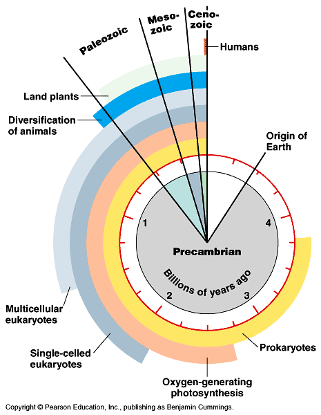{#fig-evo-clock fig-align="center"}

## {.scrollable}

{#fig-britannica-evolution width="50%"}

## Nervous system architectures

:::: {.columns}
::: {.column width=50%}
- Body symmetry
  + radial
  + bilateral

:::
::: {.column width=50%}

::: {#fig-nerve-net-video}
<iframe width="560" height="315" src="https://www.youtube.com/embed/-UI531GMRTM?si=K7s4uS3iiIVWticm" title="YouTube video player" frameborder="0" allow="accelerometer; autoplay; clipboard-write; encrypted-media; gyroscope; picture-in-picture; web-share" referrerpolicy="strict-origin-when-cross-origin" allowfullscreen></iframe>

@Park2009-ic
:::
:::
::::

## Nervous system architectures

- Segmentation
- Cephalization (concentration of sensory & neural structures in anterior portion of body)
- Encasement in bone (vertebrates)
- Centralized vs. distributed function

<!-- --- -->

<!-- **Cephalopods have "intelligent arms"** -->

<!-- <iframe width="700" height="400" src="http://www.sciencedirect.com/science/article/pii/S0022098113000683" frameborder="0" allowfullscreen></iframe> -->

## Biological computation

:::: {.columns}
::: {.column width=50%}
- Ingestion
- Defense
- Reproduction
:::
::: {.column width=50%}
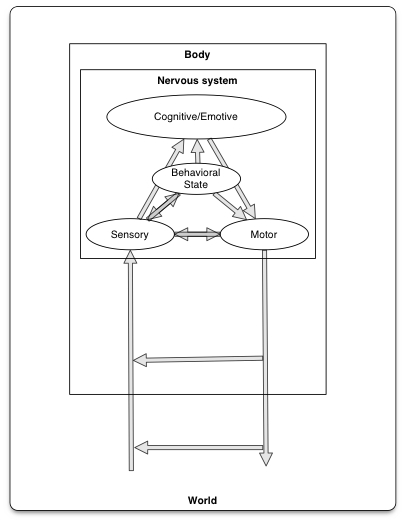{width="60%" #fig-swanson-2012-fig7-5}
:::
::::

## Information processing universals

- Sense/detect via sensors
  - Specialize by information source/type
  - Specialize by target location
    + Interoceptive
    + Exteroceptive
    
## Information processing universals

- Analyze, evaluate, decide
  - Current state
      + World
      + Organism
  - Current goals
  - Past state(s)

## Information processing universals

- Act
    + Move body
      - Approach/avoid
      - Manipulate
      - Ingest
      - Signal
    - Change physiological state

## Evolution of architectures {.scrollable}

:::: {.columns}
::: {.column width=50%}
- Neurons and nervous systems 520-570 M years old
:::
::: {.column width=50%}
![@arendt_nerve_2016 Figure 1^["Animal phylogeny. A simplified animal phylogenetic tree (showing the evolutionary history of animals), in which lines represent evolutionary diversification. The lengths of the lines are arbitrary, as they do not indicate evolutionary distance. For a brief characterization of the Anthozoa, Bilateria, Ceriantharia, Cnidaria, Ctenophora, Medusozoa and Neuralia, see the glossary. The phylogenetic position of the Ctenophora is not settled, as indicated by a question mark. The Ctenophora image is adapted with permission from Ref. 43, Wiley. The Porifera and Placozoa images are reprinted with permission from Ref. 139 (Nielsen, C. Animal Evolution: Interrelationships of the Living Phyla p31 and p39 (2012)) by the permission of Oxford University Press. The Annelida image is adapted with permission from Ref. 140, Schweizerbart Science Publishers (www.schweizerbart.de)."]](../include/img/nrn.2015.15-f1.jpg){#fig-arendt-2016-fig01}
:::
::::

## {.scrollable}

:::: {.columns}
::: {.column width=50%}
- Diverse nervous systems show developmental similarities at molecular level
:::
::: {.column width=50%}
![@arendt_nerve_2016 Figure 2^["Comparison of neurodevelopment in the frog, annelid and sea anemone. The frog Xenopus laevis (part a), the annelid Platynereis dumerilii (part b) and the cnidarian Nematostella vectensis (part c) are depicted in their gastrula-like stages (gastrula, trochophora and planula, respectively; upper panels), intermediate developmental (neurula, metatrochophora and late planula, respectively; middle panels) and juvenile stages (tadpole, nectochaete and polyp, respectively; lower panels). Colours demarcate developmental neurogenic regions, and double-headed arrows show the apical (AP)–blastoporal (BL) axis. All views in parts a–c are lateral. At gastrula stages (upper panels), blastoporal ectodermal tissue (around the closing blastopore; red) and apical pole ectodermal tissue (violet) can be distinguished. At subsequent stages, a large part of the ectoderm — incluing the former apical and blastoporal regions — gives rise to neurogenic tissue. The neurogenic tissue comprises regions of distinct molecular identity (indicated by different colours), which will give rise to different parts of the nervous system. In the frog (part a), the neural plate (violet, red and yellow) comprises future forebrain tissue, as well as medial and lateral neural tube tissue; it is laterally bounded by developing peripheral nervous system components (blue). Similar regions are apparent in the annelid (part b), and these give rise to the brain, medial and lateral nerve cord and peripheral nervous system. As reasoned in this article, these regions also exist in the cnidarian (part c). In the frog and annelid worm, these regions are further subdivided into specific subregions by the activity of molecular organizing signals"]](../include/img/nrn.2015.15-f2.jpg){#fig-arendt-2016-fig02}
:::
::::

## Vertebrate CNS organization {.scrollable}

:::: {.columns}
::: {.column width=50%}
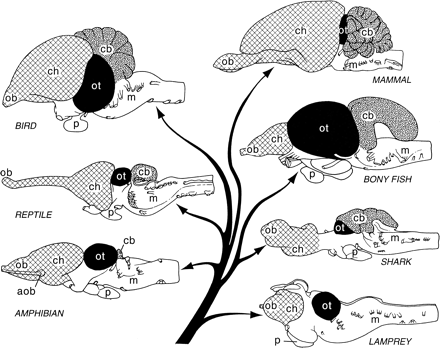{.lightbox}
:::
::: {.column width=50%}
{.lightbox}

:::
::::

## Brain/Body Sizes {.scrollable}

:::: {.columns}
::: {.column width=50%}
{.lightbox}
:::
::: {.column width=50%}
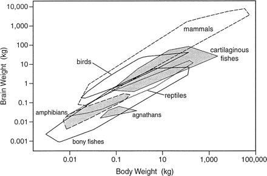{.lightbox}
:::
::::

## Cerebral cortex a target of selection

![@hofman_evolution_2014 Figure 1^["Lateral views of the brains of some mammals to show the evolutionary development of the neocortex (gray). In the hedgehog almost the entire neocortex is occupied by sensory and motor areas. In the prosimian Galago the sensory cortical areas are separated by an area occupied by association cortex (AS). A second area of association cortex is found in front of the motor cortex. In man these anterior and posterior association areas are strongly developed. A, primary auditory cortex; AS, association cortex; Ent, entorhinal cortex; I, insula; M, primary motor cortex; PF, prefrontal cortex; PM, premotor cortex; S, primary somatosensory cortex; V, primary visual cortex. Modified with permission from Nieuwenhuys (1994)."]](http://www.frontiersin.org/files/Articles/78485/fnana-08-00015-HTML/image_m/fnana-08-00015-g001.jpg){#fig-hofman-fig01 width="40%"}

---

| Structural measure | Non-human comparison | Human |
|--------------------|----------------------|-------|
| Cortical gray matter %/tot brain vol | insectivores 25% | 50% |
| Cortical gray + white | mice 40% | 80% |
| Cerebellar mass | primates, mammals 10-15% | 10-15% |

- Evidence for greater gray and white matter (relative to total brain volume) in human cerebral cortex

---

:::: {.columns}
::: {.column width=50%}
{#fig-rakic-fig01 .lightbox}
:::
::: {.column width=50%}
{#fig-hovman-fig02 .lightbox}
:::
::::

## Take homes

- (log) Brain sizes scale with (log) body size
- Brain sizes (more or less) scale with animal class

## Old story

:::: {.columns}
::: {.column width=50%}
- Within mammals, human brains bigger than expected
    - Higher *encephalization quotient* -- deviation from species-typical norm
- Humans have larger cerebral cortical gray + white matter than comparable mammals
:::
::: {.column width=50%}
{#fig-northcutt-fig02}
:::
::::

## New story

- Does brain *size/mass* matter (that much)?
- "Size matters" (brain mass) presumes similarity among brains at micro-level
- Big (large mass) brains arise in multiple mammalian lineages
- Body sizes tend to increase over evolutionary time

## @Venditti2024-ul

>Despite decades of comparative studies, puzzling aspects of the relationship between mammalian brain and body mass continue to defy satisfactory explanation. Here we show that several such aspects arise from routinely fitting log-linear models to the data: the correlated evolution of brain and body mass is in fact *log-curvilinear* [emphasis added]. 

## @Venditti2024-ul

>...we document dramatically varying rates of relative brain mass evolution across the mammalian phylogeny, and we resolve the question of whether there is an overall trend for brain mass to increase through time. 

-- @Venditti2024-ul

## {.scrollable}

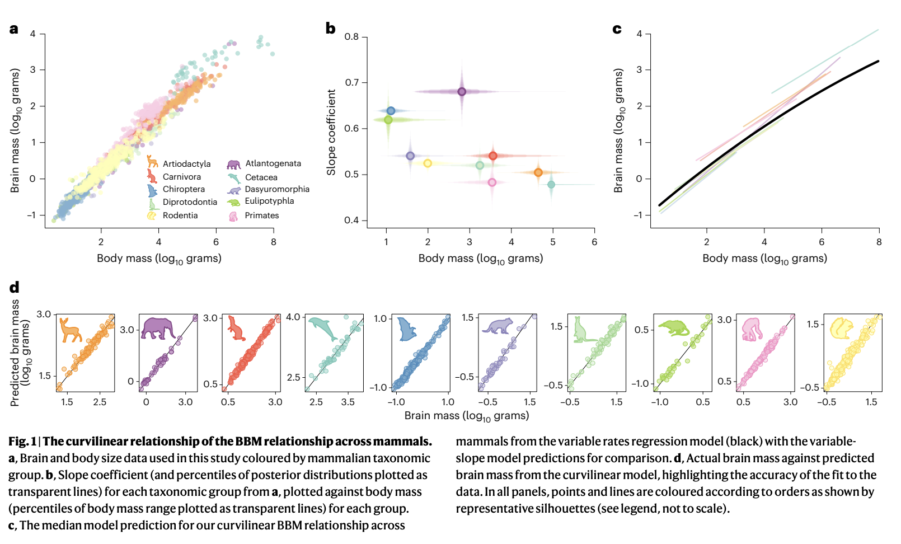{#fig-venditti-fig01}

## @Venditti2024-ul

>We find a trend in only three mammalian orders, which is by far the strongest in primates, setting the stage for the uniquely rapid directional increase ultimately producing the computational powers of the human brain.

## {.scrollable}

:::: {.columns}
::: {.column width=50%}
- *# of cortical neurons* possibly more important difference than brain mass
- The primate advantage
  - more cortical neurons
    - but not larger neurons
    - not more neurons in cerebellum
- Human brain just scaled up (non-ape) primate brain
:::
::: {.column width=50%}

:::
::::

## {.scrollable}

![@Herculano-Houzel2012-up Figure 1^["Large brains appear several times in the mammalian radiation. Example species are illustrated for each major mammalian group. The mammalian radiation is based on the findings of Murphy et al. (18) and Kaas (19). Brain images are from the University of Wisconsin and Michigan State Comparative Mammalian Brain Collections (www.brainmuseum.org)."]](../include/img/herculano-houtzel-2012-fig-01.webp)

## {.scrollable}

![@Herculano-Houzel2012-up Figure 3^["Shared nonneuronal scaling rules and structure- and order-specific neuronal scaling rules for mammalian brains. Each point represents the average values for one species (insectivores, blue; rodents, green; primates, red; Scandentia, orange). Arrows point to human data points, circles represent the cerebral cortex, squares represent the cerebellum, and triangles represent the rest of the brain (excluding the olfactory bulb). (A) Clade- and structure-specific scaling of brain structure mass as a function of numbers of neurons. Allometric exponents: cerebral cortex: 1.699 (Glires), 1.598 (insectivores), 1.087 or linear (primates); cerebellum: 1.305 (Glires), 1.028 or linear (insectivores), 0.976 or linear (primates); rest of the brain: 1.568 (Glires), 1.297 (insectivores), 1.198 (or 1.4 when corrected for phylogenetic relatedness in the dataset, primates). (B) Neuronal cell densities scale differently across structures and orders but are always larger in primates than in Glires. Allometric exponents: cerebral cortex: −0.424 (Glires), −0.569 (insectivores), −0.168 (primates); cerebellum: −0.271 (Glires), not significant (insectivores and primates); rest of the brain: −0.467 (Glires), not significant (insectivores), −0.220 (primates). (C) Mass of the cerebral cortex, cerebellum, and rest of the brain varies as a similar function of their respective numbers of nonneuronal cells. Allometric exponents: cerebral cortex: 1.132 (Glires), 1.143 (insectivores), 1.036 (primates); cerebellum: 1.002 (Glires), 1.094 (insectivores), 0.873 (primates); rest of the brain: 1.073 (Glires), 0.926 (insectivores), 1.065 (primates). (D) Average density of nonneuronal cells in each structure does not vary systematically with structure mass across species. Power functions are not plotted so as not to obscure the data points. Allometric exponents are from a study by Herculano-Houzel (20); data are from studies by Herculano-Houzel and her colleagues (22–27)."]](../include/img/herculano-houtzel-2012-fig-03.webp){#fig-herculano-fig03}

## {.scrollable}

:::: {.columns}
::: {.column width=50%}
- Primate body sizes grew relatively less than brain sizes
:::
::: {.column width=50%}
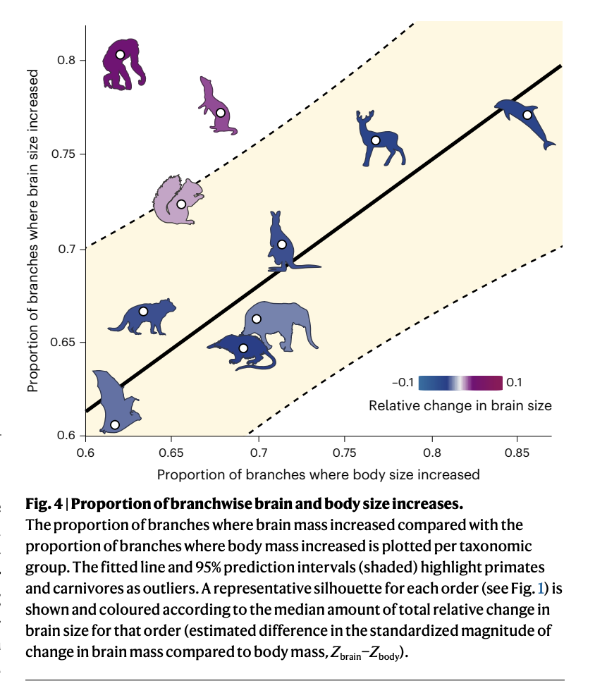

:::
::::

## Does neuron # predict cognition?

{#fig-herculano-fig03}

## Selection pressures

- Brain
    - More neurons in cerebral cortex than other mammals
- Behavior
    - Less time spent foraging
        + Higher quality/more energetically dense food
        + Higher food availability
        - Diet diversity
        
## Selection pressures

- Cultural factors
  - Social brain
  - Cooking then later, agriculture, see also [@Wrangham2009-vq]

## A further human advantage

{fig-align="center"}

## What cortical areas were selected?

>Although intense research effort is seeking to address which brain areas fire and connect to each other to produce complex behaviors in a few living primates, little is known about their evolution, and which brain areas or facets of cognition were favored by natural selection.  

-- @Melchionna2025-cg

## {.scrollable}

![@Melchionna2025-cg Figure 1^["Fig. 1: Relative warp analysis (RWA) plot showing the distribution of mammalian endocast diversity...The two meshes to the right (in latero-frontal view) show the relative importance of each landmark (their loadings) on the extreme values of first and on the second Relative Warp (RW) axes, respectively."]](../include/img/melchionna-2025-fig01.png)

## {.scrollable}

![@Melchionna2025-cg Figure 2^["a Evolutionary rate values related to the node correspond to the positive and significant shift. b The phylogenetic tree of mammals. The light blue circle indicates the positive shift in Catarrhine. The light red circles indicate the negative shift pertaining to Ferungulata and Marsupialia. The circle size is proportional to the intensity of rate change. c The phylogenetic tree of the Primates (extracted from the tree in b) shows the location of principal primate clades and representative shapes of their respective endocasts. The color gradient represents the map of the evolutionary changes in shape of the endocast from the mammal tree root, in terms of cortical area expansion (blue) and contraction (red). Multivariate rates of brain evolution of individual species are indicated by the colored dots next to the tree tips in both b and c. Brain endocasts of the different species are not to scale. Silhouettes for Homo, Carlito, Lemur, Bradypus, Macropus, Canis, Panthera, and Capreolus are free for reuse under CC0 1.0 Universal Public Domain Dedication license (https://creativecommons.org/publicdomain/zero/1.0/). Silhouettes for Cebus (credits to Sarah Werning) and Ceratotherium (credits to Jan A. Venter, Herbert H. T. Prins, David A. Balfour and Rob Slotow) are free for reuse under the Attribution 3.0 Unported license (https://creativecommons.org/licenses/by/3.0/). Silhouette for Macaca is free for reuse under the Public Domain Mark 1.0 license (https://creativecommons.org/publicdomain/mark/1.0/)."]](../include/img/melchionna-2025-fig02.png)

## {.scrollable}

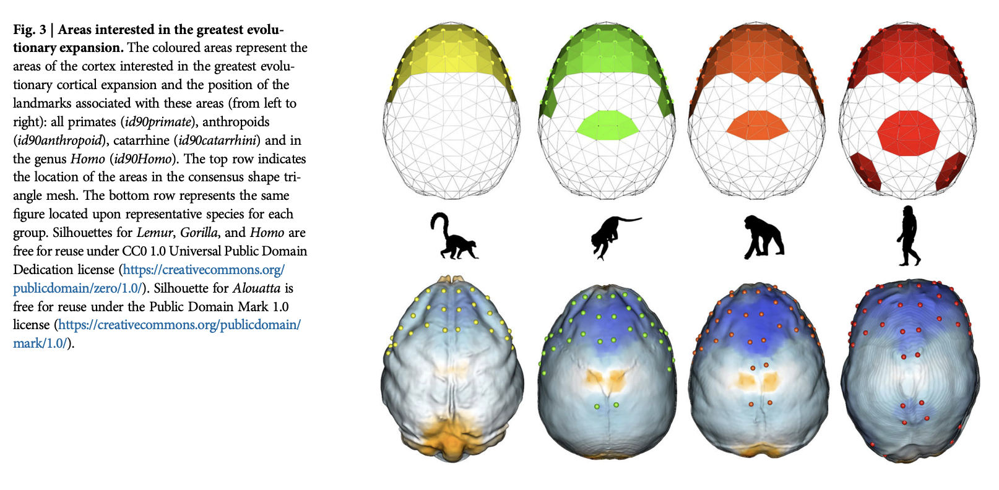

## {.scrollable}

>By developing statistical tools to study the evolution of the brain cortex at the fine scale, we found that rapid cortical expansion in the prefrontal region took place early on during the evolution of primates. In anthropoids, fast-expanding cortical areas extended to the posterior parietal cortex. In Homo, further expansion affected the medial temporal lobe and the posteroinferior region of the parietal lobe.

-- @Melchionna2025-cg

# Development of the human brain

## Timeline {.scrollable}

![@Silbereis2016-la Figure 1^["Timeline of Key Human Neurodevelopmental Processes and Functional Milestones."]. ](https://ars.els-cdn.com/content/image/1-s2.0-S0896627315010806-gr1_lrg.jpg){.lightbox width=75% fig-align="center" #fig-silbereis-2016-fig-01}

## {.scrollable}

- CNS among earliest-developing, last to finish organ systems
    - Prolonged developmental period...makes CNS vulnerable
    - CNS especially *open* to external influences
    
## By the numbers

- ~ 86 billion neurons in adult CNS
  - similar # of glia
  - about 16 (14-32) billion neurons, 80/20% Glu/GABA
- 7-80K synapses/cortical neuron
  - 164 trillion synapses in cerebral cortex, [@DeFelipe2002-xz]
  - $10^{15}$ (quadrillion) synapses in CNS
  
## By the numbers

- 145-175 km (90-109 mi) of myelinated axons, [@Marner2003-qu]
- brain ~ 2.5% of body mass, but consumes 18% of $O_2$ at rest, [@Kety1948-ty], and has been estimated to consume about 20 W.
  - millions of neurons generated per hour
   
# Summaries by phase
    
## Prenatal period

- ~38 weeks from conception/fertilization on average
- Embryonic period (weeks 1-8), fetal period (weeks 9-)
- Three 12-13 week trimesters

## Earliest steps

- Insemination
  - Can occur 3-4 days before or up to 1-2 days after...
    - Ovulation
- Fertilization
  - Within ~ 24 hrs of ovulation
- Implantation
  - ~ 6 days after fertilization

## Early embryogenesis

::: {#fig-embryogenesis-video}
<iframe width="1280" height="450" src="https://www.youtube.com/embed/dAOWQC-OBv0" frameborder="0" allowfullscreen></iframe>

:::

## Formation of *neural tube*^[Neurulation]

:::: {.columns}
::: {.column width=50%}
- Embryonic layers: ectoderm, mesoderm, endoderm
    - Neural tube forms ~ 23 pcd^[*p*ost *c*onceptual *d*ays] from dorsal *ectoderm*
    - "Skin-brain" axis [@Jameson2023-jd].
:::
::: {.column width=50%}
{.lightbox fig-align="right"}
:::
::::

## {.scrollable}
    
![@Jameson2023-jd Figure 1^["The ectoderm and neurodevelopmental divergence. This figure describes the evolutionary and developmental skin-brain connection, common molecular factors that underpin this relationship in utero and post-birth, the existing evidence for associations between atopic disease and neurodevelopmental delay, and potential early life markers that could identify neurodevelopmental divergence."]](https://media.springernature.com/lw685/springer-static/image/art%3A10.1038%2Fs41380-022-01829-8/MediaObjects/41380_2022_1829_Fig1_HTML.png?as=webp){.lightbox width=75% fig-align="center"}

## Neural tube closure

:::: {.columns}
::: {.column width=50%}
- Neural tube closes in middle, moves toward rostral & caudal ends, closing by 29 - 30 pcd.
- Failures of neural tube closure
    + Anencephaly (rostral neuraxis)
    + Spina bifida (caudal neuraxis)
:::
::: {.column width=50%}
{.lightbox width=75% fig-align="center"}
:::
::::

## Neural tube becomes

+ Ventricles & cerebral aqueduct
+ Central canal of spinal cord
- Rostro-caudal patterning via differential growth into vesicles
    - Forebrain (prosencephalon)
    - Midbrain (mesencephalone)
    - Hindbrain (rhomencephalon)

## Neurogenesis and gliogenesis

- Neuroepithelium cell layer lines neural tube creating ventricular zone (VZ) and subventricular zone (SVZ)
    - Peri-ventricular regions home to pluripotent stem and progenitor cells that produce new neurons & glia
- Neurogenesis (of excitatory Glu neurons) observed by 27 pcd (7 pcw; post-conceptual week)
    - complete by 191 pcd (27 pcw), [@Silbereis2016-la](http://dx.doi.org/10.1016/j.neuron.2015.12.008)
    
## Neurogenesis and gliogenesis

- Most cortical and striatal neurons generated prenatally, but
    - Cerebellum continues to ~ 18 mos
    
## {.scrollable}

![@Gotz2005-yj Figure 1^["The lineage trees shown provide a simplified view of the relationship between neuroepithelial cells (NE), radial glial cells (RG) and neurons (N), without (a) and with (b) basal progenitors (BP) as cellular intermediates in the generation of neurons. They also show the types of cell division involved."]](https://media.springernature.com/full/springer-static/image/art%3A10.1038%2Fnrm1739/MediaObjects/41580_2005_Article_BFnrm1739_Fig1_HTML.jpg?as=webp){.lightbox width=75% fig-align="center"}

## Old brains, new neurons?

- Some areas in adult human brain generate new neurons
    - hippocampus
    - striatum
    - olfactory bulb (minimally)
    - weak evidence for *substantial* neurogenesis in adult cerebral cortex

## {.scrollable}

![@Ernst2015-iz Figure 1^["New neurons are indicated in green. (A) Neuroblasts that are generated in the subventricular zone lining the lateral ventricle (LV) in rodents migrate to the OB, a structure crucial for olfaction, where they integrate as interneurons. (B) Neuroblasts are present in the subventricular zone also in humans, and new neurons integrate in the adjacent striatum, which plays an essential role in movement coordination, procedural learning, and memory, as well as motivational and emotional control. New neurons are continuously generated in the DG of the hippocampus—a brain structure essential for memory and mood control—in both rodents and humans (A, B). A limited subpopulation of DG neurons are subject to exchange in rodents (C), whereas the majority turn over in humans (D) [4–6]. The neurons within the turning over population are continuously exchanged. A value of 100% on the y-axis means that all neurons have been replaced since the individual’s birth."]](../include/img/ernst-fig-01.png){.lightbox width=75% fig-align="center"}

## Neural stem cells

- Undergo *symmetric* & *asymmetric* cell division 
- Generate glia, neurons, and basal progenitor cells

## Radial glia and cell migration

:::: {.columns}
::: {.column width=50%}
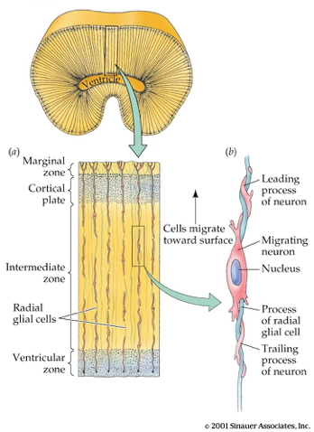{.lightbox width=75% fig-align="center"}
:::
::: {.column width=50%}
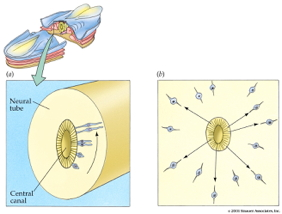{.lightbox width=75% fig-align="center"}
:::
::::

## Radial unit hypothesis

## Neural migration

:::: {.columns}
::: {.column width=50%}
<iframe width="420" height="315" src="https://www.youtube.com/embed/ZRF-gKZHINk" frameborder="0" allowfullscreen></iframe>
:::
::: {.column width=50%}
<iframe width="420" height="315" src="https://www.youtube.com/embed/t-8bxeWqSV4" frameborder="0" allowfullscreen></iframe>
:::
::::

## Axon growth cone

:::: {.columns}
::: {.column width=50%}
- Chemoattractants
    + e.g., Nerve Growth Factor (NGF)
- Chemorepellents
- Receptor molecules in growth cone detect chemical gradients

:::
::: {.column width=50%}
<iframe width="420" height="315" src="https://www.youtube.com/embed/Fgmt2RBow0I" frameborder="0" allowfullscreen></iframe>

:::
::::

## Glia migrate, too

![@Baumann2001-nw Figure 4^["Fig. 4. A: migration and differentiation of cells of astrocyte and oligodendrocyte lineages, and multifocal pattern of development of glial rows in the fimbria between embryonic day 15 (E15) and postnatal day 60 (P60). (Lower surface, ependyma; upper surface, pia.) There is a relatively small increase in the thickness of the fimbria. The multicellular ventricular layer (small open circles at lower surface at E15 and P0) becomes reduced to a unicellular adult ependyma (triangles on ependymal surface). Cells migrating into the body of the fimbria, and supplemented by division of precursors there, become arranged in progressively longer interfascicular glial rows. The astrocytes (large, pale circles) change from predominantly radial processes to predominantly longitudinal. Oligodendrocytes are represented by small, black, filled contiguous circles. Myelination (not represented) largely occurs between P10 and P60. Axons (not represented) are present from the earliest developmental stage. [From Suzuki and Raisman (596). Copyright 1992, reprinted by permission of Wiley-Liss, Inc., a subsidiary of John Wiley & Sons, Inc.]B: organization of the glial framework of central white matter tracts. Arrangement of radial and longitudinal processes of oligodendrocytes (Og) and astrocytes (As) forming a continuous meshwork of processes intermingled within the axonal tracts in the fimbria. Astrocytes are linked with each other by gap junctions, and also form gap junctions with oligodendrocytes, thus providing an indication for a functional as well as an anatomical functional syncytium. Myelination occurs on an asynchronous mode, with individual oligodendrocytes maturing independently within a cluster of adjacent oligodendrocytes, suggesting an interaction between axon maturation and oligodendrocyte differentiation. [From Raisman (492).]"]](../include/img/baumann-2001.jpeg){.lightbox width=50% fig-align="center"}

## Differentiation

- Neuron 
  - pyramidal cell vs. stellate vs. Purkinje vs. ...
  - NTs released
- vs. glial cell
  - myelin-producing vs. astrocyte vs. microglia
- Where to connect

## Differential gene expression {.scrollable}

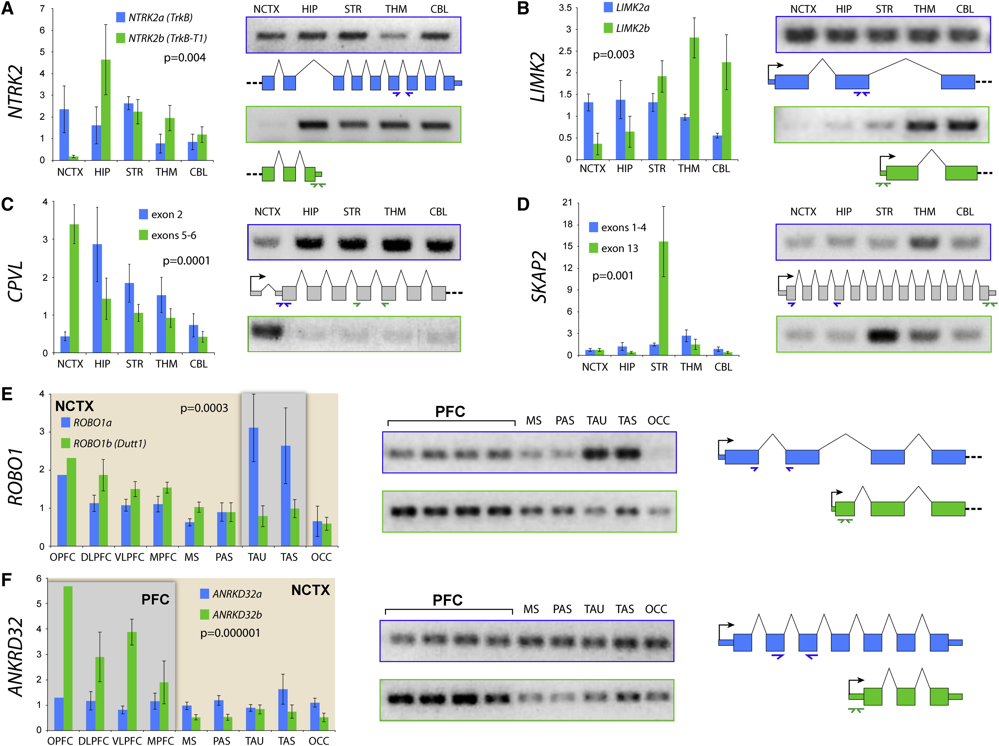{width=75% fig-align="center"}

## Gyral development

:::: {.columns}
::: {.column width=50%}
#### 16-19 wk
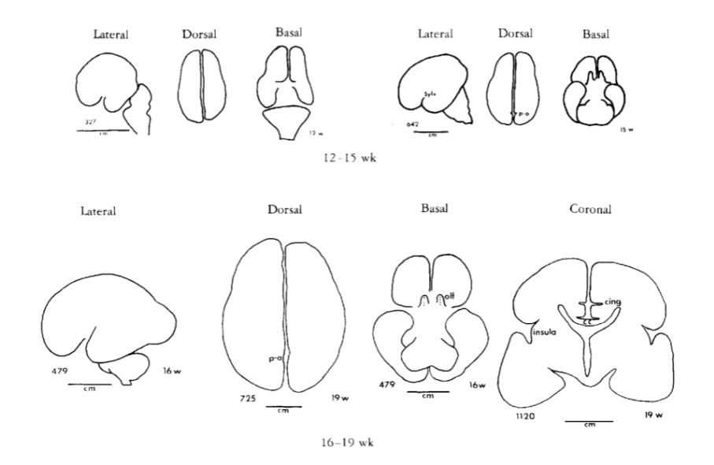
:::
::: {.column width=50%}
#### 24-27 wk
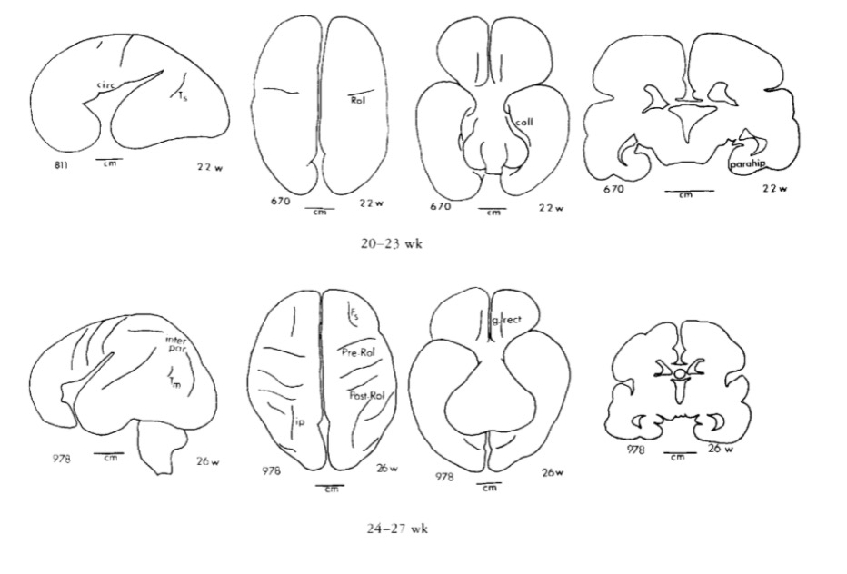
:::
::::

## Gyral development

:::: {.columns}
::: {.column width=50%}
#### 28-31 wk
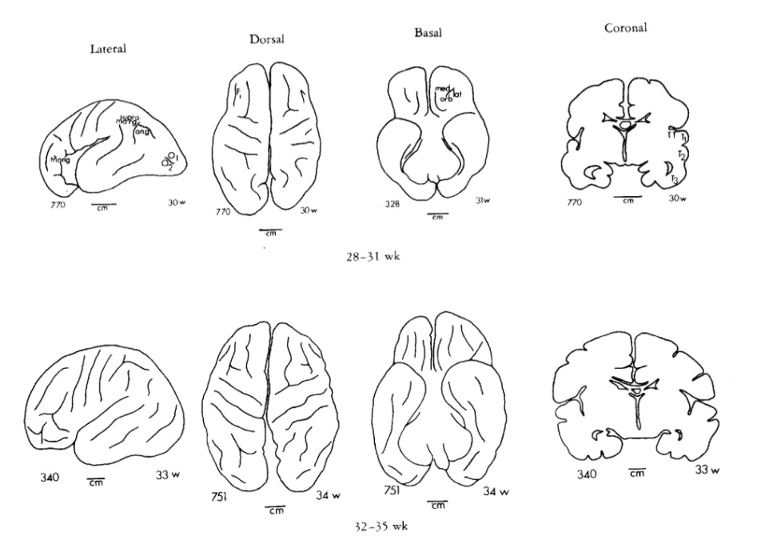
:::
::: {.column width=50%}
#### 36-44 wk
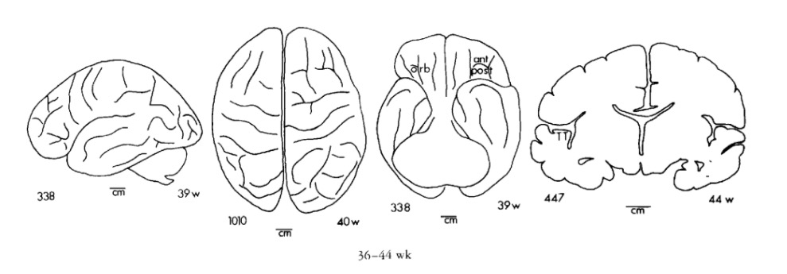
:::
::::

# Infancy & Early Childhood

## Synaptogenesis

:::: {.columns}
::: {.column width=50%}
- Begins prenatally (~ 18 pcw)
- Peak density ~ 15 mos postnatal
- Spine density in DLPFC ~ 7 yrs postnatal
- 700K synapses/s on average
:::
::: {.column width=50%}
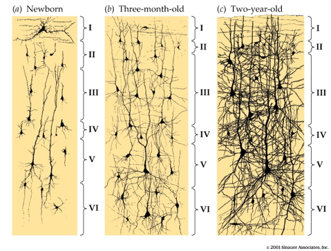{.lightbox}
:::
::::

## Proliferation, pruning

- Early proliferation (synapse formation)
- Later pruning (synapse removal)
- Rates, peaks differ by area

## Apoptosis

:::: {.columns}
::: {.column width=50%}
- Programmed cell death
- 20-80%, varies by area
- Spinal cord >> cortex
- Quantity of nerve growth factors (NGF) influences
:::
::: {.column width=50%}


[@Mr_Riddz_Science2015-bd]
:::
::::

## {.scrollable}

{width=75% fig-align="center"}

## Synaptic rearrangement

:::: {.columns}
::: {.column width=50%}
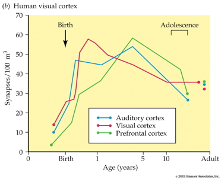{width=75% fig-align="center"}
:::
::: {.column width=50%}
- Progressive phase: growth rate >> loss rate
- Regressive phase: growth rate << loss rate
:::
::::

## Myelination

:::: {.columns}
::: {.column width=50%}
- Neonatal brain largely unmyelinated
- Gradual myelination, peaks in mid-20s
- Non-uniform pattern
    - Spinal cord before brain
    - Sensory before motor
:::
::: {.column width=50%}
![@Baumann2001-nw Figure 6^["Fig. 6. Cycles of myelination in the CNS during development. The width and the length of graphs indicate progression in the intensity of staining corresponding to the density of myelinated fibers; the vertical stripes at the end of the graphs indicate approximate age range of termination of myelination estimated from comparison of the fetal and postnatal tissue with tissue from adults in the third and later decades of life. Adapted from Yakovlev and Lecours (677)."]](../include/img/baumann-fig-06.jpeg)
:::
::::

## Structural development {.scrollable}

{#fig-knickmeyer width="60%"}

## Structural development

:::: {.columns}
::: {.column width=50%}
#### Synaptogenesis

:::
::: {.column width=50%}
#### Myelination

:::
::::

## Networks in the brain

:::: {.columns}
::: {.column width=50%}
- Some more susceptible to lesioning/injury.
:::
::: {.column width=50%}
![@irimia_2014 Figure 4^["SIMILARITIES IN GM LESION EFFECTS UPON NETWORK TOPOLOGY AS REVEALED BY PCA. Shown are lateral, medial, dorsal, ventral, anterior and posterior views of each hemisphere for the first three PCs—i.e. PC1 in (A), PC2 in (B) and PC3 in (C)—mapped on the cortex, demonstrating the anatomical similarity pattern associated with the extent to which the removal of different regions affects the network in a similar way. For each PC, color varies from the minimum to the maximum value of the PC factor loadings. PC1 (54% of the variance Σ in the data) exhibits greater hemispheric asymmetry than the following two PCs and covers the entire left parietal lobe and, to a smaller extent, the left temporal lobe. PC2 (26% of Σ) is—by comparison to PC1—highly symmetric, and includes the entire frontal lobe of both hemispheres, whereas PC3 (8% of Σ) is again symmetric and includes the occipital lobes of both hemispheres."]](https://www.frontiersin.org/files/Articles/72413/fnhum-08-00051-HTML/image_m/fnhum-08-00051-g004.jpg)
:::
::::

## Develop (across) age with differing profiles:

>Our results revealed three distinguishable profiles, whose expression strengthened with increasing age and which characterized developmental differences in connectivity within the ten systems, between networks thought to underlie cognitive control and non-control systems, and among the non-control networks.

-- @Petrican2017-re

## Sensory/Attention Networks {.scrollable}

## "Control" networks

## Non-"control" networks {.scrollable}

## Developmental connectomics

![@Cao2017-bl^["Hypothetical Models of Brain Connectome Development from Infancy to Early Childhood (A) A hypothetical developmental model of information segregation and integration in the brain networks. (C) A hypothetical developmental model from primary regions to higher-order association regions. (C) A hypothetical developmental model of structural and functional brain connectomes."]](../include/img/cao-2017.jpg)

## Myelination changes "network" properties {.scrollable}

![@Hagmann02112010 Figure 2^["Relationship of network metrics and developmental age. Results shown are for cerebral cortex at two spatial resolutions: (A) n = 66 and (B) n = 241 nodes. For whole-brain data (cortex and deep gray structures) see Fig. S2. Scatter plots show node strength, global efficiency, clustering coefficient, and modularity (left to right). All measures are computed from the weighted SC matrices of individual subjects. Values for clustering coefficient and small-world index are scaled relative to populations of 100 random networks with preserved degree and weight distributions. For R and P values, see Table 1."]](../include/img/hagmann-fig-02.webp){#fig-hagmann-fig-02}

## Cortical thickness changes

:::: {.columns}
::: {.column width=50%}
- Due to synaptic rearrangment, myelination [@Gogtay2004-bq]
:::
::: {.column width=50%}
{width="75%"}
:::
::::

## {.scrollable}

:::: {.columns}
::: {.column width=50%}

:::
::: {.column width=50%}

:::
::::

## {.scrollable}

{width="50%"}

<!-- ## Video depictions -->

<!-- :::: {.columns} -->
<!-- ::: {.column width=50%} -->
<!-- #### Left hemisphere -->
<!-- <video width="320" height="240" controls> -->
<!--   <source src="../include/mov/02680Movie1.mp4" type="video/mp4"> -->
<!-- Your browser does not support the video tag. -->
<!-- </video> -->
<!-- ::: -->
<!-- ::: {.column width=50%} -->
<!-- #### Right hemisphere -->
<!-- <video width="320" height="240" controls> -->
<!--   <source src="../include/mov/02680Movie2.mp4" type="video/mp4"> -->
<!-- Your browser does not support the video tag. -->
<!-- </video> -->
<!-- ::: -->
<!-- :::: -->

<!-- ## {.scrollable} -->

<!-- :::: {.columns} -->
<!-- ::: {.column width=50%} -->
<!-- #### Superior -->
<!-- <video width="320" height="240" controls> -->
<!--   <source src="../include/mov/02680Movie3.mp4" type="video/mp4"> -->
<!-- Your browser does not support the video tag. -->
<!-- </video> -->

<!-- ::: -->
<!-- ::: {.column width=50%} -->
<!-- #### Inferior -->

<!-- <video width="320" height="240" controls> -->
<!--   <source src="../include/mov/02680Movie4.mp4" type="video/mp4"> -->
<!-- Your browser does not support the video tag. -->
<!-- </video> -->

<!-- ::: -->
<!-- :::: -->

## Changes in brain energetics (glucose utilization)

## Gene expression across development

![@Kang2011-ex Figure 5^["a, Comparison between DCX expression in HIP and the density of DCX-immunopositive cells in the human dentate gyrus36. b, Comparison between transcriptome-based dendrite development trajectory in DFC and Golgi-method-based growth of basal dendrites of layer 3 (L3) and 5 (L5) pyramidal neurons in the human DFC41. c, Comparison between transcriptome-based synapse development trajectory in DFC and density of DFC synapses calculated using electron microscopy42. For b and c, PC1 for gene expression was plotted against age to represent the developmental trajectory of genes associated with dendrite (b) or synapse (c) development. Independent data sets were centred, scaled and plotted on a logarithmic scale. d, PC1 value for the indicated sets of genes (expressed as percentage of maximum) plotted against age to represent general trends and regional differences in several neurodevelopmental processes in NCX, HIP and CBC."]](https://media.springernature.com/full/springer-static/image/art%3A10.1038%2Fnature10523/MediaObjects/41586_2011_Article_BFnature10523_Fig5_HTML.jpg?as=webp)

## Summary of prenatal milestones

:::: {.columns}
::: {.column width=50%}
+ Neuro- and gliogenesis
+ Migration
+ Synaptogenesis begins
+ Differentiation
:::
::: {.column width=50%}
+ Apoptosis
+ Myelination begins
+ Infant gene expression ≠ Adult
:::
::::

## Summary of postnatal milestones

:::: {.columns}
::: {.column width=50%}
+ Synaptogenesis
+ Cortical expansion, activity-dependent change
- Then cubic, quadratic, or linear declines in cortical thickness
+ Myelination
:::
::: {.column width=50%}
+ Connectivity changes (esp within networks)
+ Prolonged period of postnatal/pre-reproductive development [@konner_evolution_2011]
:::
::::

## How brain development clarifies anatomical structure

## 3-4 weeks

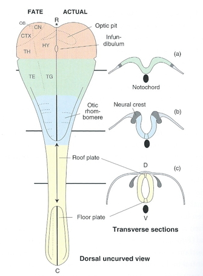

## 4 weeks

## ~4 weeks

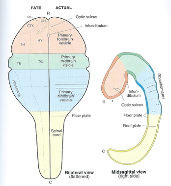

## 6 weeks

:::: {.columns}
::: {.column width=50%}

:::
::: {.column width=50%}
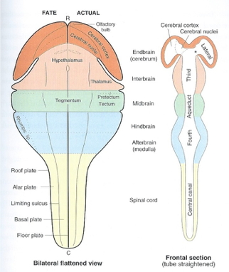
:::
::::

## Beyond 6 weeks

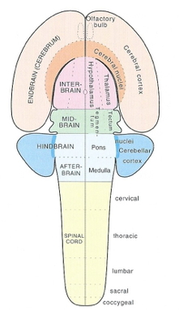

## Organization of the brain

| Major division | Ventricular Landmark | Embryonic Division | Structure       |
|----------------|----------------------|--------------------|-----------------|
| Forebrain      | Lateral              | Telencephalon      | Cerebral cortex |
|                |                      |                    | Basal ganglia   |
|                |                      |                    | Hippocampus, amygdala |
|                | Third                | Diencephalon       | Thalamus        |
|                |                      |                    | Hypothalamus    |

## Organization of the brain

| Major division | Ventricular Landmark | Embryonic Division | Structure       |
|----------------|----------------------|--------------------|-----------------|
| Midbrain       | Cerebral Aqueduct    | Mesencephalon      | Tectum, tegmentum |
| Hindbrain      | 4th                  | Metencephalon      | Cerebellum, pons  |
|                | --                   | Mylencephalon      | Medulla oblongata |

## From structural development to functional development {.scrollable}

![@Johnson2001-yy Figure 3^["Three accounts of the neural basis of an advance in behavioural abilities in infants. a | A maturational view in which the neuroanatomical maturation of one region, in this case the dorsolateral prefrontal cortex (DLPC), allows new behavioural abilities to emerge. Specifically, maturation of DLPC has been associated with successful performance in the object retrieval task (Fig. 1a)50. Note that although the task itself involves activity in several regions, it is thought to be maturation of only one of these, the DLPC, that results in changed behaviour. b | An interactive specialization view in which the onset of a new behavioural ability is due to changes in the interactions between several regions that were already partially active. In this hypothetical illustration, it is suggested that changes in the interactions between DLPC, parietal cortex and cerebellum might give rise to successful performance in the object retrieval paradigm. In contrast to the maturational view, it is refinement of the connectivity between regions, rather than within a single region, that is important. According to this view, regions adjust their functionality together to allow new computations. c | A skill-learning model, in which the pattern of activation of cortical regions changes during the acquisition of new skills throughout the lifespan. In the example illustrated there is decreasing activation of DLPC and medial frontal cortex (pre-supplementary motor area), accompanied by increasing activation of more posterior regions (such as intraparietal sulcus), as human adults perform a visuomotor sequence learning task77. It is suggested that similar changes might occur during the acquisition of new skills by infants. These three accounts are not necessarily mutually exclusive."]](https://media.springernature.com/full/springer-static/image/art%3A10.1038%2F35081509/MediaObjects/41583_2001_Article_BF35081509_Fig3_HTML.gif?as=webp){#fig-johnson-2001-fig-03}

## Different hardware = different computations?

>Researchers routinely use motor behaviors (e.g., eye, face, and limb movements) to index cognition in the human neonate.

>When developmental researchers use infant movements to index cognition, they often assume that the cortex is involved in producing the behavior.

-- @Blumberg2023-ce

## @Blumberg2023-ce

>However, cortical control of movement is absent at birth, emerging gradually over the first several postnatal months and beyond; before cortical outflow emerges, brainstem networks produce complex motor behavior.

>Thus, cortical control of the motor behaviors used to infer cognition in neonates is not neurobiologically plausible.

## @Blumberg2023-ce

>Researchers should be cautious when making claims about developmental continuity between newborn and adult cognition (i.e., ‘core knowledge’) and its supporting neural architecture.

## {.scrollable}

![@Blumberg2023-fs Figure 1^["Sensory origins of primary motor cortex (M1). (A) Boundaries of primary cortical areas in rats: primary somatosensory cortex (S1, red) and M1 (blue), and primary auditory (A1) and visual (V1) cortex. (B) Enlargements of red and blue regions in (A) show the somatotopic organization of S1 and M1. Adapted, with permission, from [92]. (C) Peri-event histogram showing sensory responsiveness of an individual neuron in the forelimb region of M1 at P20. The neuron’s firing rate is shown in relation to movement onset (vertical broken line) for twitches (red) and wake movements (black). This neuron is representative of all M1 neurons recorded at this age. Neurons fire above baseline (0 on the y-axis) after – not before – movement onset during both sleep and wake, indicative of sensory responding. Adapted, with permission, from [9]."]](https://ars.els-cdn.com/content/image/1-s2.0-S136466132200331X-gr1_lrg.jpg)

## {.scrollable}

![@Blumberg2023-fs Figure 2^["Protracted development of motor maps in M1. (A) Representative motor maps in rat pups at postnatal day (P) 25 and P30 and in adult rats at P60. Each map was produced using intracortical microstimulation in the forelimb region of M1 in anesthetized animals. The legends indicate the simple (i.e., single joint) and complex (i.e., multijoint) movements evoked at each stimulation site. Rectangles around the maps demarcate identical cortical surface areas. Adapted, with permission, from [17]. (B) Representative motor maps in kittens at P63 and P86 and in adult cats. Each map was produced using intracortical microstimulation in the forelimb region of M1 in anesthetized animals. The legend indicates the single-joint forelimb movements (shoulder, elbow, wrist) and multijoint movements evoked at each stimulation site. Movements of the digits occurred with movements of other joints. Colors denote the threshold electric current for movement production as indicated by the color bar at right. The black lines show the location of the cruciate sulcus. Adapted, with permission, from [24]. Both figure parts are used with permission of the American Physiological Society; permission conveyed through Copyright Clearance, Inc."]](https://ars.els-cdn.com/content/image/1-s2.0-S136466132200331X-b1_lrg.jpg)

## @Blumberg2023-ce

![@Blumberg2023-ce Figure 1^["Figure I. Estimating the onset of M1 motor outflow in early human development. Estimated days postconception plotted against event scale for humans, macaques, cats, and rats (data from translatingtime.org). Red-shaded region denotes 95% confidence intervals for human data. Three additional events are shown: birth (vertical bars), estimated onset of cortical delta rhythm (gray circles), and estimated onset of M1 motor outflow based on cortical stimulation studies (gray squares). Based on M1 onset in the non-human species, five possible onsets in humans are represented (arrows a–e). Inset: semi-log replotting of the data shown with four events from the visual system. Abbreviations: dLGN, dorsal lateral geniculate nucleus; SC, superior colliculus; V1, primary visual cortex; VEP, visual evoked potential."]](https://ars.els-cdn.com/content/image/1-s2.0-S1364661323001250-b1_lrg.jpg)

## @Blumberg2023-ce

>With regard to the developmental continuity of core knowledge, Pinker famously argued that ‘…the null hypothesis in developmental psychology is that the cognitive mechanisms of children and adults are identical; hence it is a hypothesis that should not be rejected until the data leave us no other choice’ [10]... 

## @Blumberg2023-ce

>Regardless, given developmental discontinuities in the brain mechanisms upon which the expression of infant cognition relies, why assume developmental continuity between infant and adult minds? The available evidence leaves us no choice but to reject Pinker’s null hypothesis.

# Wrap-up

## Main points

## Next time

- Cellular neuroscience

# Resources

## About

This talk was produced using [Quarto](https://quarto.org), using the [RStudio](https://posit.co/products/open-source/rstudio/)
Integrated Development Environment (IDE), version 2026.1.0.392.

The source files are in R and R Markdown, then rendered to HTML using the
[revealJS](https://revealjs.com) framework.
The HTML slides are hosted in a [GitHub repo](https://github.com/psu-psychology/psy-511-scan-fdns-2026-spring) and served by GitHub pages:
<https://psu-psychology.github.io/psy-511-scan-fdns-2026-spring/>

## References