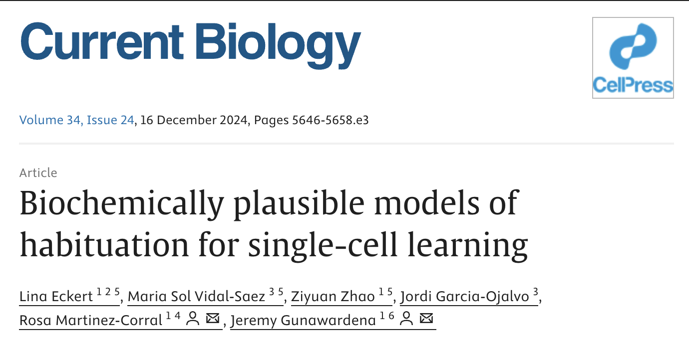
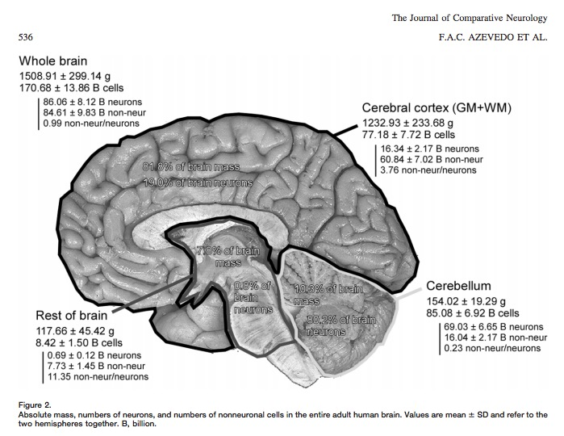
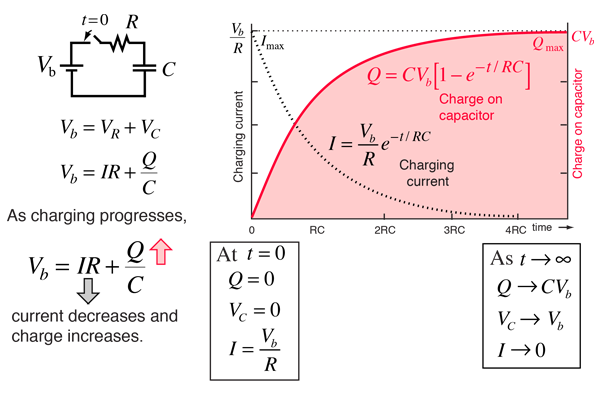

# Prelude

## For fun

::: {#fig-neuron-song}
<iframe width="1280" height="450" src="https://www.youtube.com/embed/R0SZnLOeh5E?si=CKypPTKatJ5k1N_E" title="YouTube video player" frameborder="0" allow="accelerometer; autoplay; clipboard-write; encrypted-media; gyroscope; picture-in-picture; web-share" referrerpolicy="strict-origin-when-cross-origin" allowfullscreen></iframe>

@Neural-Academy2020-wg
:::

## Announcements

## Today's topics

- Why should (psychologists) care?
- Cellular neuroanatomy
- Neurophysiology I

## Warm-up

# Why should (psychologists) care?

## Single-celled organisms

- Behave

---

::: {#fig-single-cell-behavior}
<iframe width="1280" height="450" src="https://www.youtube.com/embed/QGAm6hMysTA?si=4TXeVND6TKQGblha" title="YouTube video player" frameborder="0" allow="accelerometer; autoplay; clipboard-write; encrypted-media; gyroscope; picture-in-picture; web-share" referrerpolicy="strict-origin-when-cross-origin" allowfullscreen></iframe>

@Purushotham2007-ne
:::

---

- [*Escherichia Coli (E. Coli)*](https://en.wikipedia.org/wiki/Escherichia_coli)
- Tiny, single-celled bacterium
- Feeds on glucose
- Chemo ("taste") receptors on surface membrane
- Flagellum for movement
- Food concentration regulates duration of "move" phase
- ~4 ms for chemical signal to diffuse from anterior/posterior

## Learn

{#fig-eckert-2024 width="60%"}

## Communicate

- via mechanisms similar to multicellular organisms

---

::: {.callout-important}
### Biological channels
:::: {.columns}
::: {.column width=50%}
- Chemical
  + via diffusion; slow(er)
  + Within & between cells 
  - Molecular matching (binding) for specificity
  - Metabolically efficient
:::
::: {.column width=50%}
- Electrical
  + Fast(er) (10-100x)
  + Within cells
  + From one part of body to another
  - Point-to-point connections for specificity
  - Metabolically costly to create & maintain
:::
::::
:::

## [*Paramecium*](https://en.wikipedia.org/wiki/Paramecium)

- 300K larger than E. Coli
- Propulsion through coordinated beating of cilia
- Diffusion from head to tail ~40 s!
- Use *electrical* signaling instead
  - $Na^+$ channel opens (e.g., when stretched)
  - Voltage-gated $Ca^{++}$ channels open, $Ca^{++}$ enters, triggers cilia
  - Signal across cell within ms
 
## [*Caenorhabditis Elegans (C. Elegans)*](https://en.wikipedia.org/wiki/Caenorhabditis_elegans)

:::: {.columns}
::: {.column width=50%}
::: {#fig-c-elegans}
<iframe width="560" height="315" src="https://www.youtube.com/embed/GgZHziFWR7M?si=tH_v9SUWiCRmWnjP" title="YouTube video player" frameborder="0" allow="accelerometer; autoplay; clipboard-write; encrypted-media; gyroscope; picture-in-picture; web-share" referrerpolicy="strict-origin-when-cross-origin" allowfullscreen></iframe>

@Bio-Rad-Laboratories2013-so
:::
:::
::: {.column width=50%}
- ~10x larger than paramecium
- multicellular invertebrate
- 302 neurons (118 classes) + 56 glial cells (out of 959 total cells) [@Hobert2010-dl]
- Swim, forage, mate
:::
::::

## So, why nervous systems?

:::: {.columns}
::: {.column width=50%}
{width=30%}
:::
::: {.column width=50%}
- Chemical communication specific (neurotransmitters $\rightarrow$ receptors)
- Energy efficient
- But slow
- Bigger bodies $\rightarrow$ fast(er) communication
  - To/from periphery
:::
::::

## Why nervous systems?

- Steering
  - Multicellular bodies
  - Approach/avoidance
- Store/recall past events
  - Greater storage capacity
- Predict the future
- (Richer) communication

## Brain energetics

>The human brain is just 2% of the body’s weight, but 20% of its metabolic load, and 10 times more expensive per gram than muscle. On the other hand, the brain manages to produce poetry, design spacecraft, and create art on an energy budget of 20 W, a paltry sum given that the computer on which this article is being typed requires 80 W. 

-- @Balasubramanian2021-fw

# Cellular neuroanatomy

## How many neurons and glia?

- Old "lore": ~100 billion neurons
- New estimate [@azevedo2009equal]:
    + ~86 +/- 8 billion neurons
    + ~85 +/- 9 billion glia
    
---

::: {.callout-tip}

How long would it take you to count 170 billion cells?

How would you estimate how long?

- 60 s/min x 60 min/hr x 24 hrs/day x 365 days/ yr = 31,536,000 s/yr
- 1.7e11/31,536,000 = 5,390 years

"Back of the envelope" calculations/guess-timates are extremely useful--in science and in other aspects of life.

:::

---

:::: {.columns}
::: {.column width=50%}
> *"These findings challenge the common view that humans stand out from other primates in their brain composition and indicate that, with regard to numbers of neuronal and nonneuronal cells, the human brain is an isometrically scaled-up primate brain."*

-- @azevedo2009equal
:::
::: {.column width=50%}

:::
::::

## Glia (neuroglia)

:::: {.columns}
::: {.column width=50%}
- "Glia" means glue
- Functions
	+ Structural support
	+ Metabolic support
	+ Brain development
	+ Neural plasticity?
- Multiple types
:::
::: {.column width=50%}
![Wikipedia ^[Neuron (yellow), astrocyte (green), oligodendrocyte (blue), microglia (reddish brown)]](https://upload.wikimedia.org/wikipedia/commons/c/ca/Glial_Cell_Types.png){width="60%" fig-align="right"}
:::
::::

## Astrocytes

:::: {.columns}
::: {.column width=50%}
- "Star"-shaped cells
- Physical and metabolic support
	+ Support [blood/brain barrier](https://en.wikipedia.org/wiki/Blood%E2%80%93brain_barrier)
	- Regulate local blood flow & oxygen
:::
::: {.column width=50%}
{fig-align="right"}
:::
::::

## Astrocytes

:::: {.columns}
::: {.column width=50%}
- Interact with neurons
  - Ion (Ca++/K+) buffering
  - Neurotransmitter (e.g., glutamate) buffering
- Regulate/influence communication between neurons [@Bazargani2016-io]
:::
::: {.column width=50%}

:::
::::

## Astrocytes

:::: {.columns}
::: {.column width=50%}
- Disruption linked to cognitive impairment, disease [@chung_glia_2015]
:::
::: {.column width=50%}

:::
::::

## Myelinating cells

::: {.callout-note}
## Myelin

- outer covering of neurons
- provided by separate class of glial cell
- increases the speed of signal (action potential) conduction. 
- found in all *vertebrates*^[except jawless fish]
- The white in white matter

See also: <https://en.wikipedia.org/wiki/Myelin>
:::

## Oligodendrocytes

:::: {.columns}
::: {.column width=50%}
+ In brain and spinal cord (CNS) 
+ 1:many neurons
:::
::: {.column width=50%}
![@Wikipedia-contributors2026-or^["A neuron cell diagram, cropped to show oligodendrocyte and myelin sheath. By Neuron_with_oligodendrocyte_and_myelin_sheath.svg: *Complete_neuron_cell_diagram_en.svg: LadyofHatsderivative work: Andrew c (talk) - Neuron_with_oligodendrocyte_and_myelin_sheath.svg, Public Domain, https://commons.wikimedia.org/w/index.php?curid=10888009."]](https://upload.wikimedia.org/wikipedia/commons/thumb/a/a8/Neuron_with_oligodendrocyte_and_myelin_sheath.svg/1920px-Neuron_with_oligodendrocyte_and_myelin_sheath.svg.png){#fig-oligodendrocyte width="60%"}
:::
::::

## Oligodendrocytes

![@Wikipedia-contributors2025-aa^["An oligodendrocyte seen myelinating several axons. By Artwork by Holly Fischer - http://open.umich.edu/education/med/resources/second-look-series/materials - CNS Slide 9, CC BY 3.0, https://commons.wikimedia.org/w/index.php?curid=24367135 "]](https://upload.wikimedia.org/wikipedia/commons/2/2e/Oligodendrocyte_illustration.png){#fig-oligodendrocyte-2 width="60%"}

## Schwann cells

:::: {.columns}
::: {.column width=50%}
+ In peripheral nervous system (PNS)
+ 1:1 neuron
:::
::: {.column width=50%}

:::
::::

---

{#fig-schwann-cell width="60%"}

## TV-show-inspired mnemonic

{width="30%" fig-align="center"}

**C**entral **O**ligodendrocytes  **Peripheral** **S**chwann cells

## TV-show-inspired mnemonic

{width="30%" fig-align="center"}

**S**chwann cells **P**eripheral **O**ligodendrocytes **C**entral

## Microglia

:::: {.columns}
::: {.column width=50%}
- Phagocytosis
- Clean-up damaged, dead tissue
- 'Pruning' of synapses in normal development
:::
::: {.column width=50%}

:::
::::

## Microglia

:::: {.columns}
::: {.column width=50%}
- Role in multiple sclerosis (MS) [@Distefano-Gagne2023-gt]
- Disruptions -> impaired connectivity and social behavior [@Zhan2014-lx]
:::
::: {.column width=50%}

:::
::::

## [Neurons](https://en.wikipedia.org/wiki/Neuron)

## What makes neurons "special"

- Specialized for electrical & chemical communication
- Post-mitotic -- don't divide
- Most [born early in life](http://www.ninds.nih.gov/disorders/brain_basics/ninds_neuron.htm) [@Bhardwaj2006-ny]
- Among longest-lived cells in body, may scale with *organism* lifespan [@Magrassi2013-il]
- Can extend over long distances

## Macrostructure

:::: {.columns}
::: {.column width=50%}
- Dendrites
- Soma
- Axons
- Terminal buttons (boutons)
:::
::: {.column width=50%}

:::
::::

## [Dendrites](https://en.wikipedia.org/wiki/Dendrite)

:::: {.columns}
::: {.column width=50%}
- Majority of input to neuron
- Passive (do not generate current flows) vs. active (generate current flows like axons)
- "Polarized" or directional information flow (to soma)
:::
::: {.column width=50%}

:::
::::

## Dendrites

:::: {.columns}
::: {.column width=50%}
- "Polarized" or directional information flow (to soma)
:::
::: {.column width=50%}

:::
::::

## Dendritic Spines

:::: {.columns}
::: {.column width=50%}
- Protrusions from dendrites
- Concentrate effects of local current flows, biochemical reactions
:::
::: {.column width=50%}

:::
::::

## Soma (cell body)

:::: {.columns}
::: {.column width=50%}
- Varied shapes
- Nucleus
	+ Chromosomes
- Organelles
	+ Mitochondria
	+ Smooth and Rough Endoplasmic reticulum (ER)
:::
::: {.column width=50%}

:::
::::

## [Axons](https://en.wikipedia.org/wiki/Axon)

:::: {.columns}
::: {.column width=50%}
- Another branch-like "extrusion" from soma
- Extend farther than dendrites
- Usually transmit info
:::
::: {.column width=50%}

:::
::::

## Axon components

:::: {.columns}
::: {.column width=50%}
- **Axon initial segment** (closest to soma, unmyelinated)
+ **Nodes of Ranvier** (unmyelinated segments along axon)
+ Axon terminals, terminal buttons, **synaptic boutons**
:::
::: {.column width=50%}
{fig-align="right"}
:::
::::

## Nodes of Ranvier

- Gaps in myelin sheath
- Neuronal membrane exposed to extracellular space
- Action potential regenerates

## Synaptic bouton (terminal button)

:::: {.columns}
::: {.column width=50%}
- *Synapse* (~1-1,000s/neuron) 
- *Pre-* (sending side) and *postsynaptic* (receiving side) *membranes*
- *Synaptic cleft*
- *Synaptic vesicles*
    + Store/release neurotransmitters
:::
::: {.column width=50%}

:::
::::

## *Autoreceptors* & *transporters*

![@Torres2003-ry Figure 1^["Monoamine transporters are localized to perisynaptic sites, where they are crucial for the termination of monoamine transmission and the maintenance of presynaptic monoamine storage. Several selective pharmacological agents acting at each monoamine transporter are shown. Amph., amphetamine; DA, dopamine; DAT, Dopamine transporter; L-DOPA, L-3,4-dihydroxyphenylalanine; 5-HT, 5-hydroxytryptamine; MPP+, 1-methyl-4-phenylpyridinium; MDMA, (+)-3,4-methylenedioxymethamphetamine; NA, noradrenaline; NET, noradrenaline transporter; SERT, 5-HT transporter"]](https://media.springernature.com/lw685/springer-static/image/art%3A10.1038%2Fnrn1008/MediaObjects/41583_2003_Article_BFnrn1008_Fig1_HTML.jpg?as=webp)

## Classifying neurons

:::: {.columns}
::: {.column width=50%}
- Functional role
    + Input (sensory), output (motor/secretory), interneurons 
- Anatomy of axons
    + Unipolar
    + Bipolar
    + Multipolar
:::
::: {.column width=50%}

:::
::::

## Classifying neurons

:::: {.columns}
::: {.column width=50%}
- By specific anatomy
    + Pyramidal cells
    + Stellate cells 
    + Purkinje cells 
    + Granule cells
:::
::: {.column width=50%}
{fig-align="right" width="70%"}
:::
::::

## Classifying neurons

## Morphology, physiology, gene transcription {.scrollable}

![@Zeng2017-sg Figure 1^["Neurons can be classified using morphological, physiological and molecular criteria. a | Representative examples of five subclasses of cortical neurons obtained from brain slices. The cells were filled with biocytin, stained and imaged following patch clamp recording (see part b). Each subclass has distinct morphological features. For the four interneurons on the left, the dendrites are shown in dark grey and the axons in light grey. The soma of the 5-hydroxytryptamine receptor 3A-expressing (HTR3A+) sparse neuro- gliaform cell is located in layer 1, and its axons are also concentrated in this layer. The vasoactive intestinal peptide-expressing (VIP+) bipolar cell has a characteristic bipolar dendritic extension. The soma of the somatostatin-expressing (SST+) deep Martinotti cell is located in layer 5/6, and its axons extend upward into layer 1. The parvalbumin-expressing (PVALB+) basket cell has basket-like axonal arborisation. For the excitatory neuron on the right, the apical dendrites are shown in dark grey and the basal dendrites in light grey. This is a layer 5, thick-tufted cell from a retinol-binding protein 4 (Rbp4) gene promoter-driven Cre-expressing mouse. The cell features thick apical dendritic tufts extending into layer 1. These morphological features are consistent with those described in published reports49,130,140. b | Differential electrophysiological responses of the five subclasses of neurons shown in part a to square pulses of current in patch clamp recordings. For example, the HTR3A+ cell is late spiking, whereas the PVALB+ cell is fast spiking. These responses are consistent with those described in published reports49,130,140. c | Differential molecular signatures of the five subclasses of cortical neurons illustrated in part a derived from single-cell RNA-sequencing data. The violin plot shows the collective gene expression profile for each gene of all the cells in a type (cluster). We define the smallest discrete clusters of cells as types and the aggregates of types that share common features as classes or subclasses. Each transcriptomic cell type is shown as a column of data points with the same colour (the colour coding corresponds to that of the transcriptomic taxonomy shown in Fig. 5). Shown here are three interneuron cell types expressing Htr3a but notVip, six interneuron cell types expressing Vip, six interneuron cell types expressing Sst and seven interneuron cell types expressing Pvalb. All of the interneurons express glutamate decarboxylase 1 (Gad1). Also shown are eight layer 5 excitatory neuron types, all of which express solute carrier family 17 member 7 (Slc17a7). All of the cells express synaptosome-associated protein 25 (Snap25). The height of each 'violin'-shaped data point represents the range of expression levels of the gene, and the width represents the proportion of cells displaying a particular level of expression. Parts a and b are from the Allen Cell Types Database (see Further Information). Part c is adapted with permission from Ref. 136."]](https://media.springernature.com/lw685/springer-static/image/art%3A10.1038%2Fnrn.2017.85/MediaObjects/41583_2017_Article_BFnrn201785_Fig1_HTML.jpg?as=webp)

## {.scrollable}

![@Zeng2017-sg Figure 6^["The figure shows a proposed hierarchical classification of cells in the retina (a) and cerebral cortex (b). In both areas, individual cell types can be grouped into classes, and intermediate levels of subclasses can be determined based on distinct morphological, physiological and molecular features. Higher-order groupings (such as those shown in part a, including sensory neurons, interneurons and projection neurons) may emerge once enough areas have been provided and compared. Types are the commonly recognized ('validated') terminal branches in the current hierarchical arrangement of cell types. Lower-order groupings into subtypes may largely be provisional until additional data are collected that could determine if they could form new types or should be merged into other types. Dashed lines indicate the presence of additional types that cannot be labelled due to lack of space. The question marks in part a indicate that the hierarchical relationship among the indicated cell types remains unclear. The question mark in part b indicates that the status of the cortical cell groups indicated may be either subclasses, types or subtypes. CT, cortico-thalamic neurons; DS, direction-selective retinal ganglion cells (RGCs); F, forkhead box P2 (Foxp2)-expressing RGCs; HTR3A, 5-hydroxytryptamine receptor 3A; ipRGC, intrinsically photosensitive RGCs; IT, intratelencephalic neurons; L4, layer 4; L6b, layer 6b subplate neurons; nGnG, non-GABAergic-non-glycinergic amacrine cells; ooDSGC, ON-OFF direction-selective RGCs; PT, pyramidal tract neurons; PVALB, parvalbumin; SST, somatostatin; VIP, vasoactive intestinal peptide."]](https://media.springernature.com/lw685/springer-static/image/art%3A10.1038%2Fnrn.2017.85/MediaObjects/41583_2017_Article_BFnrn201785_Fig6_HTML.jpg?as=webp)

## {.scrollable}

![@Boldog2018-dj Figure 4^["a, Examples of different firing patterns induced by current injections in layer 1 interneurons. Firing pattern of an RC (top), an NGFC (middle), and an unidentified layer 1 interneuron (bottom). b, SVM-based wrapper-feature selection of electrophysiological parameters for the identification of RCs. Anatomically identified RCs (red dots) and other types of interneurons with known morphology (black dots) are mapped to the distribution of electrophysiological features ranked as the two best delineators by SVM. Black lines show the best hyperplane separating RCs from other interneuron types. c,d, RCs exhibit a distinct impedance profile relative to neurogliaform and other human interneurons in layer 1. (c) Individual responses of anatomically identified rosehip (red), neurogliaform (blue), and other (black) interneurons to current injections with an exponential chirp (0.2–200 Hz; top). Traces were normalized to the amplitude of the rosehip response at 200 Hz. (d) Left: normalized impedance (Z) profiles of distinct groups of interneurons. RCs (n=5) had higher impedance in the range of 0.9–12.4 Hz compared to neurogliaform (n=5) and other (n=5) interneurons. Shaded regions represent s.d. Right: impedances were similar at the lowest frequency (Z0.2 Hz; left), but resonance magnitude (Q) calculated as maximal impedance value divided by the impedance at lowest frequency (middle) and frequencies of maximal impedance (fmax; right) showed significant differences (P < 0.05, ANOVA with Bonferroni post hoc correction). e, Automatized selection of recording periods for assessing subthreshold membrane potential oscillations (boxed segments) and detection of bursts (bars) for measuring intraburst spiking frequency demonstrated on an RC response to near-rheobasic stimulation showing stuttering firing behavior. f, Averaged fast fast Fourier transforms (FFTs) of membrane potential oscillations had higher power between 3.8 and 80 Hz in RCs compared to neurogliaform and other interneurons. g, Intraburst frequency of RCs peaked in the gamma range. AP, action potential."]](https://media.springernature.com/lw685/springer-static/image/art%3A10.1038%2Fs41593-018-0205-2/MediaObjects/41593_2018_205_Fig4_HTML.png?as=webp)

# Neurophysiology

## Basic principles

:::: {.columns}
::: {.column width=50%}
- Electrical potential (== voltage)
    + Think of potential energy
    + Voltage ~ pressure
    + Energy that will be released if something changes
:::

::: {.column width=50%}

:::
::::

## Basic principles

:::: {.columns}
::: {.column width=50%}
- Current flow ($I$) across membrane
- Resistors *resist* current flow
- Product $IR$ is electromotive force ($E$) or voltage
  - Resistors dissipate (as heat) energy stored in voltage source
:::
::: {.column width=50%}
$$E = IR$$

:::
::::

## Basic principles

:::: {.columns}
::: {.column width=50%}
- A capacitor ($C$) accumulates electrical charge
- Stores & releases charge
- Camera flash uses a capacitor
:::
::: {.column width=50%}

:::
::::

## In the neuron...

## Measuring electrical potential

:::: {.columns}
::: {.column width=50%}
+ Electrode on inside
+ Electrode on outside (reference)
+ Inside - Outside = potential
:::
::: {.column width=50%}

:::
::::

## Neurons have electrical potential

:::: {.columns}
::: {.column width=50%}
- Have *potential energy*
- [Resting potential](https://en.wikipedia.org/wiki/Resting_potential)
    - Voltage across neuronal membrane when cell is 'at-rest' (not firing)
    + Inside typically -60-70 mV, with respect to outside
    + ~1/20th typical $1.5V$ AA  battery
- [Action potential](https://en.wikipedia.org/wiki/Action_potential)
    - Changing pattern of voltage across neuronal membrane when cell is active or firing
:::
::: {.column width=50%}

:::
::::
    
## Neuron as a [dynamical system](https://en.wikipedia.org/wiki/Dynamical_system)

- In a (temporarily stable) equilibrium
  - Not really at "rest"
- Influenced by multiple forces
- Forces balance-out (for now)

## Studying systems in equilibrium

- What are the forces?
- How do the forces act on the system *individually*?
- How do the forces act on the system *collectively*?
- What happens when the forces or the balance among them changes?

## Metaphor I

## The drama of the resting potential

- Characters
- Setting
- Forces

## Metaphor II

- Annie/Alex ($A^-$) was having a party.
    + Used to date Nate/Natalie ($Na^+$), but now sees Karl/Kristie ($K^+$)
- Hired bouncers called
    + "The Channels"
    + Let Karl/Kristie and friends in or out, keep Nate/Natalie out

## Metaphor II

:::: {.columns}
::: {.column width=50%}
- Annie/Alex's friends ($A^-$) and Karl/Kristie's ($K^+$) mostly inside
- Nate/Natalie and friends ($Na^+$) mostly outside
- Claudia/Claude ($Cl^-$) tagging along
:::
::: {.column width=50%}

:::
::::

## Contributors

:::: {.columns}
::: {.column width=50%}
- Ions
  - Potassium, $K^+$
  - Sodium, $Na^+$
  - Chloride, $Cl^-$
  - Calcium, $Ca^{++}$
  - Organic anions, $A^-$
:::
::: {.column width=50%}
- Ion channels
- Separation between charges
- A balance of forces
:::
::::

## Ion channels

:::: {.columns}
::: {.column width=50%}
- Macromolecules that form openings in membrane
- Different types of subunits
:::
::: {.column width=50%}

:::
::::

## Ion channels

:::: {.columns}
::: {.column width=50%}
- Selective (permit some ions to flow)
- Vary in permeability (allow some substances to pass more than others)
- Types
    + Passive/leak
    + Voltage-gated
    + Ligand-gated (chemically-gated)
    + Transporters
:::
::: {.column width=50%}

:::
::::

## [Na+/K+ "pump"](https://en.wikipedia.org/wiki/Sodium%E2%80%93potassium_pump)

:::: {.columns}
::: {.column width=50%}
- Also known as Na+/K+-ATPase
- Moves ions across membrane 
- With metabolic "help" (energy expenditure)
:::
::: {.column width=50%}

:::
::::

## Metaphor III

---

## Forces at work I

:::: {.columns}
::: {.column width=50%}
- *Force of diffusion*
  - Movement from higher concentration to lower
  - Stop when concentrations ==
:::
::: {.column width=50%}
![@Wikipedia-contributors2026-ay^["Some particles are dissolved in a glass of water. At first, the particles are all near one top corner of the glass. If the particles randomly move around ("diffuse") in the water, they eventually become distributed randomly and uniformly from an area of high concentration to an area of low, and organized (diffusion continues, but with no net flux). By JrPol - Own work, CC BY 3.0, https://commons.wikimedia.org/w/index.php?curid=4586487"]](https://upload.wikimedia.org/wikipedia/commons/thumb/1/12/Diffusion.svg/3840px-Diffusion.svg.png)
:::
::::

---

<iframe width="844px" height="596px" frameborder="no" scrolling="no" allowfullscreen="true" webkitallowfullscreen="true" mozallowfullscreen="true" src="https://lab.concord.org/embeddable.html#interactives/sam/diffusion/4-semipermeable.json"></iframe>

## Forces at work II

:::: {.columns}
::: {.column width=50%}
- "Metabolic" force via Na/K-ATPase
- 3 Na^+ out : 2 K^+ in
- Creates/sustains ion concentration imbalances
:::
::: {.column width=50%}

:::
::::

## Spotlight on $K^+$

:::: {.columns}
::: {.column width=50%}
::: {.incremental}
- Na/K-ATPase pumps K+ in
- $[K^+]_{i} \approx 150 mM$
- $[K^+]_{o} \approx 4 mM$
- Inside >> Outside
:::
:::
::: {.column width=50%}
::: {.fragment}
::: {.callout-important}
## Your turn
If there's an opening in the membrane, what direction will the force of diffusion push $K^+$ ions?
:::
:::
:::
::::

## Spotlight on $K^+$

:::: {.columns}
::: {.column width=50%}
- Passive $K^+$-selective channels in membrane open
- $K^+$ flows out
:::
::: {.column width=50%}
::: {.fragment}
::: {.callout-important}
## Your turn
All things being equal, when will the outflow of $K^+$ due to the force of diffusion *stop*?
:::
:::
:::
::::

## Forces at work III

:::: {.columns}
::: {.column width=60%}
- Electrostatic force
  - Movement of charged particles (ions) == current
  - Like charges repel; opposite charges attract
  - Build-up of charges along membrane creates a voltage
:::
::: {.column width=40%}

:::
::::

## Electrostatic force

:::: {.columns}
::: {.column width=60%}
- Membrane acts like a capacitor
:::
::: {.column width=40%}

:::
::::

## Focus on $K^+$

:::: {.columns}
::: {.column width=50%}
::: {.incremental}
- $K^+$ move out
- Line up along outside of membrane
- $A^-$ ions no open channel
    - line up along inside
:::
:::
::: {.column width=50%}

:::
::::

## Focus on $K^+$

:::: {.columns}
::: {.column width=50%}
- $K^+$ / $A^-$ separation creates voltage
:::
::: {.column width=50%}
::: {.fragment}
::: {.callout-important}
Is the voltage *positive* (+) or *negative* (-)?

What sign of voltage will stop $K^+$ outflow?
:::
:::
:::
::::

## Focus on $K^+$

:::: {.columns}
::: {.column width=50%}
- Flow stops at *equilibrium potential*
- Nernst equation
- Equilibrium potential for $K^+ \approx -90mV$ 
:::
::: {.column width=50%}

:::
::::

## Story so far

:::: {.columns}
::: {.column width=50%}
- Na/K-ATPase creates concentration imbalance
- Outflow of $K^+$ causes a *negative* membrane potential

::: {.fragment}
- But resting potential is -60-70 mV, not -90 mV
- Why?
:::

:::

::: {.column width=50%}

:::
::::

---

<iframe width="844px" height="596px" frameborder="no" scrolling="no" allowfullscreen="true" webkitallowfullscreen="true" mozallowfullscreen="true" src="https://lab.concord.org/embeddable.html#interactives/sam/diffusion/4-semipermeable.json"></iframe>

## Focus on $Na^+$

:::: {.columns}

::: {.column width=50%}
- Na/K-ATPase pumps $Na^+$ *out*
- $[Na^+]_{i} \approx 10 mM$
- $[Na^+]_{o} \approx 140 mM$
- Outside >> Inside
:::

::: {.column width=50%}

::: {.fragment}
::: {.callout-important}
## Your turn

If there is an open channel, what direction will the force of diffusion push $Na+$ ions?
:::

:::

:::

::::

## Focus on $Na^+$

:::: {.columns}
::: {.column width=50%}
- Passive channels for $Na^+$ not especially permeable, but
- Some $Na^+$ flows *in*
:::
::: {.column width=50%}
::: {.fragment}
::: {.callout-important}
## Your turn

All things being equal, when will the inflow of $Na+$ due to the force of diffusion *stop*? 
:::
:::
:::
::::

## Focus on $Na^+$

:::: {.columns}
::: {.column width=50%}
- Flow stops at *equilibrium potential* for $Na^+$
- Calculate using Nernst equation

:::
::: {.column width=50%}
::: {.fragment}
::: {.callout-important}
## Your turn

What is the *sign* of the equlibrium potential for $Na^+$
:::
:::
:::
::::

## Story thus far

- Na/K-ATPase creates Na/K concentration imbalances
- $K^+$ outflow makes membrane potential negative
  - Membrane potential approaches, but does not reach $K^+$ equilibrium potential ($\approx 90 mV$)
- $Na^+$ inflow makes membrane potential (more) positive than system with $K^+$ alone

## A combination of forces

:::: {.columns}
::: {.column width=50%}
- Calculate net effects of ion flow across membrane via
- Goldman-Hodgkin-Katz equation
:::
::: {.column width=50%}

:::
::::

## 

:::: {.columns}
::: {.column width=50%}

:::
::: {.column width=50%}

:::
::::

## Summary of forces

| Ion | Concentration gradient | Force of diffusion  | Sign of electrostatic force |
|--------|--------------------------|---------------------|---------------------|
| $K^+$  | $[K^+]_{i} >> [K^+]_{o}$ | outward        | -     |
| $Na^+$ | $[Na^+]_{i} << [Na^+]_{o}$ | inward       | -     |

## Driving force

- Difference between
  - Ion equilibrium potential
  - Current membrane potential
- Driving force >> if membrane potential far from ion equilibrium potential

## From rest to action

:::: {.columns}
::: {.column width=50%}
- What ion has the strongest driving force when the neuron is at resting potential?
- Which way will that ion flow?
- What will happen to the membrane potential if flow for that ion increases?
:::
::: {.column width=50%}

:::
::::

## From rest to action

:::: {.columns}
::: {.column width=50%}
- What change(s) could cause changes in the neuron's equilibrium state?
:::
::: {.column width=50%}

:::
::::

<!-- ## [Equilibrium potentials](http://www.physiologyweb.com/calculators/nernst_potential_calculator.html) -->

<!-- Under typical conditions -->

<!-- | Ion | [inside]  | [outside]    | Voltage    | -->
<!-- |-----|-----------|--------------|------------| -->
<!-- | $K^+$  | ~150 mM   | ~4 mM        | ~ -90 mV    | -->
<!-- | $Na^+$ | ~10 mM    | ~140 mM      | ~ +55-60 mV | -->
<!-- | $Cl-$ | ~10 mM    | ~110 mM      | - 65-80 mV  | -->

<!-- --- -->

<!--  -->

---

::: {#fig-resting-potential-video}
<iframe width="1280" height="450" src="https://www.youtube.com/embed/PtKAeihnbv0?si=tzS8_sY3z_IPdAch" title="YouTube video player" frameborder="0" allow="accelerometer; autoplay; clipboard-write; encrypted-media; gyroscope; picture-in-picture; web-share" referrerpolicy="strict-origin-when-cross-origin" allowfullscreen></iframe>

@khanacademymedicine2012-fl
:::

# Wrap-up

## Main points

- Behavior in complex multicellular organisms builds upon their $\approx 4 B$ year history
  - (Slower) chemical communication via diffusion
  - (Faster) Electrical communication along membrane via ion flows
  
## Main points

- Glia consist of three main types
  - Astrocytes
  - Myelinating cells (Oligodendrocytes in CNS & Schwann cells in PNS)
  - Microglia
- Neurons may be classified by multiple structural and functional features

## Main points

- Like other cells, neurons have a negative resting membrane potential
  - Na/K-ATPase creates concentration differences inside & outside the cell
  - $K^+$ concentrated inside; $Na^+$ outside
- Membrane has channels that permit ions to flow

## Main points

- Neuron's -60-70 mV resting potential a combination of outward flows of $K^+$ and inward flows of $Na^+$
- Balance between force of diffusion & electrostatic forces

## Next time

- Cellular neuroscience II
  - Action potential
  - Synaptic transmission

# Resources

## About

This talk was produced using [Quarto](https://quarto.org), using the [RStudio](https://posit.co/products/open-source/rstudio/)
Integrated Development Environment (IDE), version 2026.1.0.392.

The source files are in R and R Markdown, then rendered to HTML using the
[revealJS](https://revealjs.com) framework.
The HTML slides are hosted in a [GitHub repo](https://github.com/psu-psychology/psy-511-scan-fdns-2026-spring) and served by GitHub pages:
<https://psu-psychology.github.io/psy-511-scan-fdns-2026-spring/>

## References