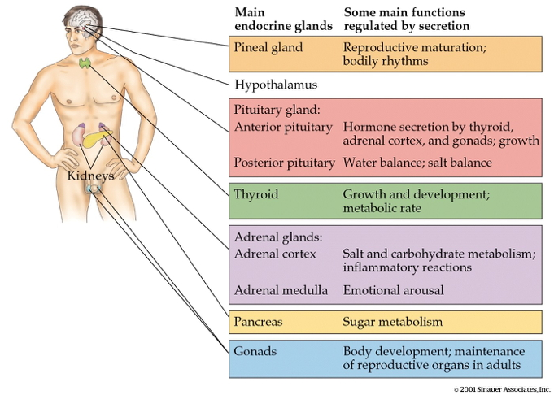
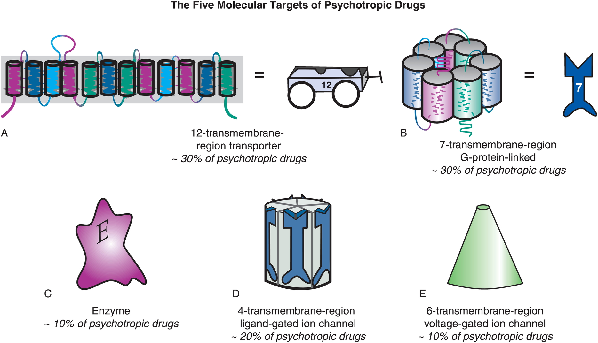

# Prelude

## For fun

## Announcements

## Today's topics

- Neurochemistry
  - Neurotransmitters
  - Hormones

## Warm-up

# Neurochemistry

## Components
  
- Neurotransmitters
- Hormones

## Neurotransmitters (NTs)

- Chemicals *produced by* neurons
- *Released by* neurons
- *Bound by neurons* and other cells
- Send messages (have physiological effect on target cells)
- Inactivated after release

## Things to know about NTs

- Input from (soma & dendrite location)
- Input to
- What receptor(s) bind it
- What effect(s)
- How inactivated

## Categories

:::: {.columns}
::: {.column width=50%}
- Function/Mode of Action
  - Excitatory^["Generates EPSP"]
  - Inhibitory^["Generates IPSP"]
  - Modulatory
:::
::: {.column width=50%}
- Chemical structure
  - Amino acids
  - Monoamines
  - Acetylcholine (ACh)
  - Others
:::
::::

## Amino acids

- [Glutamate](https://en.wikipedia.org/wiki/Glutamate_(neurotransmitter)) 
- [$\gamma$ aminobutyric acid (GABA)](https://en.wikipedia.org/wiki/Gamma-Aminobutyric_acid) 
- Glycine
- Aspartate

## Glutamate

- Widespread in CNS (~ 1/2 all synapses)
- Primary excitatory NT in CNS
- Role in learning (via NMDA-R)
- Receptors on neurons and glia (astrocytes and oligodendrocytes)

## Glutamate

- Inactivated via 
  - reuptake via glutamate transporters in preysynaptic terminal
  - glial reuptake
- Linked to umami (savory) taste sensation (think monosodium glutamate or MSG)
- Dysregulation in schizophrenia [@McCutcheon2020-ez](https://doi.org/10.1002/wps.20693), mood disorders [@Malgorzata2020-nz](http://dx.doi.org/10.1080/14728222.2020.1836160)
- Too much glutamate is toxic!

## Glutamate receptor types

| Type         | Receptor   | Esp Permeable to |
|--------------|------------|------------------|
| Ionotropic   | [AMPA](https://en.wikipedia.org/wiki/AMPA_receptor) | $Na^+$, $K^+$ |
|              | [Kainate](https://en.wikipedia.org/wiki/Kainate_receptor) | $Na^+$, $K^+$ |
|              | [NMDA](https://en.wikipedia.org/wiki/NMDA_receptor) | $Ca^{++}$, $Na^+$, $K^+$ |
| Metabotropic | [mGlu](https://en.wikipedia.org/wiki/Metabotropic_glutamate_receptor) |  |

---

:::: {.columns}
::: {.column width=50%}

:::
::: {.column width=50%}

:::
::::

## $\gamma$ aminobutyric acid (GABA)

- Primary inhibitory NT in CNS
- Excitatory in developing CNS, $[Cl^-]_{in} >> [Cl^-]_{out}$ out
- Binding sites for benzodiazepines (BZD; e.g., Valium), barbiturates, ethanol, etc.
  - BZD affect subset of GABA-A receptors
  - Increase total Cl- influx

## GABA receptor types

| Type         | Receptor   | Esp Permeable to |
|--------------|------------|------------------|
| Ionotropic   | GABA-A     | $Cl^-$           |
| Metabotropic | GABA-B     | $K^+$             |

##

:::: {.columns}
::: {.column width=50%}

<!--  -->
:::
::: {.column width=50%}

:::
::::

## {.scrollable}

{height="60%"}

## Other amino acid NTs

- *Aspartate*
    + Like Glu, stimulates NMDA receptor
- *Glycine*
    + Spinal cord interneurons
    - Inhibitory
    - Cl- channel opens

## Acetylcholine (ACh)

- Primary excitatory NT of CNS output

## ACh in Somatic Motor System (SMS)

:::: {.columns}
::: {.column width=50%}
- Somatic nervous system
  - Motor neuron in spinal cord -> neuromuscular junction
:::
::: {.column width=50%}

:::
::::

---

## ACh in ANS

:::: {.columns}
::: {.column width=50%}
- Autonomic nervous system (ANS)
    + Sympathetic branch: preganglionic neuron
    + Parasympathetic branch: pre/postganglionic
:::
::: {.column width=50%}

:::
::::

## {.scrollable}


## ACh receptor types

| Type         | Receptor           | Esp Permeable to | Blocked by       |
|--------------|--------------------|------------------|------------------|
| Ionotropic   | Nicotinic (nAChR)  | $Na^+$, $K^+$          | e.g., Curare     |
| Metabotropic | Muscarinic (mAChR) | $K^+$               | e.g., Atropine   |

## Curare

:::: {.columns}
::: {.column width=50%}
{width="50%"}
:::
::: {.column width=50%}

:::
::::

## Atropine

:::: {.columns}
::: {.column width=50%}
- aka, nightshade or belladonna
- inhibits (acts as an antagonist for) muscarinic ACh receptor
:::
::: {.column width=50%}
{width="25%"}

{width="25%"}
:::
::::

## ACh in CNS

- ACh a neuromodulator [@Picciotto2012-ig]
  - Via *cholinergic* system
- Neuromodulators
  - Longer-term effects
  - Wider-range effects
  - Change neuron responses to other inputs
  - Don't generate short-duration EPSPs or IPSPs  

## Basal forebrain

![@Avram2021-vs Figure 1^["Fig. 1: Map of the cholinergic basal forebrain. The region of interest depicts the cholinergic basal forebrain, based on a cytoarchitectonic map of cholinergic nuclei, overlaid on a human brain template in Montreal Neurological Institute space. The BFCN mask is based on combined histology and postmortem MRI [63], containing several cholinergic subdivisions within the basal forebrain, including the medial septal nucleus, diagonal band of Broca, nucleus subputaminalis, the basal magnocellular complex, and nucleus basalis of Meynert (57, 72)"]](https://media.springernature.com/lw685/springer-static/image/art%3A10.1038%2Fs41386-021-01070-x/MediaObjects/41386_2021_1070_Fig1_HTML.png?as=webp)

---


---


## Monoamines

::: {#fig-monoamine-video}


<https://en.wikipedia.org/wiki/Mah_Nà_Mah_Nà>
:::

## Monoamine Song

Monoamines, do-do do do-do</br>
Monoamines, do do do-do</br>
Monoamines, do do do do-do do do-do do do-do do do do do-do do

## Monoamine Song

Monoamines, do-pa-mine is one</br>
Monoamines, norepi, too</br>
Monoamines, sero-tonin e-pinephrine, dop-a-mine, nor-epinephrine, melatonin, whoo!

## Monoamine Song

Monoamines, mod-u-late neurons </br>
Monoamines, throughout the brain</br>
Monoamines, keep people happy, brains snappy, not sleepy, not sappy, do-do do-do do-do do

## Monoamine NTs

- Catecholamines
  - Dopamine (DA)
  - Norepinephrine (NE)/Noradrenaline (NAd)
  - Epinephrine (Epi)/Adrenaline (Ad)
  
## Synthesis pathways

:::: {.columns}
::: {.column width=50%}
- L-tyrosine -> L-DOPA -> DA
- DA -> NE/NAd -> Epi/Ad
:::
::: {.column width=50%}
![@Henley2021-ii Figure 9.6^["Figure 9.6. Dopamine is synthesized in a two-step process. Tyrosine is converted into DOPA by tyrosine hydroxylase, the rate-limiting step in the pathway. Then dopamine is synthesized from DOPA by DOPA decarboxylase. Dopamine is then packaged into vesicles by vesicular monoamine transporter. ‘Dopamine Synthesis’ by Casey Henley is licensed under a Creative Commons Attribution Non-Commercial Share-Alike (CC BY-NC-SA) 4.0 International License."]](https://openbooks.lib.msu.edu/app/uploads/sites/6/2020/01/DopamineSynthesis.jpg)
:::
::::

## Monoamine NTs

- Indolamines
  - Serotonin (5-HT)
  - Melatonin
  - Histamine

## Information processing

:::: {.columns}
::: {.column width=50%}
- Point-to-point
    + One sender, small number of recipients
    + Glu, GABA
:::
::: {.column width=50%}
- Broadcast
    + One sender, widespread recipients
    + DA, NE, 5-HT, melatonin, histamine
:::
::::

## Receptor distribution

{width="50%"}

## DA release pathways

+ Substantia nigra -> striatum
  - *meso-striatal projection*
+ Ventral tegmental area (VTA) ->
  - nucleus accumbens, ventral striatum, hippocampus, amygdala, cortex
  - *meso-limbo-cortical projection*

---

{width="60%"}

## DA clinical relevance

- Parkinson's Disease (mesostriatal)
    + DA *agonists* treat (agonists facilitate/increase transmission)
- ADHD (mesolimbocortical)
- Schizophrenia (mesolimbocortical)
    + DA antagonists treat
- Addiction (mesolimbocortical)

## DA inactivation

- Enzymatic breakdown via [monoamine oxidase (MAO)](http://www.scholarpedia.org/article/Dopamine_anatomy#Dopamine_receptors)
  - MAO removes amine group
  - Monoamine Oxidase Inhibitors (MAO-Is) *inhibit* monoamine inactivation
  
::: {.fragment}
::: {.callout-important}
## Your turn
What is the effect of *inhibiting* neurotransmitter inactivation?
:::
:::

## DA inactivation

:::: {.columns}
::: {.column width=50%}
- Reuptake via Dopamine transporter (DAT)
  - Psychostimulants (e.g., cocaine, methylphenidate) act upon. [@noauthor_undated-on](https://www.sciencedirect.com/topics/neuroscience/dopamine-transporter)
  - DAT also transports norepinephrine (NE)
:::
::: {.column width=50%}

:::
::::

## DA receptor types

| Type         | Receptor             | Comments                      |
|--------------|----------------------|-------------------------------|
| Metabotropic | D1-like (D1 and D5)  | more prevalent                |
|              | D2-like (D2, D3, D4) | target of many antipsychotics |

## Norepinephrine (NE)

- Released by
    + *[locus coeruleus](http://www.scholarpedia.org/article/Locus_coeruleus)* ('blue place') in pons/caudal tegmentum
    + postganglionic sympathetic nervous system neurons contact target tissues

---


---

{width="60%"}

## NE clinical relevance 

- ADHD, Alzheimer's Disease, Parkinson's Disease, depression
- Role in arousal, mood, eating, sexual behavior

## NE inactivation 

- Norepinephrine transporter (NET), aka noradrenaline transporter (NAT)
  - Contributes to DA uptake, too
  
## NE inactivation

- Enzymatic degradation via MAO
  + inactivate monoamines
  - Type A (MAO-A)
    - NE, epinephrine, 5-HT, melatonin, DA
  - Type B (MAO-B)
    - DA
  - @Wikipedia-contributors2026-fs

## MAO-Is [@Wikipedia-contributors2026-fs]

:::: {.columns}
::: {.column width=50%}
+ MAOIs increase extracellular NE, DA, 5-HT
+ Earliest drug treatment for depression
+ Also used for panic disorder, social anxiety disorder, Parkinson's Disease
:::
::: {.column width=50%}

:::
::::

## MAO-Is

:::: {.columns}
::: {.column width=50%}
- Side effects include
  - High blood pressure
  - Withdrawal effects
- Selective (MAO-A or B) vs. non-selective (MAO-A and B)
:::
::: {.column width=50%}

:::
::::

## NE receptor types

| Type         | Receptor         | Comments                           |
|--------------|------------------|------------------------------------|
| Metabotropic | $\alpha$ (1,2)   | antagonists treat anxiety, panic   |
|              | $\beta$ (1,2,3)  | 'beta blockers' in cardiac disease |

## Adrenaline/Epinephrine

- Synthesized from norepinephrine
- Both NT and hormone
    - As NT: Released in small amounts by medulla oblongata
    - As hormone: Released by adrenal medulla
- Binds to ($\alpha_{1,2}$, $\beta_{1,2,3}$) receptors in blood vessels, cardiac muscle, lungs, eye muscles controlling pupil dilation, liver, pancreas, etc.

## Adrenaline/Epinephrine

- Release enhanced by cortisol from adrenal cortex
- Unusual in NOT being part of negative feedback system controlling its own release

- Role in mood, sleep, eating, pain, nausea, cognition, memory
- Modulates release of other NTs
- 

## Serotonin (5-hydroxytryptamine or 5-HT)

:::: {.columns}
::: {.column width=50%}
- Released by *raphe nuclei* in brainstem
- Role in mood, sleep, eating, pain, nausea, cognition, memory
- Modulates release of other NTs
:::
::: {.column width=50%}

:::
::::

## 5-HT in the PNS

:::: {.columns}
::: {.column width=50%}
- Most (90%; @De_Ponti2004-lo) of body's $\approx$ 250K 5-HT neurons regulate digestion
- via Enteric Nervous System (in PNS)
:::
::: {.column width=50%}
{width="70%"}
:::
::::

## 5-HT in the CNS

:::: {.columns}
::: {.column width=50%}
- Separate cortical, subcortical 5-HT projection pathways?
:::
::: {.column width=50%}

:::
::::

## 5-HT receptors

- Seven families (5-HT 1-7) with 14 types
- All but one (5-HT3) metabotropic
    - 5-HT3 receptor antagonists (e.g., ondansetron) are antimimetics used in treating nausea

## 5-HT clinical relevance

:::: {.columns}
::: {.column width=50%}
- Ecstasy (MDMA) disturbs serotonin
- So does LSD
- Fluoxetine (Prozac)
    + *Selective Serotonin Reuptake Inhibitor (SSRI)*
    + Treats depression, panic, eating disorders, others
:::
::: {.column width=50%}
![Wikipedia^["In this drawing of the brain, the serotonergic system is red and the mesolimbic dopamine pathway is blue. There is one collection of serotonergic neurons in the upper brainstem that sends axons upwards to the whole cerebrum, and one collection next to the cerebellum that sends axons downward to the spinal cord. Slightly forward the upper serotonergic neurons is the ventral tegmental area (VTA), which contains dopaminergic neurons. These neurons' axons then connect to the nucleus accumbens, hippocampus, and the frontal cortex. Over the VTA is another collection of dopaminergic cells, the substansia nigra, which send axons to the striatum."]](https://upload.wikimedia.org/wikipedia/commons/a/aa/Pubmed_equitativa_hormonal.png)
:::
::::

## 5-HT clinical relevance

:::: {.columns}
::: {.column width=50%}
- Different psychological roles (passive vs. active coping) associated with different 5-HT receptor subtypes? [@Carhart-Harris2017-aq]
- "No consistent of there being an association between serotonin and depression..." [@Moncrieff2022-os]
:::
::: {.column width=50%}
![Wikipedia^["In this drawing of the brain, the serotonergic system is red and the mesolimbic dopamine pathway is blue. There is one collection of serotonergic neurons in the upper brainstem that sends axons upwards to the whole cerebrum, and one collection next to the cerebellum that sends axons downward to the spinal cord. Slightly forward the upper serotonergic neurons is the ventral tegmental area (VTA), which contains dopaminergic neurons. These neurons' axons then connect to the nucleus accumbens, hippocampus, and the frontal cortex. Over the VTA is another collection of dopaminergic cells, the substansia nigra, which send axons to the striatum."]](https://upload.wikimedia.org/wikipedia/commons/a/aa/Pubmed_equitativa_hormonal.png)
:::
::::

## Melatonin

:::: {.columns}
::: {.column width=50%}
- Released by *pine*al gland (pine cone-like appearance)
- Neurotransmitter & hormone
:::
::: {.column width=50%}

:::
::::

## Histamine (HA)

:::: {.columns}
::: {.column width=50%}
- Released by hypothalamus, projects to whole brain.
- $H_1$-$H_4$ Metabotropic receptors, one ionotropic type in thalamus/hypothalamus
:::
::: {.column width=50%}
![@Haas2003-gh Figure 1^["About 64,000 histamine-producing neurons, located in the tuberomamillary nucleus119 of the human brain, innervate all of the major parts of the cerebrum, cerebellum, posterior piuitary and the spinal cord."]](https://media.springernature.com/full/springer-static/image/art%3A10.1038%2Fnrn1034/MediaObjects/41583_2003_Article_BFnrn1034_Fig1_HTML.jpg?as=webp) 
:::
::::

## Histamine (HA)

:::: {.columns}
::: {.column width=50%}
- Role in arousal/sleep regulation
- In body, part of immune/inflammatory response
:::
::: {.column width=50%}
![@Haas2003-gh Figure 1^["About 64,000 histamine-producing neurons, located in the tuberomamillary nucleus119 of the human brain, innervate all of the major parts of the cerebrum, cerebellum, posterior piuitary and the spinal cord."]](https://media.springernature.com/full/springer-static/image/art%3A10.1038%2Fnrn1034/MediaObjects/41583_2003_Article_BFnrn1034_Fig1_HTML.jpg?as=webp) 
:::
::::

## Other NTs

- Gases
    + *Nitric Oxide (NO)*, *carbon monoxide (CO)*
- Neuropeptides
    + *Substance P* and *endorphins* (endogenous morphine-like compounds) regulate pain
    + *Cholecystokinin (CCK)* stimulates digestion
    + *Orexin/hypocretin*, project from lateral hypothalamus across brain, regulates appetite, arousal

## Other NTs

- Purines
    + *Adenosine* (inhibited by caffeine)
- Others
    + *Anandamide* (activates endogenous cannabinoid receptors)

# Hormones

## What are hormones?

- Chemicals secreted into blood
- Act on specific target tissues via receptors
- Produce specific effects

## Both NTs and hormones
    
- Melatonin
- Epinephrine/adrenaline
- Oxytocin
- Arginine Vasopressin (AVP) or Anti-Diuretic Hormone (ADH)
- Corticotropic Releasing Hormone (CRH)
    
## Behaviors under hormonal influence

## Physiological responses and behaviors under hormonal influence

:::: {.columns}
::: {.column width=50%}
- Ingestive (eating/ drinking)
    + Fluid levels
    + Na, K, Ca levels 
    + Digestion
    + Blood glucose levels
:::
::: {.column width=50%}

:::
::::

## Physiological responses and behaviors under hormonal influence

:::: {.columns}
::: {.column width=50%}
- Reproduction
    + Sexual Maturation
    + Mating
    + Birth
    + Caregiving
:::
::: {.column width=50%}

:::
::::
    
## Physiological responses and behaviors under hormonal influence

:::: {.columns}
::: {.column width=50%}
- Responses to threat/challenge
    + Metabolism
    + Heart rate, blood pressure 
    + Digestion
    + Arousal
:::
::: {.column width=50%}

:::
::::

## Common factors

- Biological imperatives
- Behaviors/responses proscribed in space and time
    - e.g., foraging/hunting
        + Find targets distributed in space, evaluate, act upon

## Principles of hormonal action

- Gradual action
- Change intensity or probability of behavior 
- Behavior influences/influenced by hormones
    + +/- Feedback
- Multiple effects on different tissues
- Produced in small amounts; released in bursts

## Principles of hormonal action

- Levels vary daily, seasonally
    + or are triggered by specific external/internal events
- Effect cellular metabolism 
- Influence only cells with receptors
- Point to point vs.“broadcast”
    + Wider broadcast than neuromodulators

## Similarities between neural and hormonal communication

- Chemical messengers stored for later release 
- Release follows stimulation
- Action depends on specific receptors
- 2nd messenger systems common

## Hormonal release sites



## Release sites

:::: {.columns}
::: {.column width=50%}
- CNS
    + Hypothalamus
    + *Pituitary*
        * *Anterior*
        * *Posterior*
    + Pineal gland
:::
::: {.column width=50%}
- Rest of body
    + *Thyroid*
    +  *Adrenal (ad=adjacent, renal=kidney) gland*
        * *Adrenal cortex*
        * *Adrenal medulla*
    + *Gonads* (testes/ovaries)
:::
::::

## Two release systems

- From hypothalamus via pituitary
  - Direct
  - Indirect

## Direct release

:::: {.columns}
::: {.column width=50%}
- Hypothalamus ->
- Posterior pituitary
    + *Oxytocin*
    + *Arginine Vasopressin (AVP, vasopressin)*, also known as anti-diuretic hormone (ADH)
:::
::: {.column width=50%}
{fig-align="right"}
:::
::::

## Indirect release

:::: {.columns}
::: {.column width=50%}
- Hypothalamus -> *releasing hormones* 
- Anterior pituitary -> *tropic hormones*
:::
::: {.column width=50%}
![@Wikipedia-contributors2026-ve^["By OpenStax College - Anatomy & Physiology, Connexions Web site. http://cnx.org/contents/IgqATiKA@3/The-Pituitary-Gland-and-Hypoth, Jun 19, 2013., CC BY 3.0, https://commons.wikimedia.org/w/index.php?curid=30148144"]](https://upload.wikimedia.org/wikipedia/commons/e/ef/1808_The_Anterior_Pituitary_Complex.jpg)
:::
::::

## Indirect release

:::: {.columns}
::: {.column width=50%}
- Blood stream ->
- End organs
:::
::: {.column width=50%}
{#fig-hormone-release-pathways}
:::
::::

# Case studies

## Responses to threat or challenge

![@ulrich-lai_neural_2009 Figure 1^["Figure 1: General scheme of brain acute-stress regulatory pathways. Stressors activate brainstem and/or forebrain limbic structures. The brainstem can generate rapid hypothalamic-pituitary-adrenal (HPA) axis and autonomic nervous system (ANS) responses through direct projections to hypophysiotrophic neurons in the paraventricular nucleus of the hypothalamus (PVN) or to preganglionic autonomic neurons (stress response triggers). By contrast, forebrain limbic regions have no direct connections with the HPA axis or the ANS and thus require intervening synapses before they can access autonomic or neuroendocrine neurons (top-down regulation). A high proportion of these intervening neurons are located in hypothalamic nuclei that are also responsive to homeostatic status, providing a mechanism by which the descending limbic information can be modulated according to the physiological status of the animal ('middle management'). BST, bed nucleus of the stria terminalis; CVO, circumventricular organ; SAM, sympathoadrenomedullary system."]](https://media.springernature.com/full/springer-static/image/art%3A10.1038%2Fnrn2647/MediaObjects/41583_2009_Article_BFnrn2647_Fig1_HTML.jpg?as=webp)

## Responses to threat or challenge

:::: {.columns}
::: {.column width=50%}
- Neural response
    + *Sympathetic Adrenal Medulla (SAM) response*
    + Sympathetic NS activation of adrenal medulla, other organs
    + Releases NE and Epi into bloodstream
:::
::: {.column width=50%}


:::
::::

## Responses to threat or challenge

:::: {.columns}
::: {.column width=50%}
- Endocrine response
    + *Hypothalamic Pituitary Adrenal (HPA) axis*
    + Adrenal hormones released
:::
::: {.column width=50%}
![@Deussing2018-ub Figure 1^["FIGURE 1. Effector systems of the stress response. A stressor elicits rapid activation of the autonomic nervous system with its sympathoneuronal (SN) and sympatho-adrenomedullary (SAM) limbs releasing their main effectors, noradrenaline and adrenaline, respectively. Activation of the hypothalamic-pituitary-adrenocortical (HPA) axis results in synthesis and release of its main effector, cortisol or corticosterone, in rodents. ACTH, adrenocorticotropic hormone; CRF, corticotropin-releasing factor."]](https://journals.physiology.org/cms/10.1152/physrev.00042.2017/asset/images/medium/z9j0041828650001.gif)
:::
::::
  
## Endocrine responses

:::: {.columns}
::: {.column width=50%}
- Hypothalamus
    + *Corticotropin Releasing Hormone (CRH)* or *Corticotropin Releasing Factor (CRF)*
    + Paraventricular nucleus (PVN)
- Anterior pituitary
    + *Adrenocorticotropic hormone (ACTH)*
:::
::: {.column width=50%}
![@ulrich-lai_neural_2009 Figure 3^["Figure 3: The brain circuitry that regulates HPA axis stress responses. Stress-induced activation of the dorsal part of the medial parvocellular paraventricular nucleus of the hypothalamus (PVNmpd) originates in several brain regions (excitatory inputs are coloured blue with solid lines and inhibitory (GABA (γ-aminobutyric acid)-ergic) inputs are coloured red with dashed lines). The paraventricular nucleus of the hypothalamus (PVN) receives direct noradrenergic, adrenergic and peptidergic innervation from the nucleus of the solitary tract (NTS). The dorsomedial components of the dorsomedial hypothalamus (dmDMH) and the arcuate nucleus (Arc) provide intrahypothalamic stress excitation. The anterior part of the bed nucleus of the stria terminalis (BST), particularly the anteroventral nucleus of the BST (avBST), activates hypothalamic-pituitary-adrenocortical (HPA) axis stress responses. The PVN also receives a stress-excitatory drive from the dorsal raphe, the tuberomammillary nucleus, the supramammillary nucleus and the spinal cord, among others (omitted in the interest of space). Activation of the PVNmpd is inhibited by numerous hypothalamic circuits, including the medial preoptic area (mPOA), the ventrolateral component of the dorsomedial hypothalamus (vlDMH) and local neurons in the peri-PVN region (pPVN), encompassing the PVN surround and the subparaventricular zone. The posterior subregions of the bed nucleus of the stria terminalis (pBST) provide a prominent forebrain inhibition of HPA axis responses; most of these inputs are GABAergic. Brain sections are modified, with permission, from Ref. 154 © (1998) Academic Press."]](https://media.springernature.com/full/springer-static/image/art%3A10.1038%2Fnrn2647/MediaObjects/41583_2009_Article_BFnrn2647_Fig3_HTML.jpg?as=webp)
:::
::::

## Endocrine responses

:::: {.columns}
::: {.column width=50%}
- Adrenal cortex
    + *Glucocorticoids (e.g., cortisol)*
    + *Mineralocorticoids (e.g. aldosterone)*
:::
::: {.column width=50%}

:::
::::

## CRF receptors

:::: {.columns}
::: {.column width=50%}
- Found throughout the brain
:::
::: {.column width=50%}
![@Deussing2018-ub Figure 4^["FIGURE 4. Distribution of mRNA expression of corticotropin-releasing factor (CRF)-related peptides in the rodent brain. Three-dimensional expression patterns of CRF-related peptide were collapsed onto a single sagittal brain section. Depicted are well-documented sites of high to moderate expression. Sites of expression are indicated by colored dots: CRF (orange), urocortin (UCN) 1 (green), UCN2 (light blue), UCN3 (purple). 7, Facial nerve; 12, hypoglossal nerve; Amb, ambiguous nucleus; AP, area postrema; arc, arcuate nucleus; Bar, Barrington’s nucleus; BLA, basolateral amygdala; BNST, bed nucleus of the stria terminalis (d, dorsal aspect; v, ventral aspect); CA1, cornu ammonis subfield 1; CA3, cornu ammonis subfield 3; CC, corpus callosum; CeA, central amygdala; Cereb, cerebellum; CingCx, cingulate cortex; CPu, caudate putamen; DeepN, deep nucleus of cerebellum; DG, dentate gyrus; EW, Edinger Westphal nucleus; FrCx, frontal cortex; GPe, external globus pallidus; Hip, hippocampus; IC, inferior colliculus; IO, inferior olive; IPN, interpeduncular nucleus; LC, locus coeruleus; LH, lateral hypothalamus; LS, lateral septum; LSO, lateral superior olive; LTDg, laterodorsal tegmental nucleus; MeA, medial amygdala; MePO, median preoptic area; MGN, medial geniculate nucleus; MS, medial septum; MVN, medial vestibular nucleus; NAc, nucleus accumbens; NTS, nucleus of the solitary tract; OB, olfactory bulb; OccCx, occipital cortex; OT, olfactory tubercle; PAG, periaqueductal gray; ParCx, parietal cortex; PB, parabrachial nucleus; PFA, perifornical area; PG, pontine gray; Pir, piriform cortex; Pit, pituitary (p, lobe, anterior lobe, intermediate, posterior lobe); PM, premammillary nucleus; PPTg, pedunculopontine tegmental nucleus; PVN, paraventricular nucleus of the hypothalamus; R, red nucleus; RN, raphe nuclei; RTB, reticular thalamic nucleus; SC, superior colliculus; SN, substantia nigra; Sp5n, spinal trigeminal nucleus; SPO, superior paraolivary nucleus; VMH, ventromedial hypothalamus, VTA, ventral tegmental area."]](https://journals.physiology.org/cms/10.1152/physrev.00042.2017/asset/images/medium/z9j0041828650004.gif)
:::
::::

## Adrenal hormones

- *Steroids*
    + Derived from cholesterol
- *Aldosterone*
    + Regulates Na (and water)
- *Cortisol* (CORT)

## Cortisol

:::: {.columns}
::: {.column width=50%}
+ increases blood glucose, aids in fat, protein, & carbohydrate metabolism
+ suppressess immune response, e.g., anti-inflammatory
+ in presence of Epi/Ad, role in memory formation

:::
::: {.column width=50%}

:::
::::

## Cortisol

:::: {.columns}
::: {.column width=50%}
- Receptors found in cytosol of most cells; some on cell membranes
- Regulates gene transcription
+ circadian rhythmicity: high in am, low in pm
:::
::: {.column width=50%}

:::
::::

## Reproductive behavior -- the milk letdown reflex

:::: {.columns}
::: {.column width=50%}
- Supraoptic nucleus & Paraventricular nucleus (PVN) of hypothalamus release oxytocin 
    - Into bloodstream via posterior pituitary (endocrine)
    - Onto neurons in nucleus accumbens (neurocrine), amygdala, brainstem
:::
::: {.column width=50%}

:::
::::


## Reproductive behavior -- the milk letdown reflex

:::: {.columns}
::: {.column width=50%}
- In CNS (*neurocrine*)
  - nucleus accumbens, amygdala, brainstem
- In breast tissue, oxytocin stimulates milk ducts
:::
::: {.column width=50%}

:::
::::

## Oxytocin

- Sexual arousal
- Released during orgasm, causing rhythmic muscle contractions
- Stimulates uterine, vaginal contraction during labor
    - But mouse OXY knock-out model still engages in reproductive behavior and gives birth without incident
    
## Oxytocin

- Oxytocin-producing cells in ovarian corpus luteum, testicles, retina, adrenal medulla, pancreas
- Links to social interaction, bonding [@Weisman2013158]
- Alters face processing in autism  [@Domes2013164]
- May inhibit fear/anxiety-related behaviors by gating amygdala [@viviani2011oxytocin]

## Melatonin

:::: {.columns}
::: {.column width=50%}
- Diurnal rhythm
- Night time peak, early morning low
- Secretion suppressed by short wavelength or "blue" light (< 460-480 nm)
- Rhythm irregular until ~3 mos post-natal [@Ardura2003-tw]
:::
::: {.column width=50%}
![@Zisapel2018-jc Figure 2^["Mean plasma levels of ingested (A) and endogenous (B) melatonin. (A) Pharmacokinetics of prolonged‐release (PRM) versus immediate‐release (IR) melatonin 2 mg formulations. Results are mean plasma melatonin levels following drug intake and expressed as % of the AUC (adapted from Zisapel, 2010). (B) Mean endogenous plasma melatonin levels (adapted from Zhdanova et al., 1998)."]](https://cdn.ncbi.nlm.nih.gov/pmc/blobs/aec0/6057895/d56a1df8d539/BPH-175-3190-g002.jpg)
:::
::::

## Melatonin

![@Arendt2000-cv Figure 2^["Diagrammatic representation of the control of production and the functions of melatonin, regarding seasonal and circadian timing mechanisms. Abbreviations: SCN: suprachiasmatic nucleus, PVN: paraventricular nucleus, SCG: superior cervical ganglion, NA: norepinephrine (noradrenalin), RHT: retino-hypothalamic-tract, CCG: clock-controlled genes. Based on an original diagram by Dr Elisabeth Maywood, MRC Laboratory of Molecular Biology, Neurobiology Division, Hills Road Cambridge, CB2 2QH, UK."]](https://www.ncbi.nlm.nih.gov/books/NBK550972/bin/neuroendo_pinealmel-Image002.jpg)

## Melatonin

:::: {.columns}
::: {.column width=50%}
- Suprachiasmatic nucleus (SCN) of the hypothalamus
- Paraventricular nucleus of the hypothalamus
- Spinal cord
- Superior cervical ganglion (sympathetic NS)
- Pineal gland
:::
::: {.column width=50%}

:::
::::

## Melatonin and other circadian rhythms

![[@Arendt2000-cv Figure 6^["Relationship of plasma melatonin to other major circadian rhythms driven by the internal clock. Abbreviations: VAS: visual analogue scale. Reproduced from Rajaratnam SMW and Arendt J. Lancet 358:999-1005, 2001 by permission."]](https://www.ncbi.nlm.nih.gov/books/NBK550972/bin/neuroendo_pinealmel-Image006.jpg)

# Neurocomputing

## Targets of psychotropic drugs

:::: {.columns}
::: {.column width=50%}
- Transporters
- G-protein-linked (metabotropic) receptors
- Enzymes
- Ligand-gated channels
- Voltage-gated (ionotropic receptors)
:::
::: {.column width=50%}

:::
::::

## Comparing neuromodulators

:::: {.columns}
::: {.column width=50%}
- Limited evidence for specific functions by neuromodulator
- Same neuromodulators -> different effects on different target areas
:::
::: {.column width=50%}

:::
::::

## Comparing neuromodulators

:::: {.columns}
::: {.column width=50%}
- Most neuromodulators relate to attention and novelty detection
- Neuromodulators interact with one another
:::
::: {.column width=50%}

:::
::::

## On neurochemical influences

- Measure hormones in blood, saliva, urine; can't effectively measure NTs
- Multivariate, nonlinear, mutually interacting
- Varied time scales
    - *Phasic* (e.g., cortisol in response to challenge)
    - *Periodic* (e.g., melatonin; diurnal cortisol)
    
:::: {.columns}
::: {.column width=50%}
Content
:::
::: {.column width=50%}

:::
::::
  
## Thinking about neurochemical influences

- Peripheral effects (e.g., autonomic) + neural feedback
- State variables and behavior
- What do/can you ignore? What do/can you control?

---

![@Wikipedia-contributors2025-yz^["Seven blind men and an elephant parable at a Jain temple. By romana klee from usa - sammati tarka prakarana, CC BY-SA 2.0, https://commons.wikimedia.org/w/index.php?curid=59461928"]](https://upload.wikimedia.org/wikipedia/commons/e/ed/Medieval_Jain_temple_Anekantavada_doctrine_artwork.jpg){width="60%"}

## Architecture

:::: {.columns}
::: {.column width=33%}
```{mermaid}
%%| label: fig-feedforward
%%| fig-cap: "A simple feedforward architecture."
flowchart TD
  A["A"] --> B["B"]
  B --> C["C"]
  C --> D["D"] & E["E"]
```
:::
::: {.column width=33%}
```{mermaid}
%%| label: fig-broadcast
%%| fig-cap: "Feedforward architecture with modulation."
flowchart TD 
  B --> C
  C --> D & E
  M["M"] -.-> B["B"] & C["C"] & D["D"] & E["E"]
```
:::
::: {.column width=33%}
```{mermaid}
%%| label: fig-broadcast-varied-effects
%%| fig-cap: "Feedforward architecture with varied modulation (different effects of **M**)."
flowchart TD 
  B --> C
  C --> D & E
  M -.-> B
  M["M"] -.-o C["C"]
  M -.-x D["D"] & E["E"]
```
:::
::::

## Architecture

```{mermaid}
%%| label: fig-broadcast-varied-effects-feedback
%%| fig-cap: "Feedforward/feedback architecture with varied modulation."
flowchart TD 
  B --> C
  C --> D & E
  M -.-> B
  M["M"] -.-o C["C"]
  M -.-x D["D"] & E["E"]
  E ==> M
```

# Wrap-up

## Main points

## Next time

- Disorder & disease I

# Resources

## About

This talk was produced using [Quarto](https://quarto.org), using the [RStudio](https://posit.co/products/open-source/rstudio/)
Integrated Development Environment (IDE), version 2026.1.0.392.

The source files are in R and R Markdown, then rendered to HTML using the
[revealJS](https://revealjs.com) framework.
The HTML slides are hosted in a [GitHub repo](https://github.com/psu-psychology/psy-511-scan-fdns-2026-spring) and served by GitHub pages:
<https://psu-psychology.github.io/psy-511-scan-fdns-2026-spring/>

## References