# Preliminaries

## Prelude

::: {#fig-seasons-in-the-sun-video}
<iframe width="972" height="467" src="https://www.youtube.com/embed/D_P-v1BVQn8?si=VL1it9LBBDH9NeXQ" title="YouTube video player" frameborder="0" allow="accelerometer; autoplay; clipboard-write; encrypted-media; gyroscope; picture-in-picture; web-share" referrerpolicy="strict-origin-when-cross-origin" allowfullscreen></iframe>

@valliseasons2006-zx
:::

## Announcements

- Final Projects due Thursday, May 7

## Today's topics

- Warm-up
- On mental illness
- Biology of major depressive disorder (MDD)
- Treatment of MDD

# Warm-up

---

::: question
## Which of the following statements about bipolar disorder is *false*?

- A. It is linked to disruption in a specific neurotransmitter system.
- B. Li can be an effective treatment for both major subtypes.
- C. It has genetic similarities to SCZ.
- D. Drug therapies for major depressive disorder can make it worse.
:::

::: fragment
::: answer
- **A. It is linked to disruption in a specific neurotransmitter system.**
- B. Li can be an effective treatment for both major subtypes.
- C. It has genetic similarities to SCZ.
- D. Drug therapies for major depressive disorder can make it worse.
:::
:::

---

::: question
## The dopamine (DA) hypothesis of schizophrenia holds that

- A. Reduced DA levels are associated with SCZ.
- B. Elevated DA levels are associated with SCZ.
- C. Temporally oscillating levels of DA are associated with SCZ.
- D. DA is released from midbrain loci onto targets in the PNS.
:::

::: fragment
::: answer
- ~~A. Reduced DA levels are associated with SCZ.~~
- **B. Elevated DA levels are associated with SCZ.**
- ~~C. Temporally oscillating levels of DA are associated with SCZ.~~
- ~~D. DA is released from midbrain loci onto targets in the PNS.~~
:::
:::

# On mental illness

## Prevalence: Any

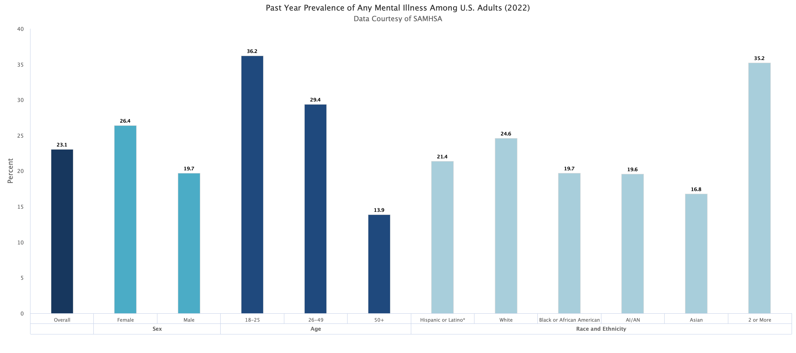{#fig-mental-illness-prev}

## Prevalence: Serious

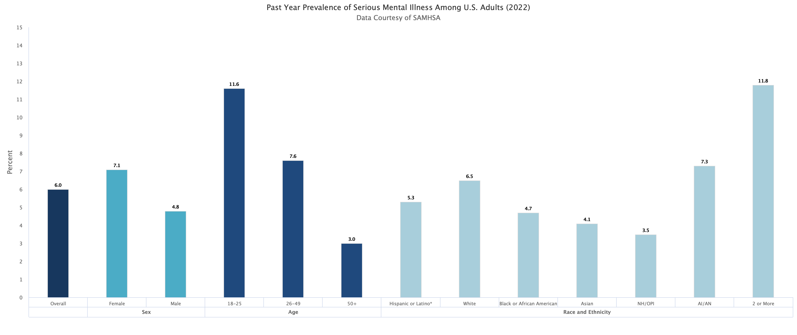{#fig-mental-illness-prev-2}

## Neuroscience of

- Presume diseases of the mind are disorders of the brain, see @Kendler2024-fz

>The first step toward a knowledge of the symptoms [of insanity] is their locality—to which organ do the indications of the disease belong? … Physiological and pathological factors show us that this organ can only be the brain.

-- @Griesinger1867-wk cited in @Kendler2024-fz

## Diagnoses via...

:::: {.columns}
::: {.column width=60%}
- Measurements/observations and self-reports of behavior & mood
  - e.g., Hamilton Rating Scale for Depression [@Wikipedia-contributors2025-ix; @UnknownUnknown-ef]
:::
::: {.column width=40%}

:::
::::

<!-- ## Neuroscience of... -->

<!-- :::: {.columns} -->
<!-- ::: {.column width=60%} -->
<!-- - No biological test or biomarker -->
<!-- ::: -->
<!-- ::: {.column width=40%} -->
<!-- 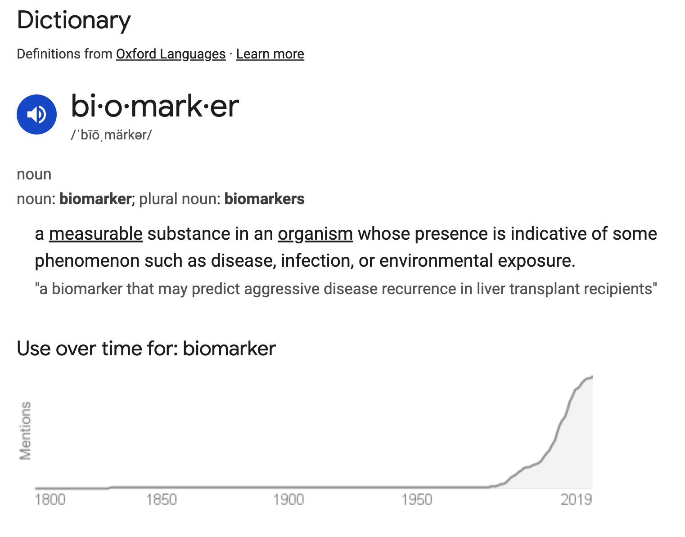{fig-align="right"} -->
<!-- ::: -->
<!-- :::: -->

## Heritability of...

+ *proportion of variance in trait accounted for by genetic factors*
  - e.g., p(your sibling has X | you have X)
- Higher for psychiatric disorders than non-psychiatric diseases
- Family member with mental illness often highest known risk factor

## Heritability of...

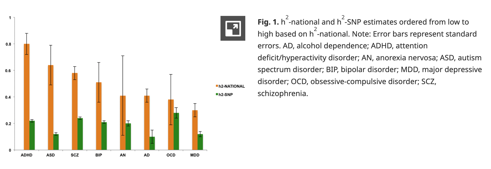{#petterson-2019-fig-01}

## Gene & brain measures relate *across* disorders {.scrollable}

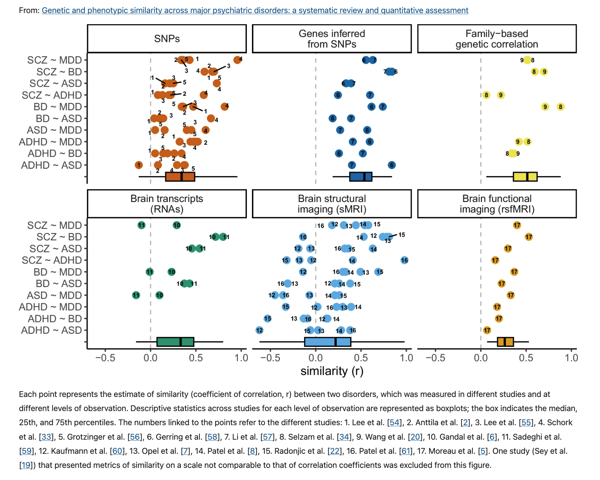{#fig-bourque-fig-02}

---

>The majority of correlations (88.6%) across disorders between studies, within and between levels of observation, were positive.

-- @Bourque2024-rw

---

# Biology of major depressive disorder (MDD)

## Major Depressive Disorder (MDD)

:::: {.columns}
::: {.column width=50%}
- Symptoms
  + Depressed mood or loss of interest in daily activities
  - Plus 4 others
- Most of the day, every day, lasting for two weeks or more
:::
::: {.column width=50%}
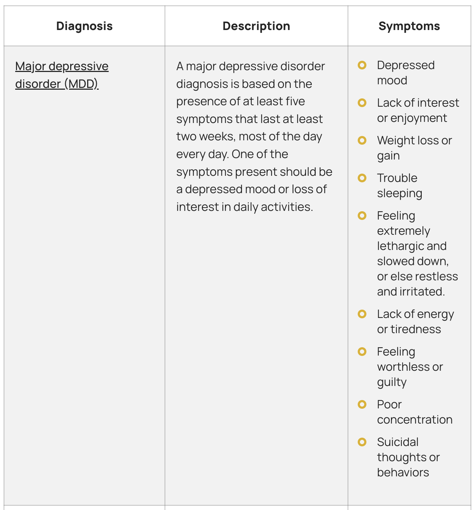{#fig-khaliq-2022}
:::
::::

## Major Depressive Disorder (MDD)

- Experienced by ~8% Americans in any year
- U.S. prevalence up to ~20% lifetime (higher than international average; @Bromet2011-sc)
  - Females 2-3x males
- Median age of first episode ~25 years

## Prevalence of MD episodes

:::: {.columns}
::: {.column width=50%}
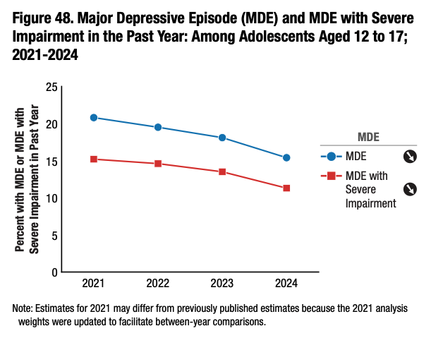{#fig-nsduh-mde}
:::
::: {.column width=50%}
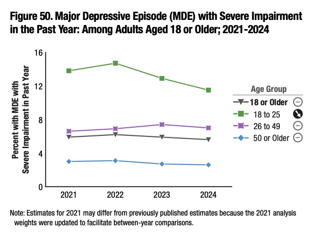{#fig-nsduh-mde-18}
:::
::::

## Cultural/geographic factors

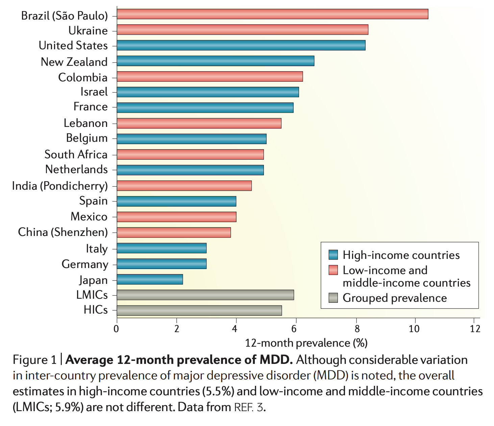{width="60%" #fig-otte-2016-fig-01}

---

>MDD is a complex disorder that cannot be fully explained by any one single established biological or environmental pathway. Instead, MDD seems to be caused by a combination of genetic, environmental, psychological and biological factors. 

-- @Marx2023-ks

## Pathogenesis {#fig-cui-2024-fig-01 .scrollable}

![@Cui2024-tn Figure 1^["An outline map of the hypotheses to explain MDD pathogenesis. (I) HPA axis dysfunction hypothesis: high levels of glucocorticoids (GCs) play a core role in the pathogenesis of MDD, and thyroid hormone (TH) and estrogen are also involved in functions of the HPA axis; (II) the monoamine hypothesis: the functional deficiency of serotonin (5-HT), dopamine (DA) and norepinephrine (NE) are the main pathogenesis of MDD; (III) the inflammatory hypothesis: the neuro-inflammation induced by reactive oxygen species (ROS), inflammatory cytokines and inflammasomes activation is suggested to promote the occurrence of MDD; (IV) the genetic and epigenetic anomaly hypothesis: some genes are susceptible in the patients with MDD, including presynaptic vesicle trafficking (PCLO), D2 subtype of the dopamine receptor (DRD2), glutamate ionotropic receptor kainate type subunit 5 (GRIK5), metabotropic glutamate receptor 5 (GRM5), calcium voltage-gated channel subunit alpha1 E (CACNA1E), calcium voltage-gated channel auxiliary subunit alpha2 delta1(CACNA2D1), DNA methyltransferases (DNMTs), transcription levels of somatostatin (SST), fatty acid desaturase (FADS); (V) the structural and functional brain remodeling hypothesis: the postmortem results of patients with MDD are mostly associated with the reduced densities of glial cells in the prefrontal cortex (PFC), hippocampus, and amygdala; (VI) the social psychological hypothesis: the traumatic or stressful life events are the high risks of the occurrence of MDD. Adobe Illustrator was used to generate this figure"]](../include/img/mdd-pathogenesis.png){width="60%" #fig-cui-2024-fig-01}

---

![@Otte2016-rp Figure 3^["Figure 3 | Biological systems involved in the pathophysiology of MDD. Clinical studies in major depressive disorder (MDD) and relevant animal models have identified pathophysiological features in the central nervous system, as well as the major stress response systems, such as the hypothalamic–pituitary–adrenal (HPA) axis, the autonomic nervous system and the immune system. In the central nervous system, altered neurotransmission and reduced plasticity are evident. These could underlie functional changes in relevant brain circuits (for example, cognitive control and affective–salience networks), smaller regional brain volumes (for example, in the hippocampus) and neuroinflammation, as confirmed in neuroimaging studies. Beyond the central nervous system, chronic hyperactivity impairs feedback regulation of the HPA axis, which is one of the most consistently reported biological features of MDD. Within the immune system, substantial evidence supports increased levels of circulating cytokines and low-grade chronic activation of innate immune cells, including monocytes. However, other aspects of immunity seem to be impaired as exemplified by reduced natural killer (NK) cell cytotoxicity and T cell proliferative capacity. Once it becomes chronic, both HPA axis hyperactivity and inflammation might converge with alterations in the autonomic nervous system to contribute to central nervous system pathobiology as well as cardiovascular and metabolic disease, which often co‑occur with MDD. The sequence of events leading to changes in these interconnected systems and their exact relationship is not known. However, mechanistic studies in animals have shown that alterations in stress response systems can directly and indirectly affect the central nervous system (BOX 3). Conversely, chronic stress and associated changes in behaviour can reproduce many of the stress system alterations, including HPA feedback impairment and inflammation, which suggests a bidirectional link between central and peripheral biological features of MDD. ACTH, adrenocorticotropin; CRH, corticotropin-releasing hormone; TNF, tumour necrosis factor."]](../include/img/otte-2015-fig-03.png){.scrollable width="60%" #fig-otte-2016-fig-03}

## Heritability

- Large, 2.5 M Swedish population study, @Kendler2018-cl
  - Females 0.49 (twins); 0.51 (non-twin relatives)
  - Males 0.41 (twins); 0.36 (non-twin relatives)
- ~35% [@Geschwind2015-xm; @Otte2016-rp]

## Sex-specific genetic effects

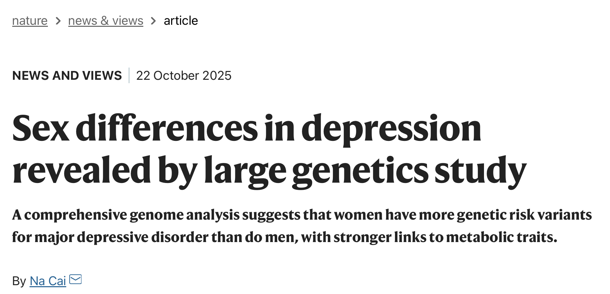{#fig-cai-2025-title}

## {.scrollable}

![@Cai2025-cb Figure 1^["Figure 1 | Genetics of sex differences in depression. a, Thomas et al. 1 examine the effects of genetic variants (known as genetic effects) that might underlie sex differences in major depressive disorder (MDD). They propose three groups of genetic effects: group 1 contains shared genetic effects, which have the same direction (increase or decrease in MDD risk) and magnitude (size) in both sexes; group 2 contains sex-dependent genetic effects that differ in magnitude or direction (light grey points), or both, between sexes; group 3 contains sex-specific genetic effects that are present in one sex but not the other. b, One hypothesis is that shared genetic effects act through molecular intermediates (such as genes or proteins) and pathways in the same way in men and women; sex-dependent effects act through the same molecular intermediates but with different effect sizes for men and women (coloured arrows indicate the larger effect); and sex-specific effects act through molecular intermediates specific to one sex. These schematics are illustrative and do not comprehensively show the genetic effects, molecular intermediates or biological pathways that lead to MDD."] comment on @Thomas2025-ee](https://media.nature.com/lw767/magazine-assets/d41586-025-03374-0/d41586-025-03374-0_51604912.jpg?as=webp){#fig-cai-2025-fig-01}

## Genes and environment interact

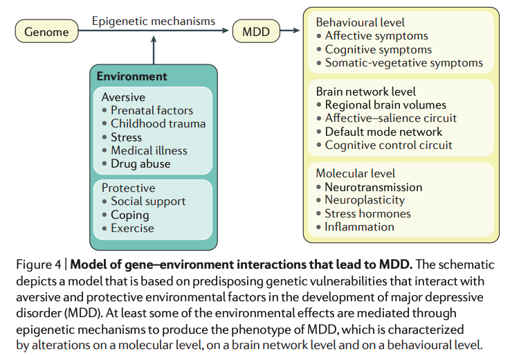{#fig-otte-2016-fig-04}

## Smaller brain areas 

![@Otte2016-rp Figure 5^[" Structural brain alterations in MDD. Regional brain volumes as determined by structural MRI have been investigated in patients with major depressive disorder (MDD) compared with healthy controls in numerous cross-sectional studies. Brain areas with smaller volumes in MDD include the basal ganglia, thalamus, hippocampus and frontal regions, typically with volume differences between 3.5% and 15.5% (left graph) and moderate effect sizes (right graph; error bars indicate 95% confidence intervals). Smaller volumes in the basal ganglia and the hippocampus have also been confirmed when comparing patients with MDD to those with bipolar disorder, suggesting some specificity of these areas for the depressive symptoms that are characteristic of unipolar MDD. Finally, in an independent meta-analysis of structural MRI data using voxel-based morphometry, only smaller volumes in the hippocampus were specific to patients with MDD when compared with other psychiatric disorders. Volume group differences, effect sizes and confidence intervals of MDD compared with healthy controls are based on data from Kempton et al.88, as are the comparisons of MDD and patients with bipolar disorder. Comparisons of MDD with bipolar disorder, schizophrenia, anxiety disorders, obsessive–compulsive disorder or substance use disorder are based on data from Goodkind et al.91."]](../include/img/otte-2016-fig-05.png){#fig-otte-2016-fig-05}

## Monoamine hypothesis

- Or "chemical imbalance theory"
+ More: euphoria
+ Less: depression

## Monoamine hypothesis

- Reserpine [@Wikipedia-contributors2025-ov]
  - reduces blood pressure
  - NE receptor antagonist
  - Early (1950s-60s) use as anti-psychotic drug to treat schizophrenia
  - Once thought to induce depressive symptoms, but see [@Baumeister2003-cw]

# Treatment of MDD

## Drugs

- Monoamine oxidase (MAO) inhibitors (MAOIs)
- Tricyclics
- Selective (Serotonin/Serotonin-Norephinephrine) Reuptake Inhibitors

## Monoamine oxidase (MAO) inhibitors

+ MAO degrade monoamines in synaptic cleft (chemical inactivation)
+ MAOI’s boost monoamine levels
- Used to treat MDD, panic disorder, anxiety disorder
- But side effects, especially high blood pressure
      
## Tricyclics

- Named for atomic structure
+ Inhibit NE, 5-HT reuptake -> Upregulate monoamine levels
- Used to treat MDD, anxiety
- Non-selective -> side effects

## Tricyclics

>The long-term effects of tricyclic antidepressants and the effects on quality of life are unknown. Short-term results suggest that tricyclic antidepressants may reduce depressive symptoms while also increasing the risks of serious adverse events, but these results were based on low and very low certainty evidence.

-- @Kamp2024-mz
    
## Selective Serotonin Reuptake Inhibitors (SSRIs)

+ Fluoxetine (Prozac, Paxil, Zoloft)
+ Prolong duration of 5-HT in synaptic cleft
  + Increase brain steroid production
- Selective Serotonin Norepinephrine Reuptake Inhibitors (SNRIs)
  - Inhibit both 5-HT and NE transporters

## Cymbalta (SNRI)

::: {#fig-cymbalta-commercial}


@Pries2009-ka
:::

## How well do the drugs work?

- [STAR*D trial](http://www.nimh.nih.gov/funding/clinical-research/practical/stard/allmedicationlevels.shtml)
- $35M NIMH-funded clinical trial 2001-2007, target *n*=4,000

## STAR*D protocol

- On SSRI for 12-14 weeks.
- If SSRI didn't work, could switch drugs up to 3 times

## STAR*D results

- 1st round
  - ~1/3 achieved remission; 10-15% showed symptom reduction
- 2nd round
  - ~25% became symptom free.
- 67% cumulative remission rate
- 6-7 weeks to show response

## STAR*D reanalyzed 

- @Pigott2023-xv
- STAR*D investigators deviated from their own protocol (raters were not blind to status)
- Included data that should have been excluded

>In contrast to the STAR*D-reported 67% cumulative remission rate after up to four antidepressant treatment trials, the rate was 35.0% when using the protocol-stipulated HRSD and inclusion in data analysis criteria

## Monoamine hypothesis reconsidered

:::: {.columns}
::: {.column width=50%}
- Too simplistic
- Monoamines interact 
- Drugs fast acting (min), but improvement slow (weeks)
:::
::: {.column width=50%}
![@Otte2016-rp Figure 7^["Figure 7 | The mechanisms of action of antidepressant drugs. The selective serotonin reuptake inhibitors (SSRIs; denoted with \*) have been shown to have significant binding (antagonistic) to the serotonin transporter (5‑HTT), thereby blocking serotonin reuptake. The relatively selective noradrenaline reuptake inhibitors (NRIs; denoted with ‡) have also shown at therapeutically relevant doses to have significant binding to the noradrenaline transporter. The tricyclic antidepressants (TCAs; denoted with §) and other cyclic antidepressants, as well as the serotonin–noradrenaline reuptake inhibitors (SNRIs; denoted with ||), block the reuptake of serotonin and noradrenaline by binding to their transporter in varying ratios. TCAs, to varying degrees, are potent blockers of histamine H1 receptors, serotonin 5‑HT2 receptors, muscarinic acetylcholine receptors, and α1‑adrenergic receptors. These effects account for the higher adverse-effect burden of the TCAs than the other classes of antidepressants. The noradrenaline–dopamine reuptake inhibitors (NDRIs; denoted with ¶ ) primarily block the reuptake of noradrenaline and dopamine. The α2‑adrenergic receptor antagonists (denoted with # ) seem to enhance the release of both serotonin and noradrenaline by blocking α2-autoreceptors. More-selective dual-action serotonin receptor antagonists/agonists primarily bind to serotonin 5‑HT2 receptors. Agomelatine is a melatonin receptor (MT1 and MT2) agonist (not shown) and a 5‑HT2C antagonist without anticholinergic or antihistaminergic properties. Most currently used monoamine oxidase (MAO) inhibitors are irreversible inhibitors of both MAOA and MAOB, with dopamine, tyramine and tryptamine being substrates for both isoforms of MAO. Moclobemide is a selective and reversible MAOA inhibitor. In addition, other neurobiological systems (such as γ‑aminobutyric acid, glutamate and opioids) are probably involved in the neurobiology of MDD and are to some extent targeted by more experimental antidepressive substances (such as ketamine). \*\*Serotonin antagonist and reuptake inhibitor."]](../include/img/otte-2016-fig-07.png){#fig-otte-2016-fig-07}
:::
::::

---

>No correlation between serotonin and its metabolite 5-HIAA in the cerebrospinal fluid and [11C]AZ10419369 binding measured with PET in healthy volunteers.

-- @Tiger2015-dy

---

>...we performed the first meta-analysis of the mood effects in [acute tryptophan depletion] ATD and [alpha-methyl-para-tyrosine] APTD studies. The depletion of monoamine systems (both 5-HT and NE/DA) does not decrease mood in healthy controls. However, in healthy controls with a family history of MDD the results suggest that mood is slightly decreased...by [monoamine depletion]...

-- @Ruhe2007-qc

---

>The serotonin hypothesis of depression is still influential. We aimed to synthesise and evaluate evidence on whether depression is associated with lowered serotonin concentration or activity in a systematic umbrella review of the principal relevant areas of research. 

-- @Moncrieff2022-os

---

>The main areas of serotonin research provide no consistent evidence of there being an association between serotonin and depression, and no support for the hypothesis that depression is caused by lowered serotonin activity or concentrations.

-- @Moncrieff2022-os

---

## When drugs *do* work, how?

- Alter receptor sensitivity?
  - 5-HT terminals contain autoreceptors
  - Presynaptic autoreceptors regulate 5-HT release
  - Autoreceptors compensate for elevated 5-HT from SSRIs 
  + Postsynaptic receptor upregulation of NE/5-HT effects?

## When drugs do work, how?

- Stimulate neurogenesis?
  + Link to neurotrophin, brain-derived nerve growth factor (BDNF)
  + BDNF boosts neurogenesis

## Neurogenesis hypothesis 

- @mahar_stress_2014
- Chronic stress causes neural loss in hippocampus
  - Cortisol and CRF receptors in hippocampus
- Chronic stress down-regulates 5-HT sensitivity

## Neurogenesis hypothesis

- Depression ~ chronic stress
- Anti-depressants upregulate neurogenesis via 5-HT modulation
- Hippocampus one site where neurogenesis occurs in adults

## Beyond SSRIs

- Psychotherapy
- Other drugs
- Neurostimulation

## Psychotherapy

- Effective in treating MDD
- No clear differences among therapy types
- Similar outcomes to antidepressant medication
- @Otte2016-rp

## Ketamine

- Selective antagonist of the NMDA receptor
  - NMDA is an ionotropic glutamate (Glu) receptor
- Relieves depressive symptoms relatively quickly [@Berman2000-vg; @Zarate2006-np]
- But only for a short time
- Boosts synaptic spine formation [@Li2010-ve] and reverses effects of induced stress

## Ketamine

>Our findings show that ketamine and esketamine may be more efficacious than placebo at 24 hours. How these findings translate into clinical practice, however, is not entirely clear...Long term non‐inferiority RCTs comparing repeated ketamine and esketamine, and rigorous real‐world monitoring are needed to establish comprehensive data on safety and efficacy.

-- @Dean2021-qw

## Electroconvulsive Therapy (ECT)

- Last line of treatment for drug-resistant depression
- Electric current delivered to the brain causes 30-60s seizure
- Usually done in a hospital's operating or recovery room under general anesthesia

## Electroconvulsive Therapy (ECT)

- Once every 2-5 days for a total of 6-12 sessions.
- Remission rates of up to 50.9% [@dierckx_efficacy_2012]
- Seems to work via
  + Intrinsic anticonvulsant effects (brain responds to seizure with seizure-preventing responses)
  + Neurotrophic (stimulates neurogenesis) effects
  
## Electroconvulsive Therapy (ECT)

:::: {.columns}
::: {.column width=50%}
- ECT more effective than ketamine?
:::
::: {.column width=50%}
![@Ekstrand2021-cq Figure 3^["Figure 3. Mean Montgomery Åsberg Depression Rating Scale (MADRS) score and remission rate over successive treatment sessions in hospitalized patient with major depressive disorder (MDD) randomized to electroconvulsive therapy (ECT) or multiple infusions with racemic ketamine. (A) Mean MADRS scores over the 4-week treatment (thrice weekly) period. Boxes and lines indicate mean scores and 1-sided SD for ECT (black) and ketamine (red). Numbers on the x-axis denote the treatment session that preceded the rating. Baseline and acute indicate ratings done prior to receiving any treatment and 4–5 hours after receiving the first treatment, respectively. (B) Numbers indicate the accumulated percentage of remitters in the treatment groups over time. AE, adverse event; Ket, racemic ketamine."]](../include/img/eckstrand-2021-fig3.jpeg){#fig-ekstrand-2021-fig-03}
:::
::::

## Deep brain stimulation

::: {#fig-video-deep-brain-stimulation}


@ucsf2021-db
:::

## Other neurostimulation

:::: {.columns}
::: {.column width=50%}
- Vagal (Xth cranial) nerve stimulation
- Parasympathetic branch of ANS
- Mixed (afferent/efferent)
:::
::: {.column width=50%}
{#fig-mayoclinic-vagal-stim}
:::
::::

## Other neurostimulation

:::: {.columns}
::: {.column width=50%}
- Transcranial Magnetic Stimulation
- Non-invasive
- Weekday treatments, 20-30 min/session, 4-8 weeks
- Target dorsolateral prefrontal cortex
- @Kim2024-ay
:::
::: {.column width=50%}
{#fig-brainfacts-tms}
:::
::::

# Wrap-up

## Main points

- MDD highly prevalent
- MDD widespread dysfunction
- No universal biomarkers, but high heritability

## Main points

- Weak evidence for "chemical imbalance"
- Monoamine drugs widely prescribed, work sometimes in some people
- Weak evidence for monoamine hypothesis
- How reuptake inhibitors (e.g.) alleviate MDD not clear

## Main points  

- MDD ≠ males & females
- Some evidence for altered HPA system, especially cortisol
- MDD may mimic chronic stress & affect neural development
- Ketamine faster acting than monoamine-affecting drugs

## Main points

- Psychotherapy can be effective
- ECT, deep brain stimulation for treatment-resistant depression

---

>...High-quality (prospective) studies on MDD are needed to disentangle the etiology and maintenance of MDD.

-- @Kennis2020-rw

## Next time

- Student presentation
- Frontiers in the biology of behavior
- Beethoven and the Cerebral Symphony

# Resources

## About

This talk was produced using [Quarto](https://quarto.org), using the [RStudio](https://posit.co/products/open-source/rstudio/)
Integrated Development Environment (IDE), version 2026.1.0.392.

The source files are in R and R Markdown, then rendered to HTML using the
[revealJS](https://revealjs.com) framework.
The HTML slides are hosted in a [GitHub repo](https://github.com/psu-psychology/psy-511-scan-fdns-2026-spring) and served by GitHub pages:
<https://psu-psychology.github.io/psy-511-scan-fdns-2026-spring/>

## References