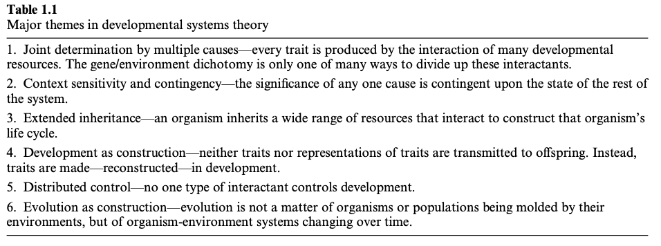
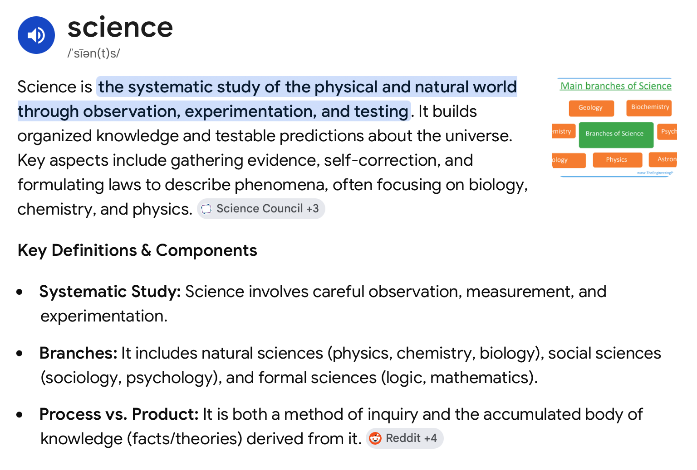

# Preliminaries

## For fun

::: {#fig-immortal-beloved}


@Rlzee2010-ll
:::

## Announcements

- [Final Project](../exercises/final-project.qmd) write-up due *next Thursday, May 7*
  - [Canvas dropbox](https://psu.instructure.com/courses/2379931/assignments/17170786)

## Today's topics

- Student presentations
  - Faith Lockhart
  - Alex Petryczenko
- Frontiers in the biology of behavior
- Beethoven and the Cerebral Symphony

# Student presentations

# Frontiers in the biology of behavior

---

>Everything should be made as simple as possible, but not simpler.

-- @UnknownUnknown-hk

## Psychology is a hub science

>...seven hub sciences can be identified: mathematics, physics, chemistry, earth sciences, medicine, psychology, and the social sciences...public health, neuroscience, neurology, radiology, cardiology, and genetics are among the sciences that fall between psychology and medicine, whereas education and gerontology fall between psychology and the social sciences.

-- @Cacioppo2007-xt commenting on @Boyack2005-bu

## {.scrollable}

![@Boyack2005-bu Figure 3^["Figure 3. Map of science generated using the CC-K50 similarity measure. The map is comprised of 7,121 journals from year 2000. Large font size labels identify major areas of science. Small labels denote the disciplinary topics of nearby large clusters of journals"]](../include/img/boyack-2005-fig-03.png){#fig-boyack-2015-fig-03}

## Psychology is a *systems* science

- @Bronfenbrenner1977-cm
- Microsystem
  - Place, time, physical features, activity, participant(s), role(s)
- Mesosystem
  - System of microsystems
- Exosystem
- Macrosystem

---

{#fig-bronfenbrenner width="60%"}

## Disprate spatial scales

{#fig-sejnowski-2014}

## Changing across ontogenetic...



## And evolutionary timescales

:::: {.columns}
::: {.column width=50%}
- @Jablonka2014-nv
- Genetic, epigenetic, behavioral, and symbolic inheritance systems
:::
::: {.column width=50%}
{fig-align="right"}
:::
::::

## If psychology is the study of

:::: {.columns}
::: {.column width=50%}
- Behavior
- Mental experience

::: {.fragment}
- What are the prerequisites for a *science* of behavior & mental experience?
- Inspired by, grounded in, but not reduced to, biology?

:::
:::
::: {.column width=50%}

{width="60%"}
:::
::::

## What is science?

:::: {.columns}
::: {.column width=60%}
::: {.incremental}
- A system for generating new knowledge
  - Discovering & describing lawful relations relating phenomena
- Drawn from
  - Systematic observation & description
  - Experimental manipulation & testing

:::

:::
::: {.column width=40%}
::: {fragment}

:::
:::
::::

## What is science?

:::: {.columns}
::: {.column width=60%}
- Product & process
- Qualitative & quantitative
:::
::: {.column width=40%}

:::
::::

## Where is the behaviorome?

{#fig-cisek-2019-fig-01}

## What are our *laws*?

- [Weber-Fechner Law](https://en.wikipedia.org/wiki/Weber–Fechner_law) or Stevens [Power Law](https://en.wikipedia.org/wiki/Stevens%27s_power_law)
- [Fitts Law](https://en.wikipedia.org/wiki/Fitts%27s_law)
- Thorndike's [Law of Effect](https://en.wikipedia.org/wiki/Law_of_effect)
- [Rescorla-Wagner model](https://en.wikipedia.org/wiki/Rescorla–Wagner_model)

::: {.fragment}
- How do we strengthen, build upon them?

:::

## Embrace

- Experimentation
- Systematic description
- Of mental experience & behavior

## Borrow from other nodes

![@Boyack2005-bu Figure 3^["Figure 3. Map of science generated using the CC-K50 similarity measure. The map is comprised of 7,121 journals from year 2000. Large font size labels identify major areas of science. Small labels denote the disciplinary topics of nearby large clusters of journals"]](../include/img/boyack-2005-fig-03.png){#fig-boyack-2015-fig-03 width="50%"}

## Things worth knowing more about

::: {.incremental}
- Math/Physics: 
  - Feedback, control theory, cybernetics
  - Network science
  - Computation, representation (and its limitations)
- Medicine:
  - Microbiome
  - Immunology, endocrinology, pharmacology, toxicology

:::

## Things worth knowing more about

::: {.incremental}
- Chemistry
  - Biochemistry, food science
- Social sciences
  - Anthropology, sociology, political science, economics
  
:::

---

### As simple as possible, but no simpler

```{mermaid}
flowchart TD
  N[**N**ervous System] --> B[**B**ody]
  B --> W[**W**orld]
  W --> B
  B --> N
  M["**M**ind"] -.- N
```

---

{#fig-artemis-earthrise width="60%"}

# The Cerebral Symphony

---

::: {#fig-beethoven-9th}



@Smalin2011-vr
:::

# Resources

## About

This talk was produced using [Quarto](https://quarto.org) v1.8.27f, using the [RStudio](https://posit.co/products/open-source/rstudio/)
Integrated Development Environment (IDE), version 2026.4.0.526.

The source files are in R and R Markdown, then rendered to HTML using the
[revealJS](https://revealjs.com) framework.
The HTML slides are hosted in a [GitHub repo](https://github.com/psu-psychology/psy-511-scan-fdns-2026-spring) and served by GitHub pages:
<https://psu-psychology.github.io/psy-511-scan-fdns-2026-spring/>

## References